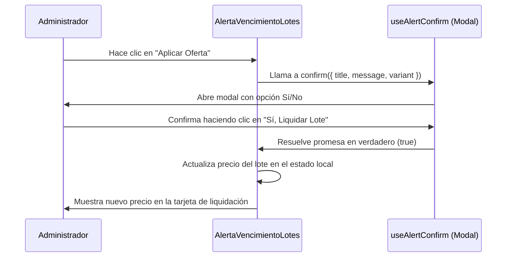

<!--
{
  "resource": "AlertaVencimientoLotes",
  "technicalName": "AlertaVencimientoLotes",
  "targetPath": "src/components/common/AlertaVencimientoLotes.jsx",
  "type": "component",
  "niches": ["grocery_food"],
  "dependencies": {
    "npm": {
      "lucide-react": "^0.344.0"
    },
    "internal": []
  }
}
-->

# Alerta de Vencimiento de Lotes (`AlertaVencimientoLotes`)

Permite monitorear los lotes de productos perecederos (lácteos, carnes, panes) próximos a su fecha de expiración, alertando al administrador del negocio y ofreciendo una interfaz reactiva para aplicar rebajas rápidas en el inventario o imprimir etiquetas de oferta para mitigar pérdidas.

## 1. Propósito y Casos de Uso
* **Gestión de Mermas:** Identificar productos críticos y venderlos antes de expirar.
* **Liquidación de Inventario:** Aplicar descuentos directos (ej: 30%, 50%) para acelerar la rotación del lote.
* **Control Sanitario:** Asegurar que ningún producto vencido permanezca en góndola.

## 2. Especificación Visual y Estilos
* **Línea de Semáforo de Expiración:** Bordes de colores basados en la criticidad (Rojo = Crítico, Amarillo = Moderado, Gris = Normal).
* **Filtro de Días Umbral:** Control para filtrar lotes que vencen en 1, 3, 5 o 7 días.
* **Acciones por Lote:** Botones rápidos de "Aplicar Oferta" y "Declarar Merma".

## 3. Código React Completo

```jsx
import React, { useState } from 'react';
import { Calendar, AlertTriangle, CheckCircle, Percent, Printer, FileText, ArrowRight } from 'lucide-react';
import { useAlertConfirm } from '../common/AlertConfirmContext';

export default function AlertaVencimientoLotes({
  initialLots = [
    { id: 'L001', name: 'Leche Entera Alquería 1L', stock: 45, expDate: '2026-07-03', price: 4200, category: 'Lácteos' },
    { id: 'L002', name: 'Queso Doble Crema Colanta 500g', stock: 12, expDate: '2026-07-05', price: 12500, category: 'Lácteos' },
    { id: 'L003', name: 'Pan Tajado Bimbo Familiar', stock: 18, expDate: '2026-07-04', price: 7800, category: 'Panadería' },
    { id: 'L004', name: 'Pechuga de Pollo Premium 1Kg', stock: 8, expDate: '2026-07-02', price: 18900, category: 'Carnes' },
    { id: 'L005', name: 'Yogurt Fresa Colanta 150g', stock: 64, expDate: '2026-07-10', price: 2100, category: 'Lácteos' },
  ],
  onApplyDiscount = () => {},
  onDeclareMerma = () => {},
}) {
  const [lots, setLots] = useState(initialLots);
  const [thresholdDays, setThresholdDays] = useState(3); // Filtrar lotes venciendo en N días o menos
  const [selectedLot, setSelectedLot] = useState(null);
  const [discountPercent, setDiscountPercent] = useState(30);
  const confirm = useAlertConfirm();

  // Calcular días de diferencia
  const getDaysRemaining = (expDateStr) => {
    const today = new Date('2026-07-02'); // Fecha simulada fija del sistema
    const expDate = new Date(expDateStr);
    const diffTime = expDate - today;
    const diffDays = Math.ceil(diffTime / (1000 * 60 * 60 * 24));
    return diffDays;
  };

  const getStatusColor = (days) => {
    if (days <= 0) return 'text-red-500 bg-red-500/10 border-red-500/30';
    if (days <= 1) return 'text-red-500 bg-red-500/10 border-red-500/30 animate-pulse';
    if (days <= 3) return 'text-amber-500 bg-amber-500/10 border-amber-500/30';
    return 'text-emerald-500 bg-emerald-500/10 border-emerald-500/30';
  };

  const getStatusLabel = (days) => {
    if (days < 0) return 'Vencido';
    if (days === 0) return 'Vence Hoy';
    if (days === 1) return 'Vence Mañana';
    return `${days} días restantes`;
  };

  // Filtrar lotes según el umbral
  const filteredLots = lots.filter(lot => {
    const days = getDaysRemaining(lot.expDate);
    return days <= thresholdDays;
  });

  const handleApplyDiscountClick = async () => {
    if (!selectedLot) return;
    const days = getDaysRemaining(selectedLot.expDate);
    
    const accepted = await confirm({
      title: '¿Aplicar descuento de liquidación?',
      message: `Se aplicará un descuento del ${discountPercent}% a las ${selectedLot.stock} unidades del lote ${selectedLot.id} (${selectedLot.name}). El nuevo precio de góndola será ${new Intl.NumberFormat('es-CO', { style: 'currency', currency: 'COP', maximumFractionDigits: 0 }).format(selectedLot.price * (1 - discountPercent / 100))}.`,
      variant: 'warning',
      confirmText: 'Sí, Liquidar Lote',
      cancelText: 'Cancelar'
    });

    if (accepted) {
      const updated = lots.map(l => {
        if (l.id === selectedLot.id) {
          return { ...l, price: l.price * (1 - discountPercent / 100), discountApplied: discountPercent };
        }
        return l;
      });
      setLots(updated);
      onApplyDiscount(selectedLot.id, discountPercent);
      setSelectedLot(null);
    }
  };

  const handleMermaClick = async (lot) => {
    const accepted = await confirm({
      title: '¿Declarar Merma de Lote?',
      message: `Esta acción dará de baja las ${lot.stock} unidades del lote ${lot.id} (${lot.name}) del inventario de forma definitiva.`,
      variant: 'error',
      confirmText: 'Sí, Dar de Baja',
      cancelText: 'Cancelar'
    });

    if (accepted) {
      const updated = lots.filter(l => l.id !== lot.id);
      setLots(updated);
      onDeclareMerma(lot.id);
      if (selectedLot?.id === lot.id) setSelectedLot(null);
    }
  };

  return (
    <div className="bg-[var(--color-surface)] border border-[var(--color-border)] rounded-2xl shadow-xl w-full p-6 text-[var(--color-text)]">
      <div className="flex flex-col md:flex-row md:items-center justify-between gap-4 mb-6">
        <div className="flex items-center gap-3">
          <div className="p-2 bg-red-500/10 rounded-lg text-red-500">
            <AlertTriangle className="w-6 h-6" />
          </div>
          <div>
            <h3 className="font-semibold text-lg">Alertas de Vencimiento de Lotes</h3>
            <p className="text-xs text-[var(--color-text-muted)]">Fecha del sistema: 2026-07-02</p>
          </div>
        </div>

        {/* Selector de Umbral */}
        <div className="flex items-center gap-2">
          <span className="text-xs font-semibold text-[var(--color-text-muted)]">Ver lotes que vencen en:</span>
          <div className="flex bg-[var(--color-surface-2)] p-1 rounded-xl border border-[var(--color-border)]">
            {[1, 3, 5, 7].map(days => (
              <button
                key={days}
                onClick={() => setThresholdDays(days)}
                className={`px-3 py-1.5 rounded-lg text-xs font-semibold transition ${thresholdDays === days ? 'bg-[var(--color-primary)] text-[var(--color-text)] shadow-md' : 'hover:bg-[var(--color-border)]/20'}`}
              >
                {days === 1 ? '24h' : `${days}d`}
              </button>
            ))}
          </div>
        </div>
      </div>

      <div className="grid grid-cols-1 lg:grid-cols-12 gap-6">
        {/* Tabla de Lotes */}
        <div className="lg:col-span-8 overflow-x-auto border border-[var(--color-border)]/60 rounded-xl">
          <table className="w-full text-left text-sm">
            <thead className="bg-[var(--color-surface-2)] border-b border-[var(--color-border)] text-xs text-[var(--color-text-muted)] font-semibold uppercase tracking-wider whitespace-nowrap">
              <tr>
                <th className="p-4">Lote / Producto</th>
                <th className="p-4">Stock</th>
                <th className="p-4">Vence</th>
                <th className="p-4">Estado</th>
                <th className="p-4">Acciones</th>
              </tr>
            </thead>
            <tbody className="divide-y divide-[var(--color-border)]/50">
              {filteredLots.length === 0 ? (
                <tr>
                  <td colSpan="5" className="p-8 text-center text-[var(--color-text-muted)]">
                    <CheckCircle className="w-10 h-10 text-emerald-500 mx-auto mb-2 stroke-1" />
                    <p className="font-medium text-sm">Ningún lote crítico</p>
                    <p className="text-xs">Todos los lotes están por encima del umbral de {thresholdDays} días.</p>
                  </td>
                </tr>
              ) : (
                filteredLots.map(lot => {
                  const days = getDaysRemaining(lot.expDate);
                  const isSelected = selectedLot?.id === lot.id;
                  return (
                    <tr 
                      key={lot.id} 
                      className={`hover:bg-[var(--color-border)]/5 transition cursor-pointer ${isSelected ? 'bg-[var(--color-primary)]/5 border-l-4 border-l-[var(--color-primary)]' : ''}`}
                      onClick={() => setSelectedLot(lot)}
                    >
                      <td className="p-4">
                        <div>
                          <p className="font-semibold text-xs text-[var(--color-text-muted)]">{lot.id} • {lot.category}</p>
                          <p className="font-bold text-sm text-[var(--color-text)]">{lot.name}</p>
                        </div>
                      </td>
                      <td className="p-4 font-bold whitespace-nowrap">{lot.stock} und</td>
                      <td className="p-4 text-xs font-semibold whitespace-nowrap">{lot.expDate}</td>
                      <td className="p-4">
                        <span className={`whitespace-nowrap px-2.5 py-1 text-[10px] font-extrabold rounded-full border ${getStatusColor(days)}`}>
                          {getStatusLabel(days)}
                        </span>
                      </td>
                      <td className="p-4" onClick={e => e.stopPropagation()}>
                        <div className="flex items-center gap-2">
                          <button
                            onClick={() => setSelectedLot(lot)}
                            className="px-2.5 py-1.5 bg-[var(--color-primary)]/10 hover:bg-[var(--color-primary)] text-[var(--color-primary)] hover:text-[var(--color-text)] rounded-lg text-xs font-semibold transition"
                          >
                            Ofertar
                          </button>
                          <button
                            onClick={() => handleMermaClick(lot)}
                            className="px-2.5 py-1.5 bg-red-500/10 hover:bg-red-500 text-red-500 hover:text-[var(--color-text)] rounded-lg text-xs font-semibold transition"
                          >
                            Merma
                          </button>
                        </div>
                      </td>
                    </tr>
                  );
                })
              )}
            </tbody>
          </table>
        </div>

        {/* Panel de Liquidación */}
        <div className="lg:col-span-4 bg-[var(--color-surface-2)] border border-[var(--color-border)]/50 rounded-xl p-5 flex flex-col justify-between min-h-[300px]">
          {selectedLot ? (
            <div className="flex-1 flex flex-col gap-4">
              <div>
                <span className="text-[10px] font-bold uppercase tracking-wider text-[var(--color-text-muted)]">Lote Seleccionado</span>
                <h4 className="font-bold text-sm text-[var(--color-primary)]">{selectedLot.id} • {selectedLot.name}</h4>
                <div className="grid grid-cols-1 sm:grid-cols-2 gap-3 mt-3 text-xs bg-[var(--color-surface)] border border-[var(--color-border)] p-3 rounded-lg">
                  <div>
                    <span className="text-[10px] text-[var(--color-text-muted)]">Stock</span>
                    <p className="font-bold text-sm">{selectedLot.stock} unidades</p>
                  </div>
                  <div>
                    <span className="text-[10px] text-[var(--color-text-muted)]">Precio Base</span>
                    <p className="font-bold text-sm">
                      {new Intl.NumberFormat('es-CO', { style: 'currency', currency: 'COP', maximumFractionDigits: 0 }).format(selectedLot.price)}
                    </p>
                  </div>
                </div>
              </div>

              {/* Slider de Descuento */}
              <div>
                <div className="flex justify-between items-baseline mb-2">
                  <span className="text-xs font-semibold">Descuento Sugerido</span>
                  <span className="text-lg font-extrabold text-[var(--color-primary)]">{discountPercent}%</span>
                </div>
                <input 
                  type="range"
                  min="10"
                  max="90"
                  step="5"
                  value={discountPercent}
                  onChange={(e) => setDiscountPercent(parseInt(e.target.value))}
                  className="w-full h-2 rounded-lg cursor-pointer bg-[var(--color-border)] accent-[var(--color-primary)]"
                />
                <div className="flex justify-between text-[9px] text-[var(--color-text-muted)] mt-1">
                  <span>10% (Oferta Leve)</span>
                  <span>90% (Liquidación Total)</span>
                </div>
              </div>

              {/* Comparador de Precios */}
              <div className="bg-[var(--color-surface)] border border-[var(--color-border)] rounded-lg p-3 flex justify-between items-center text-xs">
                <div>
                  <span className="text-[9px] text-[var(--color-text-muted)]">Actual</span>
                  <p className="line-through text-[var(--color-text-muted)]">
                    {new Intl.NumberFormat('es-CO', { style: 'currency', currency: 'COP', maximumFractionDigits: 0 }).format(selectedLot.price)}
                  </p>
                </div>
                <ArrowRight className="w-4 h-4 text-[var(--color-text-muted)]" />
                <div className="text-right">
                  <span className="text-[9px] text-[var(--color-primary)] font-bold">Liquidación</span>
                  <p className="font-bold text-sm text-[var(--color-primary)]">
                    {new Intl.NumberFormat('es-CO', { style: 'currency', currency: 'COP', maximumFractionDigits: 0 }).format(selectedLot.price * (1 - discountPercent / 100))}
                  </p>
                </div>
              </div>

              {/* Acciones */}
              <div className="flex flex-col gap-2 mt-auto">
                <button
                  onClick={handleApplyDiscountClick}
                  className="w-full flex items-center justify-center gap-2 bg-[var(--color-primary)] text-[var(--color-text)] hover:bg-[var(--color-primary)]/90 py-2.5 rounded-xl text-xs font-semibold shadow transition"
                >
                  <Percent className="w-4 h-4" />
                  Aplicar Descuento a Góndola
                </button>
                <button
                  onClick={() => alert(`Imprimiendo ${selectedLot.stock} etiquetas de liquidación con código de barras y precio modificado.`)}
                  className="w-full flex items-center justify-center gap-2 border border-[var(--color-border)] hover:bg-[var(--color-border)]/20 py-2.5 rounded-xl text-xs font-semibold transition"
                >
                  <Printer className="w-4 h-4" />
                  Imprimir Etiquetas de Oferta
                </button>
              </div>
            </div>
          ) : (
            <div className="flex-1 flex flex-col items-center justify-center text-center p-6 text-[var(--color-text-muted)]">
              <FileText className="w-10 h-10 stroke-1 mb-2" />
              <p className="text-xs font-semibold">Selecciona un lote de la lista para gestionar descuentos o imprimir etiquetas.</p>
            </div>
          )}
        </div>
      </div>
    </div>
  );
}
```

## 4. Lógica de Estado y Ciclo de Vida
* El componente maneja el estado local de los lotes (`lots`), permitiendo la baja de unidades (declarar mermas) y el recálculo dinámico de su valor comercial tras aplicar un descuento.
* Hace uso del hook global `useAlertConfirm` para gatillar diálogos de confirmación modal promesificados que detienen las acciones destructivas y de liquidación financiera hasta recibir el consentimiento explícito del administrador.

## 5. Secuencia de Interacción

