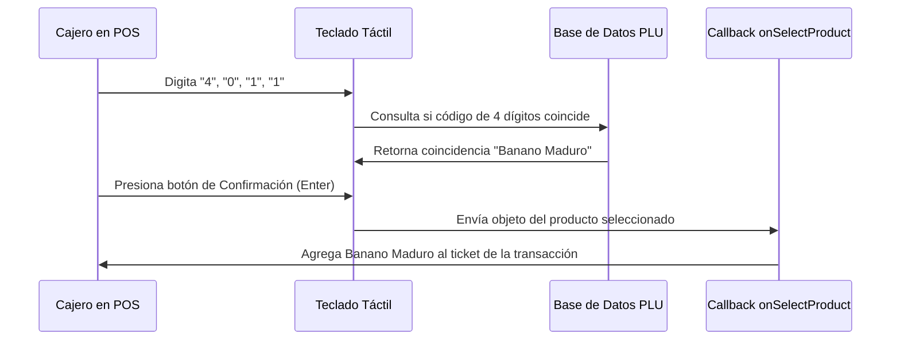

<!--
{
  "resource": "BuscadorCodigoPLU",
  "technicalName": "BuscadorCodigoPLU",
  "targetPath": "src/components/common/BuscadorCodigoPLU.jsx",
  "type": "component",
  "niches": ["grocery_food"],
  "dependencies": {
    "npm": {
      "lucide-react": "^0.344.0"
    },
    "internal": []
  }
}
-->

# Buscador de Código PLU (`BuscadorCodigoPLU`)

Proporciona una interfaz ágil de búsqueda y digitación de códigos PLU (Price Look-Up) para cajeros en minimarkets, facilitando la identificación instantánea de frutas, verduras y productos pesados mediante un teclado numérico táctil en pantalla o barra de búsqueda predictiva.

## 1. Propósito y Casos de Uso
* **Punto de Venta (POS):** Agiliza el cobro de productos agrícolas que no poseen etiqueta de código de barras.
* **Balanza de Autoservicio:** Permite al cliente buscar el código del artículo directamente para pesar y etiquetar.
* **Entrenamiento de Cajeros:** Sirve como glosario interactivo rápido de códigos PLU locales.

## 2. Especificación Visual y Estilos
* **Teclado Numérico Táctil:** Disposición clásica 3×4 (con teclas "Borrar" e "Ingresar") para digitación directa.
* **Directorio Visual:** Rejilla de tarjetas rápidas con iconos y fotos ilustrativas de los productos agrícolas más vendidos.
* **Búsqueda Instantánea:** Filtrado interactivo en tiempo real al escribir palabras clave (ej: "manzana", "tomate").

## 3. Código React Completo

```jsx
import React, { useState, useMemo } from 'react';
import { Search, Delete, CornerDownLeft, Plus, Check, HelpCircle, Apple } from 'lucide-react';

const PLU_DATABASE = [
  { plu: '4011', name: 'Banano Maduro', price: 2900, category: 'Frutas' },
  { plu: '4131', name: 'Manzana Gala Importada', price: 9200, category: 'Frutas' },
  { plu: '4022', name: 'Uva Roja Sin Semilla', price: 14500, category: 'Frutas' },
  { plu: '4799', name: 'Tomate Chonto Primera', price: 4500, category: 'Vegetales' },
  { plu: '4062', name: 'Pepino Cohombro', price: 2200, category: 'Vegetales' },
  { plu: '4070', name: 'Cebolla Cabezona Blanca', price: 3400, category: 'Vegetales' },
  { plu: '4889', name: 'Cilantro Atado Fresco', price: 1500, category: 'Hierbas' },
  { plu: '4901', name: 'Perejil Liso Atado', price: 1800, category: 'Hierbas' },
  { plu: '3284', name: 'Aguacate Hass Premium', price: 11000, category: 'Frutas' },
  { plu: '4512', name: 'Papa Pastusa Lavada', price: 2800, category: 'Vegetales' }
];

export default function BuscadorCodigoPLU({
  onSelectProduct = () => {},
}) {
  const [searchQuery, setSearchQuery] = useState('');
  const [pluInput, setPluInput] = useState('');
  const [activeCategory, setActiveCategory] = useState('TODOS');

  // Filtrar base de datos por texto y categoría
  const filteredProducts = useMemo(() => {
    return PLU_DATABASE.filter(item => {
      const matchesSearch = item.name.toLowerCase().includes(searchQuery.toLowerCase()) || item.plu.includes(searchQuery);
      const matchesCategory = activeCategory === 'TODOS' || item.category.toUpperCase() === activeCategory;
      return matchesSearch && matchesCategory;
    });
  }, [searchQuery, activeCategory]);

  // Validar si el código digitado existe
  const activeMatchedProduct = useMemo(() => {
    if (pluInput.length < 4) return null;
    return PLU_DATABASE.find(item => item.plu === pluInput) || null;
  }, [pluInput]);

  const handleKeyPress = (num) => {
    if (pluInput.length < 4) {
      setPluInput(prev => prev + num);
    }
  };

  const handleBackspace = () => {
    setPluInput(prev => prev.slice(0, -1));
  };

  const handleClear = () => {
    setPluInput('');
  };

  const handleEnterCode = () => {
    if (activeMatchedProduct) {
      onSelectProduct(activeMatchedProduct);
      setPluInput('');
    }
  };

  const handleProductSelect = (product) => {
    onSelectProduct(product);
  };

  return (
    <div className="bg-[var(--color-surface)] border border-[var(--color-border)] rounded-2xl shadow-xl w-full max-w-4xl mx-auto p-6 text-[var(--color-text)]">
      <div className="flex flex-col md:flex-row md:items-center justify-between gap-4 mb-6 border-b border-[var(--color-border)] pb-4">
        <div className="flex items-center gap-3">
          <div className="p-2 bg-[var(--color-primary)]/10 rounded-lg text-[var(--color-primary)]">
            <Apple className="w-6 h-6" />
          </div>
          <div>
            <h3 className="font-semibold text-lg">Buscador y Directorio de Códigos PLU</h3>
            <p className="text-xs text-[var(--color-text-muted)]">Ingresa códigos de 4 dígitos para pesar a granel</p>
          </div>
        </div>

        {/* Input de Búsqueda de Texto */}
        <div className="relative w-full md:w-64">
          <Search className="absolute left-3 top-2.5 w-4 h-4 text-[var(--color-text-muted)]" />
          <input 
            type="text"
            placeholder="Buscar por PLU o nombre..."
            value={searchQuery}
            onChange={(e) => setSearchQuery(e.target.value)}
            className="w-full pl-9 pr-4 py-2 bg-[var(--color-surface-2)] border border-[var(--color-border)] rounded-xl text-xs focus:outline-none focus:ring-1 focus:ring-[var(--color-primary)] text-[var(--color-text)]"
          />
        </div>
      </div>

      <div className="grid grid-cols-1 xl:grid-cols-12 gap-6">
        {/* Panel Izquierdo: Directorio Visual */}
        <div className="xl:col-span-8 flex flex-col gap-4">
          {/* Tabs de Filtro de Categoría */}
          <div className="flex gap-2 overflow-x-auto pb-1 scrollbar-none">
            {['TODOS', 'FRUTAS', 'VEGETALES', 'HIERBAS'].map(cat => (
              <button
                key={cat}
                onClick={() => setActiveCategory(cat)}
                className={`px-3.5 py-1.5 rounded-lg text-xs font-semibold whitespace-nowrap transition ${activeCategory === cat ? 'bg-[var(--color-primary)] text-[var(--color-text)] shadow-sm' : 'bg-[var(--color-surface-2)] border border-[var(--color-border)] hover:bg-[var(--color-border)]/20'}`}
              >
                {cat}
              </button>
            ))}
          </div>

          {/* Grilla de Productos */}
          <div className="grid grid-cols-1 sm:grid-cols-2 2xl:grid-cols-3 gap-3 max-h-[360px] overflow-y-auto pr-1">
            {filteredProducts.length === 0 ? (
              <div className="col-span-full py-12 text-center text-[var(--color-text-muted)]">
                <HelpCircle className="w-10 h-10 mx-auto stroke-1 mb-2" />
                <p className="text-xs">No se encontraron productos con esos criterios</p>
              </div>
            ) : (
              filteredProducts.map(product => (
                <div
                  key={product.plu}
                  onClick={() => handleProductSelect(product)}
                  className="p-4 bg-[var(--color-surface-2)] border border-[var(--color-border)]/60 hover:border-[var(--color-primary)] rounded-xl cursor-pointer transition flex flex-col justify-between h-28"
                >
                  <div className="flex justify-between items-start">
                    <span className="text-xs font-extrabold text-[var(--color-primary)] bg-[var(--color-primary)]/10 px-2 py-0.5 rounded">
                      #{product.plu}
                    </span>
                    <span className="text-[10px] text-[var(--color-text-muted)]">{product.category}</span>
                  </div>
                  <div>
                    <h5 className="font-bold text-xs truncate mb-1">{product.name}</h5>
                    <p className="text-[10px] text-[var(--color-text-muted)] font-medium">
                      {new Intl.NumberFormat('es-CO', { style: 'currency', currency: 'COP', maximumFractionDigits: 0 }).format(product.price)} / kg
                    </p>
                  </div>
                </div>
              ))
            )}
          </div>
        </div>

        {/* Panel Derecho: Teclado Numérico PLU */}
        <div className="xl:col-span-4 bg-[var(--color-surface-2)] border border-[var(--color-border)]/60 rounded-xl p-5 flex flex-col gap-4 self-start">
          <div className="text-center">
            <span className="text-[10px] font-bold uppercase tracking-wider text-[var(--color-text-muted)]">Digitador PLU Directo</span>
            {/* Pantalla del Teclado */}
            <div className="bg-[var(--color-surface)] border border-[var(--color-border)] rounded-xl p-3 mt-2 flex items-center justify-between min-h-[52px]">
              <span className="text-2xl font-extrabold tracking-widest text-[var(--color-text)]">
                {pluInput || <span className="text-[var(--color-text-muted)]/30">----</span>}
              </span>
              {pluInput && (
                <button onClick={handleBackspace} className="p-1 hover:bg-[var(--color-border)]/30 rounded text-[var(--color-text-muted)]">
                  <Delete className="w-4 h-4" />
                </button>
              )}
            </div>
          </div>

          {/* Información en Tiempo Real del PLU digitado */}
          <div className="min-h-[70px] bg-[var(--color-surface)] border border-[var(--color-border)] rounded-xl p-3 text-xs flex flex-col justify-center">
            {activeMatchedProduct ? (
              <div className="flex items-center justify-between">
                <div>
                  <p className="font-bold text-xs">{activeMatchedProduct.name}</p>
                  <p className="text-[10px] text-[var(--color-text-muted)]">
                    {new Intl.NumberFormat('es-CO', { style: 'currency', currency: 'COP', maximumFractionDigits: 0 }).format(activeMatchedProduct.price)} / kg
                  </p>
                </div>
                <div className="p-1.5 bg-emerald-500/10 rounded-lg text-emerald-500 border border-emerald-500/30">
                  <Check className="w-4 h-4" />
                </div>
              </div>
            ) : (
              <p className="text-[10px] text-[var(--color-text-muted)] text-center">
                {pluInput.length === 4 ? 'Código PLU no registrado' : 'Digita los 4 números del código PLU'}
              </p>
            )}
          </div>

          {/* Botones del Teclado */}
          <div className="grid grid-cols-3 gap-2">
            {[1, 2, 3, 4, 5, 6, 7, 8, 9].map(num => (
              <button
                key={num}
                onClick={() => handleKeyPress(num.toString())}
                className="py-3.5 bg-[var(--color-surface)] border border-[var(--color-border)] hover:bg-[var(--color-border)]/20 active:bg-[var(--color-primary)] active:text-[var(--color-text)] font-extrabold text-sm rounded-xl transition duration-150"
              >
                {num}
              </button>
            ))}
            <button
              onClick={handleClear}
              className="py-3.5 bg-red-500/10 hover:bg-red-500/20 text-red-500 font-bold text-xs rounded-xl transition"
            >
              Borrar
            </button>
            <button
              onClick={() => handleKeyPress('0')}
              className="py-3.5 bg-[var(--color-surface)] border border-[var(--color-border)] hover:bg-[var(--color-border)]/20 font-extrabold text-sm rounded-xl transition"
            >
              0
            </button>
            <button
              onClick={handleEnterCode}
              disabled={!activeMatchedProduct}
              className={`py-3.5 flex items-center justify-center rounded-xl font-bold text-xs transition ${activeMatchedProduct ? 'bg-[var(--color-primary)] text-[var(--color-text)] hover:bg-[var(--color-primary)]/90 shadow' : 'bg-[var(--color-border)]/40 text-[var(--color-text-muted)]/50 cursor-not-allowed'}`}
            >
              <CornerDownLeft className="w-4 h-4" />
            </button>
          </div>
        </div>
      </div>
    </div>
  );
}
```

## 4. Lógica de Estado y Ciclo de Vida
* El componente utiliza estados locales para capturar la entrada directa del teclado numérico (`pluInput`) y los criterios de búsqueda textual (`searchQuery`) de forma independiente.
* Un hook `useMemo` evalúa reactivamente el código digitado para buscar la coincidencia dentro del listado maestro de PLUs en tiempo real. 

## 5. Secuencia de Interacción

