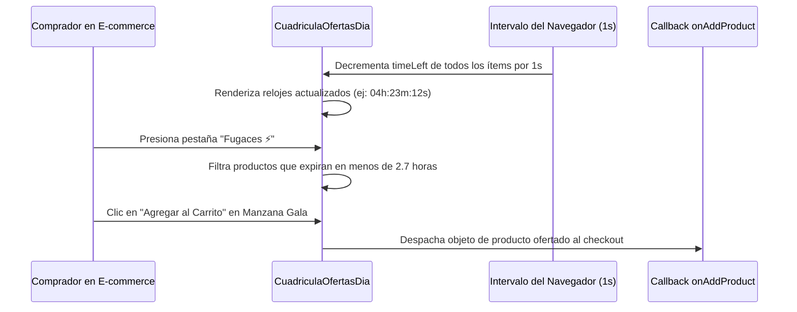

<!--
{
  "resource": "CuadriculaOfertasDia",
  "technicalName": "CuadriculaOfertasDia",
  "targetPath": "src/components/common/CuadriculaOfertasDia.jsx",
  "type": "component",
  "niches": ["grocery_food"],
  "dependencies": {
    "npm": {
      "lucide-react": "^0.344.0"
    },
    "internal": []
  }
}
-->

# Cuadrícula de Ofertas del Día (`CuadriculaOfertasDia`)

Presenta una cuadrícula responsiva premium para desplegar las promociones flash e incentivos del día (2x1, rebajas del 50%, precios especiales por tiempo limitado), integrando temporizadores regresivos reactivos y barras dinámicas de disponibilidad de stock.

## 1. Propósito y Casos de Uso
* **Página de Inicio / Landing de Tienda:** Capturar la atención del cliente al ingresar a la plataforma de ventas.
* **Sección de Liquidaciones:** Exhibir productos de alta rotación con descuentos agresivos de forma visualmente atractiva.
* **Venta por Impulso:** Motivar compras rápidas antes de que expire el reloj de cuenta regresiva de la oferta.

## 2. Especificación Visual y Estilos
* **Badges de Descuento Destacados:** Etiquetas flotantes de colores vibrantes HSL (ej: -40%, 2x1) en la esquina superior de cada tarjeta.
* **Reloj Regresivo (Countdown):** Temporizador animado indicando las horas y minutos restantes para la expiración.
* **Barra de Progreso de Stock:** Barra horizontal que representa la escasez del lote (ej: "Solo quedan 3 unidades" en rojo si stock < 5).

## 3. Código React Completo

```jsx
import React, { useState, useEffect } from 'react';
import { Flame, Clock, ShoppingCart, Percent, Heart, Sparkles } from 'lucide-react';

const INITIAL_OFFERS = [
  { id: 'O01', name: 'Manzana Gala Importada 1Kg', originalPrice: 9200, promoPrice: 5520, discount: 40, type: 'discount', stockMax: 50, stockLeft: 6, timeLeft: 15600, category: 'Fruver' },
  { id: 'O02', name: 'Arroz Diana Premium 1Kg', originalPrice: 3800, promoPrice: 1900, discount: 50, type: '2x1', stockMax: 100, stockLeft: 45, timeLeft: 28800, category: 'Granos' },
  { id: 'O03', name: 'Pechuga de Pollo Premium 1Kg', originalPrice: 18900, promoPrice: 13230, discount: 30, type: 'discount', stockMax: 20, stockLeft: 3, timeLeft: 7200, category: 'Carnes' },
  { id: 'O04', name: 'Leche Colanta Entera 1L', originalPrice: 4200, promoPrice: 3150, discount: 25, type: 'discount', stockMax: 150, stockLeft: 84, timeLeft: 34200, category: 'Lácteos' },
  { id: 'O05', name: 'Detergente Ariel Líquido 1.5L', originalPrice: 18500, promoPrice: 14800, discount: 20, type: 'special', stockMax: 40, stockLeft: 18, timeLeft: 43200, category: 'Aseo' },
  { id: 'O06', name: 'Papel Higiénico Familia Rinde+ x4', originalPrice: 8400, promoPrice: 5880, discount: 30, type: 'discount', stockMax: 60, stockLeft: 2, timeLeft: 5400, category: 'Aseo' }
];

export default function CuadriculaOfertasDia({
  onAddProduct = () => {}
}) {
  const [offers, setOffers] = useState(INITIAL_OFFERS);
  const [filterType, setFilterType] = useState('all');

  // Reloj de cuenta regresiva (descuenta 1 segundo del estado de forma global)
  useEffect(() => {
    const timer = setInterval(() => {
      setOffers(prev => prev.map(off => {
        if (off.timeLeft > 0) return { ...off, timeLeft: off.timeLeft - 1 };
        return off;
      }));
    }, 1000);
    return () => clearInterval(timer);
  }, []);

  const formatTime = (seconds) => {
    if (seconds <= 0) return 'Expirado';
    const hrs = Math.floor(seconds / 3600);
    const mins = Math.floor((seconds % 3600) / 60);
    const secs = seconds % 60;
    return `${hrs.toString().padStart(2, '0')}h:${mins.toString().padStart(2, '0')}m:${secs.toString().padStart(2, '0')}s`;
  };

  const filteredOffers = offers.filter(off => {
    if (filterType === 'all') return true;
    if (filterType === '2x1') return off.type === '2x1';
    if (filterType === 'flash') return off.timeLeft < 10000; // Ofertas de menos de ~2.7 horas
    return off.discount >= 30; // Grandes rebajas
  });

  const formatCurrency = (val) => {
    return new Intl.NumberFormat('es-CO', { style: 'currency', currency: 'COP', maximumFractionDigits: 0 }).format(val);
  };

  return (
    <div className="bg-[var(--color-surface)] border border-[var(--color-border)] rounded-2xl shadow-xl w-full max-w-5xl mx-auto p-6 text-[var(--color-text)]">
      <div className="flex flex-col md:flex-row md:items-center justify-between gap-4 mb-6 pb-4 border-b border-[var(--color-border)]">
        <div className="flex items-center gap-3">
          <div className="p-2 bg-[var(--color-primary)]/10 rounded-lg text-[var(--color-primary)]">
            <Flame className="w-6 h-6 animate-pulse text-[var(--color-primary)]" />
          </div>
          <div>
            <h3 className="font-semibold text-lg">Ofertas Flash y Descuentos del Día</h3>
            <p className="text-xs text-[var(--color-text-muted)]">Precios especiales por tiempo limitado en despensa</p>
          </div>
        </div>

        {/* Filtros rápidos */}
        <div className="flex gap-2 bg-[var(--color-surface-2)] p-1 rounded-xl border border-[var(--color-border)]">
          {[
            { key: 'all', label: 'Todas' },
            { key: '2x1', label: '2x1' },
            { key: 'flash', label: 'Fugaces ⚡' },
            { key: 'high', label: '30% Off o más' }
          ].map(btn => (
            <button
              key={btn.key}
              onClick={() => setFilterType(btn.key)}
              className={`px-3 py-1.5 rounded-lg text-xs font-bold transition ${filterType === btn.key ? 'bg-[var(--color-primary)] text-[var(--color-text)] shadow-sm' : 'hover:bg-[var(--color-border)]/20 text-[var(--color-text-muted)]'}`}
            >
              {btn.label}
            </button>
          ))}
        </div>
      </div>

      {/* Grilla responsiva */}
      <div className="grid grid-cols-1 sm:grid-cols-2 lg:grid-cols-3 gap-5">
        {filteredOffers.length === 0 ? (
          <div className="col-span-full py-16 text-center text-[var(--color-text-muted)]">
            <Sparkles className="w-10 h-10 mx-auto mb-2 stroke-1" />
            <p className="text-xs">No se encontraron ofertas en esta categoría de filtro.</p>
          </div>
        ) : (
          filteredOffers.map(off => {
            const isCriticalStock = off.stockLeft <= 5;
            const stockPct = (off.stockLeft / off.stockMax) * 100;
            return (
              <div
                key={off.id}
                className="bg-[var(--color-surface-2)] border border-[var(--color-border)]/65 hover:border-[var(--color-primary)]/80 hover:shadow-lg rounded-2xl p-4 flex flex-col justify-between transition-all duration-300 relative group"
              >
                {/* Floating Discount Tag */}
                <div className="absolute top-4 left-4 z-10">
                  <span className={`px-3 py-1 text-[10px] font-black tracking-wider text-[var(--color-text)] rounded-lg shadow-md uppercase ${off.type === '2x1' ? 'bg-emerald-500' : 'bg-red-500'}`}>
                    {off.type === '2x1' ? 'Lleva 2 Paga 1' : `-${off.discount}%`}
                  </span>
                </div>

                {/* Like Button */}
                <div className="absolute top-4 right-4 z-10">
                  <button className="p-1.5 bg-[var(--color-surface)] hover:bg-red-500/10 text-[var(--color-text-muted)] hover:text-red-500 border border-[var(--color-border)]/50 rounded-full transition">
                    <Heart className="w-3.5 h-3.5" />
                  </button>
                </div>

                <div className="pt-8 flex-1 flex flex-col gap-3">
                  <div>
                    <span className="text-[9px] font-bold text-[var(--color-primary)] uppercase bg-[var(--color-primary)]/10 px-2 py-0.5 rounded">
                      {off.category}
                    </span>
                    <h4 className="font-extrabold text-sm text-[var(--color-text)] mt-2 group-hover:text-[var(--color-primary)] transition">
                      {off.name}
                    </h4>
                  </div>

                  {/* Precios */}
                  <div className="flex items-baseline gap-2">
                    <span className="text-lg font-black text-[var(--color-primary)] !text-[var(--color-primary)]">
                      {formatCurrency(off.promoPrice)}
                    </span>
                    <span className="text-xs line-through text-[var(--color-text-muted)]">
                      {formatCurrency(off.originalPrice)}
                    </span>
                  </div>

                  {/* Cuenta regresiva */}
                  <div className="flex items-center gap-1.5 text-xs text-[var(--color-text-muted)] bg-[var(--color-surface)] border border-[var(--color-border)]/40 px-2.5 py-1.5 rounded-xl">
                    <Clock className="w-3.5 h-3.5 text-amber-500" />
                    <span className="font-mono text-[10px] font-bold">{formatTime(off.timeLeft)}</span>
                  </div>

                  {/* Stock Left */}
                  <div>
                    <div className="flex justify-between items-baseline text-[9px] mb-1">
                      <span className="font-bold text-[var(--color-text-muted)]">Disponibilidad de Stock</span>
                      <span className={`font-black ${isCriticalStock ? 'text-red-500 animate-pulse' : 'text-emerald-500'}`}>
                        {isCriticalStock ? `¡Solo quedan ${off.stockLeft}!` : `${off.stockLeft} disponibles`}
                      </span>
                    </div>
                    <div className="w-full bg-[var(--color-border)]/40 h-1.5 rounded-full overflow-hidden">
                      <div 
                        className={`h-full rounded-full transition-all duration-500 ${isCriticalStock ? 'bg-red-500' : 'bg-emerald-500'}`}
                        style={{ width: `${Math.max(5, stockPct)}%` }}
                      />
                    </div>
                  </div>
                </div>

                <button
                  onClick={() => onAddProduct(off)}
                  disabled={off.timeLeft <= 0}
                  className="w-full mt-4 flex items-center justify-center gap-2 bg-[var(--color-primary)] text-[var(--color-text)] hover:bg-[var(--color-primary)]/90 disabled:bg-gray-400 py-2.5 rounded-xl text-xs font-bold transition shadow-md group-hover:scale-[1.02]"
                >
                  <ShoppingCart className="w-4 h-4" />
                  Agregar al Carrito
                </button>
              </div>
            );
          })
        )}
      </div>
    </div>
  );
}
```

## 4. Lógica de Estado y Ciclo de Vida
* Mantiene y actualiza de manera reactiva el tiempo restante de las promociones (`timeLeft`) mediante un `setInterval` en un hook de efecto, limpiándose debidamente al desmontarse el componente.
* Utiliza estados controlados sencillos para canalizar el filtro activo (`filterType`) y refrescar dinámicamente la grilla visual de ofertas.

## 5. Secuencia de Interacción

