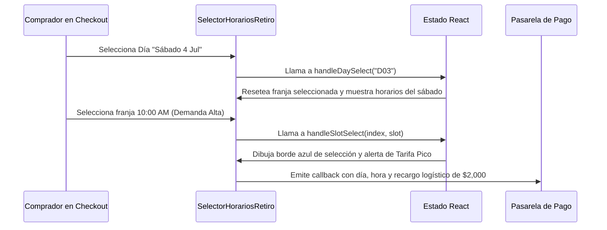

<!--
{
  "resource": "SelectorHorariosRetiro",
  "technicalName": "SelectorHorariosRetiro",
  "targetPath": "src/components/common/SelectorHorariosRetiro.jsx",
  "type": "component",
  "niches": ["grocery_food"],
  "dependencies": {
    "npm": {
      "lucide-react": "^0.344.0"
    },
    "internal": []
  }
}
-->

# Selector de Horarios de Retiro y Entrega (`SelectorHorariosRetiro`)

Permite al usuario agendar y seleccionar interactivamente el día y la franja horaria idónea para retirar sus compras en tienda (Pick Up) o recibir el envío a domicilio, mostrando dinámicamente la saturación/capacidad de despachos por franja y computando tarifas dinámicas según tarifas pico.

## 1. Propósito y Casos de Uso
* **E-commerce de Alimentos / Click & Collect:** Agendar el retiro en el supermercado evitando aglomeraciones.
* **Despacho de Domicilios:** Evitar quiebres logísticos en horas pico distribuyendo los despachos eficientemente.
* **Control de Costos de Envío:** Cobrar recargos por demanda (peak pricing) en franjas saturadas.

## 2. Especificación Visual y Estilos
* **Carrusel de Fechas:** Botones en scroll horizontal para elegir el día de la entrega (Hoy, Mañana, etc.).
* **Grilla de Franjas Horarias:** Malla interactiva de botones mostrando la hora, el estatus de capacidad y la tarifa del servicio.
* **Indicadores de Saturación:**
  * Verde (Libre): Tarifa regular o bonificada.
  * Amarillo (Media Ocupación): Tarifa regular.
  * Rojo (Ocupación Alta): Recargo por hora pico.
  * Gris/Tachado (Saturado/Agotado): Deshabilitado para selección.

## 3. Código React Completo

```jsx
import React, { useState } from 'react';
import { Calendar, Clock, AlertCircle, CheckCircle, ShieldAlert, DollarSign } from 'lucide-react';

const DAYS_DATA = [
  { key: 'D01', label: 'Hoy', date: 'Jue 2 Jul' },
  { key: 'D02', label: 'Mañana', date: 'Vie 3 Jul' },
  { key: 'D03', label: 'Sábado', date: 'Sáb 4 Jul' },
  { key: 'D04', label: 'Domingo', date: 'Dom 5 Jul' }
];

const SLOTS_TEMPLATE = {
  'D01': [
    { time: '08:00 AM - 10:00 AM', status: 'agotado', baseFee: 4000, peakSurcharge: 0 },
    { time: '10:00 AM - 12:00 PM', status: 'alta', baseFee: 4000, peakSurcharge: 2500 },
    { time: '12:00 PM - 02:00 PM', status: 'libre', baseFee: 4000, peakSurcharge: 0 },
    { time: '02:00 PM - 04:00 PM', status: 'media', baseFee: 4000, peakSurcharge: 0 },
    { time: '04:00 PM - 06:00 PM', status: 'alta', baseFee: 4000, peakSurcharge: 3000 },
    { time: '06:00 PM - 08:00 PM', status: 'libre', baseFee: 4000, peakSurcharge: -1000 } // Descuento incentivo
  ],
  'D02': [
    { time: '08:00 AM - 10:00 AM', status: 'libre', baseFee: 4000, peakSurcharge: 0 },
    { time: '10:00 AM - 12:00 PM', status: 'media', baseFee: 4000, peakSurcharge: 0 },
    { time: '12:00 PM - 02:00 PM', status: 'libre', baseFee: 4000, peakSurcharge: 0 },
    { time: '02:00 PM - 04:00 PM', status: 'media', baseFee: 4000, peakSurcharge: 0 },
    { time: '04:00 PM - 06:00 PM', status: 'media', baseFee: 4000, peakSurcharge: 0 },
    { time: '06:00 PM - 08:00 PM', status: 'libre', baseFee: 4000, peakSurcharge: 0 }
  ],
  'D03': [
    { time: '08:00 AM - 10:00 AM', status: 'media', baseFee: 4500, peakSurcharge: 0 },
    { time: '10:00 AM - 12:00 PM', status: 'alta', baseFee: 4500, peakSurcharge: 2000 },
    { time: '12:00 PM - 02:00 PM', status: 'alta', baseFee: 4500, peakSurcharge: 3000 },
    { time: '02:00 PM - 04:00 PM', status: 'media', baseFee: 4500, peakSurcharge: 0 },
    { time: '04:00 PM - 06:00 PM', status: 'libre', baseFee: 4500, peakSurcharge: 0 },
    { time: '06:00 PM - 08:00 PM', status: 'agotado', baseFee: 4500, peakSurcharge: 0 }
  ],
  'D04': [
    { time: '08:00 AM - 10:00 AM', status: 'libre', baseFee: 5000, peakSurcharge: 0 },
    { time: '10:00 AM - 12:00 PM', status: 'libre', baseFee: 5000, peakSurcharge: 0 },
    { time: '12:00 PM - 02:00 PM', status: 'media', baseFee: 5000, peakSurcharge: 0 },
    { time: '02:00 PM - 04:00 PM', status: 'media', baseFee: 5000, peakSurcharge: 0 },
    { time: '04:00 PM - 06:00 PM', status: 'libre', baseFee: 5000, peakSurcharge: 0 },
    { time: '06:00 PM - 08:00 PM', status: 'libre', baseFee: 5000, peakSurcharge: 0 }
  ]
};

export default function SelectorHorariosRetiro({
  onSelectSlot = () => {},
}) {
  const [selectedDayKey, setSelectedDayKey] = useState(DAYS_DATA[0].key);
  const [selectedSlotIndex, setSelectedSlotIndex] = useState(null);

  const activeDay = DAYS_DATA.find(d => d.key === selectedDayKey);
  const activeSlots = SLOTS_TEMPLATE[selectedDayKey] || [];

  const handleDaySelect = (dayKey) => {
    setSelectedDayKey(dayKey);
    setSelectedSlotIndex(null);
  };

  const handleSlotSelect = (index, slot) => {
    if (slot.status === 'agotado') return;
    setSelectedSlotIndex(index);
    onSelectSlot({
      day: activeDay,
      slot: slot,
      totalFee: slot.baseFee + slot.peakSurcharge
    });
  };

  const formatCurrency = (val) => {
    return new Intl.NumberFormat('es-CO', { style: 'currency', currency: 'COP', maximumFractionDigits: 0 }).format(val);
  };

  const getCapacityBadge = (status) => {
    switch (status) {
      case 'agotado':
        return <span className="text-[9px] font-bold text-gray-400 bg-gray-400/10 px-2 py-0.5 rounded border border-gray-400/30">Agotado</span>;
      case 'alta':
        return <span className="text-[9px] font-bold text-red-500 bg-red-500/10 px-2 py-0.5 rounded border border-red-500/30">Alta Demanda</span>;
      case 'media':
        return <span className="text-[9px] font-bold text-amber-500 bg-amber-500/10 px-2 py-0.5 rounded border border-amber-500/30">Ocupado</span>;
      default:
        return <span className="text-[9px] font-bold text-emerald-500 bg-emerald-500/10 px-2 py-0.5 rounded border border-emerald-500/30">Disponible</span>;
    }
  };

  const getSlotBorderColor = (slot, index) => {
    if (slot.status === 'agotado') return 'opacity-50 cursor-not-allowed border-gray-200 bg-gray-50';
    if (selectedSlotIndex === index) return 'border-[var(--color-primary)] bg-[var(--color-primary)]/5 ring-1 ring-[var(--color-primary)]';
    return 'border-[var(--color-border)] bg-[var(--color-surface)] hover:border-[var(--color-primary)]/50';
  };

  return (
    <div className="bg-[var(--color-surface)] border border-[var(--color-border)] rounded-2xl shadow-xl w-full max-w-3xl mx-auto p-6 text-[var(--color-text)]">
      <div className="flex items-center gap-3 mb-6 border-b border-[var(--color-border)] pb-4">
        <div className="p-2 bg-[var(--color-primary)]/10 rounded-lg text-[var(--color-primary)]">
          <Calendar className="w-6 h-6" />
        </div>
        <div>
          <h3 className="font-semibold text-lg">Agendar Horario de Entrega / Retiro</h3>
          <p className="text-xs text-[var(--color-text-muted)]">Elige el momento idóneo para recibir o recoger tu pedido</p>
        </div>
      </div>

      {/* Selector de Días (Carrusel) */}
      <div className="mb-6">
        <span className="block text-xs font-semibold uppercase tracking-wider text-[var(--color-text-muted)] mb-3">
          1. Selecciona el Día
        </span>
        <div className="flex gap-3 overflow-x-auto pb-1 scrollbar-none">
          {DAYS_DATA.map(day => {
            const isActive = day.key === selectedDayKey;
            return (
              <button
                key={day.key}
                onClick={() => handleDaySelect(day.key)}
                className={`flex-none w-28 h-16 flex flex-col items-center justify-center rounded-xl border text-center transition-all ${
                  isActive 
                    ? 'bg-[var(--color-primary)] text-[var(--color-text)] border-[var(--color-primary)] shadow-lg shadow-[var(--color-primary)]/25 scale-[1.02]' 
                    : 'bg-[var(--color-surface-2)] border-[var(--color-border)] hover:border-[var(--color-primary)]/40 text-[var(--color-text)]'
                }`}
              >
                <span className={`text-[9px] font-black uppercase tracking-wider ${isActive ? 'text-[var(--color-text)]/85' : 'text-[var(--color-text-muted)]'}`}>{day.label}</span>
                <span className="text-xs font-black mt-0.5">{day.date}</span>
              </button>
            );
          })}
        </div>
      </div>

      {/* Grilla de Franjas Horarias */}
      <div className="mb-6">
        <span className="block text-xs font-semibold uppercase tracking-wider text-[var(--color-text-muted)] mb-3">
          2. Selecciona la Franja Horaria
        </span>
        
        <div className="grid grid-cols-1 gap-3">
          {activeSlots.map((slot, index) => {
            const totalFee = slot.baseFee + slot.peakSurcharge;
            const isSelected = selectedSlotIndex === index;
            return (
              <div
                key={index}
                onClick={() => handleSlotSelect(index, slot)}
                className={`p-4 rounded-xl border flex justify-between items-center cursor-pointer transition ${getSlotBorderColor(slot, index)}`}
              >
                <div className="flex items-center gap-3">
                  <div className={`p-2 rounded-lg ${isSelected ? 'bg-[var(--color-primary)]/10 text-[var(--color-primary)]' : 'bg-[var(--color-surface-2)] text-[var(--color-text-muted)]'}`}>
                    <Clock className="w-4 h-4" />
                  </div>
                  <div>
                    <p className="font-bold text-xs">{slot.time}</p>
                    <div className="flex items-center gap-2 mt-1">
                      {getCapacityBadge(slot.status)}
                      {slot.peakSurcharge > 0 && (
                        <span className="text-[9px] font-extrabold text-red-500 bg-red-500/5 px-1.5 py-0.5 rounded border border-red-500/20">
                          Tarifa Pico
                        </span>
                      )}
                      {slot.peakSurcharge < 0 && (
                        <span className="text-[9px] font-extrabold text-emerald-500 bg-emerald-500/5 px-1.5 py-0.5 rounded border border-emerald-500/20">
                          Ahorro
                        </span>
                      )}
                    </div>
                  </div>
                </div>

                <div className="text-right">
                  <span className="text-[10px] text-[var(--color-text-muted)]">Costo Envío</span>
                  <p className="font-bold text-xs text-[var(--color-text)]">{formatCurrency(totalFee)}</p>
                </div>
              </div>
            );
          })}
        </div>
      </div>

      {/* Alerta de tarifa dinámica */}
      {selectedSlotIndex !== null && activeSlots[selectedSlotIndex]?.peakSurcharge > 0 && (
        <div className="flex items-center gap-2.5 bg-amber-500/10 border border-amber-500/30 text-amber-500 p-4 rounded-xl text-xs mb-4">
          <ShieldAlert className="w-5 h-5 shrink-0" />
          <span>La franja seleccionada posee un recargo adicional de {formatCurrency(activeSlots[selectedSlotIndex].peakSurcharge)} por alta congestión de envíos. Puedes elegir un horario con menor ocupación para ahorrar costos de despacho.</span>
        </div>
      )}
    </div>
  );
}
```

## 4. Lógica de Estado y Ciclo de Vida
* Mantiene el estado del día (`selectedDayKey`) y el índice de la franja horaria elegida (`selectedSlotIndex`), reseteando este último al alternar la fecha de despacho para evitar cruces inconsistentes.
* Emite un callback `onSelectSlot` conteniendo el detalle completo de la reserva (día, hora y costo logístico consolidado) hacia la pasarela de checkout.

## 5. Secuencia de Interacción

