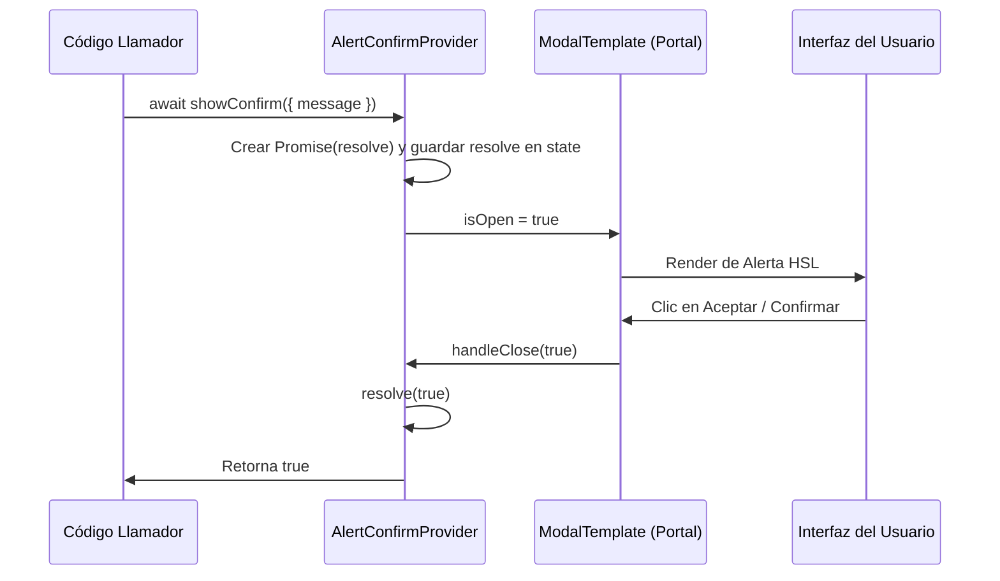

# Alertas y Confirmaciones Globales (`AlertConfirmContext.jsx`)

## 1. Propósito y Casos de Uso
Contexto y Hook React (`useAlertConfirm`) que unifican las notificaciones de alerta, mensajes de error, advertencia y confirmación síncrona en toda la aplicación, reemplazando las ventanas nativas `window.alert()` y `window.confirm()` provistas por el explorador.
Permite ejecutar flujos de validación o aprobación del usuario de forma asíncrona (`async/await`) directamente sobre un modal flotante e integrado sin perder el hilo de control secuencial del código JS.

## 2. Especificación Visual y Estilos
- **Línea Gráfica:** Estructurado en base al componente maestro de modales `ModalTemplate.jsx`. Utiliza fondos limpios `bg-white` y `dark:bg-gray-900` con bordes suavizados por variables corporativas (`--radius-base`).
- **Estados y Estética de Alerta:**
  - `success`: Círculo verde con animación de rebote y un check vectorial.
  - `error`: Círculo rojo animado (pulso elástico) con un signo de exclamación.
  - `warning`: Círculo de advertencia naranja/ámbar para alertar sobre acciones destructivas.
  - `info`: Círculo azul con ícono clásico de información.
- **Transiciones y Escala:** Soporte de entrada y salida aceleradas por hardware vía Framer Motion en el Backdrop y panel modal (`willChange: transform`).

## 3. Props y API del Componente

### Método `showAlert`
| Prop | Tipo | Default | Descripción |
| :--- | :--- | :--- | :--- |
| `title` | `string` | `'Atención'` | Título en negrita del encabezado de la alerta. |
| `message` | `string` | `''` | Cuerpo o detalle explicativo de la alerta. |
| `variant` | `'info' \| 'success' \| 'warning' \| 'error'` | `'info'` | Define el icono, color y estilo semántico. |
| `confirmText` | `string` | `'Aceptar'` | Texto del botón de confirmación. |

### Método `showConfirm`
| Prop | Tipo | Default | Descripción |
| :--- | :--- | :--- | :--- |
| `title` | `string` | `'Confirmar acción'` | Título en negrita del encabezado de la confirmación. |
| `message` | `string` | `'¿Estás seguro...?'` | Cuerpo o pregunta descriptiva del diálogo. |
| `variant` | `'info' \| 'success' \| 'warning' \| 'error'` | `'warning'` | Estilo gráfico del ícono superior y botón principal. |
| `confirmText` | `string` | `'Confirmar'` | Texto del botón afirmativo. |
| `cancelText` | `string` | `'Cancelar'` | Texto del botón de cancelación/retorno. |

## 4. Código React Completo y 100% Funcional

Consúltalo en la ubicación física: [`AlertConfirmContext.jsx`](file:///d:/Aplicaciones/App%20Ventas/src/components/common/AlertConfirmContext.jsx).

```jsx
import React, { createContext, useContext, useState, useCallback } from 'react'
import ModalTemplate from './ModalTemplate'

const AlertConfirmContext = createContext(null)

export function AlertConfirmProvider({ children }) {
  const [modalState, setModalState] = useState({
    isOpen: false,
    type: 'alert',
    title: '',
    message: '',
    confirmText: 'Aceptar',
    cancelText: 'Cancelar',
    resolve: null,
    variant: 'info'
  })

  const showAlert = useCallback(({ title = 'Atención', message = '', variant = 'info', confirmText = 'Aceptar' }) => {
    return new Promise((resolve) => {
      setModalState({
        isOpen: true,
        type: 'alert',
        title,
        message,
        confirmText,
        cancelText: '',
        resolve,
        variant
      })
    })
  }, [])

  const showConfirm = useCallback(({ 
    title = 'Confirmar acción', 
    message = '¿Estás seguro de realizar esta acción?', 
    confirmText = 'Confirmar', 
    cancelText = 'Cancelar',
    variant = 'warning'
  }) => {
    return new Promise((resolve) => {
      setModalState({
        isOpen: true,
        type: 'confirm',
        title,
        message,
        confirmText,
        cancelText,
        resolve,
        variant
      })
    })
  }, [])

  const handleClose = (result) => {
    const { resolve } = modalState
    setModalState((prev) => ({ ...prev, isOpen: false }))
    if (resolve) resolve(result)
  }

  const getHeaderIcon = () => {
    const baseClass = "w-12 h-12 rounded-2xl flex items-center justify-center border mx-auto mb-4"
    switch (modalState.variant) {
      case 'success':
        return (
          <div className={`${baseClass} bg-green-50 dark:bg-green-950/30 text-green-600 dark:text-green-400 border-green-100 dark:border-green-800`}>
            <svg className="w-6 h-6 animate-bounce" fill="none" stroke="currentColor" viewBox="0 0 24 24" strokeWidth="2.5">
              <path strokeLinecap="round" strokeLinejoin="round" d="M5 13l4 4L19 7" />
            </svg>
          </div>
        )
      case 'error':
        return (
          <div className={`${baseClass} bg-red-50 dark:bg-red-950/30 text-red-600 dark:text-red-400 border-red-100 dark:border-red-800`}>
            <svg className="w-6 h-6 animate-pulse" fill="none" stroke="currentColor" viewBox="0 0 24 24" strokeWidth="2.5">
              <path strokeLinecap="round" strokeLinejoin="round" d="M12 9v2m0 4h.01m-6.938 4h13.856c1.54 0 2.502-1.667 1.732-3L13.732 4c-.77-1.333-2.694-1.333-3.464 0L3.34 16c-.77 1.333.192 3 1.732 3z" />
            </svg>
          </div>
        )
      case 'warning':
        return (
          <div className={`${baseClass} bg-amber-50 dark:bg-amber-950/30 text-amber-600 dark:text-amber-400 border-amber-100 dark:border-amber-800`}>
            <svg className="w-6 h-6 animate-pulse" fill="none" stroke="currentColor" viewBox="0 0 24 24" strokeWidth="2.5">
              <path strokeLinecap="round" strokeLinejoin="round" d="M12 9v2m0 4h.01m-6.938 4h13.856c1.54 0 2.502-1.667 1.732-3L13.732 4c-.77-1.333-2.694-1.333-3.464 0L3.34 16c-.77 1.333.192 3 1.732 3z" />
            </svg>
          </div>
        )
      case 'info':
      default:
        return (
          <div className={`${baseClass} bg-blue-50 dark:bg-blue-950/30 text-blue-600 dark:text-blue-400 border-blue-100 dark:border-blue-800`}>
            <svg className="w-6 h-6 animate-pulse" fill="none" stroke="currentColor" viewBox="0 0 24 24" strokeWidth="2.5">
              <path strokeLinecap="round" strokeLinejoin="round" d="M13 16h-1v-4h-1m1-4h.01M21 12a9 9 0 11-18 0 9 9 0 0118 0z" />
            </svg>
          </div>
        )
    }
  }

  return (
    <AlertConfirmContext.Provider value={{ showAlert, showConfirm }}>
      {children}
      <ModalTemplate isOpen={modalState.isOpen} onClose={() => handleClose(false)} title={null}>
        <div className="text-center py-2">
          {getHeaderIcon()}
          <h3 className="text-lg font-bold text-gray-900 dark:text-white mb-2">{modalState.title}</h3>
          <p className="text-sm text-gray-500 dark:text-gray-400 whitespace-pre-wrap leading-relaxed max-w-sm mx-auto">{modalState.message}</p>
          <div className="flex gap-3 mt-6">
            {modalState.type === 'confirm' && (
              <button
                onClick={() => handleClose(false)}
                className="flex-1 py-3 px-4 rounded-xl border border-primary-soft bg-surface hover:bg-surface-2 text-app font-bold text-sm transition-all active:scale-95 cursor-pointer"
                style={{ borderRadius: 'var(--radius-base)' }}
              >
                {modalState.cancelText}
              </button>
            )}
            <button
              onClick={() => handleClose(true)}
              className={`flex-1 py-3 px-4 text-white font-bold text-sm transition-all active:scale-95 cursor-pointer ${
                modalState.variant === 'error'
                  ? 'bg-red-500 hover:bg-red-600 shadow-md shadow-red-500/10'
                  : modalState.variant === 'warning'
                    ? 'bg-amber-500 hover:bg-amber-600 shadow-md shadow-amber-500/10'
                    : 'bg-primary hover:opacity-95 shadow-md shadow-primary/10'
              }`}
              style={{ borderRadius: 'var(--radius-base)' }}
            >
              {modalState.confirmText}
            </button>
          </div>
        </div>
      </ModalTemplate>
    </AlertConfirmContext.Provider>
  )
}

export function useAlertConfirm() {
  const context = useContext(AlertConfirmContext)
  if (!context) throw new Error('useAlertConfirm debe ser usado dentro de un AlertConfirmProvider')
  return context
}
```

## 5. Lógica de Estado y Ciclo de Vida
- **Promesificación síncrona:** Cuando se invoca `showAlert` o `showConfirm`, el componente genera y guarda una referencia a la función de resolución de una Promesa (`resolve`) en el estado reactivo (`modalState`), manteniendo el modal abierto (`isOpen: true`).
- **Retorno de respuesta:** Al presionar los botones del pie de página o cerrar el modal, la función callback `handleClose(result)` se ejecuta, cambia el estado a cerrado y dispara la promesa (`resolve(result)`), lo que retorna un booleano al llamador asíncrono.

## 6. Integración con Servicios Externos
Agnóstico de servicios directos. Utiliza el Portal React provisto por `ModalTemplate.jsx` para instanciarse directamente sobre el `document.body` evitando problemas de herencia de estilos o superposiciones de `z-index`.

## 7. Flujo Operativo y Secuencia de Interacción


## 8. Ejemplo de Uso (Importación y Consumo)

### Envolvimiento en App raíz (`App.jsx`)
```jsx
import { AlertConfirmProvider } from './components/common/AlertConfirmContext'

export default function App() {
  return (
    <AlertConfirmProvider>
      <MainLayout />
    </AlertConfirmProvider>
  )
}
```

### Consumo en componentes
```jsx
import { useAlertConfirm } from './components/common/AlertConfirmContext'

export default function MiComponente() {
  const { showAlert, showConfirm } = useAlertConfirm()

  const handleAction = async () => {
    const confirm = await showConfirm({
      title: 'Eliminar Registro',
      message: '¿Estás seguro de que deseas borrar este registro de forma permanente?',
      confirmText: 'Borrar',
      cancelText: 'Conservar',
      variant: 'error'
    })

    if (confirm) {
      // Proceder con el borrado...
      showAlert({
        title: 'Borrado Exitoso',
        message: 'El registro se ha borrado correctamente.',
        variant: 'success'
      })
    }
  }

  return <button onClick={handleAction}>Ejecutar Acción</button>
}
```

## 9. Origen y Consumo Local
- **Extraído de:** [AdminOrders.jsx](file:///d:/Aplicaciones/App%20Ventas/src/pages/admin/AdminOrders.jsx) y [App.jsx](file:///d:/Aplicaciones/App%20Ventas/src/App.jsx)
- **Consumo en Consola Central:** Integrado en el visor de playgrounds de la Consola Central [`ComponentSandbox.jsx`](file:///D:/PROTOTIPE/Central PROTOTIPE/dev-dashboard/src/components/admin/ComponentSandbox.jsx) para reemplazar ventanas emergentes del navegador.
- **Fecha de extracción:** 2026-05-29
- **Versión:** 1.1 (Actualizado el 2026-06-06)
