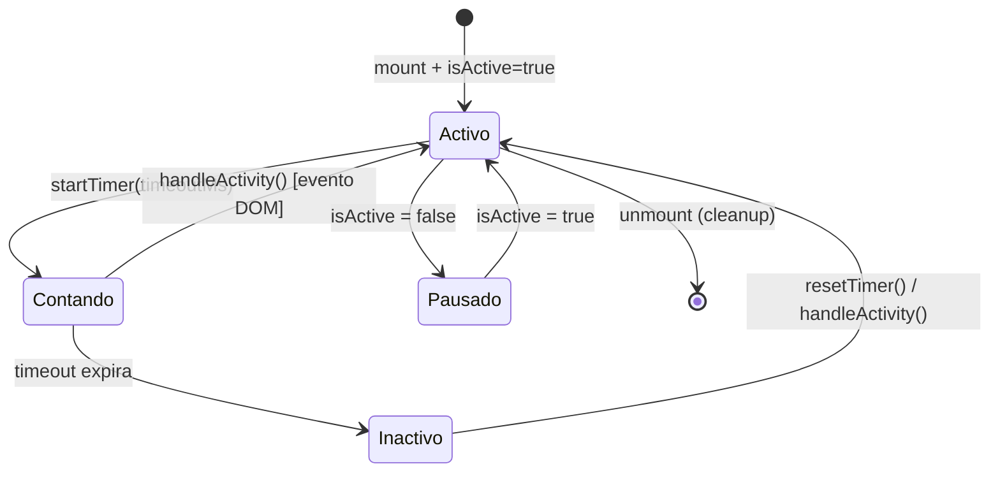

<!--
{
  "technicalName": "useInactivityTimer",
  "targetPath": "src/features/auth/hooks/useInactivityTimer.js",
  "dependencies": {
    "npm": {},
    "internal": []
  },
  "type": "hook",
  "niches": []
}
-->

# Hook de Control de Inactividad (useInactivityTimer)

## 1. Propósito y Casos de Uso

Custom hook React que detecta la **inactividad del usuario** en una pantalla o componente. Escucha un conjunto de eventos globales del DOM (`mousemove`, `keydown`, `touchstart`, `scroll`, `click`) y activa un flag `isInactive` tras un periodo configurable sin interacción. El cleanup es automático y garantiza cero memory leaks.

**Casos de uso actuales:**
- Pantalla de catálogo del cliente: mostrar un banner o modal de "¿Sigues ahí?" tras 15 segundos de inactividad.
- Sesiones de quiosco POS: auto-reset de la pantalla cuando el usuario se aleja.

**Proyectos futuros donde tiene sentido reutilizarlo:**
- Cualquier flujo con autocierre de sesión por inactividad (paneles admin, dashboards financieros).
- Screensavers/slides automáticos cuando el usuario no interactúa.
- Auto-limpieza de formularios sensibles (datos de pago, médicos) tras N segundos.
- Ocultamiento de modales de onboarding/tutorial cuando el usuario está activo.

---

## 2. Especificación Visual y Estilos

Módulo **100% lógico**. Sin UI ni tokens CSS. La respuesta visual la implementa el consumidor basándose en el flag `isInactive` retornado.

---

## 3. Props y API del Componente

| Parámetro | Tipo | Default | Descripción |
|-----------|------|---------|-------------|
| `timeoutMs` | `number` | `15000` | Milisegundos de inactividad para activar `isInactive`. |
| `isActive` | `boolean` | `true` | Controla si el timer está encendido. Útil para pausarlo cuando hay un modal abierto. |
| `events` | `string[]` | `['mousemove','keydown','touchstart','scroll','click']` | Lista de eventos DOM que reinician el contador. |

**Retorno:**

| Campo | Tipo | Descripción |
|-------|------|-------------|
| `isInactive` | `boolean` | `true` cuando el usuario lleva más de `timeoutMs` ms sin interactuar. |
| `resetTimer` | `() => void` | Fuerza el reset manual del contador (útil para triggers programáticos). |

---

## 4. Código React Completo y 100% Funcional

```js
import { useEffect, useState, useCallback, useRef } from 'react'

/**
 * useInactivityTimer
 * ─────────────────────────────────────────────────────────────────────────────
 * Detecta inactividad del usuario escuchando eventos globales del DOM.
 * Cleanup automático garantizado. Cero memory leaks.
 *
 * @param {number}   timeoutMs - ms de inactividad para activar isInactive (default: 15000)
 * @param {boolean}  isActive  - si el timer está habilitado (default: true)
 * @param {string[]} events    - eventos DOM que reinician el contador
 * @returns {{ isInactive: boolean, resetTimer: () => void }}
 */
export default function useInactivityTimer(
  timeoutMs = 15000,
  isActive = true,
  events = ['mousemove', 'keydown', 'touchstart', 'scroll', 'click']
) {
  const [isInactive, setIsInactive] = useState(false)
  // useRef para el timer evita closures obsoletos con el timer ID
  const timerRef = useRef(null)

  const clearInactivityTimer = useCallback(() => {
    if (timerRef.current) {
      clearTimeout(timerRef.current)
      timerRef.current = null
    }
  }, [])

  const startInactivityTimer = useCallback(() => {
    clearInactivityTimer()
    timerRef.current = setTimeout(() => {
      setIsInactive(true)
    }, timeoutMs)
  }, [timeoutMs, clearInactivityTimer])

  const resetTimer = useCallback(() => {
    setIsInactive(false)
    startInactivityTimer()
  }, [startInactivityTimer])

  useEffect(() => {
    if (!isActive) {
      clearInactivityTimer()
      setIsInactive(false)
      return
    }

    setIsInactive(false)
    startInactivityTimer()

    const handleActivity = () => {
      setIsInactive(false)
      startInactivityTimer()
    }

    events.forEach(event => window.addEventListener(event, handleActivity, { passive: true }))

    return () => {
      clearInactivityTimer()
      events.forEach(event => window.removeEventListener(event, handleActivity))
    }
  }, [timeoutMs, isActive, events, startInactivityTimer, clearInactivityTimer])

  return { isInactive, resetTimer }
}
```

> **Mejoras sobre el original:**
> - Se reemplazó el re-binding de `timer` en cada `handleActivity` por un `useRef` estable, eliminando el anti-patrón de cierre variable con `let timer` y `clearTimeout` + reasignación manual.
> - Se añadió el parámetro `events` para que el consumidor pueda restringir qué eventos monitorea (ej. solo `touchstart` en móvil).
> - Se añadió `{ passive: true }` en `addEventListener` para eventos de scroll/touch, mejorando el rendimiento de scroll nativo en móviles.
> - Al desactivar (`isActive = false`) el efecto limpia el timer activo y resetea `isInactive` a `false`, evitando estados colgados.

---

## 5. Lógica de Estado y Ciclo de Vida

```
useEffect [timeoutMs, isActive, events]
  │
  ├─ isActive = false → clearTimer + setIsInactive(false) + return
  │
  └─ isActive = true
       │
       ├─ setIsInactive(false)     ← reset inicial al montar/cambiar
       ├─ startInactivityTimer()   ← setTimeout(timeoutMs)
       │
       ├─ addEventListener(events, handleActivity)
       │    handleActivity():
       │      setIsInactive(false)
       │      startInactivityTimer()   ← reinicia el countdown
       │
       └─ cleanup:
            clearInactivityTimer()
            removeEventListener(events, handleActivity)
```

**Hooks internos:**

| Hook | Propósito |
|------|-----------|
| `useState(false)` | Estado reactivo de inactividad |
| `useRef(null)` | Almacena el ID del `setTimeout` sin re-renders |
| `useCallback(clearInactivityTimer)` | Limpia el timer; memoizado para estabilidad |
| `useCallback(startInactivityTimer)` | Inicia/reinicia el countdown; dep: `[timeoutMs]` |
| `useCallback(resetTimer)` | API pública para reset programático |

---

## 6. Integración con Servicios Externos

**Ninguna.** Hook 100% autónomo, opera únicamente sobre las APIs nativas del navegador (`window.addEventListener`, `setTimeout`). No requiere Firestore, Zustand ni ninguna otra dependencia externa. Compatible con cualquier proyecto React ≥ 16.8.

---

## 7. Flujo Operativo y Secuencia de Interacción



---

## 8. Ejemplo de Uso (Importación y Consumo)

```jsx
// Uso básico — timeout de 15s
import useInactivityTimer from './hooks/useInactivityTimer'

function CatalogScreen() {
  const { isInactive, resetTimer } = useInactivityTimer(15000)

  return (
    <div>
      <ProductGrid />
      {isInactive && (
        <InactivityModal
          onDismiss={resetTimer}
          message="¿Sigues ahí? Tu carrito te está esperando."
        />
      )}
    </div>
  )
}

// Uso avanzado — pausar cuando hay modal abierto, solo eventos táctiles
function KioskScreen({ isModalOpen }) {
  const { isInactive } = useInactivityTimer(
    30000,                    // 30 segundos
    !isModalOpen,             // pausar timer si hay modal encima
    ['touchstart', 'click']   // solo eventos táctiles (quiosco)
  )

  useEffect(() => {
    if (isInactive) {
      // Auto-reset del quiosco
      resetKioskToInitialState()
    }
  }, [isInactive])

  return <KioskUI />
}
```

---

## 9. Origen

* **Extraído de:** App Ventas — [`useInactivityTimer.js`](file:///d:/Aplicaciones/App%20Ventas/src/hooks/useInactivityTimer.js)
* **Fecha de extracción:** 2026-05-29
* **Versión:** 1.1 *(refactorizado con `useRef` para timer, parámetro `events` configurable y `passive: true`)*
