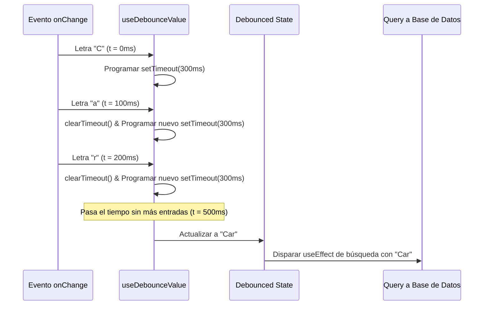

# Hook de Optimización de Búsqueda (`useDebounceValue`)

## 1. Propósito y Casos de Uso
Custom Hook React para retrasar la actualización de un valor (de-bounce) ante cambios rápidos. Su caso de uso principal es optimizar las búsquedas en tiempo real que realizan peticiones remotas de red o lecturas a Firestore (ej. buscador de productos, autocompletado de direcciones o filtros del CRM), previniendo saturación de llamadas al backend y mejorando el rendimiento de renderizado general.

## 2. Especificación Visual y Estilos
Agnóstico de interfaz (sin estilos directos al ser un Hook de lógica pura). 

## 3. Parámetros y API del Hook

```javascript
const debouncedValue = useDebounceValue(value, delay);
```

### Argumentos
| Parámetro | Tipo | Default | Descripción |
| :--- | :--- | :--- | :--- |
| `value` | `any` | *Requerido* | El estado o valor dinámico que se desea retrasar. |
| `delay` | `number` | `300` | El tiempo de espera en milisegundos antes de propagar el cambio. |

### Retorno
Retorna el valor de-bounced actualizado tras transcurrir el delay especificado.

## 4. Código React Completo y 100% Funcional

Consúltalo en la ubicación física: [`useDebounceValue.js`](file:///d:/Aplicaciones/App%20Ventas/src/hooks/useDebounceValue.js).

```javascript
import { useState, useEffect } from 'react';

/**
 * Hook para retrasar la propagación de un valor reactivo (de-bounce).
 * @param {any} value - Valor de entrada.
 * @param {number} delay - Retraso en milisegundos.
 * @returns {any} Valor de-bounced.
 */
export function useDebounceValue(value, delay = 300) {
  const [debouncedValue, setDebouncedValue] = useState(value);

  useEffect(() => {
    // Crear el temporizador
    const handler = setTimeout(() => {
      setDebouncedValue(value);
    }, delay);

    // Limpiar el temporizador al cambiar el valor de entrada o desmontar
    return () => {
      clearTimeout(handler);
    };
  }, [value, delay]);

  return debouncedValue;
}
```

## 5. Lógica de Estado y Ciclo de Vida
- **Inicialización:** Se instancia con el valor de entrada actual.
- **Efecto de Retraso:** Cada vez que el parámetro `value` o `delay` cambian, el `useEffect` anterior limpia el temporizador existente (`clearTimeout`) e inicia uno nuevo (`setTimeout`).
- **Limpieza de Fugas de Memoria:** Si el componente se desmonta antes de expirar el delay, el manejador cancela la ejecución del callback impidiendo actualizaciones sobre un estado ya desmontado.

## 6. Flujo Operativo y Secuencia de Interacción


## 7. Ejemplo de Uso (Importación y Consumo)
```jsx
import React, { useState, useEffect } from 'react';
import { useDebounceValue } from './hooks/useDebounceValue';

export function BuscadorProductos() {
  const [search, setSearch] = useState('');
  const debouncedSearch = useDebounceValue(search, 400);

  useEffect(() => {
    if (debouncedSearch) {
      console.log(`Buscando en Firestore: "${debouncedSearch}"`);
      // Disparar llamada a la API
    }
  }, [debouncedSearch]);

  return (
    <input
      type="text"
      value={search}
      onChange={(e) => setSearch(e.target.value)}
      placeholder="Buscar..."
    />
  );
}
```

## 8. Origen
- **Creado por:** Antigravity AI
- **Fecha de creación:** 2026-06-06
- **Versión:** 1.0
