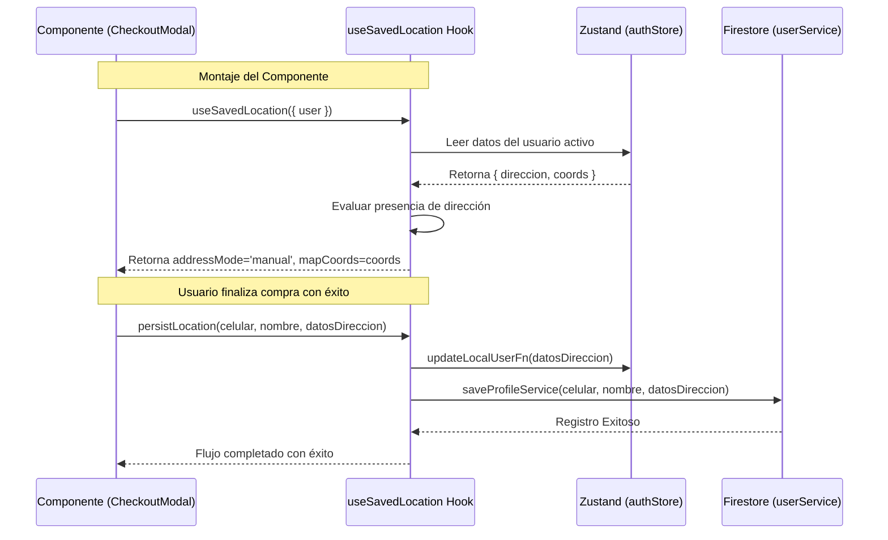

<!--
{
  "technicalName": "HookUbicacionGuardada",
  "targetPath": "src/hooks/HookUbicacionGuardada.js",
  "dependencies": {
    "npm": {},
    "internal": []
  }
}
-->

# useSavedLocation (Hook de Persistencia y Autocompletado de Ubicación)

## 1. Propósito y Casos de Uso
Este hook encapsula la lógica para cargar, gestionar y persistir la última ubicación y datos de entrega física de un cliente (`direccion`, `barrio`, `ciudad`, `coords`). 
Evita tener que reescribir la lógica de restauración y guardado del perfil en formularios multipaso (como el checkout).

### Casos de Uso:
- Autocompletar el checkout de compras de un cliente recurrente.
- Inicializar el pin y centrado de mapas interactivos (`LeafletMapPicker`) en la ubicación histórica del usuario.
- Decidir inteligentemente el modo de ingreso de dirección inicial (si tiene guardada, entra directo en modo edición de campos; si no, muestra el selector de métodos).

---

## 2. Especificación Visual y Estilos
Como hook de React puramente lógico, no renderiza elementos visuales directamente. Sin embargo, interactúa con el estado visual del selector de dirección controlando las siguientes variables de flujo:
- `addressMode`: `'choose'` (selección intermedia) o `'manual'` (formulario clásico).
- `coords`: Objeto `{ lat, lng }` o `null`.

---

## 3. Props y API del Hook

### Parámetros de Entrada (`useSavedLocation(options)`)
| Prop | Tipo | Default | Descripción |
|------|------|---------|-------------|
| `user` | `object` | `null` | Objeto del usuario autenticado actual obtenido del gestor de estado global (Zustand). |
| `updateLocalUserFn` | `function` | `() => {}` | Callback para actualizar el estado del usuario localmente (ej: `updateClient` en Zustand). |
| `saveProfileService` | `function` | `async () => {}` | Servicio asíncrono para persistir el perfil del usuario en la base de datos (ej: `saveClientProfile` de Firestore). |

### Retorno (`const { ... } = useSavedLocation(...)`)
| Propiedad | Tipo | Descripción |
|-----------|------|-------------|
| `addressMode` | `'choose' \| 'manual'` | Modo de visualización sugerido para el formulario de dirección. |
| `setAddressMode` | `function` | Cambiar el modo de visualización de dirección manualmente. |
| `mapCoords` | `{ lat: number, lng: number } \| null` | Coordenadas GPS de la última ubicación guardada. |
| `setMapCoords` | `function` | Actualizar las coordenadas GPS del mapa localmente. |
| `loadSavedLocation` | `function` | Función para forzar la recarga/restauración de la ubicación desde el perfil del usuario a los estados del formulario. |
| `persistLocation` | `function` | Función asíncrona que guarda la ubicación en Zustand y base de datos tras un pedido exitoso. |

---

## 4. Código React Completo y 100% Funcional

```javascript
import { useState, useEffect, useCallback } from 'react';

/**
 * Hook para gestionar el autocompletado y guardado de la última ubicación de entrega del cliente.
 */
export function useSavedLocation({ user, updateLocalUserFn, saveProfileService }) {
  const [addressMode, setAddressMode] = useState('choose');
  const [mapCoords, setMapCoords] = useState(null);

  // 1. Carga inicial e inicialización del flujo
  const loadSavedLocation = useCallback(() => {
    const hasSavedAddress = !!(user?.direccion || user?.barrio || user?.ciudad);
    setAddressMode(hasSavedAddress ? 'manual' : 'choose');
    setMapCoords(user?.coords || null);
  }, [user]);

  // Recargar si cambian los datos del usuario externamente (ej. inicio de sesión posterior)
  useEffect(() => {
    loadSavedLocation();
  }, [loadSavedLocation]);

  /**
   * Persiste los datos de ubicación tanto localmente como en la base de datos remota.
   * @param {string} celular - Celular del cliente
   * @param {string} nombre - Nombre del cliente
   * @param {object} addressData - Campos de dirección ({ direccion, barrio, ciudad, coords })
   */
  const persistLocation = useCallback(async (celular, nombre, addressData) => {
    if (!celular || !nombre) return;

    const cleanAddress = {
      direccion: addressData.direccion || '',
      barrio: addressData.barrio || '',
      ciudad: addressData.ciudad || '',
      ...(addressData.coords && { coords: addressData.coords })
    };

    // A. Actualizar estado local (Zustand)
    if (typeof updateLocalUserFn === 'function') {
      updateLocalUserFn(cleanAddress);
    }

    // B. Guardar en base de datos (Firestore)
    if (typeof saveProfileService === 'function') {
      try {
        await saveProfileService(celular, nombre, cleanAddress);
      } catch (error) {
        console.error("Error al persistir ubicación remota:", error);
        throw error;
      }
    }
  }, [updateLocalUserFn, saveProfileService]);

  return {
    addressMode,
    setAddressMode,
    mapCoords,
    setMapCoords,
    loadSavedLocation,
    persistLocation
  };
}
```

---

## 5. Lógica de Estado y Ciclo de Vida
1. **Render Inicial:** El hook evalúa el objeto `user`. Si contiene valores en `direccion`, `barrio` o `ciudad`, establece `addressMode` como `'manual'`, asumiendo que el usuario ya conoce el flujo y tiene datos precargados. De lo contrario, se inicializa en `'choose'`.
2. **Ciclo de Cambio:** Si el cliente limpia el formulario o alterna el método de entrega, `setAddressMode` y `setMapCoords` se actualizan reactivamente.
3. **Persistencia:** Al ejecutarse `persistLocation` tras una compra exitosa, se lanza un disparo síncrono para mutar el store local y una llamada asíncrona para actualizar Firestore de forma no bloqueante.

---

## 6. Integración con Servicios Externos
El hook no tiene un acoplamiento rígido con Firebase. En lugar de ello, recibe el servicio inyectado vía `saveProfileService` (ej: la función `saveClientProfile` definida en `userService.js`). Esto permite usarlo con Firebase, Supabase, APIs REST locales u offline mocks en entornos de pruebas.

---

## 7. Flujo Operativo y Secuencia de Interacción



---

## 8. Ejemplo de Uso (Importación y Consumo)

```jsx
import { useSavedLocation } from './useSavedLocation';
import { useAuthStore } from '../../store/authStore';
import { saveClientProfile } from '../../services/userService';

function CheckoutForm() {
  const { user, updateClient } = useAuthStore();
  
  const {
    addressMode,
    setAddressMode,
    mapCoords,
    setMapCoords,
    persistLocation
  } = useSavedLocation({
    user,
    updateLocalUserFn: updateClient,
    saveProfileService: saveClientProfile
  });

  const onSubmit = async (formData) => {
    // Proceso de creación del pedido...
    await persistLocation(formData.celular, formData.nombre, {
      direccion: formData.direccion,
      barrio: formData.barrio,
      ciudad: formData.ciudad,
      coords: mapCoords
    });
  };

  return (
    <div>
      {addressMode === 'choose' ? (
        <button onClick={() => setAddressMode('manual')}>Escribir Dirección</button>
      ) : (
        <form onSubmit={onSubmit}>
          {/* Inputs de dirección, barrio, ciudad */}
          <button type="submit">Hacer Pedido</button>
        </form>
      )}
    </div>
  );
}
```

---

## 9. Origen
* **Extraído de:** [CheckoutModal.jsx](file:///d:/Aplicaciones/App%20Ventas/src/components/client/checkout/CheckoutModal.jsx) & [userService.js](file:///d:/Aplicaciones/App%20Ventas/src/services/userService.js)
* **Fecha de extracción:** 2026-05-30
* **Versión:** 1.0
