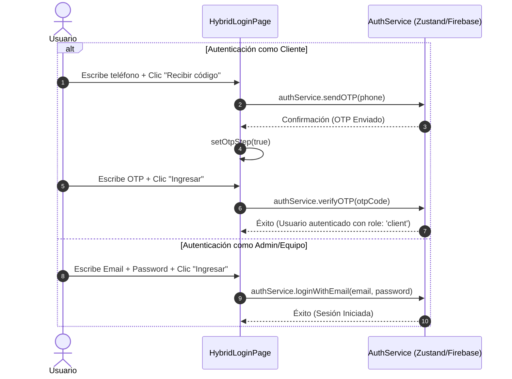

<!--
{
  "resource": "HybridLoginPage",
  "technicalName": "HybridLoginPage",
  "targetPath": "src/pages/LoginPage.jsx",
  "type": "component",
  "niches": [
    "retail_clothing",
    "grocery_food",
    "wellness_podology",
    "alimentos-artesanales",
    "distribuidoras-beauty",
    "licores-cocteleria",
    "coleccionismo-geek",
    "petshops-locales",
    "moda-local-calzado"
  ],
  "dependencies": {
    "npm": {
      "framer-motion": "^11.x",
      "lucide-react": "^0.400.x"
    },
    "internal": []
  }
}
-->

# HybridLoginPage — Página de Login Híbrida Premium

## 1. Propósito y Casos de Uso

Módulo completo de autenticación de alta fidelidad que unifica el inicio de sesión para dos roles de usuario diferenciados en el ecosistema:
- **Cliente (Flujo OTP):** Autenticación sin contraseña mediante número de teléfono y validación de código SMS. Garantiza la asignación del rol `client` en el perfil de base de datos.
- **Equipo/Administrador (Flujo Email/Password):** Autenticación tradicional mediante correo y contraseña para roles de staff y administración.

**Características Clave:**
- **Sanitización en Tiempo Real:** Remoción de caracteres no numéricos del campo de teléfono.
- **Micro-interacciones elásticas:** Feedback visual instantáneo con Framer Motion en transiciones de pestaña y submit.
- **Estética Glassmorphic:** Look premium con desenfoque de fondo avanzado y orbes orgánicos animados.

---

## 2. Especificación Visual y Estilos

| Token/Clase | Uso |
|---|---|
| `var(--color-bg)` | Fondo general de la página |
| `var(--color-surface)` | Tarjeta de login con opacidad 85% y desenfoque `backdrop-blur-2xl` |
| `var(--color-primary)` | Botón de submit principal, tab activa y orbe decorativo superior |
| `var(--color-secondary)` | Orbe decorativo inferior de fondo |
| `var(--color-border)` | Bordes sutiles translúcidos en inputs y tarjetas |
| `var(--color-text-muted)` | Textos informativos secundarios y placeholders |

---

## 3. Código React Completo

```jsx
import React, { useState } from 'react';
import { motion, AnimatePresence } from 'framer-motion';
import { Smartphone, Mail, Lock, ShieldCheck, ArrowRight, Loader2 } from 'lucide-react';

export default function HybridLoginPage() {
  // Estados de navegación y carga
  const [activeTab, setActiveTab] = useState('client'); // 'client' | 'admin'
  const [isLoading, setIsLoading] = useState(false);
  const [otpStep, setOtpStep] = useState(false); // Define si el cliente ya pidió el código

  // Estados de formulario
  const [phone, setPhone] = useState('');
  const [otpCode, setOtpCode] = useState('');
  const [email, setEmail] = useState('');
  const [password, setPassword] = useState('');

  // Sanitización y formateo de teléfono en vivo
  const handlePhoneChange = (e) => {
    const sanitizedValue = e.target.value.replace(/\D/g, '');
    setPhone(sanitizedValue);
  };

  // Simulación de envío al servicio de Firebase Auth
  const handleSubmit = async (e) => {
    e.preventDefault();
    setIsLoading(true);

    try {
      if (activeTab === 'client' && !otpStep) {
        // Aquí se llamaría a authService.sendOTP(phone)
        await new Promise(resolve => setTimeout(resolve, 1200));
        setOtpStep(true);
      } else if (activeTab === 'client' && otpStep) {
        // Aquí se llamaría a authService.verifyOTP(otpCode)
        // Y se aseguraría inyectar role: 'client' al crear el perfil
        await new Promise(resolve => setTimeout(resolve, 1500));
        console.log("Cliente autenticado con rol 'client'");
      } else {
        // Aquí se llamaría a authService.loginWithEmail(email, password)
        await new Promise(resolve => setTimeout(resolve, 1500));
        console.log("Administrador autenticado");
      }
    } catch (error) {
      console.error("Error de autenticación", error);
    } finally {
      setIsLoading(false);
    }
  };

  return (
    <div className="relative flex items-center justify-center min-h-[100dvh] p-4 bg-[var(--color-bg)] overflow-hidden">
      
      {/* Orbes de fondo (Efecto Glassmorphism Premium) */}
      <div className="absolute top-[-10%] left-[-10%] w-96 h-96 bg-[var(--color-primary)]/20 rounded-full blur-3xl pointer-events-none animate-pulse-slow"></div>
      <div className="absolute bottom-[-10%] right-[-10%] w-[30rem] h-[30rem] bg-[var(--color-secondary)]/20 rounded-full blur-3xl pointer-events-none"></div>

      <motion.div 
        initial={{ opacity: 0, y: 20 }}
        animate={{ opacity: 1, y: 0 }}
        transition={{ duration: 0.5, ease: 'easeOut' }}
        className="relative z-10 w-full max-w-md p-8 bg-[var(--color-surface)]/85 backdrop-blur-2xl border border-[var(--color-border)] rounded-[24px] shadow-soft-2xl"
      >
        {/* Cabecera del Login */}
        <div className="flex flex-col items-center mb-8 text-center">
          <div className="flex items-center justify-center w-14 h-14 mb-4 rounded-full bg-[var(--color-primary)]/10 text-[var(--color-primary)]">
            <ShieldCheck size={28} strokeWidth={2.5} />
          </div>
          <h1 className="text-2xl font-display font-bold text-[var(--color-text)]">
            Te damos la bienvenida
          </h1>
          <p className="mt-2 text-sm text-[var(--color-text-muted)]">
            Ingresa a tu cuenta para continuar
          </p>
        </div>

        {/* Control Segmentado Interactivo para Tabs */}
        {!otpStep && (
          <div className="flex p-1 mb-8 rounded-xl bg-[var(--color-surface-2)]">
            <button
              type="button"
              onClick={() => setActiveTab('client')}
              className={`relative flex-1 py-2 text-sm font-semibold transition-colors duration-200 z-10 ${
                activeTab === 'client' ? 'text-[var(--color-primary)]' : 'text-[var(--color-text-muted)] hover:text-[var(--color-text)]'
              }`}
            >
              Soy Cliente
              {activeTab === 'client' && (
                <motion.div 
                  layoutId="activeTabIndicator"
                  className="absolute inset-0 bg-[var(--color-surface)] rounded-lg shadow-sm -z-10"
                  transition={{ type: "spring", stiffness: 300, damping: 25 }}
                />
              )}
            </button>
            <button
              type="button"
              onClick={() => setActiveTab('admin')}
              className={`relative flex-1 py-2 text-sm font-semibold transition-colors duration-200 z-10 ${
                activeTab === 'admin' ? 'text-[var(--color-primary)]' : 'text-[var(--color-text-muted)] hover:text-[var(--color-text)]'
              }`}
            >
              Soy Equipo
              {activeTab === 'admin' && (
                <motion.div 
                  layoutId="activeTabIndicator"
                  className="absolute inset-0 bg-[var(--color-surface)] rounded-lg shadow-sm -z-10"
                  transition={{ type: "spring", stiffness: 300, damping: 25 }}
                />
              )}
            </button>
          </div>
        )}

        {/* Contenedor de Formularios con AnimatePresence */}
        <form onSubmit={handleSubmit} className="flex flex-col gap-5">
          <AnimatePresence mode="wait">
            
            {/* FLUJO CLIENTE (Teléfono / OTP) */}
            {activeTab === 'client' && (
              <motion.div
                key="client-form"
                initial={{ opacity: 0, x: -20 }}
                animate={{ opacity: 1, x: 0 }}
                exit={{ opacity: 0, x: 20 }}
                transition={{ duration: 0.2 }}
                className="flex flex-col gap-4"
              >
                {!otpStep ? (
                  <div className="flex flex-col gap-1.5">
                    <label className="text-xs font-semibold text-[var(--color-text)]">
                      Número de Teléfono
                    </label>
                    <div className="relative flex items-center">
                      <Smartphone className="absolute left-3.5 text-[var(--color-text-muted)]" size={18} />
                      <input
                        type="tel"
                        value={phone}
                        onChange={handlePhoneChange}
                        placeholder="300 123 4567"
                        required
                        className="w-full h-11 pl-10 pr-4 text-sm bg-[var(--color-surface-2)] border border-[var(--color-border)] rounded-xl text-[var(--color-text)] placeholder:text-[var(--color-text-muted)] focus:outline-none focus:ring-2 focus:ring-[var(--color-primary)]/50 focus:border-[var(--color-primary)] transition-all"
                      />
                    </div>
                  </div>
                ) : (
                  <div className="flex flex-col gap-1.5">
                    <label className="text-xs font-semibold text-[var(--color-text)]">
                      Código de Verificación (SMS)
                    </label>
                    <div className="relative flex items-center">
                      <Lock className="absolute left-3.5 text-[var(--color-text-muted)]" size={18} />
                      <input
                        type="text"
                        value={otpCode}
                        onChange={(e) => setOtpCode(e.target.value.replace(/\D/g, '').slice(0, 6))}
                        placeholder="123456"
                        required
                        className="w-full h-11 pl-10 pr-4 text-center tracking-[0.5em] font-mono text-lg bg-[var(--color-surface-2)] border border-[var(--color-border)] rounded-xl text-[var(--color-text)] placeholder:text-[var(--color-text-muted)] focus:outline-none focus:ring-2 focus:ring-[var(--color-primary)]/50 transition-all"
                      />
                    </div>
                    <button 
                      type="button" 
                      onClick={() => setOtpStep(false)}
                      className="mt-2 text-xs text-center font-medium text-[var(--color-text-muted)] hover:text-[var(--color-primary)] transition-colors"
                    >
                      ¿Número incorrecto? Cambiar teléfono
                    </button>
                  </div>
                )}
              </motion.div>
            )}

            {/* FLUJO EQUIPO/ADMIN (Correo y Contraseña) */}
            {activeTab === 'admin' && (
              <motion.div
                key="admin-form"
                initial={{ opacity: 0, x: 20 }}
                animate={{ opacity: 1, x: 0 }}
                exit={{ opacity: 0, x: -20 }}
                transition={{ duration: 0.2 }}
                className="flex flex-col gap-4"
              >
                <div className="flex flex-col gap-1.5">
                  <label className="text-xs font-semibold text-[var(--color-text)]">
                    Correo Electrónico
                  </label>
                  <div className="relative flex items-center">
                    <Mail className="absolute left-3.5 text-[var(--color-text-muted)]" size={18} />
                    <input
                      type="email"
                      value={email}
                      onChange={(e) => setEmail(e.target.value)}
                      placeholder="admin@empresa.com"
                      required
                      className="w-full h-11 pl-10 pr-4 text-sm bg-[var(--color-surface-2)] border border-[var(--color-border)] rounded-xl text-[var(--color-text)] placeholder:text-[var(--color-text-muted)] focus:outline-none focus:ring-2 focus:ring-[var(--color-primary)]/50 focus:border-[var(--color-primary)] transition-all"
                    />
                  </div>
                </div>

                <div className="flex flex-col gap-1.5">
                  <div className="flex justify-between items-center">
                    <label className="text-xs font-semibold text-[var(--color-text)]">
                      Contraseña
                    </label>
                  </div>
                  <div className="relative flex items-center">
                    <Lock className="absolute left-3.5 text-[var(--color-text-muted)]" size={18} />
                    <input
                      type="password"
                      value={password}
                      onChange={(e) => setPassword(e.target.value)}
                      placeholder="••••••••"
                      required
                      className="w-full h-11 pl-10 pr-4 text-sm bg-[var(--color-surface-2)] border border-[var(--color-border)] rounded-xl text-[var(--color-text)] placeholder:text-[var(--color-text-muted)] focus:outline-none focus:ring-2 focus:ring-[var(--color-primary)]/50 focus:border-[var(--color-primary)] transition-all"
                    />
                  </div>
                </div>
              </motion.div>
            )}
          </AnimatePresence>

          {/* Botón de Submit Universal Premium */}
          <button
            type="submit"
            disabled={isLoading || (activeTab === 'client' && phone.length < 10)}
            className="group relative flex items-center justify-center w-full h-12 mt-2 font-bold text-white transition-all duration-200 rounded-xl bg-[var(--color-primary)] hover:bg-[var(--color-primary)]/90 active:scale-95 disabled:opacity-50 disabled:cursor-not-allowed disabled:active:scale-100 overflow-hidden"
          >
            {isLoading ? (
              <Loader2 className="w-5 h-5 animate-spin" />
            ) : (
              <>
                <span className="relative z-10">
                  {activeTab === 'client' && !otpStep ? 'Recibir código SMS' : 'Ingresar al sistema'}
                </span>
                <ArrowRight className="absolute right-4 w-4 h-4 transition-transform duration-300 group-hover:translate-x-1" />
              </>
            )}
            {/* Destello de fondo interactivo */}
            <div className="absolute inset-0 w-full h-full bg-gradient-to-r from-transparent via-white/20 to-transparent -translate-x-full group-hover:animate-shimmer" />
          </button>
        </form>

      </motion.div>
    </div>
  );
}
```

---

## 4. Lógica de Estado y Ciclo de Vida

| Estado | Tipo | Descripción |
|---|---|---|
| `activeTab` | `'client' \| 'admin'` | Controla el flujo visual y el tipo de autenticación actual |
| `isLoading` | `boolean` | Bloquea inputs y muestra spinner animado durante peticiones |
| `otpStep` | `boolean` | Controla si se visualiza el input de número de teléfono o el input OTP |
| `phone` | `string` | Número telefónico sanitizado sin caracteres no numéricos |
| `otpCode` | `string` | Código de verificación OTP limitado a 6 dígitos numéricos |

---

## 5. Diagrama de Secuencia de Autenticación


