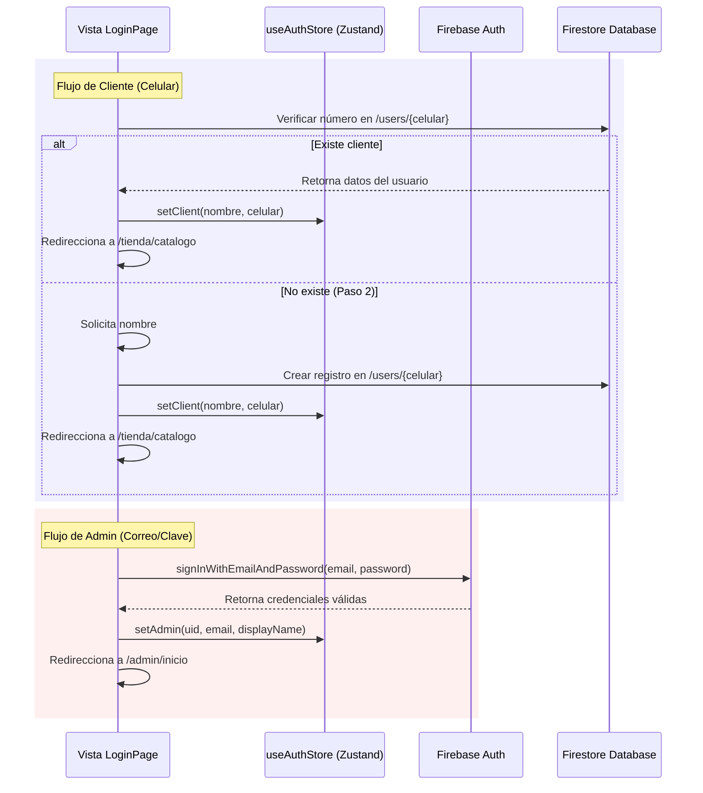

<!--
{
  "technicalName": "LoginPage",
  "targetPath": "src/pages/LoginPage.jsx",
  "dependencies": {
    "npm": {},
    "internal": []
  }
}
-->

# Página de Login Híbrida (LoginPage Component)

Componente de página principal diseñado para gestionar el ingreso a la plataforma bajo un modelo híbrido: inicio de sesión sin contraseña para clientes (número telefónico) y credenciales clásicas para administradores.

---

## 1. Propósito y Casos de Uso
* **Acceso de Clientes:** Permite a los clientes ingresar de forma rápida usando su número telefónico. Si el cliente ya existe en Firestore, ingresa inmediatamente; de lo contrario, avanza a un segundo paso para registrar su nombre y crear su perfil de forma automática.
* **Acceso de Administrador:** Permite a los vendedores ingresar con correo y contraseña. Si la tienda no cuenta con administradores registrados (instalación limpia), la vista se adapta para registrar al administrador inicial y configurar los datos del negocio (`sellerName`, `whatsappAdmin`).
* **Mensajes de Confianza:** Integra textos legales y de privacidad para dar tranquilidad al cliente al ingresar su número de celular.
* **Asistencia Guiada:** Conectado con un temporizador de inactividad que sugiere ayuda si el cliente tarda en ingresar sus datos.

---

## 2. Especificación Visual y Estilos
* **Alineación Responsiva:** Oculta los fondos complejos y patrones geométricos SVG en dispositivos móviles para priorizar la velocidad de carga y evitar la fatiga visual. En pantallas de escritorio, habilita gradientes dinámicos y difuminados (blurs).
* **Paleta de Colores de Marca:** Extrae dinámicamente la variable CSS `--color-primary` en tiempo de ejecución (`getComputedStyle`) para rellenar un patrón geométrico interactivo en el fondo del login.
* **Animaciones Premium:** Implementa envolturas de `framer-motion` para suavizar la aparición del formulario (`fade-in-up`) y animar ondas concéntricas de pulso alrededor del logotipo del negocio.

---

## 3. Código React Completo y 100% Funcional

```javascript
import { useState, useEffect, useMemo } from 'react'
import { useNavigate } from 'react-router-dom'
import { motion } from 'framer-motion'
import { signInWithEmailAndPassword, createUserWithEmailAndPassword } from 'firebase/auth'
import { doc, getDoc, setDoc, serverTimestamp } from 'firebase/firestore'
import { Store, Smartphone, Shield, Mail, Lock, ArrowLeft, User } from 'lucide-react'
import { auth, db } from '../config/firebaseConfig'
import useAuthStore from '../store/authStore'
import useAppConfigStore from '../store/appConfigStore'
import { updateAppConfig } from '../services/appConfigService'
import { ROLES, CLIENT_LOGIN_TRUST_MESSAGE, COLLECTIONS } from '../constants'
import useInactivityTimer from '../hooks/useInactivityTimer'
import SmartHint from '../components/client/guided/SmartHint'

export default function LoginPage() {
  const [mode, setMode] = useState('client')   // 'client' | 'admin'
  const [clientStep, setClientStep] = useState(1) // 1: Pedir Celular, 2: Pedir Nombre
  const [nombre, setNombre] = useState('')
  const [celular, setCelular] = useState('')
  const [adminEmail, setAdminEmail] = useState('')
  const [adminPassword, setAdminPassword] = useState('')
  const [adminSellerName, setAdminSellerName] = useState('')
  const [adminWhatsapp, setAdminWhatsapp] = useState('')
  const [isLoading, setIsLoading] = useState(false)
  const [error, setError] = useState('')

  const { role, setAdmin, setClient, isLoading: isAuthLoading } = useAuthStore()
  const { appName, appIcon, adminRegistered, primaryColor, welcomeWavesEnabled, loginTrustMessage, slogan, isLoaded, setConfig } = useAppConfigStore()
  const navigate = useNavigate()

  // Leer color primario real desde CSS en runtime
  const patternColor = useMemo(() => {
    const raw = getComputedStyle(document.documentElement)
      .getPropertyValue('--color-primary').trim()
    return raw || '#6d28d9'
  }, [primaryColor])

  const patternSvg = useMemo(() => {
    const c = encodeURIComponent(patternColor)
    return `url("data:image/svg+xml,%3Csvg xmlns='http://www.w3.org/2000/svg' width='160' height='160'%3E%3Cg transform='translate(10,10)' stroke='${c}' stroke-width='1.5' fill='none' stroke-linecap='round' stroke-linejoin='round'%3E%3Cpath d='M4 6h16l-1.5 10H5.5L4 6z'/%3E%3Cpath d='M9 6V4a3 3 0 016 0v2'/%3E%3C/g%3E%3Cg transform='translate(80,10)' stroke='${c}' stroke-width='1.5' fill='none' stroke-linecap='round' stroke-linejoin='round'%3E%3Ccircle cx='9' cy='19' r='1.5'/%3E%3Ccircle cx='18' cy='19' r='1.5'/%3E%3Cpath d='M2 2h2l2.5 11h10l2-7H6.5'/%3E%3C/g%3E%3Cg transform='translate(10,80)' stroke='${c}' stroke-width='1.5' fill='none' stroke-linecap='round' stroke-linejoin='round'%3E%3Cpath d='M12 2L2 12l8 8 10-10V2H12z'/%3E%3Ccircle cx='16' cy='6' r='1.5'/%3E%3C/g%3E%3Cg transform='translate(80,80)' stroke='${c}' stroke-width='1.5' fill='none' stroke-linecap='round' stroke-linejoin='round'%3E%3Crect x='3' y='8' width='18' height='13' rx='1'/%3E%3Cpath d='M3 8h18M12 8V21M8 8c0-2 1.5-4 4-4s4 2 4 4'/%3E%3C/g%3E%3Cg transform='translate(45,40)' stroke='${c}' stroke-width='1.5' fill='none' stroke-linecap='round' stroke-linejoin='round'%3E%3Cpolygon points='12,2 15,9 22,9 16,14 18,21 12,17 6,21 8,14 2,9 9,9'/%3E%3C/g%3E%3Cg transform='translate(115,45)' stroke='${c}' stroke-width='1.5' fill='none'%3E%3Ccircle cx='12' cy='12' r='9'/%3E%3Cpath d='M12 7v1m0 8v1m-3-5h6m-3-3v6' stroke-linecap='round'/%3E%3C/g%3E%3Cg transform='translate(45,110)' stroke='${c}' stroke-width='1.5' fill='none' stroke-linecap='round' stroke-linejoin='round'%3E%3Cpath d='M12 2L2 7l10 5 10-5-10-5zM2 17l10 5 10-5M2 12l10 5 10-5'/%3E%3C/g%3E%3C/svg%3E")`
  }, [patternColor])

  // Inactividad (Paso 1 del Cliente)
  const { isInactive } = useInactivityTimer(15000, mode === 'client' && clientStep === 1)

  // Redirección automática si ya está autenticado
  useEffect(() => {
    if (!isAuthLoading) {
      if (role === ROLES.ADMIN) {
        navigate('/admin/inicio', { replace: true })
      } else if (role === ROLES.CLIENT) {
        navigate('/tienda/catalogo', { replace: true })
      }
    }
  }, [role, isAuthLoading, navigate])

  if (isAuthLoading || !isLoaded) return null

  // Autenticación Administrador
  const handleAdminAuth = async (e) => {
    e.preventDefault()
    if (!adminEmail || !adminPassword) {
      setError('Por favor, ingresa correo y contraseña.')
      return
    }

    if (!adminRegistered) {
      if (!adminSellerName.trim()) {
        setError('Por favor, ingresa el nombre del vendedor.')
        return
      }
      if (!adminWhatsapp.trim()) {
        setError('Por favor, ingresa el número de WhatsApp.')
        return
      }
      if (adminWhatsapp.replace(/\D/g, '').length < 7) {
        setError('Por favor, ingresa un número de WhatsApp válido.')
        return
      }
    }

    setIsLoading(true)
    setError('')

    try {
      let userCredential
      if (adminRegistered) {
        userCredential = await signInWithEmailAndPassword(auth, adminEmail, adminPassword)
      } else {
        userCredential = await createUserWithEmailAndPassword(auth, adminEmail, adminPassword)
        const cleanWhatsapp = adminWhatsapp.replace(/\D/g, '')
        const configUpdates = {
          adminRegistered: true,
          sellerName: adminSellerName.trim(),
          whatsappAdmin: cleanWhatsapp
        }
        await updateAppConfig(configUpdates)
        setConfig({
          ...useAppConfigStore.getState(),
          ...configUpdates
        })
      }
      
      const user = userCredential.user
      setAdmin({
        uid: user.uid,
        email: user.email,
        displayName: user.displayName || adminSellerName.trim() || 'Administrador',
        photoURL: user.photoURL || null,
      })
      navigate('/admin/inicio', { replace: true })
    } catch (err) {
      console.error(err)
      if (err.code === 'auth/wrong-password' || err.code === 'auth/user-not-found' || err.code === 'auth/invalid-credential') {
        setError('Correo o contraseña incorrectos.')
      } else if (err.code === 'auth/email-already-in-use') {
        setError('Ese correo ya está en uso.')
      } else if (err.code === 'auth/weak-password') {
        setError('La contraseña debe tener al menos 6 caracteres.')
      } else {
        setError('Ocurrió un error. Intenta de nuevo.')
      }
    } finally {
      setIsLoading(false)
    }
  }

  // Login Cliente con celular + nombre
  const handleClientLogin = async (e) => {
    e.preventDefault()
    
    if (clientStep === 1) {
      if (celular.replace(/\D/g, '').length < 7) {
        setError('Ingresa un número de celular válido.')
        return
      }
      
      setIsLoading(true)
      setError('')

      try {
        const cleanPhone = celular.replace(/\D/g, '')
        const userRef = doc(db, COLLECTIONS.USERS, cleanPhone)
        const userSnap = await getDoc(userRef)

        if (userSnap.exists()) {
          setClient({
            nombre: userSnap.data().nombre,
            celular: cleanPhone,
            emoji: userSnap.data().emoji || null,
          })
          navigate('/tienda/catalogo', { replace: true })
        } else {
          setClientStep(2)
        }
      } catch (err) {
        setError('Error al verificar tu número. Verifica tu conexión.')
        console.error(err)
      } finally {
        setIsLoading(false)
      }
      
    } else {
      if (!nombre.trim()) {
        setError('Por favor ingresa tu nombre para continuar.')
        return
      }

      setIsLoading(true)
      setError('')

      try {
        const cleanPhone = celular.replace(/\D/g, '')
        const userRef = doc(db, COLLECTIONS.USERS, cleanPhone)
        
        await setDoc(userRef, {
          nombre: nombre.trim(),
          celular: cleanPhone,
          fechaRegistro: serverTimestamp(),
        })

        setClient({
          nombre: nombre.trim(),
          celular: cleanPhone,
        })
        navigate('/tienda/catalogo', { replace: true })
      } catch (err) {
        setError('Error al registrar tu nombre. Intenta de nuevo.')
        console.error(err)
      } finally {
        setIsLoading(false)
      }
    }
  }

  return (
    <div className="h-screen w-screen overflow-hidden bg-app flex flex-col md:flex-row items-stretch md:items-center md:justify-center relative">

      {/* Fondo en Escritorio */}
      <div className="absolute inset-0 overflow-hidden pointer-events-none hidden md:block">
        <div className="absolute -top-[20%] -left-[10%] w-[70%] h-[70%] rounded-full bg-primary/10 blur-[120px]" />
        <div className="absolute -bottom-[20%] -right-[10%] w-[70%] h-[70%] rounded-full bg-primary/8 blur-[100px]" />
        <div
          className="absolute inset-0 opacity-[0.06]"
          style={{
            backgroundImage: patternSvg,
            backgroundSize: '160px 160px',
            backgroundRepeat: 'repeat',
          }}
        />
      </div>

      {/* Botón Ir atrás */}
      <motion.button
        initial={{ opacity: 0, y: -10 }}
        animate={{ opacity: 1, y: 0 }}
        onClick={() => navigate('/')}
        className="absolute top-5 left-5 flex items-center justify-center gap-2.5 w-40 h-12 rounded-2xl bg-surface/95 backdrop-blur-md border border-app hover:border-primary/50 text-app font-bold text-sm shadow-md transition-all duration-300 hover:scale-105 active:scale-95 z-30 cursor-pointer"
      >
        <ArrowLeft size={16} className="text-primary flex-shrink-0" />
        <span>Ir atrás</span>
      </motion.button>

      {/* Botón Cambiar Modo */}
      <motion.button
        initial={{ opacity: 0, y: -10 }}
        animate={{ opacity: 1, y: 0 }}
        onClick={() => {
          setMode(prev => prev === 'client' ? 'admin' : 'client')
          setClientStep(1)
          setError('')
        }}
        className="absolute top-5 right-5 flex items-center justify-center gap-2.5 w-40 h-12 rounded-2xl bg-black/5 dark:bg-white/10 backdrop-blur-md border border-app hover:border-primary/50 text-app font-bold text-sm shadow-md transition-all duration-300 hover:scale-105 active:scale-95 z-30 cursor-pointer"
      >
        {mode === 'client' ? (
          <>
            <Shield size={16} className="text-primary flex-shrink-0" />
            <span>Ingreso Admin</span>
          </>
        ) : (
          <>
            <Smartphone size={16} className="text-primary flex-shrink-0" />
            <span>Volver a Cliente</span>
          </>
        )}
      </motion.button>

      {/* Contenedor Principal */}
      <div className="w-full h-full flex flex-col md:justify-center md:items-center z-10 md:p-4 bg-gradient-to-b from-primary/[0.06] via-primary/[0.02] to-surface md:from-transparent md:to-transparent overflow-y-auto">
        <div className="w-full md:max-w-md flex flex-col items-center gap-3 pt-24 px-4 pb-6 md:p-0">
          
          {/* Logo y Encabezado */}
          <div className="w-full flex flex-col items-center text-center relative px-2 mb-1">
            <div className="absolute top-2 w-32 h-32 rounded-full bg-primary/10 blur-2xl md:hidden pointer-events-none" />
            <div className="relative w-32 h-32 md:w-44 md:h-44 flex items-center justify-center mb-1">
              {(welcomeWavesEnabled !== false) && [0, 1.6].map((delay, i) => (
                <motion.div
                  key={i}
                  animate={{
                    scale: [0.7, 1.15],
                    opacity: [0, 0.2, 0]
                  }}
                  transition={{
                    duration: 3,
                    repeat: Infinity,
                    ease: 'easeOut',
                    delay,
                  }}
                  className="absolute inset-0 rounded-full bg-primary"
                />
              ))}

              <div className="relative w-[105px] h-[105px] md:w-[145px] md:h-[145px] z-10 flex items-center justify-center">
                {appIcon ? (
                  <motion.img
                    src={appIcon}
                    alt={`Logo`}
                    animate={{ y: [0, -3, 0] }}
                    transition={{ duration: 4, repeat: Infinity, ease: 'easeInOut' }}
                    className="w-full h-full object-contain"
                  />
                ) : (
                  <motion.div
                    animate={{ y: [0, -3, 0] }}
                    transition={{ duration: 4, repeat: Infinity, ease: 'easeInOut' }}
                    className="w-full h-full rounded-[2rem] bg-gradient-to-br from-primary to-primary/80 flex items-center justify-center shadow-lg"
                  >
                    <Store size={48} className="text-white" />
                  </motion.div>
                )}
              </div>
            </div>

            <motion.div initial={{ opacity: 0, y: 5 }} animate={{ opacity: 1, y: 0 }} className="px-2">
              {!appIcon && (
                <h1 className="text-lg md:text-2xl font-bold text-app tracking-tight mb-0.5">{appName}</h1>
              )}
              <h2 className="text-base md:text-lg font-black text-primary tracking-wide uppercase leading-tight">
                {slogan}
              </h2>
              <p className="text-muted text-[11px] md:text-xs mt-0.5 max-w-[240px] md:max-w-none mx-auto opacity-80 leading-relaxed">
                {mode === 'client' 
                  ? 'Bienvenido. Explora y realiza tus pedidos fácilmente.' 
                  : 'Panel de control y administración del negocio.'}
              </p>
            </motion.div>
          </div>

          {/* Formulario */}
          <motion.div
            initial={{ opacity: 0, y: 15 }}
            animate={{ opacity: 1, y: 0 }}
            className="w-full bg-surface rounded-3xl shadow-xl border border-app overflow-hidden p-5 md:p-6"
          >
            {mode === 'client' ? (
              <form onSubmit={handleClientLogin} noValidate>
                <div className="space-y-3.5">
                  {clientStep === 1 ? (
                    <div>
                      <label htmlFor="client-celular" className="block text-[11px] font-bold text-app mb-1.5 uppercase tracking-wider">
                        Número de celular
                      </label>
                      <div className="relative">
                        <Smartphone size={16} className="absolute left-4 top-1/2 -translate-y-1/2 text-muted" />
                        <input
                          id="client-celular"
                          type="tel"
                          value={celular}
                          onChange={(e) => setCellular(e.target.value)}
                          placeholder="3XXXXXXXXX"
                          className="w-full h-11 pl-10 pr-4 rounded-2xl bg-surface-2 border border-app text-app text-sm focus:outline-none focus:border-primary transition-all"
                        />
                      </div>
                      <div className="flex items-start gap-2.5 mt-2.5 p-3 bg-primary/[0.04] rounded-2xl">
                        <Shield size={14} className="text-primary flex-shrink-0 mt-0.5" />
                        <p className="text-[10px] text-muted leading-relaxed font-semibold">{CLIENT_LOGIN_TRUST_MESSAGE}</p>
                      </div>
                    </div>
                  ) : (
                    <div>
                      <div className="mb-4 bg-primary/5 p-3 rounded-2xl border border-primary/10">
                        <p className="text-xs text-primary font-bold mb-1">¡Hola! Parece que eres nuevo por aquí.</p>
                        <p className="text-[11px] text-muted leading-relaxed">Ingresa tu nombre para guardar tus datos.</p>
                      </div>
                      <label htmlFor="client-nombre" className="block text-[11px] font-bold text-app mb-2 uppercase tracking-wider">
                        ¿Cómo te llamas?
                      </label>
                      <input
                        id="client-nombre"
                        type="text"
                        value={nombre}
                        onChange={(e) => setNombre(e.target.value)}
                        placeholder="Ej. María Pérez"
                        className="w-full h-12 px-4 rounded-2xl bg-surface-2 border border-app text-app text-sm focus:outline-none focus:border-primary transition-all"
                        autoFocus
                      />
                    </div>
                  )}

                  {error && (
                    <div className="p-3 bg-red-500/10 border border-red-500/20 rounded-xl">
                      <p className="text-xs text-red-500 text-center font-semibold">{error}</p>
                    </div>
                  )}

                  <button
                    type="submit"
                    disabled={isLoading}
                    className="w-full h-12 bg-primary text-white rounded-2xl font-bold text-sm transition-all active:scale-95 disabled:opacity-50"
                  >
                    {isLoading ? <div className="w-5 h-5 border-2 border-white/30 border-t-white rounded-full animate-spin mx-auto" /> : 'Continuar'}
                  </button>

                  <SmartHint 
                    stepId="login_inactivity" 
                    message="Ingresa tus datos para continuar." 
                    position="bottom" 
                    inactivityTrigger={true}
                    isInactive={isInactive}
                    forceShow={true}
                  />
                </div>
              </form>
            ) : (
              <form onSubmit={handleAdminAuth} className="space-y-4" noValidate>
                <div className="mb-4">
                  <p className="text-xs text-app font-bold mb-1">
                    {adminRegistered ? 'Bienvenido de nuevo' : 'Configuración Inicial'}
                  </p>
                  <p className="text-[11px] text-muted">
                    {adminRegistered 
                      ? 'Ingresa tus credenciales para acceder.' 
                      : 'Crea el usuario administrador inicial.'}
                  </p>
                </div>

                <div className="space-y-3">
                  <div className="relative">
                    <Mail size={18} className="absolute left-4 top-1/2 -translate-y-1/2 text-muted" />
                    <input
                      type="email"
                      value={adminEmail}
                      onChange={(e) => setAdminEmail(e.target.value)}
                      placeholder="Correo electrónico"
                      className="w-full h-12 pl-11 pr-4 rounded-2xl bg-surface-2 border border-app text-app text-sm focus:outline-none focus:border-primary transition-all"
                    />
                  </div>
                  
                  <div className="relative">
                    <Lock size={18} className="absolute left-4 top-1/2 -translate-y-1/2 text-muted" />
                    <input
                      type="password"
                      value={adminPassword}
                      onChange={(e) => setAdminPassword(e.target.value)}
                      placeholder="Contraseña"
                      className="w-full h-12 pl-11 pr-4 rounded-2xl bg-surface-2 border border-app text-app text-sm focus:outline-none focus:border-primary transition-all"
                    />
                  </div>

                  {!adminRegistered && (
                    <>
                      <div className="relative">
                        <User size={18} className="absolute left-4 top-1/2 -translate-y-1/2 text-muted" />
                        <input
                          type="text"
                          value={adminSellerName}
                          onChange={(e) => setAdminSellerName(e.target.value)}
                          placeholder="Nombre del Vendedor / Dueño"
                          className="w-full h-12 pl-11 pr-4 rounded-2xl bg-surface-2 border border-app text-app text-sm focus:outline-none focus:border-primary transition-all"
                        />
                      </div>

                      <div className="relative">
                        <Smartphone size={18} className="absolute left-4 top-1/2 -translate-y-1/2 text-muted" />
                        <input
                          type="tel"
                          value={adminWhatsapp}
                          onChange={(e) => setAdminWhatsapp(e.target.value)}
                          placeholder="Número de WhatsApp"
                          className="w-full h-12 pl-11 pr-4 rounded-2xl bg-surface-2 border border-app text-app text-sm focus:outline-none focus:border-primary transition-all"
                        />
                      </div>
                    </>
                  )}
                </div>

                {error && (
                  <div className="p-3 bg-red-500/10 border border-red-500/20 rounded-xl">
                    <p className="text-xs text-red-500 text-center font-semibold">{error}</p>
                  </div>
                )}

                <button
                  type="submit"
                  disabled={isLoading}
                  className="w-full h-12 bg-primary text-white rounded-2xl font-bold text-sm transition-all active:scale-95 disabled:opacity-50"
                >
                  {isLoading ? (
                    <div className="w-5 h-5 border-2 border-white/30 border-t-white rounded-full animate-spin mx-auto" />
                  ) : (
                    adminRegistered ? 'Iniciar Sesión' : 'Registrar Administrador'
                  )}
                </button>
              </form>
            )}
          </motion.div>

        </div>
      </div>

      <p className="absolute bottom-3 left-0 right-0 text-[10px] text-muted/60 text-center pointer-events-none z-10 hidden md:block">
        {appName} · {loginTrustMessage}
      </p>
    </div>
  )
}
```

---

## 4. Lógica de Estado y Ciclo de Vida
* **Persistencia de Sesión:** Consume `useAuthStore` (Zustand) para sincronizar globalmente los estados del rol (`role`) y guardar perfiles de usuario.
* **Carga de Parámetros:** Lee datos dinámicos del negocio a través de `useAppConfigStore` (configuración del PWA, logo, waves, eslogan).
* **Control de Rutas:** Redirecciona síncronamente al usuario autenticado hacia `/admin/inicio` (vendedor) o `/tienda/catalogo` (cliente) al detectar cambios en el store de sesión.

---

## 5. Flujo Operativo y Secuencia de Interacción


