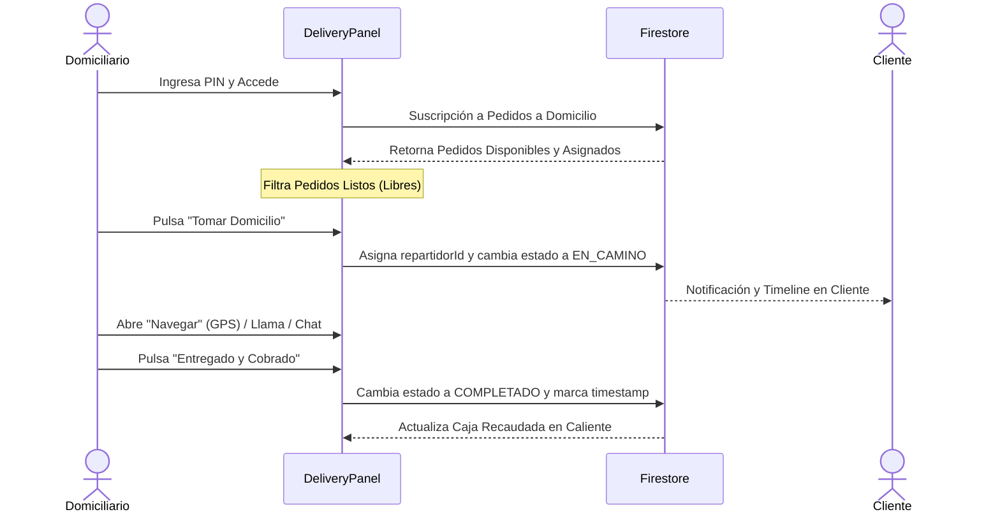

# Panel de Domicilios (DeliveryPanel)

Componente de página de nivel de producción que actúa como el espacio de trabajo centralizado para domiciliarios (delivery drivers). Permite la autenticación por PIN, la autogestión de despachos, control de entregas, geolocalización integrada y contabilidad rápida de dinero en efectivo recaudado.

---

## 1. Propósito y Casos de Uso
- **Autogestión de Reparto:** El domiciliario puede ver pedidos con el estado `READY` ('listo') y tomarlos autónomamente.
- **Ruta Activa:** Lista las entregas en curso asignadas al repartidor con opciones de contacto telefónico y chat.
- **Geolocalización In-App:** Integra el componente interactivo `MapToggle` para visualizar la dirección en OpenStreetMap y un enlace directo para abrir el destino en navegadores GPS externos (Google Maps / Waze).
- **Control de Caja Recaudada:** Suma automáticamente el monto cobrado en efectivo por los pedidos entregados en el día para facilitar el cuadre final con administración.

---

## 2. Especificación Visual y Estilos
Diseño adaptado 100% a la paleta de colores HSL corporativa inyectada dinámicamente y con soporte responsivo móvil-primero:
- **Header Adaptativo:** Banner con el nombre del domiciliario, su tipo de vehículo y placa activa.
- **Botones Táctiles Amplios:** Acciones principales (`Llamar`, `Chat`, `Completar`) diseñadas para ser pulsadas fácilmente en movimiento con una sola mano.
- **Modo Oscuro Integrado:** El panel de domicilios se acopla transparentemente al switch de tema global sin destellos visuales.

---

## 3. Código React Completo y 100% Funcional

```jsx
import React, { useState, useEffect } from 'react'
import { useNavigate } from 'react-router-dom'
import { collection, query, where, orderBy, onSnapshot, doc, updateDoc, serverTimestamp } from 'firebase/firestore'
import { db } from '../../../config/firebaseConfig'
import useAppConfigStore from '../../../store/appConfigStore'
import { ORDER_STATES } from '../../../constants'
import { 
  Truck, 
  Check, 
  Phone, 
  MessageCircle, 
  MapPin, 
  ExternalLink, 
  Lock, 
  RefreshCw, 
  LogOut, 
  Navigation, 
  DollarSign, 
  User,
  RotateCcw,
  CheckCircle2
} from 'lucide-react'
import { motion, AnimatePresence } from 'framer-motion'
import LeafletMapPicker from '../../../components/ui/LeafletMapPicker'

// ─── MAPA DESPLEGABLE DEL CLIENTE ────────────────────────────────────────────
function MapToggle({ coords, address }) {
  const [open, setOpen] = useState(false)
  return (
    <div className="mt-2">
      <button
        type="button"
        onClick={() => setOpen(v => !v)}
        className="flex items-center gap-1.5 text-[11px] font-bold text-primary hover:underline transition-all"
      >
        <svg viewBox="0 0 24 24" width="13" height="13" stroke="currentColor" fill="none" strokeWidth="2" strokeLinecap="round" strokeLinejoin="round">
          <path d="M21 10c0 7-9 13-9 13s-9-6-9-13a9 9 0 0 1 18 0z"/><circle cx="12" cy="10" r="3"/>
        </svg>
        {open ? 'Ocultar mapa' : 'Ver ubicación en mapa'}
      </button>
      <AnimatePresence>
        {open && (
          <motion.div
            initial={{ opacity: 0, height: 0 }}
            animate={{ opacity: 1, height: 'auto' }}
            exit={{ opacity: 0, height: 0 }}
            className="mt-2 overflow-hidden"
          >
            <LeafletMapPicker
              address={address}
              coords={coords}
              readOnly={true}
            />
          </motion.div>
        )}
      </AnimatePresence>
    </div>
  )
}

// Sound player helper
const playAlertSound = (type = 'success') => {
  try {
    const audioCtx = new (window.AudioContext || window.webkitAudioContext)()
    if (type === 'success') {
      const osc1 = audioCtx.createOscillator()
      const osc2 = audioCtx.createOscillator()
      const gainNode = audioCtx.createGain()
      osc1.type = 'sine'
      osc2.type = 'triangle'
      osc1.frequency.setValueAtTime(523.25, audioCtx.currentTime)
      osc1.frequency.exponentialRampToValueAtTime(659.25, audioCtx.currentTime + 0.15)
      osc2.frequency.setValueAtTime(523.25, audioCtx.currentTime)
      osc2.frequency.exponentialRampToValueAtTime(783.99, audioCtx.currentTime + 0.15)
      gainNode.gain.setValueAtTime(0.15, audioCtx.currentTime)
      gainNode.gain.exponentialRampToValueAtTime(0.01, audioCtx.currentTime + 0.3)
      osc1.connect(gainNode)
      osc2.connect(gainNode)
      gainNode.connect(audioCtx.destination)
      osc1.start()
      osc2.start()
      osc1.stop(audioCtx.currentTime + 0.3)
      osc2.stop(audioCtx.currentTime + 0.3)
    } else {
      const osc = audioCtx.createOscillator()
      const gainNode = audioCtx.createGain()
      osc.type = 'sine'
      osc.frequency.setValueAtTime(587.33, audioCtx.currentTime)
      osc.frequency.setValueAtTime(880, audioCtx.currentTime + 0.1)
      gainNode.gain.setValueAtTime(0.1, audioCtx.currentTime)
      gainNode.gain.exponentialRampToValueAtTime(0.01, audioCtx.currentTime + 0.4)
      osc.connect(gainNode)
      gainNode.connect(audioCtx.destination)
      osc.start()
      osc.stop(audioCtx.currentTime + 0.4)
    }
  } catch (e) {
    console.warn('Web Audio blocked or not supported:', e)
  }
}

export default function DeliveryPanel() {
  const navigate = useNavigate()
  const { hasMultipleEmployees } = useAppConfigStore()
  
  const [activeEmployee, setActiveEmployee] = useState(null)
  const [activeTab, setActiveTab] = useState('pending')
  const [orders, setOrders] = useState([])
  const [loading, setLoading] = useState(true)

  useEffect(() => {
    if (!hasMultipleEmployees) {
      sessionStorage.removeItem('active_employee')
      navigate('/empleado')
      return
    }
    const sessionAuth = sessionStorage.getItem('active_employee')
    if (sessionAuth) {
      try {
        const emp = JSON.parse(sessionAuth)
        if (emp.role === 'domiciliario') {
          setActiveEmployee(emp)
        } else {
          navigate('/empleado')
        }
      } catch (e) {
        navigate('/empleado')
      }
    } else {
      navigate('/empleado')
    }
  }, [hasMultipleEmployees, navigate])

  useEffect(() => {
    if (!activeEmployee) return

    setLoading(true)
    const q = query(
      collection(db, 'orders'),
      where('tipoEntrega', '==', 'domicilio'),
      orderBy('createdAt', 'desc')
    )

    const unsubscribe = onSnapshot(q, (snapshot) => {
      const docs = snapshot.docs.map(doc => ({
        id: doc.id,
        ...doc.data()
      }))
      
      setOrders(prev => {
        const prevAvailable = prev.filter(o => o.estado === ORDER_STATES.READY && !o.repartidorId).length
        const nextAvailable = docs.filter(o => o.estado === ORDER_STATES.READY && !o.repartidorId).length
        if (nextAvailable > prevAvailable && prev.length > 0) {
          playAlertSound('new')
        }
        return docs
      })
      setLoading(false)
    }, (error) => {
      console.error("Error reading orders:", error)
      setLoading(false)
    })

    return () => unsubscribe()
  }, [activeEmployee])

  const handleLogout = () => {
    sessionStorage.removeItem('active_employee')
    navigate('/empleado')
  }

  const handleTakeDelivery = async (orderId) => {
    try {
      const orderRef = doc(db, 'orders', orderId)
      await updateDoc(orderRef, {
        repartidorId: activeEmployee.id,
        repartidorName: activeEmployee.name,
        repartidorPhone: activeEmployee.phone || '',
        repartidorVehicle: activeEmployee.vehicleType || 'moto',
        repartidorPlate: activeEmployee.vehiclePlate || '',
        estado: ORDER_STATES.EN_CAMINO,
        updatedAt: serverTimestamp()
      })
      playAlertSound('success')
    } catch (e) {
      console.error("Error taking order:", e)
    }
  }

  const handleReleaseDelivery = async (orderId) => {
    try {
      const orderRef = doc(db, 'orders', orderId)
      await updateDoc(orderRef, {
        repartidorId: null,
        repartidorName: null,
        repartidorPhone: null,
        repartidorVehicle: null,
        repartidorPlate: null,
        estado: ORDER_STATES.READY,
        updatedAt: serverTimestamp()
      })
      playAlertSound('success')
    } catch (e) {
      console.error("Error releasing order:", e)
    }
  }

  const handleDeliverOrder = async (orderId) => {
    try {
      const orderRef = doc(db, 'orders', orderId)
      await updateDoc(orderRef, {
        estado: ORDER_STATES.COMPLETED,
        deliveredAt: serverTimestamp(),
        updatedAt: serverTimestamp()
      })
      playAlertSound('success')
    } catch (e) {
      console.error("Error completing delivery:", e)
    }
  }

  const handleNavigateGPS = (coords, address) => {
    if (coords?.lat && coords?.lng) {
      window.open(`https://www.google.com/maps/dir/?api=1&destination=${coords.lat},${coords.lng}`, '_blank')
    } else {
      window.open(`https://www.google.com/maps/search/?api=1&query=${encodeURIComponent(address)}`, '_blank')
    }
  }

  const formatCurrency = (val) => {
    return new Intl.NumberFormat('es-CO', {
      style: 'currency',
      currency: 'COP',
      minimumFractionDigits: 0
    }).format(val)
  }

  const currentDeliveries = orders.filter(o => 
    (o.estado === ORDER_STATES.READY && !o.repartidorId) || 
    (o.estado === ORDER_STATES.EN_CAMINO && o.repartidorId === activeEmployee?.id)
  )

  const deliveredToday = orders.filter(o => {
    if (o.estado !== ORDER_STATES.COMPLETED || o.repartidorId !== activeEmployee?.id) return false
    const date = o.deliveredAt?.toDate ? o.deliveredAt.toDate() : (o.updatedAt?.toDate ? o.updatedAt.toDate() : new Date())
    const today = new Date()
    return date.getDate() === today.getDate() &&
           date.getMonth() === today.getMonth() &&
           date.getFullYear() === today.getFullYear()
  })

  const cashCollected = deliveredToday
    .filter(o => o.metodoPago === 'efectivo')
    .reduce((sum, o) => sum + (o.total || 0), 0)

  if (!hasMultipleEmployees || !activeEmployee) {
    return (
      <div className="min-h-screen flex flex-col items-center justify-center bg-app text-app p-4">
        <RefreshCw className="w-8 h-8 animate-spin text-primary mb-2" />
        <p className="text-xs text-muted font-bold uppercase tracking-wider">Verificando Credenciales...</p>
      </div>
    )
  }

  return (
    <div className="min-h-screen bg-app flex flex-col overflow-x-hidden">
      {/* HEADER */}
      <header className="sticky top-0 z-40 bg-surface/80 backdrop-blur-xl border-b border-app/60 px-4 sm:px-6 py-4 flex flex-col md:flex-row gap-4 items-center justify-between shadow-[0_4px_30px_rgba(0,0,0,0.02)]">
        <div className="flex items-center justify-between w-full md:w-auto gap-3">
          <div className="flex items-center gap-3">
            <div className="w-10 h-10 rounded-2xl bg-primary-soft text-primary flex items-center justify-center shadow-inner">
              <Truck size={20} className="text-primary animate-pulse" />
            </div>
            <div>
              <h1 className="text-sm font-black text-app uppercase tracking-wider leading-none">Domiciliario: {activeEmployee.name}</h1>
              <p className="text-[9px] text-muted leading-none mt-1.5 font-bold uppercase tracking-widest">
                Vehículo: {activeEmployee.vehicleType === 'moto' ? 'Motocicleta' : activeEmployee.vehicleType === 'carro' ? 'Automóvil' : activeEmployee.vehicleType === 'bicicleta' ? 'Bicicleta' : 'A pie'} {activeEmployee.vehiclePlate ? `(${activeEmployee.vehiclePlate})` : ''}
              </p>
            </div>
          </div>
          <button 
            onClick={handleLogout}
            className="md:hidden h-9 px-3 rounded-xl border border-red-500/20 bg-red-500/5 text-red-500 flex items-center gap-1.5 text-xs font-black transition-all active:scale-95 shrink-0"
          >
            <LogOut size={13} />
            Salir
          </button>
        </div>

        {/* TABS */}
        <div className="flex bg-surface-2 p-1.5 rounded-2xl border border-app w-full md:w-auto relative justify-between sm:justify-start gap-1">
          <button
            onClick={() => setActiveTab('pending')}
            className={`relative flex-1 sm:flex-initial px-4 py-2 rounded-xl text-xs font-black uppercase tracking-wider transition-all z-10 select-none ${
              activeTab === 'pending' ? 'text-primary' : 'text-muted hover:text-app'
            }`}
          >
            En Ruta / Libres ({currentDeliveries.length})
            {activeTab === 'pending' && (
              <motion.div
                layoutId="activeDeliveryTab"
                className="absolute inset-0 bg-surface border border-app shadow-xs rounded-xl -z-10"
                transition={{ type: 'spring', stiffness: 380, damping: 30 }}
              />
            )}
          </button>
          <button
            onClick={() => setActiveTab('delivered')}
            className={`relative flex-1 sm:flex-initial px-4 py-2 rounded-xl text-xs font-black uppercase tracking-wider transition-all z-10 select-none ${
              activeTab === 'delivered' ? 'text-primary' : 'text-muted hover:text-app'
            }`}
          >
            Entregados Hoy ({deliveredToday.length})
            {activeTab === 'delivered' && (
              <motion.div
                layoutId="activeDeliveryTab"
                className="absolute inset-0 bg-surface border border-app shadow-xs rounded-xl -z-10"
                transition={{ type: 'spring', stiffness: 380, damping: 30 }}
              />
            )}
          </button>
        </div>

        <button 
          onClick={handleLogout}
          className="hidden md:flex h-9 px-4 rounded-xl border border-red-500/20 bg-red-500/5 hover:bg-red-500/10 text-red-500 items-center gap-2 text-xs font-black transition-all active:scale-95 shrink-0"
        >
          <LogOut size={14} />
          Salir del Panel
        </button>
      </header>

      {/* MAIN CONTAINER */}
      <main className="flex-1 p-4 sm:p-6 overflow-y-auto bg-app/20">
        {loading ? (
          <div className="flex flex-col items-center justify-center h-80 gap-3 text-muted">
            <RefreshCw size={26} className="animate-spin text-primary" />
            <p className="text-xs font-black uppercase tracking-widest text-slate-400">Sincronizando entregas...</p>
          </div>
        ) : activeTab === 'pending' ? (
          currentDeliveries.length === 0 ? (
            <div className="flex flex-col items-center justify-center h-80 text-center max-w-md mx-auto">
              <div className="w-16 h-16 rounded-3xl bg-emerald-500/5 border border-emerald-500/10 flex items-center justify-center mb-4 text-emerald-500">
                <CheckCircle2 size={28} />
              </div>
              <h3 className="font-black text-sm text-app uppercase tracking-wider">Sin Pedidos Pendientes</h3>
              <p className="text-xs text-muted mt-2 leading-relaxed">No hay domicilios para entregar o tomar en este momento. ¡Buen descanso!</p>
            </div>
          ) : (
            <motion.div layout className="grid grid-cols-1 md:grid-cols-2 lg:grid-cols-3 xl:grid-cols-4 gap-5">
              <AnimatePresence mode="popLayout">
                {currentDeliveries.map(order => {
                  const isTaken = order.repartidorId === activeEmployee.id
                  
                  return (
                    <motion.div
                      key={order.id}
                      layout
                      initial={{ opacity: 0, scale: 0.96 }}
                      animate={{ opacity: 1, scale: 1 }}
                      exit={{ opacity: 0, scale: 0.95 }}
                      className={`bg-surface rounded-3xl border shadow-xs overflow-hidden flex flex-col relative ${
                        isTaken ? 'border-primary' : 'border-app'
                      }`}
                    >
                      <div className="p-4 border-b border-app bg-surface-2/40 flex justify-between items-start">
                        <div>
                          <span className="font-mono font-black text-app text-sm bg-app px-2 py-0.5 rounded-lg border border-app">
                            #{order.orderNumber}
                          </span>
                          <p className="text-[10px] text-muted mt-2 font-bold uppercase tracking-wider">
                            Pago: {order.metodoPago === 'efectivo' ? '💸 Efectivo' : order.metodoPago === 'transferencia' ? '📱 Transfer' : '💳 Fiado'}
                          </p>
                        </div>
                        <div className="text-right">
                          <span className="text-xs font-black text-primary bg-primary-soft border border-primary/20 px-2 py-1 rounded-xl">
                            {formatCurrency(order.total || 0)}
                          </span>
                          {order.costoEnvio > 0 && (
                            <p className="text-[9px] text-muted font-bold mt-1.5">
                              Envío: {formatCurrency(order.costoEnvio)}
                            </p>
                          )}
                        </div>
                      </div>

                      <div className="p-4 flex-1 space-y-4">
                        <div className="space-y-1">
                          <p className="text-[9px] font-black text-slate-400 uppercase tracking-widest">Cliente</p>
                          <p className="text-xs font-black text-app">{order.cliente?.nombre || 'Desconocido'}</p>
                          <p className="text-xs text-muted">Celular: {order.cliente?.celular || 'N/A'}</p>
                        </div>

                        <div className="space-y-1.5">
                          <p className="text-[9px] font-black text-slate-400 uppercase tracking-widest">Dirección de Envío</p>
                          <p className="text-xs text-app font-bold leading-normal flex items-start gap-1">
                            <MapPin size={12} className="text-primary mt-0.5 flex-shrink-0" />
                            {order.cliente?.direccion || 'Sin dirección registrada'}
                          </p>
                          {order.cliente?.barrio && (
                            <p className="text-[10px] text-muted font-bold pl-4">
                              {[order.cliente.barrio, order.cliente.ciudad].filter(Boolean).join(', ')}
                            </p>
                          )}
                        </div>

                        {order.cliente?.coords?.lat && (
                          <div className="pt-1">
                            <MapToggle coords={order.cliente.coords} address={order.cliente.direccion} />
                          </div>
                        )}

                        {order.notas && (
                          <div className="p-2.5 rounded-2xl bg-yellow-500/5 border border-yellow-500/10 text-[10px] text-amber-700 italic">
                            "{order.notas}"
                          </div>
                        )}
                      </div>

                      <div className="p-3 border-t border-app bg-surface-2/20 space-y-2">
                        {isTaken ? (
                          <>
                            <div className="grid grid-cols-3 gap-2">
                              <button
                                onClick={() => handleNavigateGPS(order.cliente?.coords, order.cliente?.direccion)}
                                className="h-10 rounded-xl bg-primary-soft text-primary border border-primary/20 flex items-center justify-center gap-1 text-[10px] font-bold"
                              >
                                <Navigation size={13} />
                                Navegar
                              </button>
                              
                              <a
                                href={`tel:${(order.cliente?.celular || '').replace(/\D/g, '')}`}
                                className="h-10 rounded-xl bg-blue-500/10 text-blue-600 border border-blue-500/20 flex items-center justify-center gap-1 text-[10px] font-bold"
                              >
                                <Phone size={13} />
                                Llamar
                              </a>

                              <a
                                href={`https://api.whatsapp.com/send?phone=${(order.cliente?.celular || '').replace(/\D/g, '')}&text=${encodeURIComponent(`Hola ${order.cliente?.nombre || ''}, soy el domiciliario de la tienda. Voy en camino con tu pedido #${order.orderNumber}`)}`}
                                target="_blank"
                                rel="noopener noreferrer"
                                className="h-10 rounded-xl bg-green-500/10 text-green-600 border border-green-500/20 flex items-center justify-center gap-1 text-[10px] font-bold"
                              >
                                <MessageCircle size={13} />
                                Chat
                              </a>
                            </div>

                            <button
                              onClick={() => handleDeliverOrder(order.id)}
                              className="w-full h-11 bg-primary text-white font-bold text-xs uppercase tracking-wider rounded-2xl flex items-center justify-center gap-2 active:scale-95 transition-all cursor-pointer shadow-md shadow-primary/10"
                            >
                              <Check size={14} strokeWidth={2.5} /> Entregado y Cobrado
                            </button>

                            <button
                              onClick={() => handleReleaseDelivery(order.id)}
                              className="w-full h-9 bg-red-500/5 hover:bg-red-500/10 text-red-500 border border-red-500/20 text-[10px] font-black uppercase tracking-wider rounded-xl transition-all cursor-pointer"
                            >
                              Liberar / Devolver
                            </button>
                          </>
                        ) : (
                          <button
                            onClick={() => handleTakeDelivery(order.id)}
                            className="w-full h-11 bg-primary text-white font-bold text-xs uppercase tracking-wider rounded-2xl flex items-center justify-center gap-1.5 active:scale-95 transition-all cursor-pointer shadow-inner"
                          >
                            <Truck size={14} /> Tomar Domicilio
                          </button>
                        )}
                      </div>
                    </motion.div>
                  )
                })}
              </AnimatePresence>
            </motion.div>
          )
        ) : (
          <div className="space-y-6">
            <div className="grid grid-cols-1 sm:grid-cols-2 gap-4 max-w-xl">
              <div className="bg-surface border border-app rounded-3xl p-5 flex items-center gap-4 shadow-xs">
                <div className="w-12 h-12 rounded-2xl bg-emerald-500/10 text-emerald-500 flex items-center justify-center">
                  <CheckCircle2 size={24} />
                </div>
                <div>
                  <p className="text-[10px] text-muted uppercase font-black tracking-wider">Entregas de Hoy</p>
                  <p className="text-xl font-black text-app mt-0.5">{deliveredToday.length}</p>
                </div>
              </div>
              
              <div className="bg-surface border border-app rounded-3xl p-5 flex items-center gap-4 shadow-xs">
                <div className="w-12 h-12 rounded-2xl bg-amber-500/10 text-amber-500 flex items-center justify-center">
                  <DollarSign size={24} />
                </div>
                <div>
                  <p className="text-[10px] text-muted uppercase font-black tracking-wider">Efectivo en Caja/Recaudado</p>
                  <p className="text-xl font-black text-amber-600 mt-0.5">{formatCurrency(cashCollected)}</p>
                </div>
              </div>
            </div>

            {deliveredToday.length === 0 ? (
              <div className="flex flex-col items-center justify-center h-64 text-center max-w-md">
                <p className="text-3xl mb-3">🛵</p>
                <h3 className="font-black text-sm text-app uppercase tracking-wider">Aún sin entregas completadas</h3>
                <p className="text-xs text-muted mt-2">Los domicilios que entregues hoy aparecerán listados aquí con su resumen financiero.</p>
              </div>
            ) : (
              <div className="grid grid-cols-1 md:grid-cols-2 lg:grid-cols-3 xl:grid-cols-4 gap-5">
                {deliveredToday.map(order => (
                  <div key={order.id} className="bg-surface rounded-3xl border border-app/60 shadow-xs p-4 space-y-3 opacity-90">
                    <div className="flex justify-between items-center border-b border-app pb-2.5">
                      <span className="font-mono font-black text-xs text-app bg-app px-2 py-0.5 rounded-md border border-app">
                        #{order.orderNumber}
                      </span>
                      <span className="text-[10px] text-muted font-bold">
                        {order.deliveredAt?.toDate ? order.deliveredAt.toDate().toLocaleTimeString('es-CO', { hour: '2-digit', minute: '2-digit' }) : 'Reciente'}
                      </span>
                    </div>

                    <div className="space-y-1">
                      <p className="text-xs font-black text-app">{order.cliente?.nombre || 'Desconocido'}</p>
                      <p className="text-[10px] text-muted">{order.cliente?.direccion}</p>
                    </div>

                    <div className="flex justify-between items-center pt-2 border-t border-app/40 text-xs font-bold text-app">
                      <span>Recaudado ({order.metodoPago === 'efectivo' ? 'Efectivo' : 'Digital/Fiado'}):</span>
                      <span className={order.metodoPago === 'efectivo' ? 'text-amber-600 font-extrabold' : 'text-muted'}>
                        {formatCurrency(order.total || 0)}
                      </span>
                    </div>
                  </div>
                ))}
              </div>
            )}
          </div>
        )}
      </main>
    </div>
  )
}
```

---

## 4. Lógica de Estado y Ciclo de Vida
1. **Verificación de Sesión (`useEffect`):** El componente lee el valor de `sessionStorage.getItem('active_employee')`. Si no existe o su rol no es `domiciliario`, redirige inmediatamente a la ruta de acceso de personal `/empleado`.
2. **Suscripción en Tiempo Real (`onSnapshot`):** Escucha todos los pedidos con `tipoEntrega == 'domicilio'` ordenados descendentemente. Al dispararse actualizaciones, diferencia en tiempo real la cantidad de pedidos en preparación disponibles para alertar mediante notificaciones sonoras nativas.
3. **Persistencia Temporal:** El estado de las entregas de hoy y caja recolectada se calcula en caliente filtrando el listado en base a `repartidorId` y comparando la fecha actual contra el valor persistido de `deliveredAt`.

---

## 5. Flujo Operativo y Secuencia de Interacción


