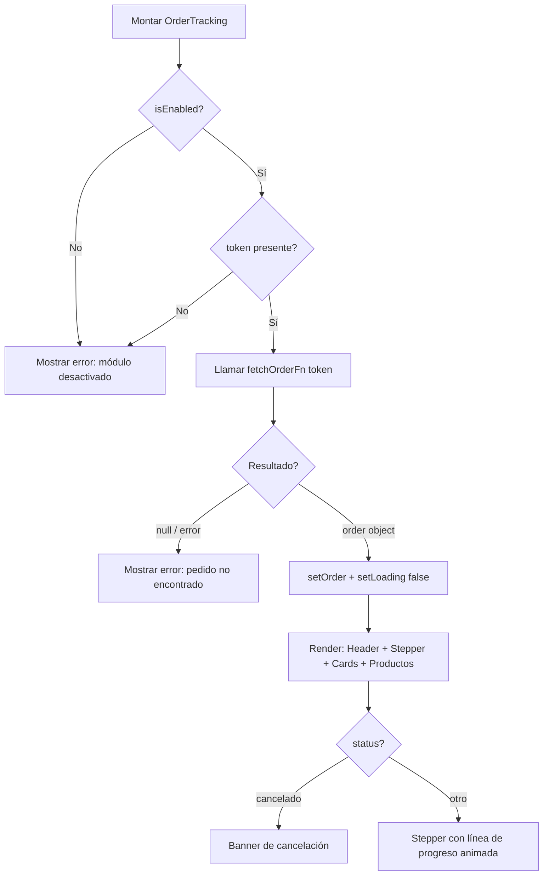

<!--
{
  "technicalName": "OrderTracking",
  "targetPath": "src/pages/OrderTracking.jsx",
  "dependencies": {
    "npm": {},
    "internal": []
  },
  "type": "component",
  "niches": [
    "retail_clothing",
    "grocery_food",
    "alimentos-artesanales",
    "laundry",
    "distribucion-horeca"
  ]
}
-->

# Seguimiento de Pedido Público (OrderTracking)

## 1. Propósito y Casos de Uso

Vista pública sin autenticación que permite a un cliente consultar el estado de su pedido mediante un token único. Ideal para:

- **E-commerce:** Link en confirmación de compra por WhatsApp/email → cliente consulta estado sin login.
- **Logística / Envíos:** Tracking público de envíos con stepper de progreso.
- **Servicios / Garantías:** Seguimiento del estado de un reclamo o solicitud de soporte.
- **Suscripciones:** Estado de activación/renovación de una suscripción.

**Uso actual en App Ventas:** `src/pages/client/OrderTracking.jsx`, accesible en `/seguimiento?t={token}`. El token se genera al crear el pedido y se envía al cliente vía WhatsApp.

---

## 2. Especificación Visual y Estilos

### Variables CSS Requeridas
```css
--bg-primary       /* Fondo principal de la página */
--card-bg          /* Fondo de tarjetas */
--text-primary     /* Texto principal */
--text-secondary   /* Texto secundario / mutado */
--color-primary    /* Color de acento primario (stepper, botones) */
```

### Características Visuales
- **Layout:** Centrado con `max-w-3xl`, padding responsivo (`px-4 py-8 md:py-16`).
- **Cards:** `rounded-3xl`, `shadow-xl`, `backdrop-blur-md`, borde sutil.
- **Stepper:** Línea de progreso activa animada (`transition-all duration-500`). Adaptativo: vertical en móvil, horizontal en `md:`.
- **Badges de estado:** Colores semánticos por estado (`amber` = pendiente, `emerald` = completado, `rose` = cancelado, `indigo` = crédito aprobado).
- **Íconos:** SVGs inline — sin dependencia de librerías externas.
- **Animación de loader:** `@keyframes spin` para el spinner del `AppLoader`.

---

## 3. Props y API del Componente

| Prop | Tipo | Default | Descripción |
|------|------|---------|-------------|
| `token` | `string` | `null` | Token único de seguimiento del pedido. Se obtiene usualmente de `?t=` en la URL. |
| `fetchOrderFn` | `async (token) => order \| null` | **requerido** | Función asíncrona que resuelve el pedido desde cualquier fuente (Firestore, REST API, etc.). |
| `isEnabled` | `boolean` | `true` | Feature flag. Si `false`, muestra mensaje de módulo desactivado. |
| `whatsappSupport` | `string` | `null` | Número de WhatsApp de soporte (sin `+`, solo dígitos). Ej: `"573001234567"`. |
| `onNavigateHome` | `() => void` | `() => window.location.href = '/'` | Callback para el botón "Ir a la Tienda". Desacopla de `react-router-dom`. |
| `steps` | `Array<{label, desc}>` | Ver default | Pasos del stepper. Por defecto: Recibido → Procesado → Entregado. |
| `statusMap` | `object` | Ver default | Mapeo de estados a etiqueta, color e índice del stepper. |
| `appName` | `string` | `'App'` | Nombre de la aplicación para el footer de copyright. |
| `loaderComponent` | `ReactNode` | Spinner nativo | Componente de loader personalizado (opcional). |

### Objeto `order` esperado (retornado por `fetchOrderFn`)
```js
{
  id: string,                      // ID del pedido
  status: string,                  // 'pendiente' | 'credito_aprobado' | 'completado' | 'cancelado'
  createdAt: { seconds: number },  // Timestamp Firestore o { seconds } compatible
  total: number,
  metodoPago: string,
  metodoEntrega: string,           // 'DOMICILIO' | 'TIENDA'
  cliente: { nombre: string, celular: string },
  productos: Array<{ nombre, precio, cantidad }>
}
```

---

## 4. Código React Completo y 100% Funcional

```jsx
import { useEffect, useState } from 'react'

// ─── Íconos SVG inline (sin dependencia de lucide-react) ──────────────────────
const IconPkg = () => (
  <svg viewBox="0 0 24 24" fill="none" stroke="currentColor" strokeWidth={2} strokeLinecap="round" strokeLinejoin="round" width={64} height={64}>
    <path d="M16.5 9.4l-9-5.19M21 16V8a2 2 0 0 0-1-1.73l-7-4a2 2 0 0 0-2 0l-7 4A2 2 0 0 0 3 8v8a2 2 0 0 0 1 1.73l7 4a2 2 0 0 0 2 0l7-4A2 2 0 0 0 21 16z" />
    <polyline points="3.27 6.96 12 12.01 20.73 6.96" />
    <line x1="12" y1="22.08" x2="12" y2="12" />
  </svg>
)
const IconCheck = ({ size = 16 }) => (
  <svg width={size} height={size} viewBox="0 0 24 24" fill="none" stroke="currentColor" strokeWidth={3} strokeLinecap="round" strokeLinejoin="round">
    <polyline points="20 6 9 17 4 12" />
  </svg>
)
const IconClock = ({ size = 16 }) => (
  <svg width={size} height={size} viewBox="0 0 24 24" fill="none" stroke="currentColor" strokeWidth={2} strokeLinecap="round" strokeLinejoin="round">
    <circle cx="12" cy="12" r="10" /><polyline points="12 6 12 12 16 14" />
  </svg>
)
const IconAlert = ({ size = 16 }) => (
  <svg width={size} height={size} viewBox="0 0 24 24" fill="none" stroke="currentColor" strokeWidth={2} strokeLinecap="round" strokeLinejoin="round">
    <path d="M10.29 3.86L1.82 18a2 2 0 0 0 1.71 3h16.94a2 2 0 0 0 1.71-3L13.71 3.86a2 2 0 0 0-3.42 0z" />
    <line x1="12" y1="9" x2="12" y2="13" /><line x1="12" y1="17" x2="12.01" y2="17" />
  </svg>
)
const IconShield = ({ size = 16 }) => (
  <svg width={size} height={size} viewBox="0 0 24 24" fill="none" stroke="currentColor" strokeWidth={2} strokeLinecap="round" strokeLinejoin="round">
    <path d="M12 22s8-4 8-10V5l-8-3-8 3v7c0 6 8 10 8 10z" /><polyline points="9 12 11 14 15 10" />
  </svg>
)
const IconCheckCircle = ({ size = 16 }) => (
  <svg width={size} height={size} viewBox="0 0 24 24" fill="none" stroke="currentColor" strokeWidth={2} strokeLinecap="round" strokeLinejoin="round">
    <path d="M22 11.08V12a10 10 0 1 1-5.93-9.14" /><polyline points="22 4 12 14.01 9 11.01" />
  </svg>
)
const IconExternal = ({ size = 14 }) => (
  <svg width={size} height={size} viewBox="0 0 24 24" fill="none" stroke="currentColor" strokeWidth={2} strokeLinecap="round" strokeLinejoin="round">
    <path d="M18 13v6a2 2 0 0 1-2 2H5a2 2 0 0 1-2-2V8a2 2 0 0 1 2-2h6" />
    <polyline points="15 3 21 3 21 9" /><line x1="10" y1="14" x2="21" y2="3" />
  </svg>
)

// ─── Spinner de carga (reemplazable vía prop loaderComponent) ─────────────────
const DefaultLoader = () => (
  <div style={{ display: 'flex', flexDirection: 'column', alignItems: 'center', gap: 16 }}>
    <div style={{
      width: 48, height: 48, borderRadius: '50%',
      border: '4px solid rgba(0,0,0,0.08)',
      borderTopColor: 'var(--color-primary)',
      animation: 'ot-spin 0.8s linear infinite'
    }} />
    <p style={{ fontSize: 13, color: 'var(--text-secondary)', opacity: 0.8 }}>
      Cargando estado de tu pedido...
    </p>
    <style>{`@keyframes ot-spin { to { transform: rotate(360deg); } }`}</style>
  </div>
)

// ─── Mapa de estados por defecto ──────────────────────────────────────────────
const DEFAULT_STATUS_MAP = {
  pendiente: {
    label: 'Pendiente de Aprobación',
    color: 'text-amber-700 bg-amber-50 border-amber-200',
    IconComponent: IconClock,
    stepIndex: 0
  },
  credito_aprobado: {
    label: 'Crédito Aprobado',
    color: 'text-indigo-600 bg-indigo-50 border-indigo-200',
    IconComponent: IconShield,
    stepIndex: 1
  },
  completado: {
    label: 'Completado y Entregado',
    color: 'text-emerald-700 bg-emerald-50 border-emerald-200',
    IconComponent: IconCheckCircle,
    stepIndex: 2
  },
  cancelado: {
    label: 'Cancelado',
    color: 'text-rose-700 bg-rose-50 border-rose-200',
    IconComponent: IconAlert,
    stepIndex: -1
  }
}

const DEFAULT_STEPS = [
  { label: 'Recibido',  desc: 'Tu pedido está en espera de revisión' },
  { label: 'Procesado', desc: 'Tu crédito o pago ha sido validado' },
  { label: 'Entregado', desc: 'Tu pedido ha sido entregado exitosamente' }
]

// ─── Utilidad de formato de moneda (configurable) ─────────────────────────────
const formatCOP = (val, locale = 'es-CO', currency = 'COP') =>
  new Intl.NumberFormat(locale, { style: 'currency', currency, minimumFractionDigits: 0 }).format(val)

// ─── Componente Principal ─────────────────────────────────────────────────────
export default function OrderTracking({
  token,
  fetchOrderFn,
  isEnabled = true,
  whatsappSupport = null,
  onNavigateHome = () => { window.location.href = '/' },
  steps = DEFAULT_STEPS,
  statusMap = DEFAULT_STATUS_MAP,
  appName = 'App',
  loaderComponent = null
}) {
  const [loading, setLoading] = useState(true)
  const [order, setOrder]   = useState(null)
  const [error, setError]   = useState(null)

  useEffect(() => {
    if (!isEnabled) {
      setError('El módulo de seguimiento de pedidos está actualmente desactivado.')
      setLoading(false)
      return
    }
    if (!token) {
      setError('Token de seguimiento no proporcionado o inválido.')
      setLoading(false)
      return
    }

    let cancelled = false
    const load = async () => {
      try {
        const result = await fetchOrderFn(token)
        if (cancelled) return
        if (!result) {
          setError('No se encontró ningún pedido con el código de seguimiento proporcionado.')
        } else {
          setOrder(result)
        }
      } catch (err) {
        if (!cancelled) setError('Ocurrió un error al consultar el estado del pedido. Intente nuevamente.')
      } finally {
        if (!cancelled) setLoading(false)
      }
    }

    load()
    return () => { cancelled = true }
  }, [token, isEnabled, fetchOrderFn])

  if (loading) {
    return (
      <div style={{
        minHeight: '100vh', display: 'flex', alignItems: 'center',
        justifyContent: 'center', background: 'var(--bg-primary)'
      }}>
        {loaderComponent ?? <DefaultLoader />}
      </div>
    )
  }

  // ─── Estado: error / módulo desactivado / token inválido ──────────────────
  if (error) {
    return (
      <div style={{
        minHeight: '100vh', display: 'flex', alignItems: 'center',
        justifyContent: 'center', background: 'var(--bg-primary)', padding: '2rem 1rem'
      }}>
        <div style={{
          width: '100%', maxWidth: 440,
          background: 'var(--card-bg)', borderRadius: 24, padding: 32,
          boxShadow: '0 20px 60px rgba(0,0,0,.12)', textAlign: 'center'
        }}>
          <div style={{
            width: 64, height: 64, borderRadius: '50%',
            background: 'rgba(239,68,68,0.1)', color: '#ef4444',
            display: 'flex', alignItems: 'center', justifyContent: 'center',
            margin: '0 auto 24px', border: '1px solid rgba(239,68,68,0.2)'
          }}>
            <IconAlert size={32} />
          </div>
          <h2 style={{ fontSize: 22, fontWeight: 700, color: 'var(--text-primary)', marginBottom: 12 }}>Atención</h2>
          <p style={{ fontSize: 14, color: 'var(--text-secondary)', marginBottom: 24, lineHeight: 1.6 }}>{error}</p>
          <div style={{ display: 'flex', flexDirection: 'column', gap: 10 }}>
            <button
              onClick={onNavigateHome}
              style={{
                padding: '12px 20px', borderRadius: 16, fontWeight: 700, fontSize: 14,
                background: 'var(--color-primary)', color: '#fff', border: 'none', cursor: 'pointer'
              }}
            >
              Ir a la Tienda Principal
            </button>
            {whatsappSupport && (
              <a
                href={`https://wa.me/${whatsappSupport.replace(/\D/g, '')}`}
                target="_blank" rel="noopener noreferrer"
                style={{
                  padding: '12px 20px', borderRadius: 16, fontWeight: 700, fontSize: 13,
                  display: 'flex', alignItems: 'center', justifyContent: 'center', gap: 6,
                  border: '1px solid rgba(0,0,0,0.1)', color: 'var(--text-primary)',
                  textDecoration: 'none', background: 'transparent'
                }}
              >
                Contactar Soporte por WhatsApp <IconExternal />
              </a>
            )}
          </div>
        </div>
      </div>
    )
  }

  const statusInfo = order ? (statusMap[order.status] ?? statusMap['pendiente']) : null
  const StatusIconComp = statusInfo?.IconComponent ?? IconClock

  // ─── Formato fecha ────────────────────────────────────────────────────────
  const orderDate = order.createdAt?.seconds
    ? new Date(order.createdAt.seconds * 1000).toLocaleDateString('es-CO', {
        day: '2-digit', month: 'long', year: 'numeric',
        hour: '2-digit', minute: '2-digit'
      })
    : 'N/A'

  return (
    <div style={{
      minHeight: '100vh', background: 'var(--bg-primary)',
      color: 'var(--text-primary)', padding: '2rem 1rem'
    }}>
      <div style={{ maxWidth: 768, margin: '0 auto', display: 'flex', flexDirection: 'column', gap: 24 }}>

        {/* Header */}
        <div style={{ textAlign: 'center', color: 'var(--color-primary)' }}>
          <IconPkg />
          <h1 style={{ fontSize: 20, fontWeight: 700, marginTop: 12 }}>Portal de Seguimiento Público</h1>
          <p style={{ fontSize: 12, color: 'var(--text-secondary)', marginTop: 4 }}>
            Consulta en tiempo real el estado de tu compra sin iniciar sesión
          </p>
        </div>

        {/* Card principal */}
        <div style={{
          background: 'var(--card-bg)', borderRadius: 24, padding: '28px 24px',
          boxShadow: '0 20px 60px rgba(0,0,0,.08)', position: 'relative', overflow: 'hidden'
        }}>
          {/* Header del pedido */}
          <div style={{
            display: 'flex', flexWrap: 'wrap', justifyContent: 'space-between',
            alignItems: 'center', gap: 16, paddingBottom: 20, marginBottom: 20,
            borderBottom: '1px solid rgba(0,0,0,0.06)'
          }}>
            <div>
              <p style={{ fontSize: 10, fontWeight: 700, color: 'var(--text-secondary)', textTransform: 'uppercase', letterSpacing: 1 }}>
                ID del Pedido
              </p>
              <h2 style={{ fontFamily: 'monospace', fontSize: 20, fontWeight: 700, color: 'var(--color-primary)', margin: '4px 0' }}>
                #{order.id?.substring(0, 10).toUpperCase()}
              </h2>
              <p style={{ fontSize: 12, color: 'var(--text-secondary)' }}>Realizado el: {orderDate}</p>
            </div>
            <div className={`inline-flex items-center gap-2 px-4 py-2 rounded-xl border text-xs font-bold ${statusInfo?.color}`}
              style={{
                display: 'inline-flex', alignItems: 'center', gap: 8,
                padding: '8px 16px', borderRadius: 12, border: '1px solid',
                fontSize: 12, fontWeight: 700
              }}
            >
              <StatusIconComp size={14} />
              {statusInfo?.label}
            </div>
          </div>

          {/* Stepper */}
          {statusInfo?.stepIndex !== -1 ? (
            <div style={{ paddingBottom: 20, marginBottom: 20, borderBottom: '1px solid rgba(0,0,0,0.06)' }}>
              <p style={{ fontSize: 10, fontWeight: 700, textTransform: 'uppercase', letterSpacing: 1, color: 'var(--text-secondary)', marginBottom: 24 }}>
                Progreso de tu Pedido
              </p>
              <div style={{ position: 'relative', display: 'flex', flexDirection: 'column', gap: 20 }}>
                {/* Línea base */}
                <div style={{
                  position: 'absolute', left: 15, top: 8, bottom: 8, width: 3,
                  background: 'rgba(0,0,0,0.07)', borderRadius: 2, zIndex: 0
                }} />
                {/* Línea de progreso */}
                <div style={{
                  position: 'absolute', left: 15, top: 8, width: 3,
                  height: `${(statusInfo.stepIndex / (steps.length - 1)) * 100}%`,
                  background: 'var(--color-primary)', borderRadius: 2, zIndex: 0,
                  transition: 'height 0.5s ease'
                }} />
                {steps.map((step, idx) => {
                  const isCompleted = idx <= statusInfo.stepIndex
                  return (
                    <div key={idx} style={{ display: 'flex', alignItems: 'center', gap: 16, position: 'relative', zIndex: 1 }}>
                      <div style={{
                        width: 32, height: 32, borderRadius: '50%', flexShrink: 0,
                        display: 'flex', alignItems: 'center', justifyContent: 'center',
                        background: isCompleted ? 'var(--color-primary)' : 'var(--card-bg)',
                        border: `2px solid ${isCompleted ? 'var(--color-primary)' : 'rgba(0,0,0,0.12)'}`,
                        color: isCompleted ? '#fff' : 'var(--text-secondary)',
                        fontWeight: 700, fontSize: 12,
                        boxShadow: isCompleted ? '0 2px 8px rgba(0,0,0,0.15)' : 'none',
                        transition: 'all 0.3s ease'
                      }}>
                        {isCompleted ? <IconCheck size={14} /> : idx + 1}
                      </div>
                      <div>
                        <p style={{
                          fontWeight: 700, fontSize: 14,
                          color: isCompleted ? 'var(--color-primary)' : 'var(--text-secondary)'
                        }}>
                          {step.label}
                        </p>
                        <p style={{ fontSize: 12, color: 'var(--text-secondary)', marginTop: 2 }}>{step.desc}</p>
                      </div>
                    </div>
                  )
                })}
              </div>
            </div>
          ) : (
            <div style={{
              padding: '16px 20px', borderRadius: 12, marginBottom: 20,
              background: 'rgba(239,68,68,0.08)', color: '#dc2626',
              border: '1px solid rgba(239,68,68,0.15)', fontSize: 13, display: 'flex', gap: 8
            }}>
              <IconAlert size={18} />
              Este pedido ha sido Cancelado. Si consideras que es un error, por favor ponte en contacto con soporte.
            </div>
          )}

          {/* Info cliente + resumen financiero */}
          <div style={{ display: 'grid', gridTemplateColumns: 'repeat(auto-fit, minmax(220px, 1fr))', gap: 16, marginBottom: 20 }}>
            <InfoCard title="Información del Destinatario">
              <p style={{ fontWeight: 700 }}>{order.cliente?.nombre || 'Cliente'}</p>
              <p style={{ fontSize: 12, color: 'var(--text-secondary)', marginTop: 4 }}>
                Celular: {order.cliente?.celular ? `*******${order.cliente.celular.slice(-4)}` : 'N/A'}
              </p>
              <p style={{ fontSize: 12, color: 'var(--text-secondary)', marginTop: 2 }}>
                Entrega: <strong>{order.metodoEntrega === 'DOMICILIO' ? 'Envío a Domicilio' : 'Retiro en Tienda'}</strong>
              </p>
            </InfoCard>
            <InfoCard title="Resumen Financiero">
              <div style={{ display: 'flex', justifyContent: 'space-between', fontSize: 12, color: 'var(--text-secondary)', marginBottom: 8 }}>
                <span>Método de pago:</span>
                <strong style={{ color: 'var(--text-primary)' }}>{order.metodoPago || 'N/A'}</strong>
              </div>
              <div style={{
                display: 'flex', justifyContent: 'space-between', fontWeight: 700, fontSize: 15,
                paddingTop: 8, borderTop: '1px solid rgba(0,0,0,0.06)'
              }}>
                <span>Total:</span>
                <span style={{ color: 'var(--color-primary)' }}>{formatCOP(order.total || 0)}</span>
              </div>
            </InfoCard>
          </div>

          {/* Listado de productos */}
          <div>
            <p style={{
              fontSize: 10, fontWeight: 700, textTransform: 'uppercase', letterSpacing: 1,
              color: 'var(--text-secondary)', marginBottom: 12
            }}>
              Detalle de Productos
            </p>
            <div style={{ borderRadius: 16, border: '1px solid rgba(0,0,0,0.07)', overflow: 'hidden' }}>
              {order.productos?.map((prod, idx) => (
                <div key={idx} style={{
                  display: 'flex', justifyContent: 'space-between', alignItems: 'center',
                  padding: '12px 16px', fontSize: 13,
                  borderBottom: idx < order.productos.length - 1 ? '1px solid rgba(0,0,0,0.05)' : 'none'
                }}>
                  <div>
                    <p style={{ fontWeight: 700 }}>{prod.nombre}</p>
                    <p style={{ fontSize: 11, color: 'var(--text-secondary)', marginTop: 2 }}>
                      {prod.cantidad} × {formatCOP(prod.precio)}
                    </p>
                  </div>
                  <span style={{ fontFamily: 'monospace', fontWeight: 700 }}>
                    {formatCOP(prod.precio * prod.cantidad)}
                  </span>
                </div>
              ))}
            </div>
          </div>
        </div>

        {/* Footer */}
        <div style={{
          display: 'flex', justifyContent: 'space-between', flexWrap: 'wrap', gap: 8,
          fontSize: 12, color: 'var(--text-secondary)', padding: '0 8px'
        }}>
          <span>© {new Date().getFullYear()} {appName}. Todos los derechos reservados.</span>
          <button
            onClick={onNavigateHome}
            style={{
              background: 'none', border: 'none', color: 'var(--color-primary)',
              cursor: 'pointer', fontWeight: 700, fontSize: 12
            }}
          >
            Volver a la tienda →
          </button>
        </div>
      </div>
    </div>
  )
}

// ─── Subcomponente InfoCard ───────────────────────────────────────────────────
function InfoCard({ title, children }) {
  return (
    <div style={{
      background: 'rgba(0,0,0,0.025)', borderRadius: 16, padding: '16px 20px',
      border: '1px solid rgba(0,0,0,0.06)'
    }}>
      <p style={{
        fontSize: 10, fontWeight: 700, textTransform: 'uppercase',
        letterSpacing: 1, color: 'var(--text-secondary)', marginBottom: 12
      }}>
        {title}
      </p>
      {children}
    </div>
  )
}
```

---

## 5. Lógica de Estado y Ciclo de Vida

| Hook | Propósito |
|---|---|
| `useState(loading)` | Controla el spinner de carga. |
| `useState(order)` | Almacena el objeto pedido resuelto. |
| `useState(error)` | Almacena el mensaje de error (token inválido, módulo off, fetch fallido). |
| `useEffect([token, isEnabled, fetchOrderFn])` | Dispara la carga del pedido. Incluye flag `cancelled` para evitar setState en componente desmontado (memory leak prevention). |

**Comportamiento del effect:**
1. Si `isEnabled === false` → error de módulo desactivado, no hace fetch.
2. Si `!token` → error de token inválido, no hace fetch.
3. Si todo OK → llama `fetchOrderFn(token)`, maneja `null` (not found) y excepciones.
4. Cleanup: `cancelled = true` al desmontar, evita race conditions.

---

## 6. Integración con Servicios Externos

### En App Ventas (Firestore)
```js
// Adaptador Firestore para inyectar como fetchOrderFn
import { collection, query, where, getDocs, limit } from 'firebase/firestore'
import { db } from './firebaseConfig'

export const fetchOrderByToken = async (token) => {
  const q = query(
    collection(db, 'orders'),          // ← Cambiar 'orders' por tu colección
    where('trackingToken', '==', token),
    limit(1)
  )
  const snap = await getDocs(q)
  if (snap.empty) return null
  return { id: snap.docs[0].id, ...snap.docs[0].data() }
}
```

### En otro proyecto (REST API)
```js
export const fetchOrderByToken = async (token) => {
  const res = await fetch(`/api/orders/track/${token}`)
  if (!res.ok) return null
  return res.json()
}
```

El componente es agnóstico al origen de los datos.

---

## 7. Flujo Operativo y Secuencia de Interacción



---

## 8. Ejemplo de Uso (Importación y Consumo)

### Uso básico (con router y Firestore)
```jsx
import OrderTracking from './OrderTracking'
import { fetchOrderByToken } from './services/orderService'
import { useSearchParams, useNavigate } from 'react-router-dom'

function TrackingPage() {
  const [searchParams] = useSearchParams()
  const navigate = useNavigate()
  const token = searchParams.get('t')

  return (
    <OrderTracking
      token={token}
      fetchOrderFn={fetchOrderByToken}
      isEnabled={true}
      whatsappSupport="573001234567"
      onNavigateHome={() => navigate('/')}
      appName="Mi Tienda"
    />
  )
}
```

### Con steps personalizados (ej. servicio técnico)
```jsx
<OrderTracking
  token={token}
  fetchOrderFn={fetchRepairByToken}
  steps={[
    { label: 'Recibido',    desc: 'Tu equipo está en diagnóstico' },
    { label: 'En Reparación', desc: 'El técnico está trabajando' },
    { label: 'Listo',       desc: 'Tu equipo está listo para recoger' },
  ]}
  statusMap={{
    diagnostico: { label: 'En Diagnóstico', color: 'text-amber-700 bg-amber-50 border-amber-200', IconComponent: IconClock, stepIndex: 0 },
    reparacion:  { label: 'En Reparación',  color: 'text-blue-700 bg-blue-50 border-blue-200',   IconComponent: IconShield, stepIndex: 1 },
    completado:  { label: 'Listo',          color: 'text-emerald-700 bg-emerald-50 border-emerald-200', IconComponent: IconCheckCircle, stepIndex: 2 },
  }}
  appName="TechRepair"
/>
```

---

## 9. Origen
* **Extraído de:** App Ventas — `src/pages/client/OrderTracking.jsx`
* **Fecha de extracción:** 2026-05-29
* **Versión:** 1.0
