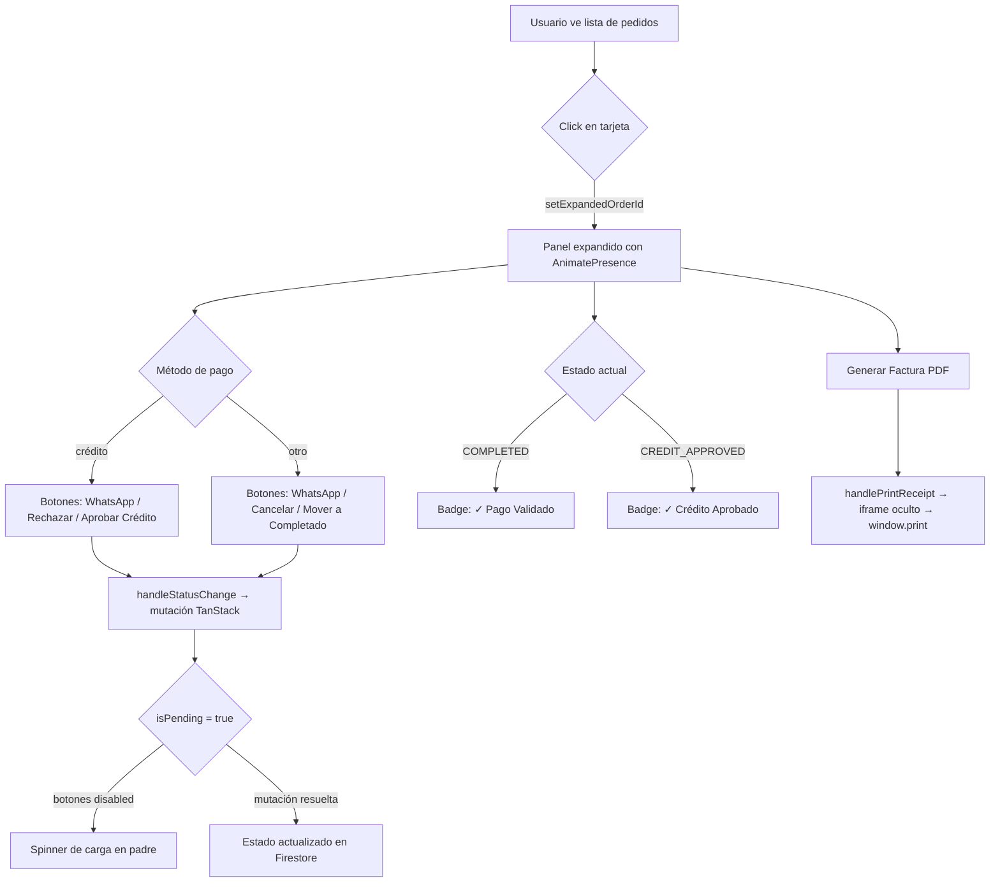

<!--
{
  "technicalName": "TarjetaPedidoAdmin",
  "targetPath": "src/components/common/TarjetaPedidoAdmin.jsx",
  "dependencies": {
    "npm": {},
    "internal": []
  }
}
-->

# OrderCard — Tarjeta de Pedido Admin

> **Origen:** Extraído y refactorizado de `src/pages/admin/AdminOrders.jsx` — función `renderOrderCard` (líneas 597–820)
> **Categoría:** `Pedidos_y_Gestion / Tarjeta_Pedido_Admin`
> **Estado:** ✅ Estable — Producción

---

## 1. Propósito y Casos de Uso

Componente que encapsula la representación visual y operativa completa de un pedido en el panel de administración. Presenta dos capas de información:

1. **Resumen colapsado** — chip de estado, número de pedido, método de pago, nombre y celular del cliente, contador de artículos y total.
2. **Panel expandido** (acordeón animado con Framer Motion) — dos columnas:
   - **Izquierda:** dirección de envío + fecha, mapa desplegable (si hay coords), notas, y un bloque de acciones rápidas (WhatsApp, Cancelar, Completar/Aprobar Crédito, Generar Factura PDF).
   - **Derecha:** lista de productos con imagen, nombre, variantes/atributos, cantidad y precio unitario.

**Cuándo usarlo:**
- Lista de pedidos del panel admin (`AdminOrders`).
- Cualquier vista de gestión de pedidos en apps derivadas de esta plataforma.
- Siempre que se necesite una tarjeta compacta con historial de estado + acciones operativas inline.

---

## 2. Especificación Visual y Estilos

| Zona | Clases Tailwind / Variables CSS |
|---|---|
| Tarjeta raíz | `bg-surface rounded-3xl border border-app shadow-sm overflow-hidden` |
| Tarjeta archivada | `opacity-65 hover:opacity-100` |
| Chip de estado | `px-3 py-1.5 rounded-lg border flex items-center gap-2 font-bold text-xs uppercase tracking-wider` + color dinámico desde `STATE_COLORS` |
| Número de pedido | `font-mono font-bold text-app text-base` |
| Badge método de pago | `text-muted text-xs px-2 py-0.5 bg-surface-2 rounded-full border border-app` |
| Total | `font-black text-primary text-lg` |
| Panel expandido | `border-t border-app bg-surface-2/30` |
| Botones de acción | Altura fija `h-11`/`h-12`, bordes HSL, `active:scale-95 disabled:opacity-50 transition-all` |
| Tarjeta de producto | `flex items-center gap-3 bg-surface p-2 rounded-xl border border-app` |
| Imagen de producto | `w-12 h-12 bg-surface-2 rounded-lg overflow-hidden border border-app` |

**Colores dinámicos de estado (`STATE_COLORS`):**

| Estado | Clases |
|---|---|
| `PENDING` | `text-warning bg-warning/10 border-warning/20` |
| `COMPLETED` | `text-success bg-success/10 border-success/20` |
| `CANCELLED` | `text-red-500 bg-red-500/10 border-red-500/20` |
| `CREDIT_APPROVED` | `text-blue-500 bg-blue-500/10 border-blue-500/20` |

---

## 3. Props y API

| Prop | Tipo | Requerido | Descripción |
|---|---|---|---|
| `order` | `object` | ✅ | Objeto completo del pedido de Firestore. Ver esquema abajo. |
| `expandedOrderId` | `string \| null` | ✅ | ID del pedido actualmente expandido. Manejo elevado al padre. |
| `setExpandedOrderId` | `function` | ✅ | Setter para controlar cuál tarjeta está expandida. |
| `isPending` | `boolean` | ✅ | Si la mutación de cambio de estado está en curso (deshabilita botones). |
| `handleStatusChange` | `function(order, newStatus, event?)` | ✅ | Callback para cambiar el estado del pedido. |
| `handleContactClient` | `function(phone, orderNumber)` | ✅ | Callback para abrir WhatsApp con el cliente. |
| `handlePrintReceipt` | `function(order)` | ✅ | Callback para generar e imprimir la factura PDF en iframe. |
| `onSaveShippingCost` | `function(order, newCost)` | ❌ | Callback opcional para actualizar el costo de envío (para pedidos a domicilio). |

### Esquema del objeto `order`

```js
{
  id: string,                    // ID de Firestore
  orderNumber: string,           // Ej: "ORD-0042"
  estado: string,                // Valor de ORDER_STATES
  metodoPago: string,            // Valor de PAYMENT_METHODS
  total: number,
  archivado: boolean,
  notas: string | undefined,
  notes: string | undefined,     // alias legacy
  createdAt: Timestamp | Date,
  cliente: {
    nombre: string,
    celular: string,
    direccion: string | undefined,
    barrio: string | undefined,
    ciudad: string | undefined,
    coords: { lat: number, lng: number } | undefined,
  },
  items: Array<{
    nombre: string,
    cantidad: number,
    precio: number,
    imagen: string | undefined,
    imageUrl: string | undefined,
    talla: string | undefined,
    color: string | undefined,
    atributos: Record<string, string> | undefined,
  }>,
}
```

---

## 4. Código React Completo y 100% Funcional

```jsx
import { useState } from 'react'
import { motion, AnimatePresence } from 'framer-motion'
import {
  Clock, CheckCircle, XCircle, CreditCard,
  ChevronDown, MapPin, FileText, Package, MessageCircle
} from 'lucide-react'
import { ORDER_STATES, ORDER_STATE_LABELS, PAYMENT_METHOD_LABELS, PAYMENT_METHODS } from '../../constants'
import { formatCurrency } from '../../utils/formatters'
import MapToggle from './MapToggle' // o desde su ruta correspondiente en ui/

// ─── Constantes locales ─────────────────────────────────────────────────────
const STATE_ICONS = {
  [ORDER_STATES.PENDING]: Clock,
  [ORDER_STATES.COMPLETED]: CheckCircle,
  [ORDER_STATES.CANCELLED]: XCircle,
  [ORDER_STATES.CREDIT_APPROVED]: CreditCard,
}

const STATE_COLORS = {
  [ORDER_STATES.PENDING]: 'text-warning bg-warning/10 border-warning/20',
  [ORDER_STATES.COMPLETED]: 'text-success bg-success/10 border-success/20',
  [ORDER_STATES.CANCELLED]: 'text-red-500 bg-red-500/10 border-red-500/20',
  [ORDER_STATES.CREDIT_APPROVED]: 'text-blue-500 bg-blue-500/10 border-blue-500/20',
}

// ─── Componente ─────────────────────────────────────────────────────────────
/**
 * OrderCard
 * Tarjeta colapsable de pedido para el panel de administración.
 */
function OrderCard({
  order,
  expandedOrderId,
  setExpandedOrderId,
  isPending,
  handleStatusChange,
  handleContactClient,
  handlePrintReceipt,
  onSaveShippingCost,
}) {
  const StateIcon = STATE_ICONS[order.estado] || Clock
  const stateColors = STATE_COLORS[order.estado] || STATE_COLORS[ORDER_STATES.PENDING]
  const isExpanded = expandedOrderId === order.id
  const [localShippingCost, setLocalShippingCost] = useState(order.costoEnvio || 0)
  const isCostChanged = localShippingCost !== (order.costoEnvio || 0)

  // Calcula el siguiente estado posible según tipo de pago
  const nextStateName = order.estado === ORDER_STATES.PENDING
    ? (order.metodoPago === PAYMENT_METHODS.CREDIT
        ? ORDER_STATES.CREDIT_APPROVED
        : ORDER_STATES.COMPLETED)
    : null

  return (
    <motion.div
      layout
      initial={{ opacity: 0, scale: 0.95 }}
      animate={{ opacity: 1, scale: 1 }}
      exit={{ opacity: 0, scale: 0.95 }}
      className={`bg-surface rounded-3xl border border-app shadow-sm overflow-hidden transition-opacity duration-300 ${
        order.archivado ? 'opacity-65 hover:opacity-100' : ''
      }`}
    >
      {/* ── Resumen Colapsable ── */}
      <div
        onClick={() => setExpandedOrderId(isExpanded ? null : order.id)}
        className="p-4 sm:p-5 flex flex-col sm:flex-row gap-4 sm:items-center justify-between cursor-pointer hover:bg-surface-2/50 transition-colors"
      >
        <div className="flex flex-col sm:flex-row gap-4 sm:items-center">
          {/* Chip de estado */}
          <div className={`px-3 py-1.5 rounded-lg border flex items-center gap-2 font-bold text-xs uppercase tracking-wider w-fit ${stateColors}`}>
            <StateIcon size={14} />
            {ORDER_STATE_LABELS[order.estado] || order.estado}
          </div>

          {/* Número de pedido + método de pago + badge archivado */}
          <div>
            <div className="flex items-center gap-2">
              <span className="font-mono font-bold text-app text-base">{order.orderNumber}</span>
              <span className="text-muted text-xs px-2 py-0.5 bg-surface-2 rounded-full border border-app">
                {PAYMENT_METHOD_LABELS[order.metodoPago] || order.metodoPago}
              </span>
              {order.archivado && (
                <span className="text-[10px] font-bold text-muted bg-surface-2 border border-app px-2 py-0.5 rounded-full uppercase tracking-wider">
                  Archivado
                </span>
              )}
            </div>
            <p className="text-sm font-medium text-app mt-1">
              {order.cliente?.nombre} <span className="text-muted font-normal">• {order.cliente?.celular}</span>
            </p>
          </div>
        </div>

        {/* Total + Chevron */}
        <div className="flex items-center justify-between sm:justify-end gap-6 border-t border-app sm:border-0 pt-4 sm:pt-0 mt-4 sm:mt-0 w-full sm:w-auto">
          <div className="text-left sm:text-right flex-1 sm:flex-none">
            <p className="text-xs text-muted mb-0.5">{order.items?.length || 0} art(s).</p>
            <p className="font-black text-primary text-lg">{formatCurrency(order.total)}</p>
          </div>
          <ChevronDown
            size={20}
            className={`flex-shrink-0 text-muted transition-transform duration-300 ${isExpanded ? 'rotate-180' : ''}`}
          />
        </div>
      </div>

      {/* ── Panel Expandido ── */}
      <AnimatePresence>
        {isExpanded && (
          <motion.div
            initial={{ height: 0, opacity: 0 }}
            animate={{ height: 'auto', opacity: 1 }}
            exit={{ height: 0, opacity: 0 }}
            className="border-t border-app bg-surface-2/30"
          >
            <div className="p-5 grid grid-cols-1 md:grid-cols-2 gap-6">

              {/* ── Columna Izquierda: Info + Acciones ── */}
              <div className="space-y-6">
                {/* Envío y Fecha */}
                <div>
                  <h4 className="text-xs font-bold text-muted uppercase tracking-wider mb-2 flex items-center gap-1.5">
                    <MapPin size={14}/> Envío y Fecha
                  </h4>
                  <p className="text-sm text-app font-semibold">
                    {order.cliente?.direccion || 'Recogida en tienda'}
                  </p>
                  {order.cliente?.barrio && (
                    <p className="text-sm text-muted">
                      {[order.cliente.barrio, order.cliente.ciudad].filter(Boolean).join(', ')}
                    </p>
                  )}
                  {!order.cliente?.barrio && order.cliente?.ciudad && (
                    <p className="text-sm text-muted">{order.cliente.ciudad}</p>
                  )}

                  {/* Mapa desplegable — sólo si existen coordenadas */}
                  {order.cliente?.coords?.lat && (
                    <MapToggle coords={order.cliente.coords} address={order.cliente.direccion} />
                  )}

                  <p className="text-sm text-app mt-2">
                    {order.createdAt?.toDate ? order.createdAt.toDate().toLocaleString() : 'Reciente'}
                  </p>
                </div>

                {/* Notas (si existen) */}
                {order.notes && (
                  <div>
                    <h4 className="text-xs font-bold text-muted uppercase tracking-wider mb-2 flex items-center gap-1.5">
                      <FileText size={14}/> Notas
                    </h4>
                    <p className="text-sm text-app italic bg-surface-2/50 p-3 rounded-xl border border-app/30">
                      {order.notas}
                    </p>
                  </div>
                )}

                {/* Acciones Rápidas */}
                <div className="bg-surface p-5 rounded-3xl border-0 shadow-sm">
                  <h4 className="text-xs font-bold text-muted uppercase tracking-wider mb-4">Acciones Rápidas</h4>
                  <div className="grid grid-cols-1 sm:grid-cols-2 gap-3">
                    {order.metodoPago === 'credito' ? (
                      // ─── Diseño especial para pedidos a crédito ───
                      <>
                        <button
                          onClick={() => handleContactClient(order.cliente?.celular, order.orderNumber)}
                          className="col-span-2 flex items-center justify-center gap-2 h-11 bg-green-500/10 text-green-600 border border-green-500/20 rounded-xl text-sm font-bold hover:bg-green-500/20 transition-colors"
                        >
                          <MessageCircle size={16} /> WhatsApp
                        </button>

                        {order.estado !== ORDER_STATES.COMPLETED &&
                         order.estado !== ORDER_STATES.CANCELLED &&
                         order.estado !== ORDER_STATES.CREDIT_APPROVED ? (
                          <>
                            <button
                              onClick={(e) => handleStatusChange(order, ORDER_STATES.CANCELLED, e)}
                              disabled={isPending}
                              className="col-span-1 h-12 flex justify-center items-center bg-red-500/10 text-red-500 border border-red-500/20 rounded-xl text-[13px] font-bold hover:bg-red-500/20 active:scale-95 disabled:opacity-50 transition-all"
                            >
                              Rechazar Crédito
                            </button>
                            <button
                              onClick={(e) => handleStatusChange(order, ORDER_STATES.CREDIT_APPROVED, e)}
                              disabled={isPending}
                              className="col-span-1 h-12 flex justify-center items-center bg-blue-600 text-[var(--color-text)] rounded-xl text-[13px] font-bold shadow-md hover:bg-blue-700 active:scale-95 disabled:opacity-50 transition-all"
                            >
                              Aprobar Crédito
                            </button>
                          </>
                        ) : order.estado === ORDER_STATES.CREDIT_APPROVED && (
                          <div className="col-span-2 flex justify-center items-center h-11 bg-blue-500/10 text-blue-600 border border-blue-500/20 rounded-xl text-sm font-bold">
                            ✓ Crédito Aprobado
                          </div>
                        )}
                      </>
                    ) : (
                      // ─── Diseño estándar para otros métodos de pago ───
                      <>
                        <button
                          onClick={() => handleContactClient(order.cliente?.celular, order.orderNumber)}
                          className="col-span-1 flex items-center justify-center gap-2 h-11 bg-green-500/10 text-green-600 border border-green-500/20 rounded-xl text-sm font-bold hover:bg-green-500/20 transition-colors"
                        >
                          <MessageCircle size={16} /> WhatsApp
                        </button>

                        {order.estado !== ORDER_STATES.COMPLETED &&
                         order.estado !== ORDER_STATES.CANCELLED ? (
                          <>
                            <button
                              onClick={(e) => handleStatusChange(order, ORDER_STATES.CANCELLED, e)}
                              disabled={isPending}
                              className="col-span-1 h-11 flex justify-center items-center bg-red-500/10 text-red-500 border border-red-500/20 rounded-xl text-sm font-bold hover:bg-red-500/20 transition-colors disabled:opacity-50"
                            >
                              Cancelar
                            </button>
                            {nextStateName && (
                              <button
                                onClick={(e) => handleStatusChange(order, nextStateName, e)}
                                disabled={isPending}
                                className="col-span-2 h-12 mt-1 flex justify-center items-center rounded-xl text-sm font-bold shadow-md hover:opacity-90 active:scale-95 disabled:opacity-50 transition-all text-[var(--color-text)] bg-primary"
                              >
                                Mover a {ORDER_STATE_LABELS[nextStateName]}
                              </button>
                            )}
                          </>
                        ) : order.estado === ORDER_STATES.COMPLETED &&
                          order.metodoPago === PAYMENT_METHODS.TRANSFER && (
                          <div className="col-span-1 flex justify-center items-center h-11 bg-success/10 text-success border border-success/20 rounded-xl text-sm font-bold">
                            ✓ Pago Validado
                          </div>
                        )}
                      </>
                    )}

                    {/* Generar Factura PDF — siempre visible */}
                    <button
                      onClick={(e) => { e.stopPropagation(); handlePrintReceipt(order) }}
                      className="col-span-2 flex items-center justify-center gap-2 h-11 bg-surface border border-app rounded-xl text-sm font-bold hover:bg-surface-2 transition-colors mt-2"
                    >
                      <FileText size={16} /> Generar Factura PDF
                    </button>
                  </div>
                </div>
              </div>

              {/* ── Columna Derecha: Productos ── */}
              <div>
                <h4 className="text-xs font-bold text-muted uppercase tracking-wider mb-3 flex items-center gap-1.5">
                  <Package size={14}/> Productos
                </h4>
                <div className="space-y-2">
                  {order.items?.map((item, idx) => (
                    <div key={idx} className="flex items-center gap-3 bg-surface p-2 rounded-xl border border-app">
                      {/* Imagen */}
                      <div className="w-12 h-12 bg-surface-2 rounded-lg flex-shrink-0 overflow-hidden border border-app relative">
                        {item.imagen || item.imageUrl ? (
                          
                        ) : (
                          <Package size={16} className="text-muted absolute top-1/2 left-1/2 -translate-x-1/2 -translate-y-1/2" />
                        )}
                      </div>

                      {/* Nombre y variantes */}
                      <div className="flex-1">
                        <p className="text-sm font-bold text-app leading-tight mb-0.5">{item.nombre}</p>
                        <p className="text-xs text-muted leading-tight">
                          {item.atributos && Object.keys(item.atributos).length > 0
                            ? Object.entries(item.atributos).map(([k, v]) => `${k}: ${v}`).join(' • ')
                            : item.talla || item.color
                              ? [item.talla, item.color].filter(Boolean).join(' • ')
                              : 'Única'}
                        </p>
                      </div>

                      {/* Cantidad y precio */}
                      <div className="text-right pr-2">
                        <p className="text-xs text-muted mb-0.5">x{item.cantidad}</p>
                        <p className="text-sm font-bold text-primary">{formatCurrency(item.precio)}</p>
                      </div>
                    </div>
                  ))}
                </div>

                {/* Resumen de costos e ingreso interactivo del costo de envío */}
                <div className="mt-4 pt-4 border-t border-app space-y-2 text-xs">
                  <div className="flex justify-between text-muted">
                    <span>Subtotal:</span>
                    <span>{formatCurrency(order.subtotal || 0)}</span>
                  </div>
                  {order.descuento > 0 && (
                    <div className="flex justify-between text-red-500 font-medium">
                      <span>Descuento:</span>
                      <span>-{formatCurrency(order.descuento)}</span>
                    </div>
                  )}
                  {order.tipoEntrega === 'domicilio' ? (
                    <div className="flex justify-between items-center py-0.5">
                      <span className="text-muted">Costo Envío:</span>
                      <div className="flex items-center gap-1.5">
                        <span className="text-muted font-bold">$</span>
                        <input
                          type="number"
                          value={localShippingCost}
                          onChange={(e) => setLocalShippingCost(parseFloat(e.target.value) || 0)}
                          onClick={(e) => e.stopPropagation()}
                          className="w-20 h-7 px-2 rounded-lg bg-surface border border-app text-xs font-bold text-app text-right focus:outline-none focus:border-primary"
                          placeholder="Costo"
                          min="0"
                        />
                        {isCostChanged && (
                          <button
                            onClick={(e) => {
                              e.stopPropagation()
                              if (onSaveShippingCost) onSaveShippingCost(order, localShippingCost)
                            }}
                            className="px-2 h-7 bg-primary text-[var(--color-text)] rounded-lg text-[10px] font-black active:scale-95 transition-all shadow-sm cursor-pointer"
                          >
                            Guardar
                          </button>
                        )}
                      </div>
                    </div>
                  ) : (
                    (order.costoEnvio || 0) > 0 && (
                      <div className="flex justify-between text-muted">
                        <span>Costo Envío:</span>
                        <span>{formatCurrency(order.costoEnvio)}</span>
                      </div>
                    )
                  )}
                  <div className="flex justify-between font-black text-app text-sm pt-2 border-t border-app">
                    <span>Total del Pedido:</span>
                    <span className="text-primary text-base">{formatCurrency(order.total)}</span>
                  </div>
                </div>
              </div>

            </div>
          </motion.div>
        )}
      </AnimatePresence>
    </motion.div>
  )
}

export default OrderCard
```

---

## 5. Lógica de Estado y Ciclo de Vida

| Estado / Comportamiento | Detalle |
|---|---|
| **Expansión** | Controlada externamente via `expandedOrderId` / `setExpandedOrderId`. Sólo un pedido puede estar expandido al mismo tiempo (patrón acordeón). |
| **`nextStateName`** | Derivado localmente: si el pedido es `PENDING` y el pago es `CREDIT` → `CREDIT_APPROVED`; de lo contrario → `COMPLETED`. |
| **`isPending`** | Deshabilita todos los botones de cambio de estado mientras la mutación de TanStack Query está en vuelo. |
| **`MapToggle`** | Estado interno al subcomponente; el `OrderCard` no necesita saber si el mapa está abierto. |

**Sin efectos (`useEffect`) propios** — el componente es completamente controlado desde el padre.

---

## 6. Integración con Servicios Externos

| Servicio / Dependencia | Uso |
|---|---|
| `framer-motion` | Animación `layout`, entrada/salida de tarjeta y acordeón del panel expandido. |
| `lucide-react` | Íconos: `Clock`, `CheckCircle`, `XCircle`, `CreditCard`, `ChevronDown`, `MapPin`, `FileText`, `Package`, `MessageCircle`. |
| `ORDER_STATES`, `ORDER_STATE_LABELS` | Constantes de estado de pedido desde `src/constants`. |
| `PAYMENT_METHOD_LABELS`, `PAYMENT_METHODS` | Constantes de método de pago desde `src/constants`. |
| `formatCurrency` | Formateador monetario desde `src/utils/formatters`. |
| `MapToggle` | Subcomponente propio documentado en `/Formularios_y_UI/Mapa_Desplegable/`. |
| `handlePrintReceipt` (callback del padre) | Genera HTML en un `<iframe>` oculto y ejecuta `window.print()`. Requiere `appName`, `appIcon`, `whatsappAdmin` del store global — por eso es un callback del padre y no lógica interna del componente. |

---

## 7. Flujo Operativo y Secuencia de Interacción



---

## 8. Ejemplo de Uso

```jsx
// En AdminOrders.jsx — sustitución de renderOrderCard:
import OrderCard from '../../components/ui/OrderCard'

// Dentro del return, reemplazando el map anterior:
<AnimatePresence>
  {paginatedActiveOrders.map(order => (
    <OrderCard
      key={order.id}
      order={order}
      expandedOrderId={expandedOrderId}
      setExpandedOrderId={setExpandedOrderId}
      isPending={isPending}
      handleStatusChange={handleStatusChange}
      handleContactClient={handleContactClient}
      handlePrintReceipt={handlePrintReceipt}
    />
  ))}
</AnimatePresence>
```

> **Nota importante:** `handlePrintReceipt` accede a `appName`, `appIcon` y `whatsappAdmin` del store Zustand (`useAppConfigStore`) y genera el HTML de la factura. Cuando se reutilice en otra app, asegurar que esas variables estén disponibles en el store equivalente o pasar como props adicionales.

---

## 9. Origen

| Campo | Valor |
|---|---|
| **Archivo fuente** | `src/pages/admin/AdminOrders.jsx` |
| **Función original** | `renderOrderCard` (líneas 597–820) |
| **Tipo de extracción** | Refactorización de función interna a componente autónomo con props explícitas |
| **Fecha de extracción** | 2026-05-29 |
| **Versión** | 1.1 |
| **Extraído por** | Protocolo `@extraer-componente` — Antigravity AI |
| **Motivo de extracción** | La tarjeta de pedido es el elemento visual central de la gestión de pedidos y tiene potencial de reutilización directa en dashboards derivados, vistas de historial de clientes y apps de domicilios. |

