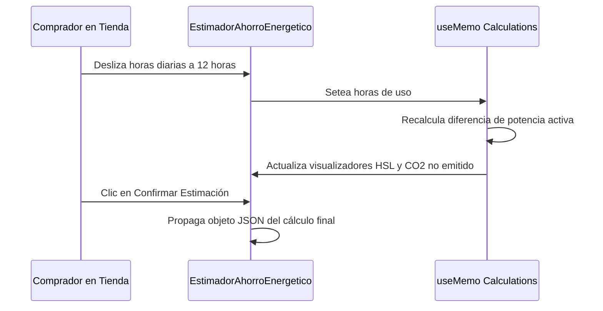

<!--
{
  "resource": "EstimadorAhorroEnergetico",
  "technicalName": "EstimadorAhorroEnergetico",
  "targetPath": "src/components/common/EstimadorAhorroEnergetico.jsx",
  "dependencies": {
    "npm": {
      "lucide-react": "^0.300.0"
    },
    "internal": []
  },
  "niches": ["refrigeration_ac"],
  "type": "component"
}
-->

# Estimador de Ahorro Energético (`EstimadorAhorroEnergetico`)

Este componente permite comparar el consumo de electricidad y costo estimado entre un aire acondicionado tradicional (Velocidad Fija) y uno con tecnología Inverter en base a las horas de uso y tarifa de luz local.

## 1. Propósito y Casos de Uso
* **Justificación de Compra Inverter:** Muestra visualmente por qué pagar la diferencia de precio de un equipo Inverter se amortiza rápidamente en el recibo de la luz.
* **Educación Energética:** Informa a los usuarios sobre el impacto del consumo en kWh y la huella de carbono estimada por climatización.

## 2. Especificación Visual y Estilos (Tailwind CSS)
* **Comparador de Columnas:** Rejilla responsiva de dos bloques paralelos con sombreado y bordes HSL del tema.
* **Barra de Progreso de Consumo:** Barras relativas para ilustrar la diferencia de kWh consumidos.
* **Deslizador de Horas Diarias:** Input de tipo slider premium que recalculador dinámicamente los consumos anuales al deslizar.

## 3. Código React Completo

```jsx
import React, { useState, useMemo } from 'react';
import { Leaf, Info, Zap, AlertTriangle } from 'lucide-react';

export default function EstimadorAhorroEnergetico({
  onEstimate = null,
  kwhTariff = 0.15, // Tarifa promedio por kWh en USD
  basePowerKw = 1.2, // Consumo aproximado de un equipo tradicional de 12k BTU (1200W)
  inverterPowerKw = 0.72 // Consumo promedio de equipo Inverter equivalente de 12k BTU (720W, ahorro ~40%)
}) {
  const [hoursPerDay, setHoursPerDay] = useState(8);
  const [daysPerYear, setDaysPerYear] = useState(250);

  const stats = useMemo(() => {
    // Consumo Tradicional
    const traditionalDailyKwh = basePowerKw * hoursPerDay;
    const traditionalYearlyKwh = traditionalDailyKwh * daysPerYear;
    const traditionalCost = traditionalYearlyKwh * kwhTariff;

    // Consumo Inverter
    const inverterDailyKwh = inverterPowerKw * hoursPerDay;
    const inverterYearlyKwh = inverterDailyKwh * daysPerYear;
    const inverterCost = inverterYearlyKwh * kwhTariff;

    // Ahorro
    const yearlyKwhSaved = traditionalYearlyKwh - inverterYearlyKwh;
    const yearlyCostSaved = traditionalCost - inverterCost;
    const savingsPercent = ((traditionalCost - inverterCost) / traditionalCost) * 100;
    
    // Co2 en Kg (factor aprox de 0.4 kg Co2 por kWh en planta eléctrica)
    const co2SavedKg = yearlyKwhSaved * 0.4;

    const data = {
      traditional: {
        kwh: Math.round(traditionalYearlyKwh),
        cost: parseFloat(traditionalCost.toFixed(2))
      },
      inverter: {
        kwh: Math.round(inverterYearlyKwh),
        cost: parseFloat(inverterCost.toFixed(2))
      },
      saved: {
        kwh: Math.round(yearlyKwhSaved),
        cost: parseFloat(yearlyCostSaved.toFixed(2)),
        percent: Math.round(savingsPercent),
        co2Kg: Math.round(co2SavedKg)
      }
    };

    return data;
  }, [hoursPerDay, daysPerYear, kwhTariff, basePowerKw, inverterPowerKw]);

  const handleRegister = () => {
    if (onEstimate) {
      onEstimate(stats);
    }
  };

  return (
    <div className="w-full max-w-xl mx-auto bg-[var(--color-surface)] border border-[var(--color-border)] rounded-2xl p-5 shadow-sm">
      <h3 className="text-sm font-bold text-[var(--color-text)] mb-2 flex items-center gap-2">
        <Zap size={16} className="text-[var(--color-primary)]" />
        <span>Comparador de Eficiencia Energética</span>
      </h3>
      <p className="text-xs text-[var(--color-text-muted)] mb-4">
        Descubre el ahorro económico y ecológico estimado al sustituir equipos fijos por Inverter.
      </p>

      <div className="space-y-4">
        {/* Sliders de Configuración */}
        <div className="space-y-3">
          <div>
            <div className="flex justify-between items-center text-[10px] font-bold text-[var(--color-text-muted)] mb-1">
              <span>Horas de Uso Diario</span>
              <span className="font-mono text-[var(--color-primary)]">{hoursPerDay} Horas</span>
            </div>
            <input
              type="range"
              min="1"
              max="24"
              value={hoursPerDay}
              onChange={(e) => setHoursPerDay(parseInt(e.target.value))}
              className="w-full h-1.5 bg-[var(--color-surface-2)] rounded-lg appearance-none cursor-pointer accent-[var(--color-primary)] outline-none"
            />
          </div>

          <div>
            <div className="flex justify-between items-center text-[10px] font-bold text-[var(--color-text-muted)] mb-1">
              <span>Días de Uso al Año</span>
              <span className="font-mono text-[var(--color-primary)]">{daysPerYear} Días</span>
            </div>
            <input
              type="range"
              min="50"
              max="365"
              value={daysPerYear}
              onChange={(e) => setDaysPerYear(parseInt(e.target.value))}
              className="w-full h-1.5 bg-[var(--color-surface-2)] rounded-lg appearance-none cursor-pointer accent-[var(--color-primary)] outline-none"
            />
          </div>
        </div>

        {/* Tarjetas Comparativas */}
        <div className="grid grid-cols-1 sm:grid-cols-2 gap-3 mt-4">
          {/* Tradicional */}
          <div className="p-3.5 border border-[var(--color-border)] bg-[var(--color-surface-2)]/10 rounded-xl relative overflow-hidden flex flex-col justify-between">
            <div>
              <div className="flex justify-between items-center mb-1.5">
                <span className="text-xs font-extrabold text-[var(--color-text)]">Tecnología Fija (On/Off)</span>
                <AlertTriangle size={14} className="text-amber-500 shrink-0" />
              </div>
              <span className="text-[10px] text-[var(--color-text-muted)] leading-tight block mb-2">
                Compresor arranca y para continuamente consumiendo picos de corriente.
              </span>
            </div>
            <div>
              <span className="text-[9px] uppercase tracking-wider font-extrabold text-[var(--color-text-muted)] block">Consumo Anual</span>
              <span className="font-mono text-sm font-bold text-[var(--color-text)]">{stats.traditional.kwh} kWh</span>
              <span className="font-mono text-xs text-[var(--color-text-muted)] block mt-0.5">
                Costo estimado: ${stats.traditional.cost} USD
              </span>
            </div>
          </div>

          {/* Inverter */}
          <div className="p-3.5 border-2 border-[var(--color-primary)] bg-[var(--color-primary)]/5 rounded-xl relative overflow-hidden flex flex-col justify-between shadow-sm">
            <div>
              <div className="flex justify-between items-center mb-1.5">
                <span className="text-xs font-extrabold text-[var(--color-primary)]">Tecnología Inverter</span>
                <Leaf size={14} className="text-[var(--color-primary)] shrink-0" />
              </div>
              <span className="text-[10px] text-[var(--color-primary)]/80 leading-tight block mb-2">
                Compresor disminuye su velocidad sin apagar, ahorrando energía.
              </span>
            </div>
            <div>
              <span className="text-[9px] uppercase tracking-wider font-extrabold text-[var(--color-primary)] block">Consumo Anual</span>
              <span className="font-mono text-sm font-black text-[var(--color-primary)]">{stats.inverter.kwh} kWh</span>
              <span className="font-mono text-xs text-[var(--color-text)] font-semibold block mt-0.5">
                Costo estimado: ${stats.inverter.cost} USD
              </span>
            </div>
          </div>
        </div>

        {/* Resumen del Ahorro */}
        <div className="p-4 bg-[var(--color-surface-2)]/40 border border-[var(--color-border)] rounded-xl space-y-2">
          <span className="text-[10px] font-black uppercase text-[var(--color-text-muted)] tracking-wider block">
            Impacto Anual de Ahorro
          </span>
          <div className="grid grid-cols-1 sm:grid-cols-2 gap-4">
            <div>
              <span className="text-[9px] text-[var(--color-text-muted)] block">Dinero Ahorrado:</span>
              <span className="font-mono text-sm font-extrabold text-green-500">
                ${stats.saved.cost} USD ({stats.saved.percent}%)
              </span>
            </div>
            <div>
              <span className="text-[9px] text-[var(--color-text-muted)] block">Co2 No Emitido:</span>
              <span className="font-mono text-sm font-extrabold text-green-500">
                {stats.saved.co2Kg} kg Co2
              </span>
            </div>
          </div>
        </div>

        {/* Botón de Registro */}
        <button
          type="button"
          onClick={handleRegister}
          className="w-full h-11 bg-[var(--color-primary)] hover:opacity-90 active:scale-95 text-[var(--color-text)] font-bold text-xs rounded-xl flex items-center justify-center gap-2 transition-all cursor-pointer shadow-sm"
        >
          <Leaf size={14} />
          <span>Confirmar Estimación Ecológica</span>
        </button>
      </div>
    </div>
  );
}
```

## 4. Lógica de Estado y Ciclo de Vida
* **Actualización en useMemo:** Calcula consumos, CO2 y ahorros al deslizar los controles de horas de uso y días activos al año de manera eficiente.
* **Props Parametrizadas:** Expone parámetros de consumo base para personalizar según el caballaje o frigorías del modelo a comparar.

## 5. Flujo Operativo y Secuencia de Interacción


