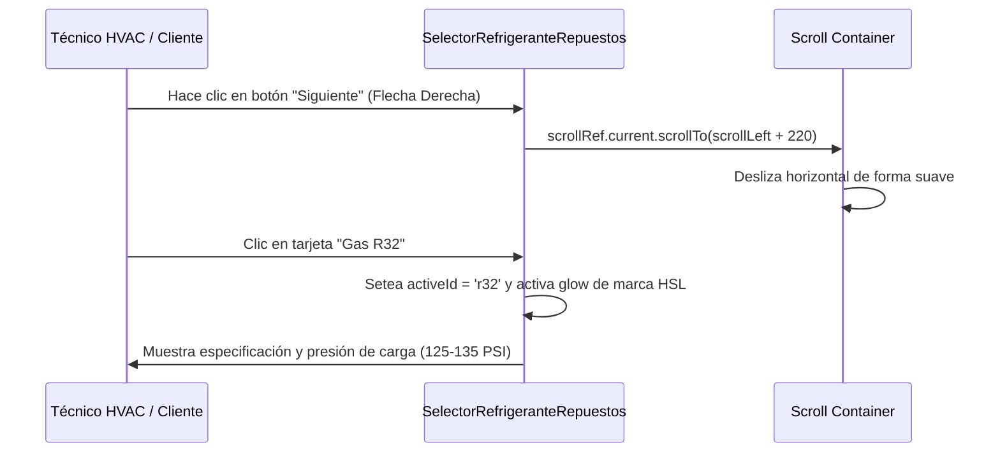

<!--
{
  "resource": "SelectorRefrigeranteRepuestos",
  "technicalName": "SelectorRefrigeranteRepuestos",
  "targetPath": "src/components/common/SelectorRefrigeranteRepuestos.jsx",
  "dependencies": {
    "npm": {
      "lucide-react": "^0.300.0"
    },
    "internal": []
  },
  "niches": ["refrigeration_ac"],
  "type": "component"
}
-->

# Selector de Refrigerante y Repuestos (`SelectorRefrigeranteRepuestos`)

Este componente proporciona un carrusel interactivo horizontal para seleccionar gases refrigerantes normalizados (R410A, R22, R134a, R32) y consumibles comunes en servicios de mantenimiento de climatización, **protegido contra clipping visual mediante holgura vertical en scroll**.

## 1. Propósito y Casos de Uso
* **Servicio de Recargas:** Para que los clientes soliciten recarga exacta de refrigerante al comprar el servicio técnico de mantenimiento.
* **Orden de Reparación:** Ayuda al técnico a listar qué tipo de gas y componentes adicionales requiere para la orden de trabajo.

## 2. Especificación Visual y Estilos (Tailwind CSS)
* **Carrusel Horizontal Anticut:** Contenedor deslizable (`overflow-x-auto snap-x flex gap-4 scrollbar-none scroll-smooth py-4`). El padding vertical `py-4` es obligatorio para evitar que las sombras de elevación (`shadow-md`) y traslaciones hover de las tarjetas sean recortadas por la caja de scroll.
* **Badges Cromáticos HSL:** Gases identificados por su color de garrafa estándar mediante variables cromáticas.
* **Botones de Control Deslizante:** Botones flotantes laterales (`useRef`) para deslizar el carrusel de manera táctil o mediante clics del cursor.

## 3. Código React Completo

```jsx
import React, { useRef, useState } from 'react';
import { Layers, ChevronLeft, ChevronRight, HelpCircle, Thermometer } from 'lucide-react';

export default function SelectorRefrigeranteRepuestos({
  selectedItem = '',
  onChange = null,
  items = [
    {
      id: 'r410a',
      name: 'Gas Ecológico R410A',
      type: 'Refrigerante HFC',
      color: '#ff6b6b', // Color rosa/rojo de garrafa
      desc: 'Gas estándar actual en aire acondicionado comercial y residencial Inverter.',
      pressurePsi: '120 - 130 PSI'
    },
    {
      id: 'r32',
      name: 'Gas Eficiente R32',
      type: 'Refrigerante Puro HFC',
      color: '#4dadf7', // Color azul celeste
      desc: 'Nueva generación con menor potencial de calentamiento atmosférico.',
      pressurePsi: '125 - 135 PSI'
    },
    {
      id: 'r134a',
      name: 'Gas Automotriz R134a',
      type: 'Refrigerante HFC',
      color: '#ffc078', // Color naranja/amarillo
      desc: 'Principalmente para aire acondicionado automotriz y refrigeradores.',
      pressurePsi: '25 - 45 PSI'
    },
    {
      id: 'r22',
      name: 'Gas Tradicional R22',
      type: 'Refrigerante HCFC (Restringido)',
      color: '#a9e34b', // Color verde claro
      desc: 'Usado en sistemas antiguos. En fase de eliminación internacional.',
      pressurePsi: '60 - 70 PSI'
    },
    {
      id: 'filter_drier',
      name: 'Filtro Deshidratador',
      type: 'Consumible Cobre',
      color: '#ced4da', // Gris
      desc: 'Retiene humedad e impurezas mecánicas en la línea de líquido.',
      pressurePsi: 'N/A'
    }
  ]
}) {
  const [activeId, setActiveId] = useState(selectedItem || items[0].id);
  const scrollRef = useRef(null);

  const handleSelect = (id) => {
    setActiveId(id);
    const selected = items.find(i => i.id === id);
    if (onChange && selected) {
      onChange(selected);
    }
  };

  const handleScroll = (dir) => {
    if (scrollRef.current) {
      const { scrollLeft, clientWidth } = scrollRef.current;
      const offset = dir === 'left' ? -220 : 220;
      scrollRef.current.scrollTo({
        left: scrollLeft + offset,
        behavior: 'smooth'
      });
    }
  };

  const activeItemData = items.find(i => i.id === activeId) || items[0];

  return (
    <div className="w-full max-w-2xl mx-auto bg-[var(--color-surface)] border border-[var(--color-border)] rounded-2xl p-5 shadow-sm">
      <div className="flex justify-between items-center mb-2">
        <div>
          <h3 className="text-sm font-bold text-[var(--color-text)]">Refrigerantes & Consumibles</h3>
          <p className="text-[10px] text-[var(--color-text-muted)]">Elige el tipo de gas o repuesto para tu orden de mantenimiento técnico.</p>
        </div>

        {/* Controles de scroll */}
        <div className="flex gap-1">
          <button
            type="button"
            onClick={() => handleScroll('left')}
            className="w-7 h-7 border border-[var(--color-border)] bg-[var(--color-surface)] hover:bg-[var(--color-surface-2)] rounded-lg flex items-center justify-center text-[var(--color-text-muted)] cursor-pointer transition-colors"
          >
            <ChevronLeft size={14} />
          </button>
          <button
            type="button"
            onClick={() => handleScroll('right')}
            className="w-7 h-7 border border-[var(--color-border)] bg-[var(--color-surface)] hover:bg-[var(--color-surface-2)] rounded-lg flex items-center justify-center text-[var(--color-text-muted)] cursor-pointer transition-colors"
          >
            <ChevronRight size={14} />
          </button>
        </div>
      </div>

      {/* Contenedor del Carrusel — py-4 para blindar contra clipping visual */}
      <div 
        ref={scrollRef}
        className="flex gap-3 overflow-x-auto scrollbar-none snap-x py-4 w-full"
      >
        {items.map((it) => {
          const isActive = it.id === activeId;
          return (
            <button
              key={it.id}
              type="button"
              onClick={() => handleSelect(it.id)}
              className={`w-48 shrink-0 snap-start p-4 rounded-xl border-2 transition-all duration-300 text-left flex flex-col justify-between cursor-pointer hover:-translate-y-1 hover:shadow-md ${
                isActive
                  ? 'border-[var(--color-primary)] bg-[var(--color-primary)]/5 shadow-sm'
                  : 'border-[var(--color-border)] bg-[var(--color-surface-2)]/10 hover:border-[var(--color-primary)]/30'
              }`}
            >
              <div>
                {/* Indicador de Gas */}
                <div className="flex items-center gap-1.5 mb-2">
                  <div 
                    className="w-2.5 h-2.5 rounded-full shrink-0 shadow-sm"
                    style={{ backgroundColor: it.color }}
                  />
                  <span className="text-[9px] uppercase tracking-wider font-extrabold text-[var(--color-text-muted)]">
                    {it.type}
                  </span>
                </div>
                <span className={`text-[11px] font-extrabold block ${
                  isActive ? 'text-[var(--color-primary)]' : 'text-[var(--color-text)]'
                }`}>
                  {it.name}
                </span>
              </div>

              <div className="mt-3 pt-2 border-t border-[var(--color-border)] flex justify-between items-center text-[9px] text-[var(--color-text-muted)] w-full">
                <span>Presión Trabajo:</span>
                <span className="font-mono font-bold text-[var(--color-text)]">{it.pressurePsi}</span>
              </div>
            </button>
          );
        })}
      </div>

      {/* Bloque Detallado de Advertencia */}
      {activeItemData && (
        <div className="mt-2 p-3.5 bg-[var(--color-surface-2)]/40 border border-[var(--color-border)] rounded-xl flex items-start gap-2.5 text-xs">
          <HelpCircle size={14} className="shrink-0 text-[var(--color-primary)] mt-0.5" />
          <div>
            <span className="text-[10px] font-bold text-[var(--color-text)] block mb-0.5">
              Especificación de carga
            </span>
            <p className="text-[9px] text-[var(--color-text-muted)] leading-relaxed">
              {activeItemData.desc} Presión de recarga recomendada: <strong>{activeItemData.pressurePsi}</strong>.
            </p>
          </div>
        </div>
      )}
    </div>
  );
}
```

## 4. Lógica de Estado y Ciclo de Vida
* **Desplazamiento horizontal interactivo (`useRef`):** Gestiona la animación de arrastre horizontal y scroll lateral elástico al presionar las flechas izquierda/derecha.
* **Control de Clipping en Scroll:** Se blindó el carrusel inyectando padding de clearance vertical `py-4` para contener las sombras del hover sin truncar la caja.

## 5. Flujo Operativo y Secuencia de Interacción


