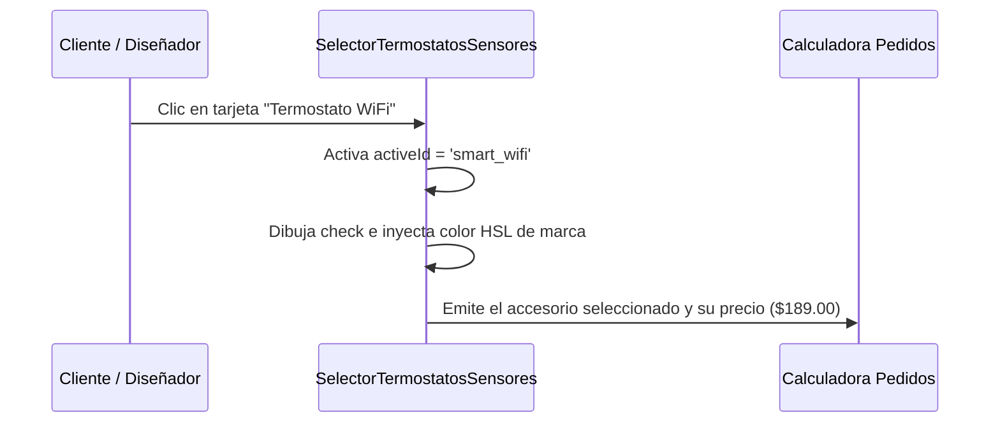

<!--
{
  "resource": "SelectorTermostatosSensores",
  "technicalName": "SelectorTermostatosSensores",
  "targetPath": "src/components/common/SelectorTermostatosSensores.jsx",
  "dependencies": {
    "npm": {
      "lucide-react": "^0.300.0"
    },
    "internal": []
  },
  "niches": ["refrigeration_ac"],
  "type": "component"
}
-->

# Selector de Termostatos y Sensores (`SelectorTermostatosSensores`)

Este componente proporciona un visualizador gráfico en cuadrícula interactiva para elegir termostatos, controles inteligentes WiFi y sensores auxiliares de climatización.

## 1. Propósito y Casos de Uso
* **Venta de Accesorios HVAC:** Facilita a los clientes adquirir controles digitales inteligentes o sensores de zona al comprar su aire acondicionado.
* **Presupuestador de Proyectos:** Permite al proyectista añadir controles y automatizaciones al diseño del sistema centralizado de climatización.

## 2. Especificación Visual y Estilos (Tailwind CSS)
* **Cuadrícula Responsiva:** Rejilla (`grid grid-cols-1 sm:grid-cols-2 gap-3`) de tarjetas con hover de elevación y glows HSL.
* **Check de Selección Activo:** Check interactivo en color de marca para denotar el accesorio seleccionado.
* **Iconografía Especializada:** Iconos Lucide estilizados con colores del tema de marca blanca.

## 3. Código React Completo

```jsx
import React, { useState } from 'react';
import { Settings, CheckCircle2, Cpu, Wifi, Thermometer, ShieldAlert } from 'lucide-react';

export default function SelectorTermostatosSensores({
  selectedAccessory = '',
  onChange = null,
  options = [
    {
      id: 'smart_wifi',
      name: 'Termostato Inteligente WiFi',
      desc: 'Pantalla táctil a color, control por voz y programación horaria mediante App móvil.',
      features: 'Ahorro del 23% energía, geo-cercado.',
      price: 189.00,
      icon: Wifi
    },
    {
      id: 'temp_sensor',
      name: 'Sensor de Temperatura Ambiente',
      desc: 'Sensor remoto inalámbrico para balancear la temperatura en habitaciones frías/calientes.',
      features: 'Alcance 15 metros, batería 2 años.',
      price: 49.00,
      icon: Thermometer
    },
    {
      id: 'zone_controller',
      name: 'Controlador de Zonas HVAC',
      desc: 'Tarjeta lógica central para abrir o cerrar compuertas motorizadas por ductos.',
      features: 'Soporta hasta 4 zonas independientes.',
      price: 249.00,
      icon: Cpu
    },
    {
      id: 'standard_remote',
      name: 'Mando a Distancia Estándar',
      desc: 'Control remoto infrarrojo universal de repuesto con pantalla LCD retroiluminada.',
      features: 'Compatible con 99% de marcas split.',
      price: 29.00,
      icon: Settings
    }
  ]
}) {
  const [activeId, setActiveId] = useState(selectedAccessory || options[0].id);

  const handleSelect = (id) => {
    setActiveId(id);
    const selected = options.find(o => o.id === id);
    if (onChange && selected) {
      onChange(selected);
    }
  };

  return (
    <div className="w-full max-w-2xl mx-auto bg-[var(--color-surface)] border border-[var(--color-border)] rounded-2xl p-5 shadow-sm">
      <div className="mb-4">
        <h3 className="text-sm font-bold text-[var(--color-text)]">Termostatos & Accesorios de Control</h3>
        <p className="text-[10px] text-[var(--color-text-muted)]">Elige el método de control y sensores complementarios para tu instalación HVAC.</p>
      </div>

      <div className="grid grid-cols-1 sm:grid-cols-2 gap-3">
        {options.map((opt) => {
          const Icon = opt.icon;
          const isActive = opt.id === activeId;

          return (
            <button
              key={opt.id}
              type="button"
              onClick={() => handleSelect(opt.id)}
              className={`p-4 rounded-xl border-2 transition-all duration-300 text-left flex flex-col justify-between relative cursor-pointer group ${
                isActive
                  ? 'border-[var(--color-primary)] bg-[var(--color-primary)]/5 shadow-sm'
                  : 'border-[var(--color-border)] bg-[var(--color-surface-2)]/10 hover:border-[var(--color-primary)]/30 hover:bg-[var(--color-surface-2)]/25'
              }`}
            >
              {/* Icono y Check */}
              <div className="flex justify-between items-center w-full mb-3">
                <div className={`p-2 rounded-lg ${
                  isActive ? 'bg-[var(--color-primary)] text-[var(--color-text)]' : 'bg-[var(--color-surface-2)] text-[var(--color-text-muted)]'
                }`}>
                  <Icon size={16} />
                </div>
                {isActive && (
                  <CheckCircle2 size={16} className="text-[var(--color-primary)]" />
                )}
              </div>

              {/* Textos */}
              <div className="space-y-1">
                <div className="flex justify-between items-start gap-1">
                  <span className="text-xs font-extrabold text-[var(--color-text)] block group-hover:text-[var(--color-primary)] transition-colors">
                    {opt.name}
                  </span>
                  <span className="font-mono text-xs font-bold text-[var(--color-text)] text-right">${opt.price.toFixed(2)}</span>
                </div>
                <p className="text-[9px] text-[var(--color-text-muted)] leading-relaxed">
                  {opt.desc}
                </p>
              </div>

              {/* Atributo Destacado */}
              <div className="mt-3 pt-2.5 border-t border-[var(--color-border)] w-full flex justify-between items-center text-[9px] text-[var(--color-text-muted)]">
                <span>Característica:</span>
                <span className={`font-bold ${
                  isActive ? 'text-[var(--color-primary)]' : 'text-[var(--color-text)]'
                }`}>
                  {opt.features}
                </span>
              </div>
            </button>
          );
        })}
      </div>
    </div>
  );
}
```

## 4. Lógica de Estado y Ciclo de Vida
* **Manejo de Selección Simple:** Registra el ID seleccionado localmente para habilitar la visualización del estado activo y propaga el cambio mediante `onChange`.
* **Componente Controlado/No Controlado:** Se sincroniza si el componente padre actualiza la prop `selectedAccessory`.

## 5. Flujo Operativo y Secuencia de Interacción


