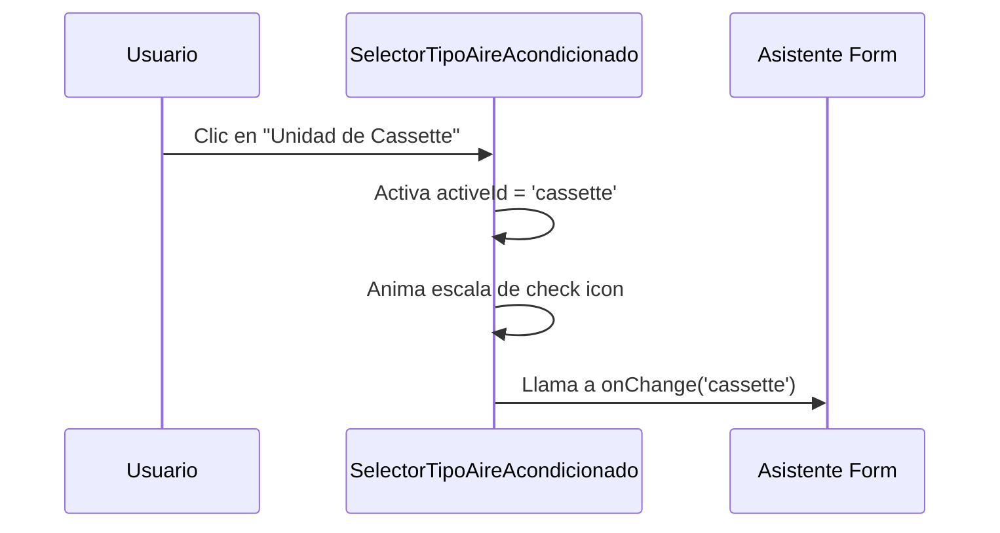

<!--
{
  "resource": "SelectorTipoAireAcondicionado",
  "technicalName": "SelectorTipoAireAcondicionado",
  "targetPath": "src/components/common/SelectorTipoAireAcondicionado.jsx",
  "dependencies": {
    "npm": {
      "lucide-react": "^0.300.0"
    },
    "internal": []
  },
  "niches": ["refrigeration_ac"],
  "type": "component"
}
-->

# Selector de Tipo de Aire Acondicionado (`SelectorTipoAireAcondicionado`)

Este componente proporciona un selector visual en rejilla de tarjetas premium para elegir el tipo de unidad de aire acondicionado (Mini-Split, Cassette, Ducto, Aire Central) de acuerdo al espacio y requisitos.

## 1. Propósito y Casos de Uso
* **Configuración del Producto:** Permite a los clientes elegir qué formato físico de evaporadora prefieren para su oficina o domicilio.
* **Diseño del Sistema:** Utilizado en asistentes de cotización automatizados para filtrar la viabilidad estructural del edificio.

## 2. Especificación Visual y Estilos (Tailwind CSS)
* **Rejilla Adaptativa:** Grid responsivo (`grid grid-cols-1 sm:grid-cols-2 gap-3`) que acomoda las tarjetas interactivas.
* **Estados Activos y Hover:** Glow HSL sutil (`border-[var(--color-primary)]` y fondo activo) junto con elevación en hover (`hover:-translate-y-1 hover:shadow-md transition-all duration-300`).
* **Iconos Técnicos:** SVGs o iconos de Lucide estilizados con colores de marca blanca.

## 3. Código React Completo

```jsx
import React, { useState } from 'react';
import { Layers, Wind, CheckCircle, Home, Monitor } from 'lucide-react';

export default function SelectorTipoAireAcondicionado({
  selectedType = '',
  onChange = null,
  options = [
    {
      id: 'minisplit',
      name: 'Mini-Split Residencial',
      desc: 'Ideal para habitaciones individuales u oficinas pequeñas sin conductos.',
      advantages: 'Bajo nivel de ruido, instalación rápida en pared.',
      icon: Wind
    },
    {
      id: 'cassette',
      name: 'Unidad de Cassette',
      desc: 'Instalación en falso techo que distribuye el aire a 4 direcciones.',
      advantages: 'Estética discreta, ideal para salones u oficinas amplias.',
      icon: Layers
    },
    {
      id: 'ductless',
      name: 'Equipo Central por Ductos',
      desc: 'Distribución centralizada mediante conductos ocultos en el cielo raso.',
      advantages: 'Climatización homogénea de múltiples habitaciones.',
      icon: Home
    },
    {
      id: 'vfv',
      name: 'Sistema Variable VRF',
      desc: 'Alta ingeniería con compresores multi-inverter para grandes consumos.',
      advantages: 'Zonificación independiente, máximo ahorro energético.',
      icon: Monitor
    }
  ]
}) {
  const [activeId, setActiveId] = useState(selectedType || options[0].id);

  const handleSelect = (id) => {
    setActiveId(id);
    if (onChange) {
      onChange(id);
    }
  };

  return (
    <div className="w-full max-w-2xl mx-auto bg-[var(--color-surface)] border border-[var(--color-border)] rounded-2xl p-5 shadow-sm">
      <div className="mb-4">
        <h3 className="text-sm font-bold text-[var(--color-text)]">Tipo de Sistema Evaporador</h3>
        <p className="text-[10px] text-[var(--color-text-muted)]">Elige el formato físico del aire acondicionado para tu espacio.</p>
      </div>

      <div className="grid grid-cols-1 sm:grid-cols-2 gap-3">
        {options.map((opt) => {
          const Icon = opt.icon;
          const isActive = opt.id === activeId;

          return (
            <button
              key={opt.id}
              type="button"
              onClick={() => handleSelect(opt.id)}
              className={`p-4 rounded-xl border-2 transition-all duration-300 text-left flex flex-col justify-between relative cursor-pointer group ${
                isActive
                  ? 'border-[var(--color-primary)] bg-[var(--color-primary)]/5 shadow-sm'
                  : 'border-[var(--color-border)] bg-[var(--color-surface-2)]/10 hover:border-[var(--color-primary)]/30 hover:bg-[var(--color-surface-2)]/25'
              }`}
            >
              {/* Icono y Check */}
              <div className="flex justify-between items-center w-full mb-3">
                <div className={`p-2 rounded-lg ${
                  isActive ? 'bg-[var(--color-primary)] text-[var(--color-text)]' : 'bg-[var(--color-surface-2)] text-[var(--color-text-muted)]'
                }`}>
                  <Icon size={16} />
                </div>
                {isActive && (
                  <CheckCircle size={16} className="text-[var(--color-primary)] animate-scaleIn" />
                )}
              </div>

              {/* Textos */}
              <div className="space-y-1">
                <span className="text-xs font-extrabold text-[var(--color-text)] block group-hover:text-[var(--color-primary)] transition-colors">
                  {opt.name}
                </span>
                <p className="text-[9px] text-[var(--color-text-muted)] leading-relaxed">
                  {opt.desc}
                </p>
              </div>

              {/* Ventajas */}
              <div className="mt-3 pt-2.5 border-t border-[var(--color-border)] w-full">
                <span className="text-[8px] uppercase tracking-wider font-extrabold text-[var(--color-text-muted)] block">
                  Ventaja Clave
                </span>
                <span className={`text-[9px] font-bold ${
                  isActive ? 'text-[var(--color-primary)]' : 'text-[var(--color-text)]'
                }`}>
                  {opt.advantages}
                </span>
              </div>
            </button>
          );
        })}
      </div>
    </div>
  );
}
```

## 4. Lógica de Estado y Ciclo de Vida
* **Estado activeId:** Gestiona el ID seleccionado internamente y propaga el cambio a través de `onChange`.
* **Componente Controlado:** Admite inicialización por `selectedType` desde el componente padre.

## 5. Flujo Operativo y Secuencia de Interacción


