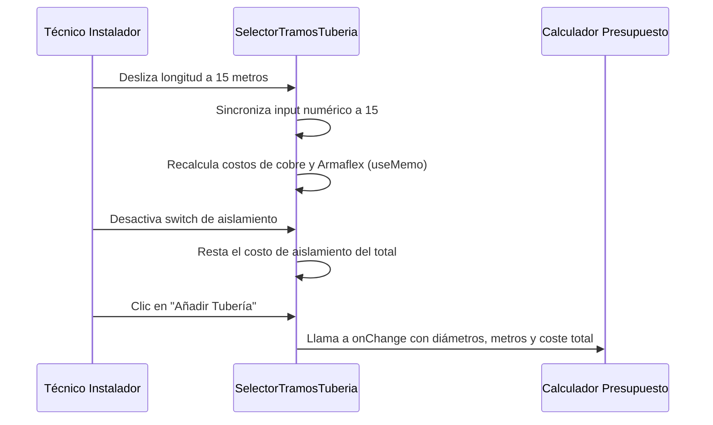

<!--
{
  "resource": "SelectorTramosTuberia",
  "technicalName": "SelectorTramosTuberia",
  "targetPath": "src/components/common/SelectorTramosTuberia.jsx",
  "dependencies": {
    "npm": {
      "lucide-react": "^0.300.0"
    },
    "internal": [
      {
        "name": "CustomSelect",
        "path": "src/components/ui/CustomSelect.jsx"
      }
    ]
  },
  "niches": ["refrigeration_ac"],
  "type": "component"
}
-->

# Selector de Tramos de Tubería (`SelectorTramosTuberia`)

Este componente permite a los instaladores o compradores cotizar la longitud (metros) de tuberías de cobre de succión y líquido, así como el aislamiento térmico de elastómero (Armaflex) necesario para interconectar el condensador y el evaporador.

## 1. Propósito y Casos de Uso
* **Venta Adicional en Instalación:** Permite calcular el cobro de tramos adicionales de tubería cuando la distancia entre las unidades excede los 3 metros estándar incluidos en la compra del equipo.
* **Lista de Materiales de Montaje:** Genera los requerimientos exactos de cobre para que el almacén prepare los kits de instalación de los técnicos.

## 2. Especificación Visual y Estilos (Tailwind CSS)
* **Formulario Responsivo:** Grid adaptable con variables CSS HSL.
* **CustomSelect para Diámetros:** Dropdowns interactivos para diámetros de tuberías comerciales (1/4", 3/8", 1/2", 5/8") sin usar selectores nativos.
* **Visualizador de Totales:** Resumen en caliente con cálculo de precio de tubería por metro.

## 3. Código React Completo

```jsx
import React, { useState, useMemo } from 'react';
import { Settings, Ruler, Info, ShoppingBag } from 'lucide-react';
import CustomSelect from '../ui/CustomSelect';

export default function SelectorTramosTuberia({
  onChange = null,
  liquidPipeOptions = [
    { value: '1_4', label: 'Línea de Líquido: 1/4" (6.35 mm)', priceMeter: 3.50 },
    { value: '3_8', label: 'Línea de Líquido: 3/8" (9.52 mm)', priceMeter: 4.80 }
  ],
  suctionPipeOptions = [
    { value: '3_8', label: 'Línea de Succión: 3/8" (9.52 mm)', priceMeter: 4.80 },
    { value: '1_2', label: 'Línea de Succión: 1/2" (12.7 mm)', priceMeter: 6.50 },
    { value: '5_8', label: 'Línea de Succión: 5/8" (15.8 mm)', priceMeter: 8.20 }
  ]
}) {
  const [liquidSize, setLiquidSize] = useState(liquidPipeOptions[0].value);
  const [suctionSize, setSuctionSize] = useState(suctionPipeOptions[1].value);
  const [meters, setMeters] = useState(5); // metros de tubería
  const [insulation, setInsulation] = useState(true); // Incluir aislamiento Armaflex

  const calculation = useMemo(() => {
    const liquidOpt = liquidPipeOptions.find(o => o.value === liquidSize) || liquidPipeOptions[0];
    const suctionOpt = suctionPipeOptions.find(o => o.value === suctionSize) || suctionPipeOptions[0];

    const liquidCost = liquidOpt.priceMeter * meters;
    const suctionCost = suctionOpt.priceMeter * meters;
    const insulationCost = insulation ? (1.50 * meters * 2) : 0; // $1.50 metro por cada línea
    
    const totalCost = liquidCost + suctionCost + insulationCost;

    return {
      liquidCost: parseFloat(liquidCost.toFixed(2)),
      suctionCost: parseFloat(suctionCost.toFixed(2)),
      insulationCost: parseFloat(insulationCost.toFixed(2)),
      total: parseFloat(totalCost.toFixed(2)),
      meters
    };
  }, [liquidSize, suctionSize, meters, insulation, liquidPipeOptions, suctionPipeOptions]);

  const handleRegister = () => {
    if (onChange) {
      const liquidOpt = liquidPipeOptions.find(o => o.value === liquidSize);
      const suctionOpt = suctionPipeOptions.find(o => o.value === suctionSize);
      onChange({
        liquidDiameter: liquidOpt?.label,
        suctionDiameter: suctionOpt?.label,
        meters,
        insulation,
        totalCost: calculation.total
      });
    }
  };

  return (
    <div className="w-full max-w-xl mx-auto bg-[var(--color-surface)] border border-[var(--color-border)] rounded-2xl p-5 shadow-sm">
      <h3 className="text-sm font-bold text-[var(--color-text)] mb-2 flex items-center gap-2">
        <Ruler size={16} className="text-[var(--color-primary)]" />
        <span>Kit de Tubería de Cobre & Montaje</span>
      </h3>
      <p className="text-xs text-[var(--color-text-muted)] mb-4">
        Configura los diámetros de tuberías y longitud necesarios para la interconexión de tus equipos.
      </p>

      <div className="space-y-4">
        {/* Diámetros de Tubería */}
        <div className="grid grid-cols-1 sm:grid-cols-2 gap-4">
          <div>
            <label className="text-[11px] font-bold text-[var(--color-text-muted)] block mb-1.5">Diámetro Línea Líquido</label>
            <CustomSelect
              value={liquidSize}
              onChange={setLiquidSize}
              options={liquidPipeOptions}
            />
          </div>
          <div>
            <label className="text-[11px] font-bold text-[var(--color-text-muted)] block mb-1.5">Diámetro Línea Succión</label>
            <CustomSelect
              value={suctionSize}
              onChange={setSuctionSize}
              options={suctionPipeOptions}
            />
          </div>
        </div>

        {/* Metros de Tubería */}
        <div>
          <div className="flex justify-between items-center text-[10px] font-bold text-[var(--color-text-muted)] mb-1">
            <span>Metraje de Tubería Requerida</span>
            <span className="font-mono text-[var(--color-primary)]">{meters} Metros</span>
          </div>
          <div className="flex items-center gap-3">
            <input
              type="range"
              min="2"
              max="25"
              value={meters}
              onChange={(e) => setMeters(parseInt(e.target.value))}
              className="flex-1 h-1.5 bg-[var(--color-surface-2)] rounded-lg appearance-none cursor-pointer accent-[var(--color-primary)] outline-none"
            />
            <input
              type="number"
              value={meters}
              onChange={(e) => setMeters(Math.max(2, parseInt(e.target.value) || 2))}
              className="w-16 h-8 px-2 rounded-lg border border-[var(--color-border)] bg-[var(--color-surface-2)]/20 text-center font-mono text-xs text-[var(--color-text)] outline-none"
              min="2"
            />
          </div>
        </div>

        {/* Switch Aislamiento Térmico */}
        <div className="flex justify-between items-center p-3 border border-[var(--color-border)] rounded-xl bg-[var(--color-surface-2)]/10">
          <div>
            <span className="text-xs font-bold text-[var(--color-text)] block">Incluir Aislamiento Elastómero</span>
            <span className="text-[9px] text-[var(--color-text-muted)]">Protege los caños de condensaciones e incrementa la eficiencia.</span>
          </div>
          <button
            type="button"
            onClick={() => setInsulation(!insulation)}
            className={`w-10 h-6 rounded-full p-0.5 transition-colors cursor-pointer ${
              insulation ? 'bg-[var(--color-primary)]' : 'bg-[var(--color-border)]'
            }`}
          >
            <div className={`w-5 h-5 bg-white rounded-full shadow-sm transition-transform ${
              insulation ? 'translate-x-4' : 'translate-x-0'
            }`} />
          </button>
        </div>

        {/* Resumen de Materiales */}
        <div className="p-4 bg-[var(--color-surface-2)]/40 border border-[var(--color-border)] rounded-xl space-y-2 text-xs">
          <div className="flex justify-between items-center text-[10px] text-[var(--color-text-muted)]">
            <span>Costo Línea de Cobre (Líquido + Succión):</span>
            <span className="font-mono">${(calculation.liquidCost + calculation.suctionCost).toFixed(2)} USD</span>
          </div>
          {insulation && (
            <div className="flex justify-between items-center text-[10px] text-[var(--color-text-muted)]">
              <span>Aislamiento Armaflex ({meters * 2} metros):</span>
              <span className="font-mono">${calculation.insulationCost.toFixed(2)} USD</span>
            </div>
          )}
          <div className="border-t border-[var(--color-border)] pt-2 flex justify-between items-center font-bold">
            <span className="text-[var(--color-text)]">Total Cotización Materiales:</span>
            <span className="text-[var(--color-primary)] text-sm font-mono">${calculation.total.toFixed(2)} USD</span>
          </div>
        </div>

        {/* Botón de acción */}
        <button
          type="button"
          onClick={handleRegister}
          className="w-full h-11 bg-[var(--color-primary)] hover:opacity-90 active:scale-95 text-[var(--color-text)] font-bold text-xs rounded-xl flex items-center justify-center gap-2 transition-all cursor-pointer shadow-sm"
        >
          <ShoppingBag size={14} />
          <span>Añadir Tubería a Cotización</span>
        </button>
      </div>
    </div>
  );
}
```

## 4. Lógica de Estado y Ciclo de Vida
* **Sincronización Slider/Input:** Permite definir la longitud mediante un control deslizante táctil o un input de texto sincronizado.
* **Cálculo Reactivo de Componentes:** useMemo actualiza en caliente los costos al habilitar/deshabilitar el aislamiento térmico o cambiar diámetros.

## 5. Flujo Operativo y Secuencia de Interacción


