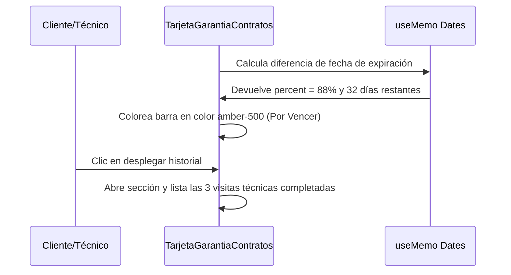

<!--
{
  "resource": "TarjetaGarantiaContratos",
  "technicalName": "TarjetaGarantiaContratos",
  "targetPath": "src/components/common/TarjetaGarantiaContratos.jsx",
  "dependencies": {
    "npm": {
      "lucide-react": "^0.300.0"
    },
    "internal": []
  },
  "niches": ["refrigeration_ac"],
  "type": "component"
}
-->

# Tarjeta de Garantía y Contratos (`TarjetaGarantiaContratos`)

Este componente proporciona un visualizador premium independiente con estética glassmorphism para consultar el estado de contratos de mantenimiento preventivo y vigencia de garantías de compresores HVAC.

## 1. Propósito y Casos de Uso
* **Fidelización y Postventa:** Permite a los clientes residenciales y comerciales monitorear el tiempo restante de su póliza contratada.
* **Portal del Técnico:** Informa al técnico antes de realizar una reparación si la pieza de recambio (compresor) está amparada por garantía del fabricante.

## 2. Especificación Visual y Estilos (Tailwind CSS)
* **Estilo Glassmorphism:** Fondo traslúcido estilizado (`bg-[var(--color-surface)]/80 backdrop-blur-md`) y bordes HSL suaves.
* **Barra de Progreso Temporal:** Barra horizontal responsiva que representa el tiempo transcurrido de la póliza o garantía, coloreándose en rojo cuando se aproxima la fecha de expiración.
* **Historial Desplegable:** Sección colapsable que muestra las firmas y fechas de los servicios técnicos efectuados.

## 3. Código React Completo

```jsx
import React, { useState, useMemo } from 'react';
import { ShieldCheck, Calendar, Clock, ChevronDown, ChevronUp, FileText, Check } from 'lucide-react';

export default function TarjetaGarantiaContratos({
  contractData = {
    id: 'CTR-9082-2026',
    clientName: 'Almacenes Éxito S.A.',
    equipmentModel: 'Condensadora Carrier 24k BTU Inverter',
    startDate: '2025-06-01',
    endDate: '2026-06-01',
    compressorWarrantyYears: 5,
    compressorStartDate: '2025-06-01',
    visitsHistory: [
      { id: 'v1', date: '2025-09-12', technician: 'Ing. Carlos Ruiz', status: 'Firmado', type: 'Mantenimiento Preventivo' },
      { id: 'v2', date: '2025-12-15', technician: 'Ing. Juan Rojas', status: 'Firmado', type: 'Limpieza de serpentines' },
      { id: 'v3', date: '2026-03-10', technician: 'Ing. Carlos Ruiz', status: 'Firmado', type: 'Control de presión de gas' }
    ]
  }
}) {
  const [expanded, setExpanded] = useState(false);

  const stats = useMemo(() => {
    const start = new Date(contractData.startDate);
    const end = new Date(contractData.endDate);
    const today = new Date();

    const totalDays = (end - start) / (1000 * 60 * 60 * 24);
    const elapsedDays = (today - start) / (1000 * 60 * 60 * 24);
    
    let percent = (elapsedDays / totalDays) * 100;
    percent = Math.min(100, Math.max(0, percent));

    const remainingDays = Math.ceil((end - today) / (1000 * 60 * 60 * 24));
    const isExpired = remainingDays <= 0;
    const isCloseToExpire = !isExpired && remainingDays <= 45;

    // Garantía del compresor (ej: 5 años)
    const compressorEnd = new Date(contractData.compressorStartDate);
    compressorEnd.setFullYear(compressorEnd.getFullYear() + contractData.compressorWarrantyYears);
    const warrantyRemainingMonths = Math.ceil((compressorEnd - today) / (1000 * 60 * 60 * 24 * 30.4));
    const isCompressorWarrantyActive = warrantyRemainingMonths > 0;

    return {
      progressPercent: Math.round(percent),
      remainingDays: isExpired ? 0 : remainingDays,
      isExpired,
      isCloseToExpire,
      isCompressorWarrantyActive,
      compressorWarrantyMonths: Math.max(0, warrantyRemainingMonths)
    };
  }, [contractData]);

  const getStatusBadge = () => {
    if (stats.isExpired) {
      return (
        <span className="px-2 py-0.5 rounded-md text-[8px] font-black uppercase bg-red-500/10 text-red-500 border border-red-500/20">
          Contrato Expirado
        </span>
      );
    }
    if (stats.isCloseToExpire) {
      return (
        <span className="px-2 py-0.5 rounded-md text-[8px] font-black uppercase bg-amber-500/10 text-amber-500 border border-amber-500/20 animate-pulse">
          Por Vencer (Pocos días)
        </span>
      );
    }
    return (
      <span className="px-2 py-0.5 rounded-md text-[8px] font-black uppercase bg-green-500/10 text-green-500 border border-green-500/20">
        Póliza Vigente
      </span>
    );
  };

  return (
    <div className="w-full max-w-md mx-auto bg-[var(--color-surface)] border border-[var(--color-border)] rounded-2xl p-5 shadow-sm">
      <div className="flex justify-between items-start mb-3">
        <div>
          <span className="text-[9px] font-mono text-[var(--color-text-muted)] block">ID Contrato: {contractData.id}</span>
          <h3 className="text-xs font-bold text-[var(--color-text)] mt-0.5">{contractData.equipmentModel}</h3>
        </div>
        {getStatusBadge()}
      </div>

      {/* Barra de progreso de la póliza anual */}
      <div className="space-y-1.5 mb-4">
        <div className="flex justify-between items-center text-[10px] text-[var(--color-text-muted)]">
          <span>Progreso del Contrato Anual</span>
          <span className="font-mono">{stats.progressPercent}% Transcurrido</span>
        </div>
        <div className="w-full h-1.5 bg-[var(--color-surface-2)] rounded-full overflow-hidden">
          <div
            className={`h-full transition-all duration-500 ${
              stats.isExpired
                ? 'bg-red-500'
                : stats.isCloseToExpire
                  ? 'bg-amber-500'
                  : 'bg-[var(--color-primary)]'
            }`}
            style={{ width: `${stats.progressPercent}%` }}
          />
        </div>
        <div className="flex justify-between items-center text-[9px] text-[var(--color-text-muted)]">
          <span>Inicio: {contractData.startDate}</span>
          <span>Expira: {contractData.endDate}</span>
        </div>
      </div>

      {/* Detalle de Garantía del Compresor */}
      <div className="p-3 bg-[var(--color-surface-2)]/40 border border-[var(--color-border)] rounded-xl flex items-center justify-between gap-2.5 text-xs mb-4">
        <div className="flex items-center gap-2">
          <ShieldCheck size={16} className={stats.isCompressorWarrantyActive ? 'text-[var(--color-primary)]' : 'text-[var(--color-text-muted)]'} />
          <div>
            <span className="text-[10px] font-bold text-[var(--color-text)] block">
              Garantía Compresor de Fábrica
            </span>
            <span className="text-[9px] text-[var(--color-text-muted)] block">
              Cobertura total del componente motriz.
            </span>
          </div>
        </div>
        <div className="text-right">
          {stats.isCompressorWarrantyActive ? (
            <span className="font-mono text-[10px] font-extrabold text-[var(--color-primary)]">
              {stats.compressorWarrantyMonths} Meses Restantes
            </span>
          ) : (
            <span className="text-[10px] font-bold text-red-500">Expirada</span>
          )}
        </div>
      </div>

      {/* Historial Colapsable */}
      <div className="border-t border-[var(--color-border)] pt-3">
        <button
          type="button"
          onClick={() => setExpanded(!expanded)}
          className="w-full flex items-center justify-between text-[10px] font-bold text-[var(--color-text-muted)] uppercase tracking-wider cursor-pointer hover:text-[var(--color-primary)] transition-colors"
        >
          <span className="flex items-center gap-1.5">
            <FileText size={12} />
            Historial de Mantenimientos ({contractData.visitsHistory.length})
          </span>
          {expanded ? <ChevronUp size={12} /> : <ChevronDown size={12} />}
        </button>

        {expanded && (
          <div className="space-y-2 mt-3 animate-slideDown">
            {contractData.visitsHistory.map((visit) => (
              <div 
                key={visit.id} 
                className="p-2.5 rounded-lg border border-[var(--color-border)] bg-[var(--color-surface-2)]/20 flex justify-between items-center text-[10px]"
              >
                <div className="space-y-0.5">
                  <span className="text-xs font-bold text-[var(--color-text)] block">{visit.type}</span>
                  <span className="text-[9px] text-[var(--color-text-muted)] block">{visit.technician}</span>
                  <span className="text-[9px] font-mono text-[var(--color-text-muted)] block flex items-center gap-1">
                    <Calendar size={10} /> {visit.date}
                  </span>
                </div>
                <div className="flex items-center gap-1 text-[9px] text-green-500 font-bold bg-green-500/10 border border-green-500/20 px-1.5 py-0.5 rounded-md">
                  <Check size={8} />
                  <span>{visit.status}</span>
                </div>
              </div>
            ))}
          </div>
        )}
      </div>
    </div>
  );
}
```

## 4. Lógica de Estado y Ciclo de Vida
* **Cálculo de Tiempos con useMemo:** Convierte fechas de inicio y fin en porcentajes transcurridos y evalúa condiciones de urgencia por expiración de forma reactiva.
* **Historial Desplegable local:** Expande y colapsa la sección de visitas de mantenimiento mediante un control de toggle local.

## 5. Flujo Operativo y Secuencia de Interacción


