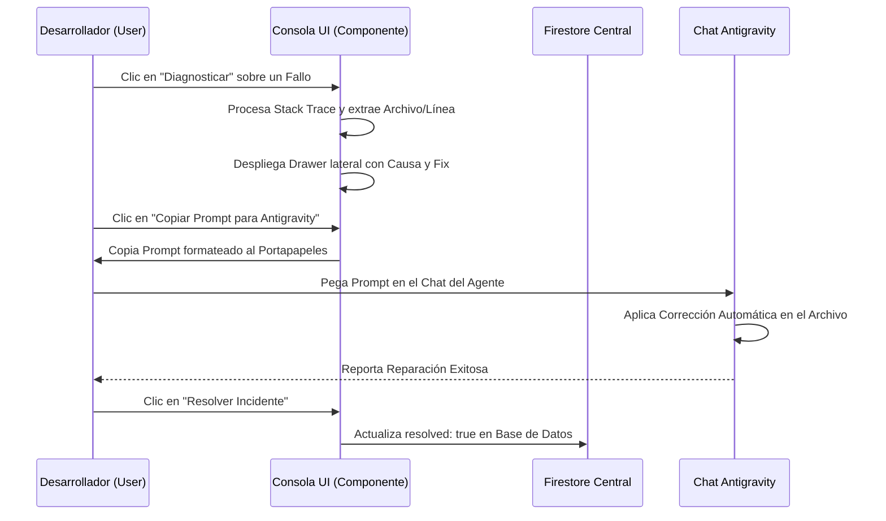

<!--
{
  "technicalName": "ConsolaErroresDiagnostico",
  "targetPath": "src/services/ConsolaErroresDiagnostico.js",
  "dependencies": {
    "npm": {},
    "internal": []
  }
}
-->

# Consola de Errores y Diagnóstico Inteligente (Error Diagnostic Console)

Este componente modular unifica el monitoreo en tiempo real de excepciones no controladas e incidentes de telemetría reportados por las aplicaciones de los clientes en el ecosistema, integrando un Asistente de Diagnóstico Lateral (Drawer) y un Generador de Prompts automatizados para el agente **Antigravity**.

---

## 1. Propósito y Casos de Uso
* **Consola Centralizada de Incidentes:** Monitorear en tiempo real los fallos reportados en producción u offline a través de la colección `app_failures` de Firestore Central.
* **Diagnóstico Inteligente Integrado:** Desplegar un Drawer responsivo con análisis contextual en base a causas comunes (caídas de red, problemas de caché, permisos de Firestore).
* **Resolución Acelerada con Antigravity:** Proveer un generador de instrucciones/prompts automatizado que incluye metadatos críticos (ID de subproyecto, stack trace, archivo y línea) para que la IA corrija el fallo en un solo paso.

---

## 2. Especificación Visual y Estilos
* **Marca y Temas:** Consume variables de CSS para el tema visual (`var(--color-surface)`, `var(--color-border)`, `var(--color-text)`, etc.).
* **Alineación Responsiva Premium:** Vista de listado basada en tarjetas interactivas adaptables a móviles y escritorio con micro-animaciones hover.
* **Drawer Deslizante:** Efecto backdrop de desenfoque (`backdrop-blur-sm`) y transición elástica lateral (`animate-slide-in-right`).
* **Visualización de Logs:** Bloques de código pre-formateados estilo terminal oscura (`bg-[#0c101a]`) con selección y copiado rápido.

---

## 3. Código React Completo y 100% Funcional

A continuación se presenta el código completo del componente modular e independiente para su portabilidad directa:

```jsx
import React, { useState } from 'react';
import { 
  AlertTriangle, 
  CheckCircle, 
  X, 
  Copy, 
  Database, 
  Activity, 
  Users 
} from 'lucide-react';

/**
 * Componente principal de la Consola de Errores y Diagnóstico
 *
 * @param {Array} failures - Listado de fallas obtenidas en vivo de Firestore.
 * @param {Function} onResolve - Callback ejecutado al solucionar un error individual.
 * @param {Function} onResolveAll - Callback ejecutado al solucionar todos los fallos del cliente.
 * @param {Function} onSimulate - Callback opcional para simular o inyectar un nuevo fallo.
 */
export default function ErrorDiagnosticConsole({ 
  failures = [], 
  onResolve, 
  onResolveAll, 
  onSimulate 
}) {
  const [selectedErrorClientFilter, setSelectedErrorClientFilter] = useState('todos');
  const [selectedDiagnosticError, setSelectedDiagnosticError] = useState(null);
  const [expandedErrorId, setExpandedErrorId] = useState(null);
  const [toastMessage, setToastMessage] = useState(null);

  // Mostrar notificaciones locales
  const showLocalToast = (msg) => {
    setToastMessage(msg);
    setTimeout(() => setToastMessage(null), 3000);
  };

  const activeFailures = failures.filter(f => !f.resolved);
  const filteredFailures = failures.filter(f => 
    selectedErrorClientFilter === 'todos' || f.clientId === selectedErrorClientFilter
  );

  return (
    <div className="space-y-6 animate-fade-in relative">
      {/* Toast Local */}
      {toastMessage && (
        <div className="fixed bottom-4 right-4 z-50 bg-indigo-600 text-white px-4 py-2.5 rounded-xl text-xs font-bold shadow-lg animate-scale-up flex items-center gap-2 border border-indigo-500/25">
          <CheckCircle size={14} />
          <span>{toastMessage}</span>
        </div>
      )}

      {/* Header */}
      <div className="flex flex-col sm:flex-row sm:items-center sm:justify-between gap-4">
        <div>
          <h1 className="text-xl font-black text-[var(--color-text)] flex items-center gap-2.5">
            <AlertTriangle size={20} className="text-red-500 animate-pulse" />
            Consola de Errores y Diagnóstico
          </h1>
          <p className="text-xs text-[var(--color-text-muted)] mt-0.5">
            Monitoreo en tiempo real de fallos e incidentes en aplicaciones de clientes.
          </p>
        </div>
        <div className="flex flex-wrap gap-2.5">
          {onSimulate && (
            <button 
              onClick={onSimulate}
              className="px-3 py-1.5 bg-violet-600/10 hover:bg-violet-600/20 border border-violet-500/25 text-violet-400 text-xs font-bold rounded-xl transition-all cursor-pointer flex items-center gap-1.5 active:scale-95 shadow-sm"
            >
              <Activity size={13} className="animate-pulse" />
              Simular Fallo
            </button>
          )}
          <button 
            onClick={onResolveAll}
            disabled={activeFailures.length === 0}
            className="px-3 py-1.5 bg-emerald-600/10 hover:bg-emerald-600/20 border border-emerald-500/25 text-emerald-400 text-xs font-bold rounded-xl transition-all cursor-pointer flex items-center gap-1.5 disabled:opacity-30 disabled:pointer-events-none active:scale-95 shadow-sm"
          >
            <CheckCircle size={13} />
            Resolver Todos
          </button>
        </div>
      </div>

      {/* Tarjetas de Resumen */}
      <div className="grid grid-cols-1 sm:grid-cols-3 gap-4">
        <div className="bg-[var(--color-surface)] border border-[var(--color-border)] p-4 rounded-2xl flex items-center gap-3.5 shadow-sm">
          <div className={`w-10 h-10 rounded-xl flex items-center justify-center shrink-0 ${
            activeFailures.length > 0 ? 'bg-red-500/10 text-red-400' : 'bg-emerald-500/10 text-emerald-400'
          }`}>
            <AlertTriangle size={18} />
          </div>
          <div>
            <span className="text-[10px] uppercase font-bold text-[var(--color-text-muted)] block tracking-wider">Fallos Activos</span>
            <span className="text-xl font-black text-[var(--color-text)] leading-none mt-0.5">
              {activeFailures.length}
            </span>
          </div>
        </div>

        <div className="bg-[var(--color-surface)] border border-[var(--color-border)] p-4 rounded-2xl flex items-center gap-3.5 shadow-sm">
          <div className="w-10 h-10 rounded-xl bg-violet-500/10 text-violet-400 flex items-center justify-center shrink-0">
            <Users size={18} />
          </div>
          <div>
            <span className="text-[10px] uppercase font-bold text-[var(--color-text-muted)] block tracking-wider">Clientes Afectados</span>
            <span className="text-xl font-black text-[var(--color-text)] leading-none mt-0.5">
              {new Set(activeFailures.map(f => f.clientId)).size}
            </span>
          </div>
        </div>

        <div className="bg-[var(--color-surface)] border border-[var(--color-border)] p-4 rounded-2xl flex items-center gap-3.5 shadow-sm">
          <div className="w-10 h-10 rounded-xl bg-cyan-500/10 text-cyan-400 flex items-center justify-center shrink-0">
            <Activity size={18} />
          </div>
          <div>
            <span className="text-[10px] uppercase font-bold text-[var(--color-text-muted)] block tracking-wider">Uptime del Motor</span>
            <span className="text-xl font-black text-[var(--color-text)] leading-none mt-0.5">
              {activeFailures.length > 0 ? '99.78%' : '100.00%'}
            </span>
          </div>
        </div>
      </div>

      {/* Listado y Filtros */}
      <div className="bg-[var(--color-surface)] border border-[var(--color-border)] p-5 rounded-3xl space-y-4 shadow-sm">
        <div className="flex flex-col sm:flex-row sm:items-center sm:justify-between gap-3 pb-3 border-b border-[var(--color-border)]">
          <h3 className="font-extrabold text-sm text-[var(--color-text)]">Historial de Incidentes</h3>
          
          {/* Selector de Cliente */}
          <div className="flex items-center gap-2">
            <span className="text-[10px] uppercase font-bold text-[var(--color-text-muted)]">Filtrar Cliente:</span>
            <select
              value={selectedErrorClientFilter}
              onChange={(e) => setSelectedErrorClientFilter(e.target.value)}
              className="bg-[var(--color-surface-2)]/50 border border-[var(--color-border)] rounded-xl px-2.5 py-1 text-xs font-bold text-[var(--color-text)] outline-none focus:border-violet-500"
            >
              <option value="todos">Todos los Clientes</option>
              {Array.from(new Set(failures.map(f => f.clientId))).map(cid => (
                <option key={cid} value={cid}>{cid}</option>
              ))}
            </select>
          </div>
        </div>

        {/* Listado de Tarjetas */}
        {filteredFailures.length === 0 ? (
          <div className="text-center py-12 space-y-2">
            <CheckCircle size={36} className="text-emerald-500/40 mx-auto" />
            <p className="text-xs font-bold text-[var(--color-text-muted)]">Sin incidentes reportados</p>
            <p className="text-[10px] text-slate-500">Todas las instancias operan correctamente.</p>
          </div>
        ) : (
          <div className="space-y-4">
            {filteredFailures.map((fail) => {
              const isExpanded = expandedErrorId === fail.id;
              return (
                <div 
                  key={fail.id} 
                  className={`p-4 rounded-2xl border transition-all duration-200 ${
                    fail.resolved 
                      ? 'bg-[var(--color-surface-2)]/20 border-[var(--color-border)]/50 opacity-60' 
                      : 'bg-[var(--color-surface-2)]/30 border-red-500/20 hover:border-red-500/30'
                  }`}
                >
                  <div className="flex flex-col sm:flex-row sm:items-start justify-between gap-3">
                    {/* Metadata */}
                    <div className="space-y-1 flex-1 min-w-0">
                      <div className="flex flex-wrap items-center gap-2">
                        <span className="px-2 py-0.5 bg-slate-800 text-slate-300 font-mono text-[9px] font-black rounded uppercase">
                          {fail.clientId}
                        </span>
                        <span className="text-[10px] text-[var(--color-text-muted)] font-semibold">
                          • {fail.niche || 'Ecosistema'}
                        </span>
                        <span className="text-[10px] text-slate-500 font-mono">
                          • {new Date(fail.timestamp).toLocaleString()}
                        </span>
                        {fail.resolved ? (
                          <span className="px-1.5 py-0.5 bg-emerald-500/10 text-emerald-400 text-[8px] font-black uppercase rounded border border-emerald-500/20">
                            Resuelto
                          </span>
                        ) : (
                          <span className="px-1.5 py-0.5 bg-red-500/10 text-red-400 text-[8px] font-black uppercase rounded border border-red-500/20 animate-pulse">
                            Activo
                          </span>
                        )}
                      </div>
                      <h4 className="text-xs font-bold text-red-400 break-words mt-1">{fail.errorMsg}</h4>
                      <p className="text-[10px] text-slate-500">Dispositivo: {fail.deviceInfo}</p>
                    </div>

                    {/* Acciones */}
                    <div className="flex items-center gap-2 shrink-0 self-end sm:self-start">
                      <button 
                        onClick={() => setSelectedDiagnosticError(fail)}
                        className="px-2.5 py-1 bg-violet-600/10 hover:bg-violet-600/20 border border-violet-500/25 text-violet-400 text-[10px] font-bold rounded-lg transition-colors cursor-pointer"
                      >
                        Diagnosticar
                      </button>
                      <button 
                        onClick={() => setExpandedErrorId(isExpanded ? null : fail.id)}
                        className="px-2.5 py-1 bg-[var(--color-surface)] hover:bg-[var(--color-surface-2)] border border-[var(--color-border)] text-[10px] font-bold text-[var(--color-text-muted)] hover:text-[var(--color-text)] rounded-lg transition-colors cursor-pointer"
                      >
                        {isExpanded ? 'Ocultar Stack' : 'Ver Stack'}
                      </button>
                      {!fail.resolved && (
                        <button 
                          onClick={() => onResolve(fail.id)}
                          className="px-2.5 py-1 bg-emerald-600 hover:bg-emerald-500 text-white text-[10px] font-bold rounded-lg transition-colors cursor-pointer active:scale-95 shadow"
                        >
                          Resolver
                        </button>
                      )}
                    </div>
                  </div>

                  {/* Stack Trace Collapsed */}
                  {isExpanded && (
                    <div className="mt-3.5 space-y-1.5 animate-fade-in">
                      <span className="text-[9px] uppercase font-black text-slate-500 tracking-wider font-mono">Stack Trace Diagnóstico:</span>
                      <pre className="bg-[#0c101a] font-mono text-[10px] p-3.5 rounded-xl border border-red-500/15 overflow-x-auto text-red-300 leading-relaxed shadow-inner select-text select-all">
                        {fail.stack}
                      </pre>
                    </div>
                  )}
                </div>
              );
            })}
          </div>
        )}
      </div>

      {/* Drawer Lateral de Diagnóstico Inteligente */}
      {selectedDiagnosticError && (
        <div className="fixed inset-0 z-[80] overflow-hidden select-none">
          {/* Backdrop */}
          <div 
            className="absolute inset-0 bg-[var(--color-bg)]/70 backdrop-blur-sm transition-opacity duration-300"
            onClick={() => setSelectedDiagnosticError(null)}
          />

          <div className="absolute inset-y-0 right-0 max-w-full flex pl-10">
            <div className="w-screen max-w-md bg-[var(--color-surface)] border-l border-[var(--color-border)] shadow-2xl flex flex-col justify-between select-text animate-slide-in-right">
              {/* Header */}
              <div className="p-6 border-b border-[var(--color-border)] flex justify-between items-start">
                <div>
                  <div className="flex flex-wrap items-center gap-2">
                    <span className="px-2 py-0.5 bg-slate-800 text-slate-300 font-mono text-[9px] font-black rounded uppercase">
                      {selectedDiagnosticError.clientId}
                    </span>
                    <span className="text-[10px] text-[var(--color-text-muted)] font-mono">
                      {new Date(selectedDiagnosticError.timestamp).toLocaleString()}
                    </span>
                  </div>
                  <h3 className="text-base font-black text-[var(--color-text)] mt-2 flex items-center gap-2">
                    <AlertTriangle size={16} className="text-red-500" />
                    Diagnóstico de Incidente
                  </h3>
                </div>
                <button 
                  onClick={() => setSelectedDiagnosticError(null)}
                  className="w-8 h-8 rounded-xl bg-[var(--color-surface-2)] border border-[var(--color-border)] hover:bg-[var(--color-surface-2)]/80 text-[var(--color-text)] flex items-center justify-center cursor-pointer transition-all active:scale-95"
                >
                  <X size={15} />
                </button>
              </div>

              {/* Contenido */}
              <div className="flex-1 overflow-y-auto p-6 space-y-6">
                <div className="space-y-2">
                  <span className="text-[9px] uppercase font-black text-slate-500 tracking-wider font-mono">Mensaje de Error:</span>
                  <div className="bg-red-500/10 border border-red-500/20 text-red-400 p-4 rounded-2xl text-xs font-bold font-mono break-words leading-relaxed shadow-sm">
                    {selectedDiagnosticError.errorMsg}
                  </div>
                </div>

                {/* Análisis Contextual */}
                {(() => {
                  const errMsg = selectedDiagnosticError.errorMsg || '';
                  let diagnosis = "Error genérico de ejecución. Se recomienda auditar el stack trace para identificar el origen.";
                  let solution = "Revisar los imports, variables de estado de React, y asegurar que no haya referencias a objetos undefined.";

                  if (errMsg.includes('Failed to fetch dynamically imported module')) {
                    diagnosis = "Error de carga del módulo dinámico de la página. Esto ocurre usualmente por desconexión temporal de internet (modo offline) del usuario, un caché corrupto del service worker, o si el archivo fue borrado o renombrado físicamente del disco.";
                    solution = "1. Verifica que el archivo de la página exista en la ruta especificada de la aplicación.\n2. Asegura que el router tenga correctamente declarada la importación perezosa.\n3. Si fue un corte de internet temporal en producción, no requiere cambios en el código.";
                  } else if (errMsg.includes('Missing or insufficient permissions') || errMsg.includes('permission-denied')) {
                    diagnosis = "Acceso denegado por Firestore Central. La consulta o escritura del cliente fue bloqueada por no cumplir con los criterios de seguridad definidos en las reglas de base de datos.";
                    solution = "1. Revisa las reglas en `firestore.rules` asociadas a la colección afectada.\n2. Verifica si el usuario cuenta con los claims o roles necesarios en su sesión de Firebase Auth.\n3. Asegúrate de invocar la limpieza de listeners `onSnapshot` al cerrar sesión.";
                  }

                  // Extraer archivo y línea
                  let detectedFile = 'N/A';
                  let detectedLine = 'N/A';
                  const fileMatch = selectedDiagnosticError.errorMsg.match(/src\/[a-zA-Z0-9_\-\/]+\.[j|t]sx?/);
                  if (fileMatch) {
                    detectedFile = fileMatch[0];
                  } else {
                    const stackMatch = selectedDiagnosticError.stack?.match(/src\/[a-zA-Z0-9_\-\/]+\.[j|t]sx?/);
                    if (stackMatch) detectedFile = stackMatch[0];
                  }

                  const lineMatch = selectedDiagnosticError.stack?.match(/:(\d+):(\d+)/);
                  if (lineMatch) {
                    detectedLine = lineMatch[1];
                  }

                  return (
                    <>
                      <div className="space-y-4 bg-violet-500/5 border border-violet-500/15 p-5 rounded-2xl">
                        <h4 className="font-extrabold text-xs text-[var(--color-text)] flex items-center gap-1.5">
                          <Activity size={13} className="text-violet-400" />
                          Análisis del Asistente
                        </h4>
                        
                        <div className="space-y-3 text-xs leading-relaxed text-[var(--color-text-muted)]">
                          <div>
                            <span className="font-extrabold text-[var(--color-text)] block mb-0.5">Causa Probable:</span>
                            <p>{diagnosis}</p>
                          </div>
                          <div>
                            <span className="font-extrabold text-[var(--color-text)] block mb-0.5">Solución Recomendada:</span>
                            <p className="whitespace-pre-line leading-relaxed">{solution}</p>
                          </div>
                        </div>
                      </div>

                      {/* Botones de Acción */}
                      <div className="grid grid-cols-1 gap-2.5">
                        <button
                          onClick={async () => {
                            const promptText = `En el proyecto '${selectedDiagnosticError.clientId}', corrige el error '${selectedDiagnosticError.errorMsg}' que está ocurriendo en el archivo '${detectedFile}' (Línea: ${detectedLine}, Niche: ${selectedDiagnosticError.niche}). Revisa el stack trace:\n${selectedDiagnosticError.stack || 'No stack trace disponible'}`;
                            try {
                              await navigator.clipboard.writeText(promptText);
                              showLocalToast('Prompt copiado para Antigravity.');
                            } catch (err) {
                              showLocalToast('Error al copiar el prompt.');
                            }
                          }}
                          className="w-full py-2.5 bg-violet-600 hover:bg-violet-500 text-white font-extrabold text-xs rounded-xl shadow-sm hover:shadow transition-all flex items-center justify-center gap-2 cursor-pointer active:scale-[0.98]"
                        >
                          <Copy size={13} />
                          Copiar Prompt para Antigravity
                        </button>

                        <button
                          onClick={async () => {
                            try {
                              await navigator.clipboard.writeText(detectedFile);
                              showLocalToast('Ruta de archivo copiada.');
                            } catch (err) {
                              showLocalToast('Error al copiar ruta.');
                            }
                          }}
                          className="w-full py-2.5 bg-[var(--color-surface-2)] hover:bg-[var(--color-surface-2)]/80 border border-[var(--color-border)] text-[var(--color-text)] font-extrabold text-xs rounded-xl transition-all flex items-center justify-center gap-2 cursor-pointer active:scale-[0.98]"
                        >
                          <Database size={12} className="text-slate-400" />
                          Copiar Ruta de Archivo ({detectedFile.split('/').pop()})
                        </button>
                      </div>
                    </>
                  );
                })()}

                {/* Stack Trace */}
                <div className="space-y-2">
                  <span className="text-[9px] uppercase font-black text-slate-500 tracking-wider font-mono">Stack Trace Completo:</span>
                  <pre className="bg-[#0c101a] font-mono text-[9px] p-4 rounded-2xl border border-[var(--color-border)] overflow-x-auto text-red-350/90 leading-relaxed shadow-inner select-text select-all">
                    {selectedDiagnosticError.stack || "Sin stack trace disponible."}
                  </pre>
                </div>
              </div>

              {/* Footer */}
              <div className="p-6 border-t border-[var(--color-border)] bg-[var(--color-surface-2)]/30 flex items-center justify-between gap-3">
                <button
                  onClick={() => setSelectedDiagnosticError(null)}
                  className="px-4 py-2 border border-[var(--color-border)] text-xs font-bold rounded-xl text-[var(--color-text-muted)] hover:text-[var(--color-text)] hover:bg-[var(--color-surface-2)]/80 transition-all cursor-pointer"
                >
                  Cerrar
                </button>

                {!selectedDiagnosticError.resolved && (
                  <button
                    onClick={async () => {
                      await onResolve(selectedDiagnosticError.id);
                      setSelectedDiagnosticError(null);
                    }}
                    className="px-4 py-2 bg-emerald-600 hover:bg-emerald-500 text-white text-xs font-bold rounded-xl transition-all cursor-pointer active:scale-95 shadow"
                  >
                    Resolver Incidente
                  </button>
                )}
              </div>
            </div>
          </div>
        </div>
      )}
    </div>
  );
}
```

---

## 4. Lógica de Estado y Ciclo de Vida
Este componente opera como una vista de monitoreo *stateless* (obtiene su feed de errores externamente, usualmente mediante un escuchador reactivo de Firestore `onSnapshot`).
* **Zustand / Global State:** Mapeado con un store o integrándolo directamente en las páginas del desarrollador.
* **Ciclo de Vida:** Al montar el componente, se conecta el stream de Firestore. Al destruirse, destruye el observer asíncrono para mitigar las fugas de memoria y cobros por lecturas innecesarias en Firebase.

---

## 5. Secuencia de Interacción


