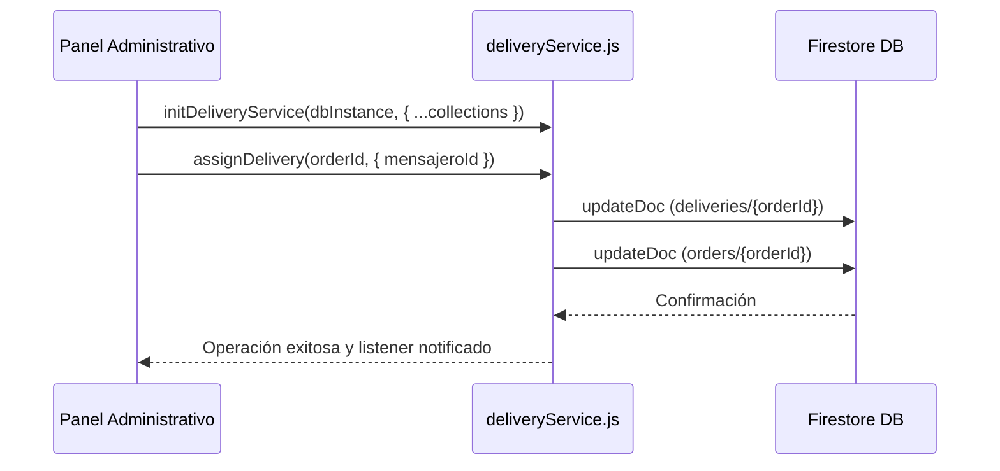

<!--
{
  "technicalName": "DeliveryService",
  "targetPath": "src/services/DeliveryService.js",
  "dependencies": {
    "npm": {},
    "internal": []
  }
}
-->

# Servicio de Gestión de Domicilios (DeliveryService)

Este servicio encapsula la lógica para administrar el ciclo de vida logístico de las entregas (domicilios), asignación de mensajeros (empleados o externos), rastreo de estados, sincronización con pedidos principales y acumulación de analíticas diarias.

---

## 1. Propósito y Casos de Uso
* **Control de Cola de Entregas (Queue):** Permite registrar pedidos en una colección logística de entregas e ir cambiando su estado (`pendiente`, `asignado`, `en_camino`, `entregado`, etc.).
* **Gestión de Mensajeros Externos:** CRUD completo para configurar transportistas externos del negocio.
* **Sincronización Transaccional:** Mantiene el estado logístico del pedido actualizado tanto en la orden principal (`orders`) como en la entrega (`deliveries`) sin duplicar lógica.
* **Analítica Diaria de Rendimiento:** Acumula transaccionalmente los pedidos entregados/fallidos/reprogramados por cada mensajero al día para dashboards administrativos.

---

## 2. Código Javascript Completo y 100% Funcional (Decoupled & Initializable)

```javascript
import {
  collection, doc, getDoc, getDocs, addDoc, setDoc, updateDoc, deleteDoc,
  serverTimestamp, onSnapshot, query, where, orderBy, limit,
  arrayUnion, increment, runTransaction,
} from 'firebase/firestore'

// Closure variables for dependency injection
let db = null
let COLLECTIONS = {
  DELIVERIES: 'deliveries',
  ORDERS: 'orders',
  CONFIG: 'config',
  DELIVERY_ANALYTICS: 'delivery_analytics'
}
let DELIVERY_STATES = {
  PENDING: 'pendiente',
  ASSIGNED: 'asignado',
  READY: 'preparado',
  ON_ROUTE: 'en_camino',
  DELIVERED: 'entregado',
  FAILED: 'fallido',
  RESCHEDULED: 'reprogramado'
}

/**
 * Initializes the Delivery Service with a Firestore instance and custom settings.
 */
export function initDeliveryService(firestoreInstance, customCollections = {}, customStates = {}) {
  db = firestoreInstance
  COLLECTIONS = { ...COLLECTIONS, ...customCollections }
  DELIVERY_STATES = { ...DELIVERY_STATES, ...customStates }
}

function checkInit() {
  if (!db) {
    throw new Error("[deliveryService] Delivery service must be initialized with initDeliveryService(dbInstance) before calling its functions.")
  }
}

// Helper to get messengers subcollection
function messengersColRef() {
  checkInit()
  return collection(db, COLLECTIONS.CONFIG, 'delivery', 'messengers')
}

// ─── MENSAJEROS EXTERNOS CRUD ───

export async function getExternalMessengers() {
  checkInit()
  const snap = await getDocs(query(messengersColRef(), orderBy('createdAt')))
  return snap.docs.map(d => ({ id: d.id, ...d.data() }))
}

export async function addExternalMessenger({ name, phone, whatsapp = '', notes = '' }) {
  checkInit()
  const ref = await addDoc(messengersColRef(), {
    name:      name.trim(),
    phone:     phone.trim(),
    whatsapp:  whatsapp.trim(),
    notes:     notes.trim(),
    status:    'disponible',
    createdAt: serverTimestamp(),
    updatedAt: serverTimestamp(),
  })
  return ref.id
}

export async function updateExternalMessenger(id, data) {
  checkInit()
  const ref = doc(messengersColRef(), id)
  await updateDoc(ref, { ...data, updatedAt: serverTimestamp() })
}

export async function deleteExternalMessenger(id) {
  checkInit()
  await deleteDoc(doc(messengersColRef(), id))
}

export async function setMessengerStatus(id, status) {
  checkInit()
  await updateDoc(doc(messengersColRef(), id), { status, updatedAt: serverTimestamp() })
}

// ─── DOMICILIOS QUEUE ───

export async function queueDelivery({
  orderId,
  orderNumber,
  address,
  clientName,
  phone,
  mensajeroId    = null,
  mensajeroExtId = null,
  deliveryCost   = null,
  items          = [],
  notas          = '',
}) {
  checkInit()
  const ref = doc(db, COLLECTIONS.DELIVERIES, orderId)
  const estado = mensajeroId || mensajeroExtId ? DELIVERY_STATES.ASSIGNED : DELIVERY_STATES.PENDING

  await setDoc(ref, {
    orderId,
    orderNumber:    orderNumber || '',
    address:        address || '',
    clientName:     clientName || '',
    phone:          phone || '',
    mensajeroId,
    mensajeroExtId,
    deliveryCost,
    items,
    notas,
    estado,
    history: [{
      estado,
      timestamp: new Date().toISOString(),
      actor: 'sistema',
      nota: 'Pedido registrado en cola de domicilios',
    }],
    createdAt: serverTimestamp(),
    updatedAt: serverTimestamp(),
  }, { merge: true })

  await _syncOrderDeliveryInfo(orderId, {
    estado,
    mensajeroId,
    mensajeroExtId,
    deliveryCost,
  })
}

// ─── ASIGNACIÓN ───

export async function assignDelivery(orderId, { mensajeroId = null, mensajeroExtId = null, actorName = 'admin' } = {}) {
  checkInit()
  const ref = doc(db, COLLECTIONS.DELIVERIES, orderId)
  const nuevoEstado = DELIVERY_STATES.ASSIGNED
  const histEntry = {
    estado:    nuevoEstado,
    timestamp: new Date().toISOString(),
    actor:     actorName,
    nota:      `Asignado a ${mensajeroId ? 'empleado' : 'mensajero externo'}`,
  }

  await updateDoc(ref, {
    mensajeroId,
    mensajeroExtId,
    estado:    nuevoEstado,
    updatedAt: serverTimestamp(),
    history:   arrayUnion(histEntry),
  })

  await _syncOrderDeliveryInfo(orderId, { estado: nuevoEstado, mensajeroId, mensajeroExtId })
}

export async function unassignDelivery(orderId, actorName = 'admin') {
  checkInit()
  const ref = doc(db, COLLECTIONS.DELIVERIES, orderId)
  const nuevoEstado = DELIVERY_STATES.PENDING
  const histEntry = {
    estado:    nuevoEstado,
    timestamp: new Date().toISOString(),
    actor:     actorName,
    nota:      'Asignación retirada',
  }

  await updateDoc(ref, {
    mensajeroId:    null,
    mensajeroExtId: null,
    estado:         nuevoEstado,
    updatedAt:      serverTimestamp(),
    history:        arrayUnion(histEntry),
  })

  await _syncOrderDeliveryInfo(orderId, { estado: nuevoEstado, mensajeroId: null, mensajeroExtId: null })
}

// ─── CAMBIOS DE ESTADO ───

export async function updateDeliveryStatus(orderId, estado, { actorName = 'sistema', nota = '' } = {}) {
  checkInit()
  const ref = doc(db, COLLECTIONS.DELIVERIES, orderId)
  const histEntry = {
    estado,
    timestamp: new Date().toISOString(),
    actor:     actorName,
    nota,
  }

  await updateDoc(ref, {
    estado,
    updatedAt: serverTimestamp(),
    history:   arrayUnion(histEntry),
    ...(estado === DELIVERY_STATES.DELIVERED ? { deliveredAt: serverTimestamp() } : {}),
  })

  await _syncOrderDeliveryInfo(orderId, { estado })

  if (estado === DELIVERY_STATES.DELIVERED || estado === DELIVERY_STATES.FAILED || estado === DELIVERY_STATES.RESCHEDULED) {
    _updateDeliveryAnalytics(orderId, estado).catch(console.error)
  }
}

// ─── SINCRONIZACIÓN TRANSACCIONAL ───

async function _syncOrderDeliveryInfo(orderId, partial) {
  checkInit()
  try {
    const ref = doc(db, COLLECTIONS.ORDERS, orderId)
    await updateDoc(ref, {
      'deliveryInfo.estado':         partial.estado         ?? null,
      'deliveryInfo.mensajeroId':    partial.mensajeroId    ?? null,
      'deliveryInfo.mensajeroExtId': partial.mensajeroExtId ?? null,
      ...(partial.deliveryCost !== undefined
        ? { 'deliveryInfo.deliveryCost': partial.deliveryCost }
        : {}),
      updatedAt: serverTimestamp(),
    })
  } catch (e) {
    console.warn('[deliveryService] No se pudo sincronizar deliveryInfo en order:', e.message)
  }
}

// ─── ANALÍTICAS DE MENSAJERO ───

async function _updateDeliveryAnalytics(orderId, estado) {
  checkInit()
  try {
    const delivRef = doc(db, COLLECTIONS.DELIVERIES, orderId)
    const delivSnap = await getDoc(delivRef)
    if (!delivSnap.exists()) return

    const data = delivSnap.data()
    const mensajeroKey = data.mensajeroId || data.mensajeroExtId || 'sin_asignar'
    const today = new Date().toISOString().slice(0, 10)

    const analyticsRef = doc(db, COLLECTIONS.DELIVERY_ANALYTICS, `${today}_${mensajeroKey}`)
    await runTransaction(db, async tx => {
      const snap = await tx.get(analyticsRef)
      if (!snap.exists()) {
        tx.set(analyticsRef, {
          date:         today,
          mensajeroKey,
          total:        0,
          entregados:   0,
          fallidos:     0,
          reprogramados: 0,
          createdAt:    serverTimestamp(),
        })
      }
      const updates = { total: increment(1) }
      if (estado === DELIVERY_STATES.DELIVERED) updates.entregados   = increment(1)
      if (estado === DELIVERY_STATES.FAILED)    updates.fallidos     = increment(1)
      if (estado === DELIVERY_STATES.RESCHEDULED) updates.reprogramados = increment(1)
      tx.update(analyticsRef, updates)
    })
  } catch (e) {
    console.warn('[deliveryService] Analytics error:', e.message)
  }
}

// ─── SUSCRIPCIONES Y LECTURAS ───

export async function getDelivery(orderId) {
  checkInit()
  const snap = await getDoc(doc(db, COLLECTIONS.DELIVERIES, orderId))
  return snap.exists() ? { id: snap.id, ...snap.data() } : null
}

export async function getPendingDeliveries() {
  checkInit()
  const q = query(
    collection(db, COLLECTIONS.DELIVERIES),
    where('estado', 'in', [
      DELIVERY_STATES.PENDING,
      DELIVERY_STATES.ASSIGNED,
      DELIVERY_STATES.READY,
      DELIVERY_STATES.ON_ROUTE,
    ]),
    orderBy('createdAt'),
  )
  const snap = await getDocs(q)
  return snap.docs.map(d => ({ id: d.id, ...d.data() }))
}

export function subscribeToDeliveries(callback, mensajeroId = null) {
  checkInit()
  const activeStates = [
    DELIVERY_STATES.PENDING,
    DELIVERY_STATES.ASSIGNED,
    DELIVERY_STATES.READY,
    DELIVERY_STATES.ON_ROUTE,
  ]

  const q = mensajeroId
    ? query(
        collection(db, COLLECTIONS.DELIVERIES),
        where('mensajeroId', '==', mensajeroId),
        where('estado', 'in', [DELIVERY_STATES.ASSIGNED, DELIVERY_STATES.READY, DELIVERY_STATES.ON_ROUTE]),
      )
    : query(collection(db, COLLECTIONS.DELIVERIES), where('estado', 'in', activeStates))

  return onSnapshot(q, snap => {
    const data = snap.docs.map(d => ({ id: d.id, ...d.data() }))
    data.sort((a, b) => (a.createdAt?.seconds || 0) - (b.createdAt?.seconds || 0))
    callback(data)
  }, (error) => {
    console.error('[deliveryService] Error al escuchar entregas activas:', error)
    callback([])
  })
}

export function subscribeToAllDeliveries(callback) {
  checkInit()
  const q = query(collection(db, COLLECTIONS.DELIVERIES), orderBy('createdAt', 'desc'), limit(200))
  return onSnapshot(q, snap => {
    const data = snap.docs.map(d => ({ id: d.id, ...d.data() }))
    callback(data)
  }, (error) => {
    console.error('[deliveryService] Error al escuchar todas las entregas:', error)
    callback([])
  })
}

export async function getDeliveriesForAnalytics(from, to) {
  checkInit()
  const q = query(
    collection(db, COLLECTIONS.DELIVERIES),
    where('createdAt', '>=', from),
    where('createdAt', '<=', to),
    orderBy('createdAt', 'asc'),
  )
  const snap = await getDocs(q)
  return snap.docs.map(d => ({ id: d.id, ...d.data() }))
}

// ─── CONSTRUCTOR DE MENSAJES WHATSAPP ───

export function buildMessengerMessage(order, template) {
  const total = new Intl.NumberFormat('es-CO', { style: 'currency', currency: 'COP', maximumFractionDigits: 0 }).format(order.total || 0)
  const variables = {
    '{pedido}':       order.orderNumber || order.id?.slice(-6)?.toUpperCase() || '---',
    '{cliente}':      order.clientName  || order.cliente?.nombre || '---',
    '{direccion}':    order.deliveryAddress || order.direccion   || '---',
    '{telefono}':     order.phone       || order.cliente?.telefono || '---',
    '{total}':        total,
    '{metodo_pago}':  order.paymentMethod || order.metodoPago   || '---',
    '{notas}':        order.notes       || order.notas          || 'Sin observaciones',
  }

  return Object.entries(variables).reduce(
    (msg, [key, val]) => msg.replaceAll(key, val),
    template,
  )
}
```

---

## 3. Lógica de Estado y Ciclo de Vida
* **Inicialización perezosa:** El servicio se acopla dinámicamente mediante `initDeliveryService` con las instancias del cliente y su esquema de base de datos específico (sharding multi-tenant).
* **Transacciones de Firestore:** La suma y resta de entregas en la analítica diaria utiliza `runTransaction` para garantizar atomicidad y prevenir condiciones de carrera cuando múltiples repartidores reportan entregas al mismo tiempo.

---

## 4. Flujo Operativo y Secuencia de Interacción



---

## 5. Origen
* **Extraído de:** [App Ventas — deliveryService.js](file:///d:/Aplicaciones/App%20Ventas/src/services/deliveryService.js)
* **Versión:** 1.0 (Generic Decoupled Service)
