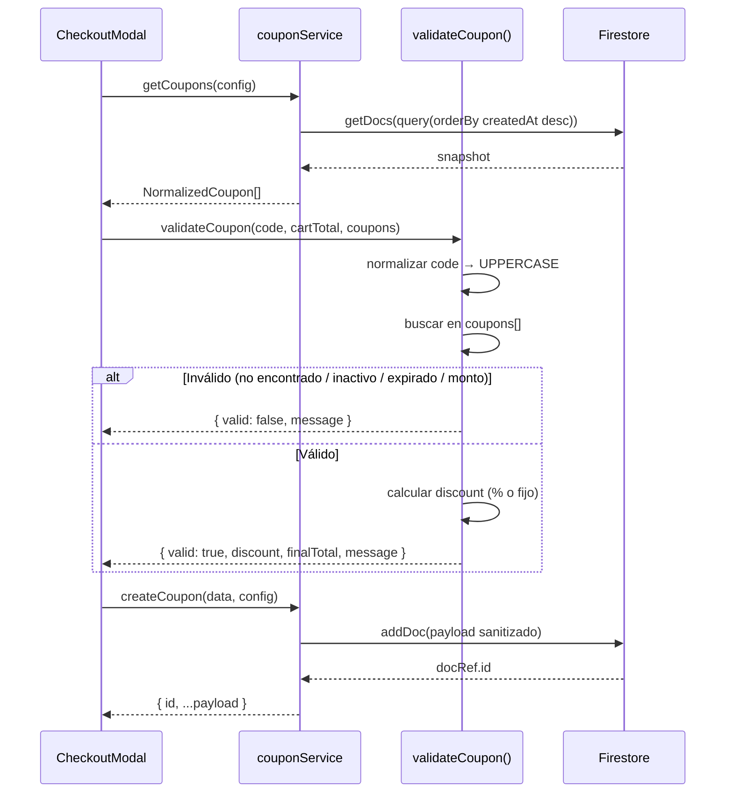

# Motor Dinámico de Cupones (couponService)

## 1. Propósito y Casos de Uso

Servicio de Firestore para la **gestión CRUD completa de cupones de descuento** con normalización bidireccional de esquemas (inglés ↔ español). Expone una API limpia para crear, leer, actualizar y eliminar cupones, garantizando compatibilidad con interfaces administrativas (campos en inglés) y modales de cliente (campos en español) sin duplicar la lógica de mapeo.

Incluye además una **función de validación de cupón** que encapsula la lógica de aplicación: verificar activación, vigencia, monto mínimo y calcular el descuento final (porcentual o fijo).

**Casos de uso actuales:**
- Panel `AdminSettings`: administrar el catálogo de cupones disponibles.
- `CheckoutModal`: validar y aplicar un código de cupón al total del carrito.
- `ClientCouponsModal`: mostrar cupones disponibles al cliente.

**Proyectos futuros:**
- Cualquier e-commerce que necesite descuentos codificados (flash sales, cupones de fidelización).
- Sistemas de referidos donde se generen cupones dinámicamente.
- Apps de marketplace con descuentos por vendedor o categoría.

---

## 2. Especificación Visual y Estilos

Módulo **100% lógico / de servicio**. Sin UI ni tokens CSS. La presentación visual del cupón aplicado la implementa el consumidor (ej. `CheckoutModal`).

---

## 3. Props y API del Componente

### `couponService` — Objeto de servicio

| Método | Parámetros | Retorno | Descripción |
|--------|-----------|---------|-------------|
| `getCoupons(config)` | `config: ServiceConfig` | `Promise<NormalizedCoupon[]>` | Obtiene todos los cupones normalizados, ordenados por fecha de creación desc. |
| `createCoupon(data, config)` | `CouponInput, ServiceConfig` | `Promise<NormalizedCoupon>` | Crea un nuevo cupón. Fuerza `code` a mayúsculas, castea tipos numéricos. |
| `updateCoupon(id, data, config)` | `string, Partial<CouponInput>, ServiceConfig` | `Promise<NormalizedCoupon>` | Actualiza campos de un cupón existente. |
| `deleteCoupon(id, config)` | `string, ServiceConfig` | `Promise<string>` | Elimina un cupón por ID. Retorna el ID eliminado. |

### `validateCoupon(code, cartTotal, coupons)` — Función standalone

| Parámetro | Tipo | Descripción |
|-----------|------|-------------|
| `code` | `string` | Código ingresado por el usuario (se normaliza a MAYÚSCULAS). |
| `cartTotal` | `number` | Total del carrito antes del descuento. |
| `coupons` | `NormalizedCoupon[]` | Lista obtenida de `getCoupons()`. |

**Retorno:**
```js
{
  valid: boolean,
  discount: number,      // monto a descontar (0 si inválido)
  finalTotal: number,    // total después del descuento
  message: string,       // mensaje de éxito o error para mostrar al usuario
  coupon: NormalizedCoupon | null
}
```

### `ServiceConfig`

```js
{
  db,                            // instancia de Firestore
  couponsCollection: 'coupons'   // nombre de la colección (configurable)
}
```

### `NormalizedCoupon` — Esquema normalizado

```js
{
  id: string,
  // Campos en español (UI cliente)
  codigo: string,
  activo: boolean,
  tipoDescuento: 'porcentaje' | 'fijo',
  valorDescuento: number,
  minimoCompra: number,
  fechaExpiracion: string | null,
  // Campos en inglés (UI admin / raw Firestore)
  code: string,
  active: boolean,
  type: 'percentage' | 'fixed',
  value: number,
  minPurchase: number,
  endDate: string,
  startDate: string,
  createdAt: Timestamp
}
```

---

## 4. Código React Completo y 100% Funcional

```js
/**
 * couponService — Motor Dinámico de Cupones
 * ─────────────────────────────────────────────────────────────────────────────
 * Servicio portátil para gestión CRUD de cupones en Firestore con normalización
 * bidireccional de esquemas (inglés ↔ español).
 * ─────────────────────────────────────────────────────────────────────────────
 */
import {
  collection,
  doc,
  addDoc,
  updateDoc,
  deleteDoc,
  getDocs,
  query,
  orderBy,
  serverTimestamp,
} from 'firebase/firestore'

// ── Normalización ─────────────────────────────────────────────────────────────

function normalizeDoc(d) {
  const data = d.data()
  return {
    id: d.id,
    ...data,
    // Campos en español (UI cliente)
    codigo:          data.codigo          ?? data.code          ?? '',
    activo:          data.activo          ?? data.active         ?? false,
    tipoDescuento:   data.tipoDescuento   ?? (data.type === 'percentage' ? 'porcentaje' : 'fijo'),
    valorDescuento:  data.valorDescuento  ?? data.value         ?? 0,
    minimoCompra:    data.minimoCompra    ?? data.minPurchase   ?? 0,
    fechaExpiracion: data.fechaExpiracion ?? data.endDate       ?? null,
    // Campos en inglés (UI admin)
    code:        data.code        ?? data.codigo        ?? '',
    active:      data.active      ?? data.activo        ?? false,
    type:        data.type        ?? (data.tipoDescuento === 'porcentaje' ? 'percentage' : 'fixed'),
    value:       data.value       ?? data.valorDescuento ?? 0,
    minPurchase: data.minPurchase ?? data.minimoCompra  ?? 0,
    endDate:     data.endDate     ?? data.fechaExpiracion ?? '',
    startDate:   data.startDate   ?? '',
  }
}

// ── Servicio CRUD ─────────────────────────────────────────────────────────────

export const couponService = {

  /**
   * Obtiene todos los cupones normalizados ordenados por fecha de creación desc.
   * @param {object} config - { db, couponsCollection }
   * @returns {Promise<NormalizedCoupon[]>}
   */
  async getCoupons(config = {}) {
    const { db, couponsCollection = 'coupons' } = config
    if (!db) throw new Error('[couponService] db es requerido en config.')
    const ref = collection(db, couponsCollection)
    const q = query(ref, orderBy('createdAt', 'desc'))
    const snap = await getDocs(q)
    return snap.docs.map(normalizeDoc)
  },

  /**
   * Crea un nuevo cupón. Fuerza uppercase en code y castea tipos numéricos.
   * @param {object} data  - CouponInput
   * @param {object} config - { db, couponsCollection }
   * @returns {Promise<NormalizedCoupon>}
   */
  async createCoupon(data, config = {}) {
    const { db, couponsCollection = 'coupons' } = config
    if (!db) throw new Error('[couponService] db es requerido en config.')
    const ref = collection(db, couponsCollection)
    const payload = {
      ...data,
      code: (data.code || data.codigo || '').toUpperCase().trim(),
      value: Number(data.value ?? data.valorDescuento ?? 0),
      minPurchase: Number(data.minPurchase ?? data.minimoCompra ?? 0),
      active: data.active ?? data.activo ?? true,
      createdAt: serverTimestamp(),
    }
    const docRef = await addDoc(ref, payload)
    return { id: docRef.id, ...payload }
  },

  /**
   * Actualiza campos de un cupón existente.
   * @param {string} id
   * @param {object} data - campos a actualizar
   * @param {object} config - { db, couponsCollection }
   * @returns {Promise<{id, ...data}>}
   */
  async updateCoupon(id, data, config = {}) {
    const { db, couponsCollection = 'coupons' } = config
    if (!db) throw new Error('[couponService] db es requerido en config.')
    const ref = doc(db, couponsCollection, id)
    const payload = { ...data }
    if (data.code || data.codigo) {
      payload.code = (data.code || data.codigo).toUpperCase().trim()
    }
    if (data.value !== undefined || data.valorDescuento !== undefined) {
      payload.value = Number(data.value ?? data.valorDescuento)
    }
    if (data.minPurchase !== undefined || data.minimoCompra !== undefined) {
      payload.minPurchase = Number(data.minPurchase ?? data.minimoCompra)
    }
    await updateDoc(ref, payload)
    return { id, ...payload }
  },

  /**
   * Elimina un cupón por ID.
   * @param {string} id
   * @param {object} config - { db, couponsCollection }
   * @returns {Promise<string>} id eliminado
   */
  async deleteCoupon(id, config = {}) {
    const { db, couponsCollection = 'coupons' } = config
    if (!db) throw new Error('[couponService] db es requerido en config.')
    const ref = doc(db, couponsCollection, id)
    await deleteDoc(ref)
    return id
  },
}

// ── Validación standalone ─────────────────────────────────────────────────────

/**
 * Valida un código de cupón contra el carrito actual.
 * @param {string} code          - Código ingresado por el usuario
 * @param {number} cartTotal     - Total del carrito antes del descuento
 * @param {NormalizedCoupon[]} coupons - Lista de cupones obtenida de getCoupons()
 * @returns {{ valid, discount, finalTotal, message, coupon }}
 */
export function validateCoupon(code, cartTotal, coupons) {
  if (!code || typeof code !== 'string') {
    return { valid: false, discount: 0, finalTotal: cartTotal, message: 'Ingresa un código de cupón.', coupon: null }
  }

  const normalizedCode = code.toUpperCase().trim()
  const coupon = coupons.find(
    c => (c.code || c.codigo || '').toUpperCase().trim() === normalizedCode
  )

  if (!coupon) {
    return { valid: false, discount: 0, finalTotal: cartTotal, message: 'Cupón no encontrado.', coupon: null }
  }

  if (!(coupon.active ?? coupon.activo)) {
    return { valid: false, discount: 0, finalTotal: cartTotal, message: 'Este cupón no está activo.', coupon: null }
  }

  // Verificar fecha de expiración
  const expDate = coupon.endDate || coupon.fechaExpiracion
  if (expDate) {
    const exp = new Date(expDate)
    exp.setHours(23, 59, 59, 999) // incluir el día completo
    if (exp < new Date()) {
      return { valid: false, discount: 0, finalTotal: cartTotal, message: 'Este cupón ha expirado.', coupon: null }
    }
  }

  // Verificar monto mínimo
  const minimo = coupon.minPurchase ?? coupon.minimoCompra ?? 0
  if (cartTotal < minimo) {
    const formatted = new Intl.NumberFormat('es-CO', { style: 'currency', currency: 'COP', maximumFractionDigits: 0 }).format(minimo)
    return {
      valid: false,
      discount: 0,
      finalTotal: cartTotal,
      message: `Compra mínima requerida: ${formatted}.`,
      coupon: null,
    }
  }

  // Calcular descuento
  const tipo = coupon.type || coupon.tipoDescuento
  const valor = coupon.value ?? coupon.valorDescuento ?? 0
  let discount = 0

  if (tipo === 'percentage' || tipo === 'porcentaje') {
    discount = Math.round((cartTotal * Math.min(valor, 100)) / 100)
  } else {
    // tipo === 'fixed' || 'fijo'
    discount = Math.min(valor, cartTotal) // no puede descontar más que el total
  }

  const finalTotal = Math.max(0, cartTotal - discount)
  const formattedDiscount = new Intl.NumberFormat('es-CO', { style: 'currency', currency: 'COP', maximumFractionDigits: 0 }).format(discount)

  return {
    valid: true,
    discount,
    finalTotal,
    message: `¡Cupón aplicado! Ahorraste ${formattedDiscount}.`,
    coupon,
  }
}
```

> **Mejoras sobre el original:**
> - `config` inyectable: `db` y `couponsCollection` se pasan como parámetro en cada método, eliminando el hardcoding de `db` y `COLLECTIONS`.
> - Validación de `db` requerido en cada método con error descriptivo.
> - `validateCoupon` extraída como función standalone (en el original estaba inline en `CheckoutModal.jsx`), con lógica robusta para: código nulo/vacío, cupón no encontrado, activo/inactivo, fecha de expiración (incluyendo el día completo), monto mínimo con formato de moneda COP, y protección `Math.min(discount, cartTotal)` para que el descuento fijo nunca supere el total.
> - `normalizeDoc` extraída como función privada reutilizable.

---

## 5. Lógica de Estado y Ciclo de Vida

Este módulo es un servicio puro (no un hook). No gestiona estado React directamente. La integración típica con estado es:

```js
// En un custom hook o componente que consume este servicio:
const [coupons, setCoupons] = useState([])
const [couponResult, setCouponResult] = useState(null)

// Al cargar
useEffect(() => {
  couponService.getCoupons(config).then(setCoupons)
}, [])

// Al aplicar cupón
const handleApplyCoupon = (code, cartTotal) => {
  const result = validateCoupon(code, cartTotal, coupons)
  setCouponResult(result)
}
```

**Flujo de `validateCoupon` — jerarquía de checks:**

```
code existe y es string?
  └─ NO → { valid: false, "Ingresa un código" }
  └─ SÍ → normalizar a MAYÚSCULAS
      └─ cupón existe en lista?
          └─ NO → { valid: false, "No encontrado" }
          └─ SÍ → ¿activo?
              └─ NO → { valid: false, "No activo" }
              └─ SÍ → ¿expirado?
                  └─ SÍ → { valid: false, "Expirado" }
                  └─ NO → ¿cumple monto mínimo?
                      └─ NO → { valid: false, "Compra mínima X" }
                      └─ SÍ → calcular descuento (porcentaje|fijo)
                           └─ { valid: true, discount, finalTotal, message }
```

---

## 6. Integración con Servicios Externos

**Firestore — 1 colección:**

| Colección | Operaciones | Descripción |
|-----------|------------|-------------|
| `coupons` (configurable) | `getDocs`, `addDoc`, `updateDoc`, `deleteDoc` | Catálogo de cupones. Se ordena por `createdAt desc`. |

**Parametrización en otro proyecto:**
```js
import { db } from './firebaseConfig'

const couponConfig = {
  db,
  couponsCollection: 'discount_codes', // nombre de tu colección
}

// Uso:
const cupones = await couponService.getCoupons(couponConfig)
await couponService.createCoupon({ code: 'BIENVENIDO20', type: 'percentage', value: 20 }, couponConfig)
```

**Esquema mínimo de documento Firestore recomendado:**
```json
{
  "code": "PROMO10",
  "type": "percentage",
  "value": 10,
  "minPurchase": 50000,
  "active": true,
  "endDate": "2026-12-31",
  "startDate": "2026-01-01",
  "createdAt": "<serverTimestamp>"
}
```

---

## 7. Flujo Operativo y Secuencia de Interacción



---

## 8. Ejemplo de Uso (Importación y Consumo)

```jsx
// Uso en CheckoutModal
import { couponService, validateCoupon } from './services/couponService'
import { db } from './config/firebaseConfig'

const couponConfig = { db, couponsCollection: 'coupons' }

function CheckoutModal({ cartTotal }) {
  const [coupons, setCoupons] = useState([])
  const [couponCode, setCouponCode] = useState('')
  const [couponResult, setCouponResult] = useState(null)

  useEffect(() => {
    couponService.getCoupons(couponConfig).then(setCoupons)
  }, [])

  const handleApply = () => {
    const result = validateCoupon(couponCode, cartTotal, coupons)
    setCouponResult(result)
  }

  const finalTotal = couponResult?.valid ? couponResult.finalTotal : cartTotal

  return (
    <div>
      <input value={couponCode} onChange={e => setCouponCode(e.target.value)} placeholder="Código de cupón" />
      <button onClick={handleApply}>Aplicar</button>
      {couponResult && (
        <p style={{ color: couponResult.valid ? 'green' : 'red' }}>
          {couponResult.message}
        </p>
      )}
      <p>Total: {finalTotal}</p>
    </div>
  )
}

// Uso en AdminSettings — crear cupón
const handleCreate = async (formData) => {
  const newCoupon = await couponService.createCoupon(formData, couponConfig)
  console.log('Creado:', newCoupon.id)
}

// Eliminar cupón
const handleDelete = async (id) => {
  await couponService.deleteCoupon(id, couponConfig)
}
```

---

## 9. Origen

* **Extraído de:** App Ventas — [`couponService.js`](file:///d:/Aplicaciones/App%20Ventas/src/services/couponService.js)
* **Lógica de validación:** inline en [`CheckoutModal.jsx`](file:///d:/Aplicaciones/App%20Ventas/src/components/ClientCatalog/CheckoutModal.jsx)
* **Fecha de extracción:** 2026-05-29
* **Versión:** 1.1 *(refactorizado: config inyectable, `validateCoupon` extraída como función standalone, protecciones de borde: descuento > total, día completo en expiración)*
