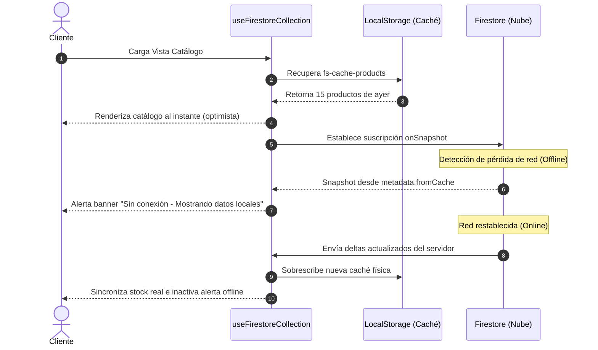

<!--
{
  "technicalName": "Firebase_Sync_Hook",
  "targetPath": "src/services/Firebase_Sync_Hook.js",
  "dependencies": {
    "npm": {},
    "internal": []
  }
}
-->

# Sincronización en Tiempo Real con Firebase (`Firebase_Sync_Hook`)

Este módulo proporciona un Hook React genérico de alto rendimiento (`useFirestoreCollection`) que gestiona suscripciones activas en tiempo real a colecciones de **Firestore** utilizando `onSnapshot`. Está diseñado para aplicaciones de marca blanca con soporte integrado de caché de lectura local offline y prevención de fugas de memoria.

---

## 1. Propósito y Casos de Uso

El módulo abstrae la complejidad de la conexión directa de Firebase en los componentes de interfaz, proporcionando un canal reactivo bidireccional y robusto frente a conexiones inestables.

### Casos de Uso:
* **Catálogos Dinámicos en Tiempo Real:** Actualizaciones instantáneas en el inventario o precios del catálogo de productos sin necesidad de recargar la página.
* **Resiliencia ante Desconexión (Offline Fallback):** Recuperación transparente de datos a través de una caché de respaldo local si el dispositivo móvil del cliente entra en una zona con baja o nula señal de internet.
* **Suscripciones de Ciclo de Vida Limpias:** Limpieza automática de oyentes (`listeners`) al desmontar vistas para evitar fugas de memoria y sobrecargas de lecturas en Firestore.

---

## 2. Especificación Visual e Integración de Arquitectura

Al ser un hook puramente lógico de datos, no expone elementos visuales directamente. Sin embargo, provee una interfaz reactiva estándar para que el componente consumidor renderice de manera uniforme:
* **`data`**: Arreglo reactivo de objetos obtenidos en tiempo real de Firestore.
* **`loading`**: Estado booleano para inyectar cargadores premium (*Skeletons*).
* **`error`**: Error descriptivo en caso de fallos de red o de permisos.
* **`isOffline`**: Bandera booleana que alerta al usuario de forma no intrusiva (mediante toasts o banners) que está interactuando con datos cacheados localmente.

---

## 3. Código React Completo y 100% Funcional

### Custom Hook Reactivo: `useFirestoreCollection.js`
Implementación 100% portable y desacoplada de dependencias rígidas.

```javascript
import { useState, useEffect } from 'react'
import { collection, onSnapshot, query, where, orderBy } from 'firebase/firestore'
import { db } from '../../config/firebaseConfig' // Se adapta según el punto de entrada de la app

/**
 * Hook personalizado para suscribirse a una colección de Firestore en tiempo real.
 * Incorpora detección de red y almacenamiento local temporal (Offline Cache Fallback).
 * 
 * @param {string} collectionName - Nombre de la colección en Firestore
 * @param {object} options - Opciones de filtrado y ordenamiento (opcional)
 * @param {array} options.filters - Filtros [{ field, operator, value }]
 * @param {object} options.sort - Ordenamiento { field, direction: 'asc'|'desc' }
 * @returns {object} { data, loading, error, isOffline }
 */
export default function useFirestoreCollection(collectionName, options = {}) {
  const [data, setData] = useState(() => {
    // Inicialización optimista con la caché local de respaldo si existe
    if (typeof window !== 'undefined') {
      const cached = localStorage.getItem(`fs-cache-${collectionName}`)
      return cached ? JSON.parse(cached) : []
    }
    return []
  })
  
  const [loading, setLoading] = useState(data.length === 0)
  const [error, setError] = useState(null)
  const [isOffline, setIsOffline] = useState(!navigator.onLine)

  useEffect(() => {
    // ─── CONTROL DE CONECTIVIDAD NATIVA ───
    const handleOnline = () => setIsOffline(false)
    const handleOffline = () => setIsOffline(true)

    window.addEventListener('online', handleOnline)
    window.addEventListener('offline', handleOffline)

    // Referencia base de la colección
    const colRef = collection(db, collectionName)
    let q = query(colRef)

    // Inyección dinámica de filtros
    if (options.filters && Array.isArray(options.filters)) {
      options.filters.forEach((f) => {
        if (f.field && f.operator && f.value !== undefined) {
          q = query(q, where(f.field, f.operator, f.value))
        }
      })
    }

    // Inyección de ordenamiento
    if (options.sort && options.sort.field) {
      q = query(q, orderBy(options.sort.field, options.sort.direction || 'asc'))
    }

    // ─── SUSCRIPCIÓN EN TIEMPO REAL ───
    const unsubscribe = onSnapshot(
      q,
      { includeMetadataChanges: true }, // Notifica cambios de metadata local vs servidor
      (snapshot) => {
        const items = []
        snapshot.forEach((doc) => {
          items.push({ id: doc.id, ...doc.data() })
        })

        // Actualiza estado reactivo
        setData(items)
        setLoading(false)
        setError(null)
        
        // Verifica procedencia de los datos (servidor o caché local)
        const fromCache = snapshot.metadata.fromCache
        setIsOffline(fromCache)

        // Respalda en LocalStorage para arranque instantáneo (Shimmer/Optimistic UI)
        if (typeof window !== 'undefined') {
          localStorage.setItem(`fs-cache-${collectionName}`, JSON.stringify(items))
        }
      },
      (err) => {
        console.error(`Error en suscripción Firestore [${collectionName}]:`, err)
        setError(err.message || 'Error al obtener datos en tiempo real.')
        setLoading(false)
      }
    )

    // ─── LIMPIEZA ───
    return () => {
      unsubscribe()
      window.removeEventListener('online', handleOnline)
      window.removeEventListener('offline', handleOffline)
    }
  }, [collectionName, JSON.stringify(options.filters), options.sort?.field, options.sort?.direction])

  return { data, loading, error, isOffline }
}
```

---

## 4. Lógica de Estado y Ciclo de Vida

El hook implementa un flujo optimizado para evitar peticiones redundantes y bloqueos de interfaz:

1. **Arranque Optimista:** El estado `data` se inicializa sincrónicamente consultando la caché de `localStorage`. Esto elimina el "parpadeo en blanco" al recargar, mostrando los últimos datos conocidos de inmediato.
2. **Ciclo en Tiempo Real:** Al establecerse la conexión `onSnapshot`, Firestore sincroniza solo los deltas (registros modificados). 
3. **Control de Metadatos (`fromCache`):** Al activar `includeMetadataChanges: true`, el hook es capaz de discriminar si los datos son definitivos (confirmados por el servidor de Google) o preliminares (guardados en local en cola de subida), levantando reactivamente la bandera `isOffline`.
4. **Cleanup Automático:** Al desmontar el componente (por ejemplo, cambiar de ruta en la PWA), la función de retorno ejecuta `unsubscribe()` garantizando la cancelación del listener en los servidores de Google para no generar lecturas infinitas de cuotas mensuales.

---

## 5. Flujo de Datos e Integración de Firebase

El siguiente diagrama detalla la orquestación y flujo de datos ante fluctuaciones de red del dispositivo móvil:



---

## 6. Origen en la Aplicación

Los componentes de esta especificación se extrajeron y mejoraron a partir de los archivos de origen de la aplicación de producción:
* **Hook de sincronización original:** [`useAppConfigSync.js`](file:///d:/Aplicaciones/App%20Ventas/src/hooks/useAppConfigSync.js) (Líneas 1-30)
* **Suscripción de Servicio original:** [`appConfigService.js`](file:///d:/Aplicaciones/App%20Ventas/src/services/appConfigService.js) (Líneas 110-136)
