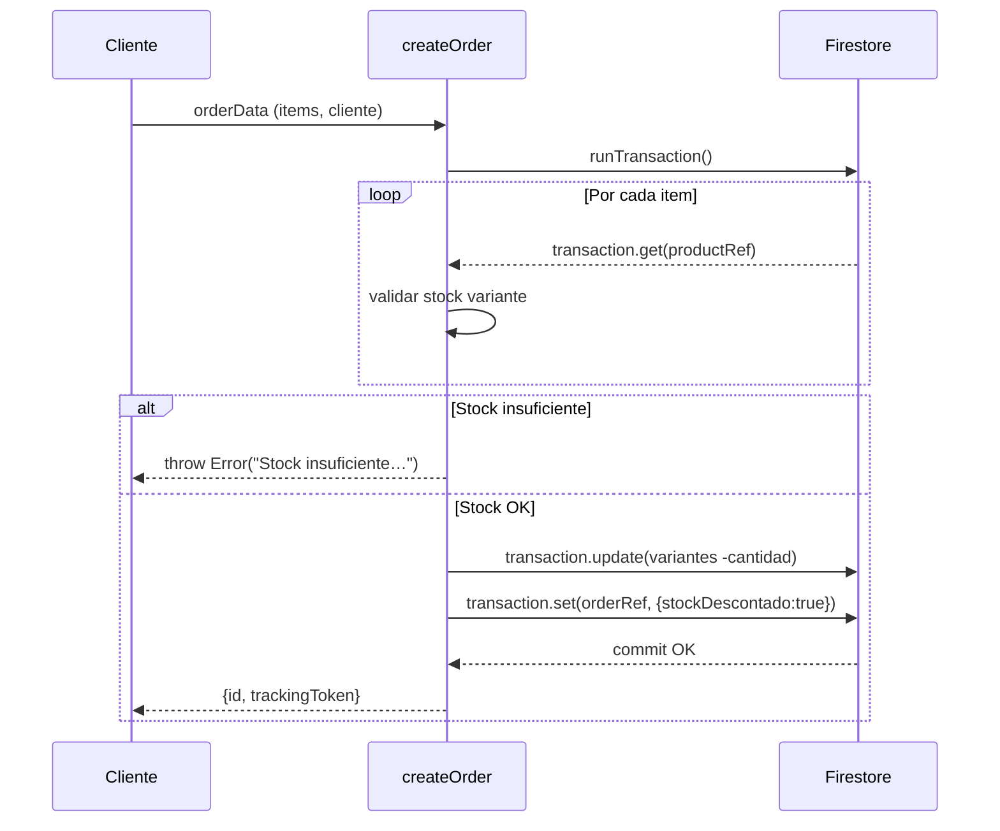
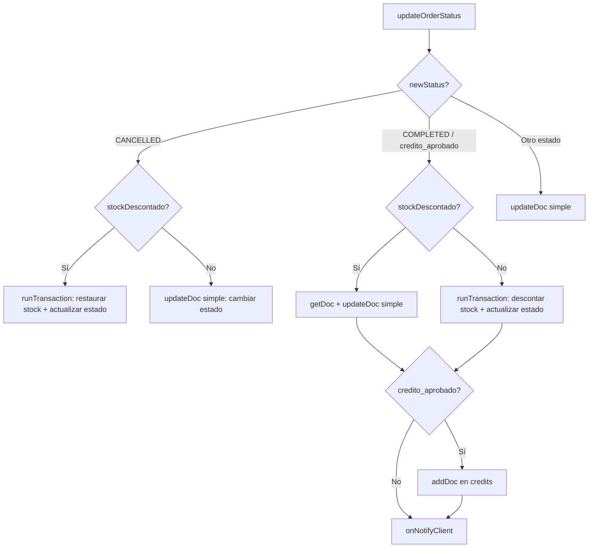

# Sistema de Transacciones Atómicas de Inventario (InventoryTransactionService)

## 1. Propósito y Casos de Uso

Servicio de lógica de negocio crítico que orquesta la **creación, actualización y cancelación de pedidos** garantizando la **consistencia del inventario** mediante transacciones atómicas de Firestore (`runTransaction`). Elimina los *race conditions* inherentes a las operaciones de lectura/escritura separadas en entornos con múltiples usuarios concurrentes.

**Casos de uso actuales:**
- E-commerce con cliente móvil: reserva de stock inmediata al crear un pedido (`createOrder`).
- POS físico administrativo: descuento instantáneo al registrar venta (`createPhysicalOrder`).
- Panel administrativo: restauración de stock al cancelar un pedido (`updateOrderStatus → CANCELLED`).
- Prevención de doble descuento con el flag `stockDescontado: true`.

**Proyectos futuros donde tiene sentido reutilizarlo:**
- Cualquier tienda en línea con inventario finito por variante.
- Sistemas de reservas (mesas, citas, cupos) donde el "stock" es un cupo limitado.
- Apps de marketplace con vendedores múltiples.

---

## 2. Especificación Visual y Estilos

Este módulo es **100% lógico / de servicio**, sin UI. No tiene tokens CSS ni componentes visuales.

---

## 3. Props y API del Componente

| Función | Parámetros | Retorno | Descripción |
|---------|-----------|---------|-------------|
| `createOrder(orderData, config)` | `orderData: OrderData`, `config: ServiceConfig` | `Promise<{id, trackingToken}>` | Crea pedido con reserva atómica de stock. Lanza error descriptivo si hay stock insuficiente. |
| `updateOrderStatus(orderId, newStatus, currentOrder, config)` | `string, string, OrderData, ServiceConfig` | `Promise<void>` | Actualiza estado. Devuelve stock si se cancela, descuenta si se completa (pedidos legacy). |
| `createPhysicalOrder(orderData, adminId, config)` | `OrderData, string, ServiceConfig` | `Promise<{id, orderNumber}>` | Crea pedido POS con descuento inmediato. Soporta crédito aprobado. |
| `subscribeToOrders(onUpdate, config)` | `callback, ServiceConfig` | `Unsubscribe fn` | Suscripción en tiempo real a todos los pedidos (admin). |
| `subscribeToClientOrders(celular, onUpdate, config)` | `string, callback, ServiceConfig` | `Unsubscribe fn` | Suscripción en tiempo real por cliente. |

**ServiceConfig (objeto de configuración inyectable):**
```js
{
  db,                    // instancia de Firestore
  collections: {
    orders: 'orders',    // nombre de la colección de pedidos
    products: 'products',// nombre de la colección de productos
    credits: 'credits'   // nombre de la colección de créditos
  },
  orderStates: {
    PENDING: 'pendiente',
    COMPLETED: 'completado',
    CANCELLED: 'cancelado',
    CREDIT_APPROVED: 'credito_aprobado'
  },
  onNotifyClient: async (order, newStatus) => {} // callback opcional para notificaciones
}
```

---

## 4. Código React Completo y 100% Funcional

```js
/**
 * InventoryTransactionService
 * ─────────────────────────────────────────────────────────────────────────────
 * Servicio portátil de transacciones atómicas de inventario para Firestore.
 * Requiere inyección de instancia `db` y configuración de colecciones.
 * ─────────────────────────────────────────────────────────────────────────────
 */
import {
  collection,
  doc,
  getDocs,
  getDoc,
  addDoc,
  updateDoc,
  query,
  where,
  serverTimestamp,
  orderBy,
  runTransaction,
  onSnapshot,
} from 'firebase/firestore'

// ── Helpers internos ──────────────────────────────────────────────────────────

async function generateTrackingToken(orderId, celular) {
  const cleanCelular = (celular || '').replace(/\D/g, '')
  const data = `${orderId}_${cleanCelular}`
  try {
    const msgBuffer = new TextEncoder().encode(data)
    const hashBuffer = await crypto.subtle.digest('SHA-256', msgBuffer)
    const hashArray = Array.from(new Uint8Array(hashBuffer))
    return hashArray.map(b => b.toString(16).padStart(2, '0')).join('')
  } catch (error) {
    // Fallback no-crypto para entornos sin SubtleCrypto
    let hash = 0
    for (let i = 0; i < data.length; i++) {
      hash = (hash << 5) - hash + data.charCodeAt(i)
      hash |= 0
    }
    return 'fallback_' + Math.abs(hash) + '_' + Date.now()
  }
}

function isCustomItem(item) {
  return item.productId?.startsWith('custom-')
}

async function _readProductsInTransaction(transaction, items, db, productsCol) {
  const cache = {}
  for (const item of items) {
    if (isCustomItem(item)) continue
    if (!cache[item.productId]) {
      const pRef = doc(db, productsCol, item.productId)
      const pDoc = await transaction.get(pRef)
      if (!pDoc.exists()) throw new Error(`Producto no encontrado: ${item.nombre}`)
      cache[item.productId] = { ref: pRef, data: pDoc.data() }
    }
  }
  return cache
}

function _deductStock(items, productsCache, validate = true) {
  const updated = {}
  for (const item of items) {
    if (isCustomItem(item)) continue
    const info = updated[item.productId] || productsCache[item.productId]
    if (!info) continue

    const variantes = [...info.data.variantes]
    const idx = variantes.findIndex(v => v.id === item.variantId)
    if (idx === -1) continue

    const stockActual = variantes[idx].stock
    if (validate && stockActual < item.cantidad) {
      const label = [variantes[idx].talla, variantes[idx].color].filter(Boolean).join(' / ')
      throw new Error(
        `Stock insuficiente para "${item.nombre}${label ? ` (${label})` : ''}". ` +
        `${stockActual > 0 ? `Solo quedan ${stockActual} unidades` : 'Está agotado'}.`
      )
    }
    variantes[idx].stock = Math.max(0, stockActual - item.cantidad)
    updated[item.productId] = { ...info, data: { ...info.data, variantes } }
  }
  return updated
}

function _restoreStock(items, productsCache) {
  const updated = {}
  for (const item of items) {
    if (isCustomItem(item)) continue
    const info = updated[item.productId] || productsCache[item.productId]
    if (!info) continue

    const variantes = [...info.data.variantes]
    const idx = variantes.findIndex(v => v.id === item.variantId)
    if (idx !== -1) {
      variantes[idx].stock += item.cantidad
      updated[item.productId] = { ...info, data: { ...info.data, variantes } }
    }
  }
  return updated
}

function _applyStockUpdates(transaction, updatedProducts) {
  Object.values(updatedProducts).forEach(info => {
    transaction.update(info.ref, {
      variantes: info.data.variantes,
      updatedAt: serverTimestamp(),
    })
  })
}

// ── API Pública ───────────────────────────────────────────────────────────────

/**
 * Crea un pedido online reservando el stock de forma atómica.
 * @param {object} orderData  - Datos del pedido (items, cliente, total, metodoPago…)
 * @param {object} config     - ServiceConfig (ver documentación de props)
 * @returns {Promise<{id: string, trackingToken: string}>}
 */
export async function createOrder(orderData, config) {
  const { db, collections, orderStates } = config
  const orderNumber = `OR-${Math.floor(10000000 + Math.random() * 90000000)}`
  const orderIdRef = doc(collection(db, collections.orders))
  const trackingToken = await generateTrackingToken(orderIdRef.id, orderData.cliente?.celular)

  await runTransaction(db, async (transaction) => {
    const productsCache = await _readProductsInTransaction(
      transaction, orderData.items || [], db, collections.products
    )
    const updatedProducts = _deductStock(orderData.items || [], productsCache, true)
    _applyStockUpdates(transaction, updatedProducts)

    transaction.set(orderIdRef, {
      ...orderData,
      orderNumber,
      estado: orderStates.PENDING,
      stockDescontado: true,
      trackingToken,
      createdAt: serverTimestamp(),
      updatedAt: serverTimestamp(),
    })
  })

  return { id: orderIdRef.id, trackingToken }
}

/**
 * Actualiza el estado de un pedido con lógica de stock según estado destino.
 * @param {string} orderId
 * @param {string} newStatus
 * @param {object} currentOrder
 * @param {object} config - ServiceConfig
 */
export async function updateOrderStatus(orderId, newStatus, currentOrder, config) {
  const { db, collections, orderStates, onNotifyClient } = config
  const orderRef = doc(db, collections.orders, orderId)
  const stockYaDescontado = currentOrder?.stockDescontado === true
  const items = currentOrder?.items || []

  const notify = async () => {
    if (onNotifyClient && currentOrder?.cliente?.celular && currentOrder.cliente.celular !== 'Desconocido') {
      await onNotifyClient(currentOrder, newStatus)
    }
  }

  // ── CANCELAR: devolver stock ────────────────────────────────────────────────
  if (newStatus === orderStates.CANCELLED) {
    if (stockYaDescontado) {
      await runTransaction(db, async (transaction) => {
        const productsCache = {}
        for (const item of items) {
          if (isCustomItem(item)) continue
          if (!productsCache[item.productId]) {
            const pRef = doc(db, collections.products, item.productId)
            const pDoc = await transaction.get(pRef)
            if (pDoc.exists()) productsCache[item.productId] = { ref: pRef, data: pDoc.data() }
          }
        }
        const updated = _restoreStock(items, productsCache)
        _applyStockUpdates(transaction, updated)
        transaction.update(orderRef, { estado: newStatus, updatedAt: serverTimestamp() })
      })
    } else {
      await updateDoc(orderRef, { estado: newStatus, updatedAt: serverTimestamp() })
    }
    await notify()
    return
  }

  // ── COMPLETAR / CRÉDITO APROBADO ────────────────────────────────────────────
  if (newStatus === orderStates.COMPLETED || newStatus === orderStates.CREDIT_APPROVED) {
    let orderData = null

    if (stockYaDescontado) {
      const orderDoc = await getDoc(orderRef)
      if (!orderDoc.exists()) throw new Error('Pedido no encontrado')
      const currentEstado = orderDoc.data().estado
      if (currentEstado === orderStates.COMPLETED || currentEstado === orderStates.CREDIT_APPROVED) {
        throw new Error('El pedido ya había sido procesado.')
      }
      orderData = orderDoc.data()
      await updateDoc(orderRef, { estado: newStatus, updatedAt: serverTimestamp() })
    } else {
      // Pedido legacy sin reserva: descontar ahora
      await runTransaction(db, async (transaction) => {
        const orderDoc = await transaction.get(orderRef)
        if (!orderDoc.exists()) throw new Error('Pedido no encontrado')
        const currentEstado = orderDoc.data().estado
        if (currentEstado === orderStates.COMPLETED || currentEstado === orderStates.CREDIT_APPROVED) {
          throw new Error('El pedido ya había sido procesado.')
        }
        orderData = orderDoc.data()
        const legacyItems = orderDoc.data().items || []
        const pRefs = legacyItems
          .filter(i => i.productId && !isCustomItem(i))
          .map(i => doc(db, collections.products, i.productId))
        const productsCache = {}
        for (const pRef of pRefs) {
          if (!productsCache[pRef.id]) {
            const pDoc = await transaction.get(pRef)
            if (pDoc.exists()) productsCache[pRef.id] = { ref: pRef, data: pDoc.data() }
          }
        }
        const updated = _deductStock(legacyItems, productsCache, false)
        _applyStockUpdates(transaction, updated)
        transaction.update(orderRef, { estado: newStatus, updatedAt: serverTimestamp() })
      })
    }

    // Generar documento de crédito si aplica
    if (newStatus === orderStates.CREDIT_APPROVED && orderData) {
      const creditsRef = collection(db, collections.credits)
      await addDoc(creditsRef, {
        orderId,
        orderNumber: orderData.orderNumber,
        clienteNombre: orderData.cliente?.nombre || 'Desconocido',
        clienteCelular: orderData.cliente?.celular || 'Desconocido',
        montoTotal: orderData.total || 0,
        saldoPendiente: orderData.total || 0,
        abonos: [],
        estado: 'activo',
        createdAt: serverTimestamp(),
        updatedAt: serverTimestamp(),
      })
    }

    await notify()
    return
  }

  // ── Cualquier otro estado (simple update) ──────────────────────────────────
  await updateDoc(orderRef, { estado: newStatus, updatedAt: serverTimestamp() })
  await notify()
}

/**
 * Crea una venta directa POS con descuento inmediato de stock.
 * @param {object} orderData
 * @param {string} adminId
 * @param {object} config - ServiceConfig
 * @returns {Promise<{id: string, orderNumber: string}>}
 */
export async function createPhysicalOrder(orderData, adminId, config) {
  const { db, collections, orderStates } = config
  const orderNumber = `OR-${Math.floor(10000000 + Math.random() * 90000000)}`
  const orderIdRef = doc(collection(db, collections.orders))
  const orderId = orderIdRef.id
  const trackingToken = await generateTrackingToken(orderId, orderData.cliente?.celular)
  const items = orderData.items || []
  const newStatus = orderData.metodoPago === 'credito'
    ? orderStates.CREDIT_APPROVED
    : orderStates.COMPLETED

  await runTransaction(db, async (transaction) => {
    const productsCache = await _readProductsInTransaction(transaction, items, db, collections.products)
    const updatedProducts = _deductStock(items, productsCache, true)
    _applyStockUpdates(transaction, updatedProducts)
    transaction.set(orderIdRef, {
      ...orderData,
      orderNumber,
      estado: newStatus,
      type: 'physical',
      trackingToken,
      createdAt: serverTimestamp(),
      updatedAt: serverTimestamp(),
      createdBy: adminId,
    })
  })

  if (newStatus === orderStates.CREDIT_APPROVED) {
    const creditsRef = collection(db, collections.credits)
    await addDoc(creditsRef, {
      orderId,
      orderNumber,
      clienteNombre: orderData.cliente?.nombre || 'Desconocido',
      clienteCelular: orderData.cliente?.celular || 'Desconocido',
      montoTotal: orderData.total || 0,
      saldoPendiente: orderData.total || 0,
      abonos: [],
      estado: 'activo',
      createdAt: serverTimestamp(),
      updatedAt: serverTimestamp(),
    })
  }

  return { id: orderId, orderNumber }
}

/**
 * Suscripción en tiempo real a todos los pedidos (admin).
 * @param {function} onUpdate - callback(orders[])
 * @param {object} config - ServiceConfig
 * @returns {function} unsubscribe
 */
export function subscribeToOrders(onUpdate, config) {
  const { db, collections } = config
  const ordersRef = collection(db, collections.orders)
  const q = query(ordersRef, orderBy('createdAt', 'desc'))
  return onSnapshot(q, (snap) => {
    onUpdate(snap.docs.map(d => ({ id: d.id, ...d.data() })))
  })
}

/**
 * Suscripción en tiempo real a los pedidos de un cliente.
 * @param {string} celular
 * @param {function} onUpdate - callback(orders[])
 * @param {object} config - ServiceConfig
 * @returns {function} unsubscribe
 */
export function subscribeToClientOrders(celular, onUpdate, config) {
  const { db, collections } = config
  if (!celular) { onUpdate([]); return () => {} }
  const ordersRef = collection(db, collections.orders)
  const q = query(ordersRef, where('cliente.celular', '==', celular))
  return onSnapshot(q, (snap) => {
    const sorted = snap.docs
      .map(d => ({ id: d.id, ...d.data() }))
      .sort((a, b) => (b.createdAt?.toMillis() || 0) - (a.createdAt?.toMillis() || 0))
    onUpdate(sorted)
  })
}
```

---

## 5. Lógica de Estado y Ciclo de Vida

| Fase | Mecanismo | Descripción |
|------|-----------|-------------|
| **Lectura optimista** | `transaction.get()` secuencial | Lee todos los docs de producto dentro de la transacción, garantizando consistencia de versión. |
| **Validación de stock** | `_deductStock(validate=true)` | Aborta la transacción con error descriptivo si cualquier variante tiene stock < cantidad solicitada. |
| **Escritura atómica** | `transaction.update()` + `transaction.set()` | Todas las escrituras se confirman juntas o ninguna. Firestore garantiza linearizabilidad. |
| **Flag anti-duplicado** | `stockDescontado: true` | Previene el doble descuento en pedidos que ya tuvieron reserva al crearse. |
| **Restauración de stock** | `_restoreStock()` | Al cancelar, incrementa las variantes en los montos exactos del pedido. |
| **Crédito automático** | `addDoc(creditsRef, ...)` | Post-transacción genera el documento de deuda cuando el estado final es `credito_aprobado`. |

**Helpers internos clave:**

```
generateTrackingToken() → SHA-256 hash (orderId + celular) con fallback XOR
_readProductsInTransaction() → Lee todos los productos involucrados dentro de la TX
_deductStock(validate) → Descuenta stock; si validate=true lanza error por stock insuficiente
_restoreStock() → Incrementa stock (para cancelaciones)
_applyStockUpdates() → Escribe en Firestore todos los productos modificados
isCustomItem() → Filtra ítems con productId='custom-*' (no gestionan stock)
```

---

## 6. Integración con Servicios Externos

**Firestore — 3 colecciones:**

| Colección | Operación | Descripción |
|-----------|-----------|-------------|
| `orders` (configurable) | `runTransaction → set/update` | Pedidos. Se lee/escribe dentro de la TX. |
| `products` (configurable) | `runTransaction → get/update` | Variantes con stock. Se actualiza atómicamente. |
| `credits` (configurable) | `addDoc` (post-TX) | Documentos de deuda para pagos a crédito. |

**Parametrización en otro proyecto:**
```js
const config = {
  db: yourFirestoreInstance,
  collections: {
    orders: 'pedidos',    // cambia el nombre según tu esquema
    products: 'inventario',
    credits: 'deudas'
  },
  orderStates: {
    PENDING: 'pending',
    COMPLETED: 'completed',
    CANCELLED: 'cancelled',
    CREDIT_APPROVED: 'credit_approved'
  },
  onNotifyClient: async (order, status) => {
    // Tu lógica de notificación
  }
}
```

---

## 7. Flujo Operativo y Secuencia de Interacción





---

## 8. Ejemplo de Uso (Importación y Consumo)

```js
// config/inventoryConfig.js
import { db } from './firebaseConfig'

export const inventoryConfig = {
  db,
  collections: {
    orders: 'orders',
    products: 'products',
    credits: 'credits',
  },
  orderStates: {
    PENDING: 'pendiente',
    COMPLETED: 'completado',
    CANCELLED: 'cancelado',
    CREDIT_APPROVED: 'credito_aprobado',
  },
  onNotifyClient: async (order, newStatus) => {
    console.log(`Notificando a ${order.cliente.celular}: estado → ${newStatus}`)
    // await sendWhatsApp(order.cliente.celular, mensaje)
  },
}

// En tu componente o hook:
import { createOrder, updateOrderStatus } from './services/inventoryTransactionService'
import { inventoryConfig } from './config/inventoryConfig'

// Crear pedido
const handleCheckout = async (cartItems, clienteData) => {
  try {
    const { id, trackingToken } = await createOrder(
      { items: cartItems, cliente: clienteData, total: 150000 },
      inventoryConfig
    )
    console.log('Pedido creado:', id, trackingToken)
  } catch (err) {
    alert(err.message) // "Stock insuficiente para Camiseta (M / Rojo). Solo quedan 1 unidades."
  }
}

// Cancelar pedido (devuelve stock automáticamente)
const handleCancel = async (orderId, order) => {
  await updateOrderStatus(orderId, inventoryConfig.orderStates.CANCELLED, order, inventoryConfig)
}
```

---

## 9. Origen

* **Extraído de:** App Ventas — [`orderService.js`](file:///d:/Aplicaciones/App%20Ventas/src/services/orderService.js)
* **Archivos relacionados:** [`inventoryService.js`](file:///d:/Aplicaciones/App%20Ventas/src/services/inventoryService.js) (CRUD base de productos)
* **Fecha de extracción:** 2026-05-29
* **Versión:** 1.0

> **Nota de refactorización:** La versión portátil reemplazó las importaciones hardcodeadas (`COLLECTIONS`, `ORDER_STATES`, `db`) por un objeto `config` inyectable. Los helpers internos fueron extraídos como funciones privadas reutilizables (`_deductStock`, `_restoreStock`, `_applyStockUpdates`) para eliminar la duplicación de código que existía en el original entre `createOrder`, `updateOrderStatus` y `createPhysicalOrder`.
