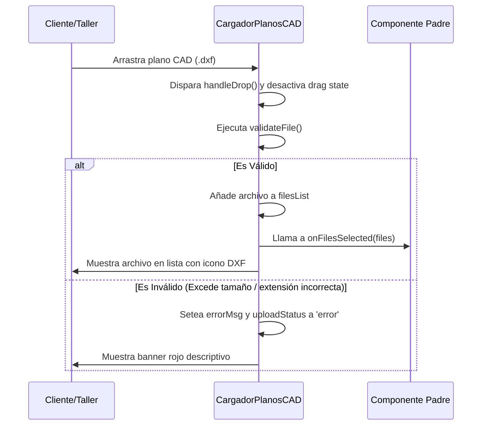

<!--
{
  "resource": "CargadorPlanosCAD",
  "technicalName": "CargadorPlanosCAD",
  "targetPath": "src/components/technical-services/CargadorPlanosCAD.jsx",
  "dependencies": {
    "npm": {
      "lucide-react": "^0.300.0"
    },
    "internal": []
  },
  "niches": ["technical_services"],
  "type": "component"
}
-->

# Cargador de Planos CAD (`CargadorPlanosCAD`)

Este componente proporciona un área interactiva de arrastre y carga (Drag and Drop) especializada para planos y archivos técnicos (DXF, STEP, IGES, PDF) en entornos de mecanizado y tornería.

## 1. Propósito y Casos de Uso
* **Carga de Planos de Cotización:** Permite a los clientes subir sus planos de diseño para cotizar mecanizado de piezas.
* **Taller de Tornería:** Registro de planos y esquemas de trabajo directamente en las órdenes de producción.

## 2. Especificación Visual y Estilos (Tailwind CSS)
* **Borde Animado:** Borde discontinuo de marca HSL (`border-dashed border-[var(--color-primary)]/40`) que resalta al arrastrar archivos.
* **Micro-interacciones:** Escala y elevación suaves en hover (`hover:scale-[1.005] hover:bg-[var(--color-surface-2)]/30 transition-all`).
* **Estados Visuales:** Soporte completo de tema claro y oscuro consumiendo variables HSL del ecosistema.

## 3. Código React Completo

```jsx
import React, { useState, useRef } from 'react';
import { Upload, FileText, CheckCircle, AlertCircle, X, Loader } from 'lucide-react';

export default function CargadorPlanosCAD({
  onFilesSelected = null,
  allowedExtensions = ['.dxf', '.step', '.iges', '.pdf'],
  maxSizeMB = 25
}) {
  const [dragActive, setDragActive] = useState(false);
  const [filesList, setFilesList] = useState([]);
  const [uploadStatus, setUploadStatus] = useState('idle'); // 'idle', 'uploading', 'success', 'error'
  const [errorMsg, setErrorMsg] = useState('');
  const fileInputRef = useRef(null);

  const validateFile = (file) => {
    const extension = '.' + file.name.split('.').pop().toLowerCase();
    if (!allowedExtensions.includes(extension)) {
      return `Tipo de archivo no permitido. Extensiones válidas: ${allowedExtensions.join(', ')}`;
    }
    if (file.size > maxSizeMB * 1024 * 1024) {
      return `El archivo supera el tamaño máximo permitido de ${maxSizeMB} MB.`;
    }
    return null;
  };

  const handleFiles = (newFiles) => {
    const validFiles = [];
    let error = '';

    for (let i = 0; i < newFiles.length; i++) {
      const file = newFiles[i];
      const err = validateFile(file);
      if (err) {
        error = err;
      } else if (!filesList.some(f => f.name === file.name && f.size === file.size)) {
        validFiles.push({
          name: file.name,
          size: (file.size / (1024 * 1024)).toFixed(2) + ' MB',
          rawFile: file
        });
      }
    }

    if (error) {
      setErrorMsg(error);
      setUploadStatus('error');
    } else if (validFiles.length > 0) {
      const updatedList = [...filesList, ...validFiles];
      setFilesList(updatedList);
      setErrorMsg('');
      setUploadStatus('success');
      if (onFilesSelected) {
        onFilesSelected(updatedList.map(f => f.rawFile));
      }
    }
  };

  const handleDrag = (e) => {
    e.preventDefault();
    e.stopPropagation();
    if (e.type === "dragenter" || e.type === "dragover") {
      setDragActive(true);
    } else if (e.type === "dragleave") {
      setDragActive(false);
    }
  };

  const handleDrop = (e) => {
    e.preventDefault();
    e.stopPropagation();
    setDragActive(false);
    if (e.dataTransfer.files && e.dataTransfer.files[0]) {
      handleFiles(e.dataTransfer.files);
    }
  };

  const handleChange = (e) => {
    e.preventDefault();
    if (e.target.files && e.target.files[0]) {
      handleFiles(e.target.files);
    }
  };

  const removeFile = (indexToRemove) => {
    const updatedList = filesList.filter((_, index) => index !== indexToRemove);
    setFilesList(updatedList);
    if (updatedList.length === 0) {
      setUploadStatus('idle');
    }
    if (onFilesSelected) {
      onFilesSelected(updatedList.map(f => f.rawFile));
    }
  };

  return (
    <div className="w-full max-w-xl mx-auto bg-[var(--color-surface)] border border-[var(--color-border)] rounded-2xl p-5 shadow-sm">
      <h3 className="text-sm font-bold text-[var(--color-text)] mb-2 flex items-center gap-2">
        <FileText size={16} className="text-[var(--color-primary)]" />
        <span>Carga de Planos Técnicos</span>
      </h3>
      <p className="text-xs text-[var(--color-text-muted)] mb-4">
        Sube tus planos CAD en formato DXF, STEP, IGES o PDF para cotización inmediata.
      </p>

      {/* Zona de Drop */}
      <div
        onDragEnter={handleDrag}
        onDragOver={handleDrag}
        onDragLeave={handleDrag}
        onDrop={handleDrop}
        onClick={() => fileInputRef.current?.click()}
        className={`w-full py-8 px-4 rounded-xl border-2 border-dashed flex flex-col items-center justify-center cursor-pointer transition-all duration-300 ${
          dragActive 
            ? 'border-[var(--color-primary)] bg-[var(--color-primary)]/5 scale-[1.005]' 
            : 'border-[var(--color-border)] bg-[var(--color-surface-2)]/30 hover:border-[var(--color-primary)]/50 hover:bg-[var(--color-surface-2)]/50'
        }`}
      >
        <input
          ref={fileInputRef}
          type="file"
          multiple
          className="hidden"
          onChange={handleChange}
          accept={allowedExtensions.join(',')}
        />
        <Upload size={32} className={`mb-3 transition-colors ${dragActive ? 'text-[var(--color-primary)]' : 'text-[var(--color-text-muted)]'}`} />
        <span className="text-xs font-bold text-[var(--color-text)] text-center">
          Arrastra tus planos aquí o haz clic para explorar
        </span>
        <span className="text-[10px] text-[var(--color-text-muted)] mt-1">
          Límite de {maxSizeMB} MB por archivo
        </span>
      </div>

      {/* Mensajes de Estado */}
      {uploadStatus === 'error' && errorMsg && (
        <div className="mt-3 p-3 bg-red-500/10 border border-red-500/20 text-red-500 rounded-xl flex items-start gap-2 text-xs">
          <AlertCircle size={14} className="mt-0.5 shrink-0" />
          <span>{errorMsg}</span>
        </div>
      )}

      {/* Lista de archivos */}
      {filesList.length > 0 && (
        <div className="mt-4 border-t border-[var(--color-border)] pt-4">
          <span className="text-[11px] font-bold text-[var(--color-text-muted)] block mb-2">
            Archivos Cargados ({filesList.length})
          </span>
          <div className="space-y-2 max-h-48 overflow-y-auto pr-1">
            {filesList.map((file, index) => (
              <div 
                key={index}
                className="flex items-center justify-between p-2.5 bg-[var(--color-surface-2)]/40 border border-[var(--color-border)] rounded-xl group/file"
              >
                <div className="flex items-center gap-2.5 overflow-hidden">
                  <FileText size={16} className="text-[var(--color-primary)] shrink-0" />
                  <div className="flex flex-col overflow-hidden">
                    <span className="text-xs font-bold text-[var(--color-text)] truncate">
                      {file.name}
                    </span>
                    <span className="text-[9px] text-[var(--color-text-muted)]">
                      {file.size}
                    </span>
                  </div>
                </div>
                <button
                  type="button"
                  onClick={(e) => { e.stopPropagation(); removeFile(index); }}
                  className="w-5 h-5 rounded-md hover:bg-red-500/10 hover:text-red-500 text-[var(--color-text-muted)] flex items-center justify-center transition-colors cursor-pointer"
                >
                  <X size={12} />
                </button>
              </div>
            ))}
          </div>
        </div>
      )}
    </div>
  );
}
```

## 4. Lógica de Estado y Ciclo de Vida
* **Control de Drag & Drop:** Maneja los eventos HTML5 `onDragOver` y `onDrop` para actualizar el estado `dragActive`.
* **Validación en Cliente:** Verifica la extensión y el tamaño del archivo cargado antes de inyectarlo en la lista.

## 5. Flujo Operativo y Secuencia de Interacción


