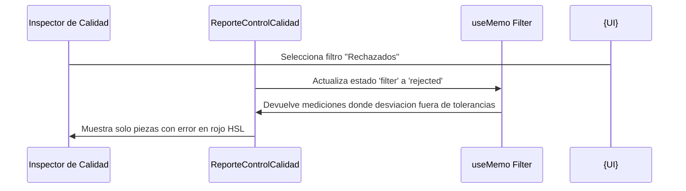

<!--
{
  "resource": "ReporteControlCalidad",
  "technicalName": "ReporteControlCalidad",
  "targetPath": "src/components/technical-services/ReporteControlCalidad.jsx",
  "dependencies": {
    "npm": {
      "lucide-react": "^0.300.0"
    },
    "internal": []
  },
  "niches": ["technical_services"],
  "type": "component"
}
-->

# Reporte de Control de Calidad (`ReporteControlCalidad`)

Este componente proporciona una tabla técnica interactiva de aseguramiento de calidad, contrastando la medida nominal del plano contra la medida real medida en el calibrador/micrómetro por el inspector de calidad.

## 1. Propósito y Casos de Uso
* **Control de Piezas Entregadas:** Visualización transparente del reporte de calibración para el cliente final.
* **Inspección de Taller:** Permite al inspector registrar cotas críticas y verificar si la pieza está dentro o fuera de tolerancia.

## 2. Especificación Visual y Estilos (Tailwind CSS)
* **Tabla Premium Limpia:** Filas con borde sutil (`border-[var(--color-border)]`) y hover interactivo suave.
* **Indicadores HSL Dinámicos:** Banners de estatus ("Aprobado" en verde HSL, "Fuera de Rango" en rojo HSL) con porcentajes de desviación.
* **Visualización de Desviación:** Micro-barra gráfica que muestra dónde cayó la medida real en relación a la tolerancia nominal.

## 3. Código React Completo

```jsx
import React, { useState, useMemo } from 'react';
import { ShieldCheck, ShieldAlert, ArrowUpDown, ChevronDown, CheckCircle, AlertTriangle } from 'lucide-react';

export default function ReporteControlCalidad({
  mediciones = [
    { cota: 'Diámetro Exterior A', nominal: 50.00, medidaReal: 50.015, toleranciaMax: 0.02, toleranciaMin: -0.02 },
    { cota: 'Largo Total L1', nominal: 120.00, medidaReal: 120.08, toleranciaMax: 0.05, toleranciaMin: -0.05 },
    { cota: 'Diámetro Interior B', nominal: 25.00, medidaReal: 24.99, toleranciaMax: 0.01, toleranciaMin: -0.01 },
    { cota: 'Espesor Reborde E1', nominal: 8.00, medidaReal: 8.00, toleranciaMax: 0.03, toleranciaMin: -0.03 }
  ]
}) {
  const [filter, setFilter] = useState('all'); // 'all', 'approved', 'rejected'

  const analyzedMediciones = useMemo(() => {
    return mediciones.map((item, index) => {
      const desviacion = item.medidaReal - item.nominal;
      const isApproved = desviacion <= item.toleranciaMax && desviacion >= item.toleranciaMin;
      
      // Calcular porcentaje de desviación relativo a la tolerancia
      let deviationPercent = 0;
      if (desviacion > 0 && item.toleranciaMax > 0) {
        deviationPercent = (desviacion / item.toleranciaMax) * 100;
      } else if (desviacion < 0 && item.toleranciaMin < 0) {
        deviationPercent = (desviacion / item.toleranciaMin) * 100;
      }

      return {
        ...item,
        id: index,
        desviacion: desviacion.toFixed(3),
        isApproved,
        deviationPercent: Math.min(100, Math.max(-100, deviationPercent)).toFixed(0)
      };
    });
  }, [mediciones]);

  const filteredList = useMemo(() => {
    if (filter === 'approved') return analyzedMediciones.filter(m => m.isApproved);
    if (filter === 'rejected') return analyzedMediciones.filter(m => !m.isApproved);
    return analyzedMediciones;
  }, [analyzedMediciones, filter]);

  const summary = useMemo(() => {
    const total = analyzedMediciones.length;
    const approved = analyzedMediciones.filter(m => m.isApproved).length;
    const rejected = total - approved;
    const rate = total > 0 ? ((approved / total) * 100).toFixed(0) : 0;
    return { total, approved, rejected, rate };
  }, [analyzedMediciones]);

  return (
    <div className="w-full max-w-xl mx-auto bg-[var(--color-surface)] border border-[var(--color-border)] rounded-2xl p-5 shadow-sm">
      <div className="flex justify-between items-center mb-4">
        <div>
          <h3 className="text-sm font-bold text-[var(--color-text)] flex items-center gap-2">
            <ShieldCheck size={16} className="text-[var(--color-primary)]" />
            <span>Control de Calidad (Metrología)</span>
          </h3>
          <p className="text-[10px] text-[var(--color-text-muted)]">Reporte dimensional vs tolerancia de diseño.</p>
        </div>

        {/* Badge de Tasa de Aprobación */}
        <div className={`px-2.5 py-1 rounded-xl text-center flex flex-col justify-center border ${
          summary.rejected > 0 
            ? 'bg-amber-500/10 border-amber-500/20 text-amber-500' 
            : 'bg-green-500/10 border-green-500/20 text-green-500'
        }`}>
          <span className="text-xs font-black leading-none">{summary.rate}%</span>
          <span className="text-[7px] uppercase font-bold tracking-wider mt-0.5">Aprobado</span>
        </div>
      </div>

      {/* Selectores de Filtro */}
      <div className="flex gap-1.5 mb-3">
        <button
          type="button"
          onClick={() => setFilter('all')}
          className={`px-3 py-1.5 rounded-lg text-[10px] font-bold border transition-colors cursor-pointer ${
            filter === 'all'
              ? 'bg-[var(--color-primary)] border-[var(--color-primary)] text-white'
              : 'bg-[var(--color-surface-2)]/30 border-[var(--color-border)] text-[var(--color-text-muted)] hover:bg-[var(--color-surface-2)]/50'
          }`}
        >
          Ver Todo ({summary.total})
        </button>
        <button
          type="button"
          onClick={() => setFilter('approved')}
          className={`px-3 py-1.5 rounded-lg text-[10px] font-bold border transition-colors cursor-pointer ${
            filter === 'approved'
              ? 'bg-green-600 border-green-600 text-white'
              : 'bg-[var(--color-surface-2)]/30 border-[var(--color-border)] text-green-500 hover:bg-green-500/10'
          }`}
        >
          Aprobados ({summary.approved})
        </button>
        <button
          type="button"
          onClick={() => setFilter('rejected')}
          className={`px-3 py-1.5 rounded-lg text-[10px] font-bold border transition-colors cursor-pointer ${
            filter === 'rejected'
              ? 'bg-red-600 border-red-600 text-white'
              : 'bg-[var(--color-surface-2)]/30 border-[var(--color-border)] text-red-500 hover:bg-red-500/10'
          }`}
        >
          Rechazados ({summary.rejected})
        </button>
      </div>

      {/* Tabla de Mediciones */}
      <div className="overflow-x-auto rounded-xl border border-[var(--color-border)] bg-[var(--color-surface-2)]/10">
        <table className="w-full text-left border-collapse">
          <thead>
            <tr className="border-b border-[var(--color-border)] bg-[var(--color-surface-2)]/30 text-[9px] font-extrabold text-[var(--color-text-muted)] uppercase tracking-wider">
              <th className="py-2.5 px-3">Cota Critica</th>
              <th className="py-2.5 px-2 text-center">Nominal</th>
              <th className="py-2.5 px-2 text-center">Real</th>
              <th className="py-2.5 px-2 text-center">Desviación</th>
              <th className="py-2.5 px-3 text-right">Estatus</th>
            </tr>
          </thead>
          <tbody className="divide-y divide-[var(--color-border)]">
            {filteredList.map((item) => (
              <tr key={item.id} className="text-xs hover:bg-[var(--color-surface-2)]/20 transition-colors">
                <td className="py-3 px-3 font-bold text-[var(--color-text)]">
                  {item.cota}
                  <span className="block text-[8px] text-[var(--color-text-muted)] font-mono font-medium">
                    Tolerancia: {item.toleranciaMin > 0 ? '+' : ''}{item.toleranciaMin} / +{item.toleranciaMax} mm
                  </span>
                </td>
                <td className="py-3 px-2 text-center font-mono text-[var(--color-text-muted)]">{item.nominal.toFixed(2)}</td>
                <td className="py-3 px-2 text-center font-mono text-[var(--color-text)] font-semibold">{item.medidaReal.toFixed(3)}</td>
                <td className={`py-3 px-2 text-center font-mono font-semibold ${
                  item.isApproved ? 'text-[var(--color-text-muted)]' : parseFloat(item.desviacion) > 0 ? 'text-amber-500' : 'text-red-500'
                }`}>
                  {parseFloat(item.desviacion) > 0 ? '+' : ''}{item.desviacion}
                </td>
                <td className="py-3 px-3 text-right">
                  <div className="flex items-center justify-end gap-1">
                    {item.isApproved ? (
                      <span className="inline-flex items-center gap-1 px-1.5 py-0.5 rounded-md bg-green-500/10 text-green-500 text-[8px] font-black uppercase">
                        <CheckCircle size={8} /> Apta
                      </span>
                    ) : (
                      <span className="inline-flex items-center gap-1 px-1.5 py-0.5 rounded-md bg-red-500/10 text-red-500 text-[8px] font-black uppercase">
                        <AlertTriangle size={8} /> Fuera
                      </span>
                    )}
                  </div>
                </td>
              </tr>
            ))}
            {filteredList.length === 0 && (
              <tr>
                <td colSpan="5" className="py-8 text-center text-xs text-[var(--color-text-muted)] italic">
                  Ninguna medición coincide con el filtro seleccionado.
                </td>
              </tr>
            )}
          </tbody>
        </table>
      </div>
    </div>
  );
}
```

## 4. Lógica de Estado y Ciclo de Vida
* **Filtros de Aprobación (`useMemo`):** Procesa y clasifica las cotas en base al valor de tolerancia máxima/mínima del objeto de entrada.
* **Control de Filtro Visual:** El estado `filter` gestiona qué subconjunto de mediciones mostrar en la tabla.

## 5. Flujo Operativo y Secuencia de Interacción


