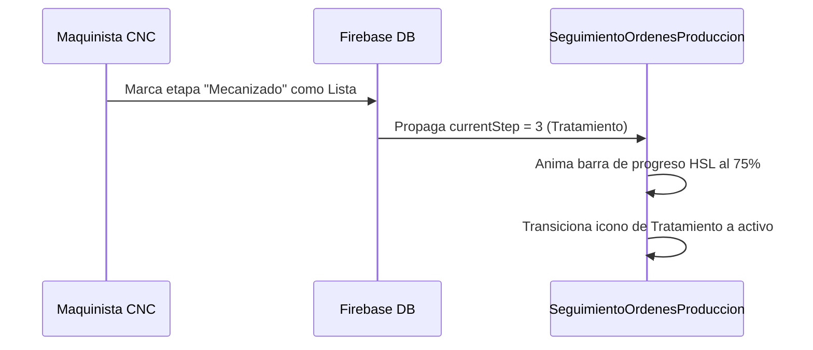

<!--
{
  "resource": "SeguimientoOrdenesProduccion",
  "technicalName": "SeguimientoOrdenesProduccion",
  "targetPath": "src/components/common/SeguimientoOrdenesProduccion.jsx",
  "dependencies": {
    "npm": {
      "lucide-react": "^0.300.0"
    },
    "internal": []
  },
  "niches": ["technical_services"],
  "type": "component"
}
-->

# Seguimiento de Ordenes de Producción (`SeguimientoOrdenesProduccion`)

Este componente proporciona un stepper visual e interactivo para visualizar el avance físico de una pieza mecanizada en las distintas estaciones de trabajo del taller.

## 1. Propósito y Casos de Uso
* **Seguimiento del Cliente:** Muestra a los clientes en qué etapa de fabricación (Aprovisionamiento, Fresado, Acabado) se encuentra su orden.
* **Control de Planta:** Permite a los maquinistas reportar el progreso físico de la orden en el panel de control.

## 2. Especificación Visual y Estilos (Tailwind CSS)
* **Línea de Conexión Dinámica:** Línea de fondo HSL que cambia de color y progresión (`w-full bg-[var(--color-primary)]`) según la etapa activa.
* **Etapas Animadas:** Círculos con transiciones elásticas (`transition-all duration-500 scale-100`) y micro-iconos explicativos.
* **Responsive Layout:** Se adapta a horizontal en escritorio y vertical en dispositivos móviles para optimizar legibilidad.

## 3. Código React Completo

```jsx
import React from 'react';
import { FileCheck, ShoppingBag, Cpu, Sparkles, ShieldCheck } from 'lucide-react';

export default function SeguimientoOrdenesProduccion({
  currentStep = 2,
  steps = [
    { label: 'Plano Aprobado', desc: 'Diseño CAD revisado y apto', icon: FileCheck },
    { label: 'Aprovisionamiento', desc: 'Materia prima cortada y lista', icon: ShoppingBag },
    { label: 'Mecanizado', desc: 'Torno, Fresadora o CNC activo', icon: Cpu },
    { label: 'Tratamiento', desc: 'Pavonado, cincado o temple', icon: Sparkles },
    { label: 'Control Calidad', desc: 'Aprobación final metrología', icon: ShieldCheck }
  ]
}) {
  return (
    <div className="w-full max-w-2xl mx-auto bg-[var(--color-surface)] border border-[var(--color-border)] rounded-2xl p-6 shadow-sm">
      <div className="mb-4">
        <h3 className="text-sm font-bold text-[var(--color-text)]">Progreso de Fabricación</h3>
        <p className="text-[10px] text-[var(--color-text-muted)]">Ruta y estado en tiempo real de tu orden en taller.</p>
      </div>

      {/* Grid del Stepper */}
      <div className="relative z-0 isolate flex flex-col md:flex-row justify-between items-start md:items-center gap-6 md:gap-4 py-3">
        {/* Barra de progreso de fondo (Desktop) */}
        <div className="absolute left-6 right-6 top-[28px] h-0.5 bg-[var(--color-border)] hidden md:block z-[-10]">
          <div 
            className="h-full bg-[var(--color-primary)] transition-all duration-500"
            style={{ width: `${(currentStep / (steps.length - 1)) * 100}%` }}
          />
        </div>

        {/* Barra de progreso de fondo (Móvil) */}
        <div className="absolute left-6 top-8 bottom-8 w-0.5 bg-[var(--color-border)] md:hidden z-[-10]">
          <div 
            className="w-full bg-[var(--color-primary)] transition-all duration-500"
            style={{ height: `${(currentStep / (steps.length - 1)) * 100}%` }}
          />
        </div>

        {steps.map((step, index) => {
          const StepIcon = step.icon;
          const isCompleted = index < currentStep;
          const isActive = index === currentStep;
          const isPending = index > currentStep;

          return (
            <div 
              key={index} 
              className="flex md:flex-col items-center md:text-center gap-4 md:gap-2 z-10 w-full md:w-1/5 relative"
            >
              {/* Círculo del hito */}
              <div 
                className={`w-10 h-10 rounded-xl flex items-center justify-center border-2 transition-all duration-500 shrink-0 relative z-10 ${
                  isCompleted 
                    ? 'bg-[var(--color-primary)] border-[var(--color-primary)] text-[var(--color-text)] shadow-sm'
                    : isActive 
                      ? 'bg-[var(--color-surface)] border-[var(--color-primary)] text-[var(--color-primary)] scale-105 shadow-sm'
                      : 'bg-[var(--color-surface)] border-[var(--color-border)] text-[var(--color-text-muted)]'
                }`}
              >
                <StepIcon size={16} />
              </div>

              {/* Textos del paso */}
              <div className="flex flex-col md:items-center">
                <span className={`text-[11px] font-extrabold ${
                  isActive ? 'text-[var(--color-primary)]' : 'text-[var(--color-text)]'
                }`}>
                  {step.label}
                </span>
                <span className="text-[9px] text-[var(--color-text-muted)] leading-tight mt-0.5 block md:max-w-[110px]">
                  {step.desc}
                </span>
              </div>
            </div>
          );
        })}
      </div>
    </div>
  );
}
```

## 4. Lógica de Estado y Ciclo de Vida
* **Layout Adaptativo en runtime:** Ajusta de forma responsiva el stepper adaptando la barra de progreso a vertical en pantallas móviles (`md:hidden` / `md:block`) y horizontal en escritorio.
* **Componente Stateless:** Recibe el estado actual desde las props, garantizando compatibilidad con Stores globales.

## 5. Flujo Operativo y Secuencia de Interacción


