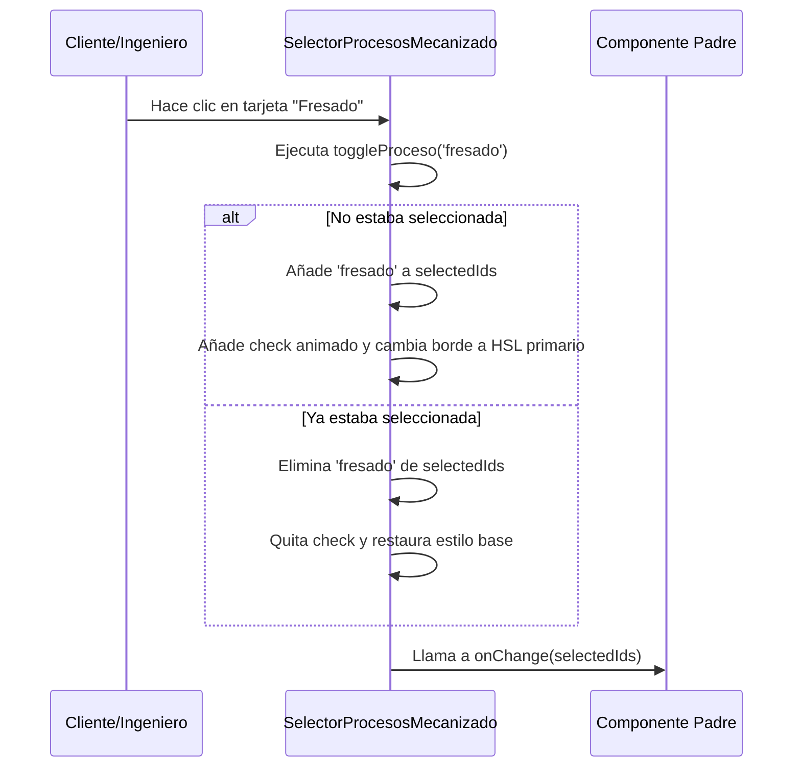

<!--
{
  "resource": "SelectorProcesosMecanizado",
  "technicalName": "SelectorProcesosMecanizado",
  "targetPath": "src/components/common/SelectorProcesosMecanizado.jsx",
  "dependencies": {
    "npm": {
      "lucide-react": "^0.300.0"
    },
    "internal": []
  },
  "niches": ["technical_services"],
  "type": "component"
}
-->

# Selector de Procesos de Mecanizado (`SelectorProcesosMecanizado`)

Este componente proporciona un selector interactivo en cuadrícula (Grid) para indicar qué operaciones y procesos físicos de mecanizado (torneado, fresado, rectificado, etc.) se requieren para fabricar la pieza.

## 1. Propósito y Casos de Uso
* **Configurador de Pedidos:** Para que los clientes detallen las operaciones que requiere su plano.
* **Hoja de Ruta de Producción:** Permite a los jefes de taller marcar la ruta de la pieza por las máquinas.

## 2. Especificación Visual y Estilos (Tailwind CSS)
* **Rejilla Adaptativa:** Grid responsivo de tarjetas interactivas (`grid grid-cols-2 gap-3`).
* **Estados Activos/Hover:** Cada tarjeta reacciona con una traslación suave (`hover:-translate-y-1 hover:shadow-md transition-all duration-300`).
* **Check de Confirmación:** Un check animado y borde de marca HSL (`border-[var(--color-primary)]`) indican la selección del proceso.

## 3. Código React Completo

```jsx
import React, { useState } from 'react';
import { Cpu, Scissors, Wrench, Layers, Compass, CheckCircle2 } from 'lucide-react';

export default function SelectorProcesosMecanizado({
  selectedProcesos = [],
  onChange = null,
  procesos = [
    { id: 'torneado', name: 'Torneado', desc: 'Mecanizado de piezas cilíndricas en torno', icon: Compass },
    { id: 'fresado', name: 'Fresado / CNC', desc: 'Corte tridimensional con fresas de carburo', icon: Cpu },
    { id: 'rectificado', name: 'Rectificado', desc: 'Acabado de alta precisión en plano o cilindros', icon: Wrench },
    { id: 'electroerosion', name: 'Electroerosión', desc: 'Corte por hilo de metal de alta dureza', icon: Scissors },
    { id: 'soldadura', name: 'Soldadura / Ensamble', desc: 'Unión de piezas y estructuras metálicas', icon: Layers }
  ]
}) {
  const [selectedIds, setSelectedIds] = useState(selectedProcesos);

  const toggleProceso = (id) => {
    const isSelected = selectedIds.includes(id);
    let updatedList = [];
    if (isSelected) {
      updatedList = selectedIds.filter(item => item !== id);
    } else {
      updatedList = [...selectedIds, id];
    }
    setSelectedIds(updatedList);
    if (onChange) {
      onChange(updatedList);
    }
  };

  return (
    <div className="w-full max-w-xl mx-auto bg-[var(--color-surface)] border border-[var(--color-border)] rounded-2xl p-5 shadow-sm">
      <h3 className="text-sm font-bold text-[var(--color-text)] mb-1.5">
        Procesos de Fabricación
      </h3>
      <p className="text-xs text-[var(--color-text-muted)] mb-4">
        Selecciona uno o más procesos necesarios para mecanizar la pieza de acuerdo a tu plano técnico.
      </p>

      <div className="grid grid-cols-1 sm:grid-cols-2 gap-3">
        {procesos.map((proceso) => {
          const Icon = proceso.icon;
          const isSelected = selectedIds.includes(proceso.id);
          
          return (
            <div
              key={proceso.id}
              onClick={() => toggleProceso(proceso.id)}
              className={`p-4 rounded-xl border-2 transition-all duration-300 relative cursor-pointer group flex flex-col justify-between h-32 select-none ${
                isSelected
                  ? 'border-[var(--color-primary)] bg-[var(--color-primary)]/5 shadow-sm'
                  : 'border-[var(--color-border)] bg-[var(--color-surface-2)]/30 hover:border-[var(--color-primary)]/40 hover:-translate-y-1 hover:shadow-md'
              }`}
            >
              <div className="flex justify-between items-start">
                <div className={`p-2 rounded-lg transition-colors ${
                  isSelected 
                    ? 'bg-[var(--color-primary)] text-[var(--color-text)]' 
                    : 'bg-[var(--color-surface)] text-[var(--color-text-muted)] group-hover:text-[var(--color-primary)]'
                }`}>
                  <Icon size={18} />
                </div>
                {isSelected && (
                  <CheckCircle2 size={16} className="text-[var(--color-primary)] animate-scale" />
                )}
              </div>

              <div>
                <span className="text-xs font-bold text-[var(--color-text)] block mb-0.5">
                  {proceso.name}
                </span>
                <span className="text-[10px] text-[var(--color-text-muted)] line-clamp-2 leading-tight">
                  {proceso.desc}
                </span>
              </div>
            </div>
          );
        })}
      </div>
    </div>
  );
}
```

## 4. Lógica de Estado y Ciclo de Vida
* **Control de Lista Multiselección:** Gestiona un array de IDs seleccionados en el estado local `selectedIds` y lo propaga mediante la propiedad callback `onChange`.
* **Micro-interacciones Reactivas:** Aplica clases dinámicas en base a la existencia de la ID en la lista seleccionada.

## 5. Flujo Operativo y Secuencia de Interacción


