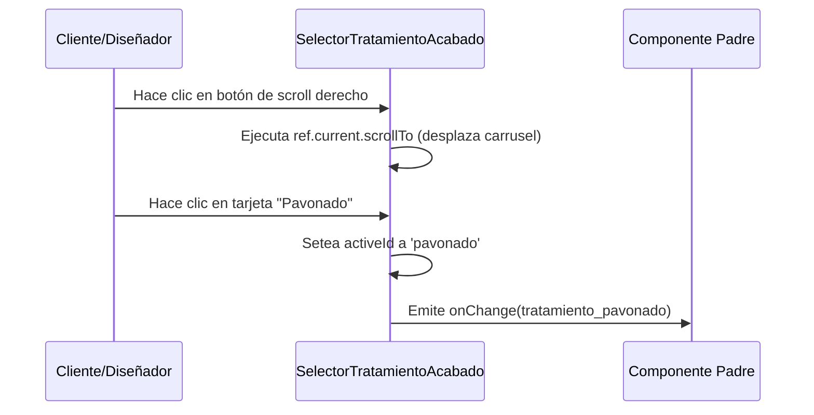

<!--
{
  "resource": "SelectorTratamientoAcabado",
  "technicalName": "SelectorTratamientoAcabado",
  "targetPath": "src/components/technical-services/SelectorTratamientoAcabado.jsx",
  "dependencies": {
    "npm": {
      "lucide-react": "^0.300.0"
    },
    "internal": []
  },
  "niches": ["technical_services"],
  "type": "component"
}
-->

# Selector de Tratamiento y Acabado (`SelectorTratamientoAcabado`)

Este componente proporciona un selector horizontal interactivo para elegir recubrimientos superficiales y tratamientos térmicos aplicados a las piezas mecanizadas.

## 1. Propósito y Casos de Uso
* **Acabados Estéticos y de Protección:** Selección de pavonado, cincado o pintura electrostática para proteger el metal de la corrosión.
* **Propiedades Mecánicas (Tratamiento Térmico):** Selección de templado, revenido o nitrurado para endurecer el acero.

## 2. Especificación Visual y Estilos (Tailwind CSS)
* **Carrusel Horizontal de Tarjetas:** Desplazamiento horizontal con snap-alignment (`overflow-x-auto snap-x scrollbar-none`).
* **Padding Anti-Clipping (Crítico):** Se implementa obligatoriamente **`py-4`** en el contenedor del carrusel para amortiguar el escalado hover (`hover:-translate-y-1 hover:scale-[1.02]`) y las sombras de elevación (`shadow-md`), evitando recortes en los bordes del scroll.
* **Borde Activo:** Resaltado mediante borde de color de marca HSL (`border-[var(--color-primary)]`).

## 3. Código React Completo

```jsx
import React, { useState, useRef } from 'react';
import { Flame, ShieldAlert, Sparkles, ChevronLeft, ChevronRight } from 'lucide-react';

export default function SelectorTratamientoAcabado({
  selectedTratamiento = null,
  onChange = null,
  treatments = [
    { id: 'ninguno', name: 'Mecanizado Bruto', type: 'base', desc: 'Sin acabado superficial (acero/aluminio al natural)', icon: Flame },
    { id: 'pavonado', name: 'Pavonado Negro', type: 'quimico', desc: 'Recubrimiento de óxido negro anticorrosivo', icon: Sparkles },
    { id: 'cincado', name: 'Cincado / Cromo', type: 'electrolitico', desc: 'Capa protectora de zinc brillante', icon: Sparkles },
    { id: 'templado', name: 'Temple y Revenido', type: 'termico', desc: 'Tratamiento térmico para aumentar la dureza', icon: Flame },
    { id: 'nitrurado', name: 'Nitrurado Gaseoso', type: 'termico', desc: 'Endurecimiento superficial antidesgaste', icon: Flame },
    { id: 'pintura_pvd', name: 'Pintura Electrostática', type: 'acabado', desc: 'Capa de pintura en polvo horneada premium', icon: Sparkles }
  ]
}) {
  const [activeId, setActiveId] = useState(selectedTratamiento || 'ninguno');
  const scrollRef = useRef(null);

  const selectTreatment = (id) => {
    setActiveId(id);
    if (onChange) {
      const selected = treatments.find(t => t.id === id);
      onChange(selected);
    }
  };

  const scroll = (direction) => {
    if (scrollRef.current) {
      const { scrollLeft, clientWidth } = scrollRef.current;
      const scrollAmount = clientWidth * 0.7;
      scrollRef.current.scrollTo({
        left: direction === 'left' ? scrollLeft - scrollAmount : scrollLeft + scrollAmount,
        behavior: 'smooth'
      });
    }
  };

  return (
    <div className="w-full max-w-xl mx-auto bg-[var(--color-surface)] border border-[var(--color-border)] rounded-2xl p-5 shadow-sm relative group">
      <div className="flex justify-between items-center mb-1 px-1">
        <div>
          <h3 className="text-sm font-bold text-[var(--color-text)]">Tratamiento y Acabado</h3>
          <p className="text-[10px] text-[var(--color-text-muted)]">Opciones de recubrimiento y dureza del material.</p>
        </div>
        
        {/* Controles de Navegación del Carrusel */}
        <div className="flex gap-1">
          <button
            type="button"
            onClick={() => scroll('left')}
            className="w-6 h-6 rounded-lg border border-[var(--color-border)] bg-[var(--color-surface-2)]/50 text-[var(--color-text-muted)] flex items-center justify-center hover:bg-[var(--color-primary)] hover:text-white transition-all duration-300 cursor-pointer shadow-sm"
          >
            <ChevronLeft size={14} />
          </button>
          <button
            type="button"
            onClick={() => scroll('right')}
            className="w-6 h-6 rounded-lg border border-[var(--color-border)] bg-[var(--color-surface-2)]/50 text-[var(--color-text-muted)] flex items-center justify-center hover:bg-[var(--color-primary)] hover:text-white transition-all duration-300 cursor-pointer shadow-sm"
          >
            <ChevronRight size={14} />
          </button>
        </div>
      </div>

      {/* Contenedor del Carrusel (Con py-4 para prevenir clipping) */}
      <div
        ref={scrollRef}
        className="flex gap-3 overflow-x-auto scroll-smooth snap-x snap-mandatory scrollbar-none py-4 px-1"
        style={{ scrollbarWidth: 'none', msOverflowStyle: 'none' }}
      >
        {treatments.map((treatment) => {
          const Icon = treatment.icon;
          const isSelected = activeId === treatment.id;

          return (
            <div
              key={treatment.id}
              onClick={() => selectTreatment(treatment.id)}
              className={`w-40 shrink-0 snap-start p-4 rounded-xl border-2 flex flex-col justify-between h-36 select-none transition-all duration-300 ${
                isSelected
                  ? 'border-[var(--color-primary)] bg-[var(--color-primary)]/5 shadow-sm scale-[1.01]'
                  : 'border-[var(--color-border)] bg-[var(--color-surface-2)]/30 hover:border-[var(--color-primary)]/30 hover:-translate-y-1 hover:scale-[1.01] hover:shadow-md'
              }`}
            >
              <div className="flex justify-between items-start">
                <div className={`p-1.5 rounded-lg ${
                  isSelected ? 'bg-[var(--color-primary)] text-white' : 'bg-[var(--color-surface)] text-[var(--color-text-muted)]'
                }`}>
                  <Icon size={14} />
                </div>
                <span className={`text-[8px] uppercase tracking-wider font-extrabold px-1.5 py-0.5 rounded-md ${
                  treatment.type === 'termico' 
                    ? 'bg-amber-500/10 text-amber-500' 
                    : treatment.type === 'base'
                      ? 'bg-slate-500/10 text-slate-500'
                      : 'bg-indigo-500/10 text-indigo-500'
                }`}>
                  {treatment.type}
                </span>
              </div>

              <div>
                <span className="text-[11px] font-extrabold text-[var(--color-text)] block mb-0.5 truncate">
                  {treatment.name}
                </span>
                <span className="text-[9px] text-[var(--color-text-muted)] line-clamp-2 leading-tight">
                  {treatment.desc}
                </span>
              </div>
            </div>
          );
        })}
      </div>
    </div>
  );
}
```

## 4. Lógica de Estado y Ciclo de Vida
* **Desplazamiento por Ref (`useRef`):** Usa `scrollRef` para realizar desplazamientos interactivos fluidos al hacer clic en los botones laterales.
* **Control de Selección:** Mantiene el estado activo en la variable `activeId` y lo transmite mediante el callback `onChange`.

## 5. Flujo Operativo y Secuencia de Interacción


