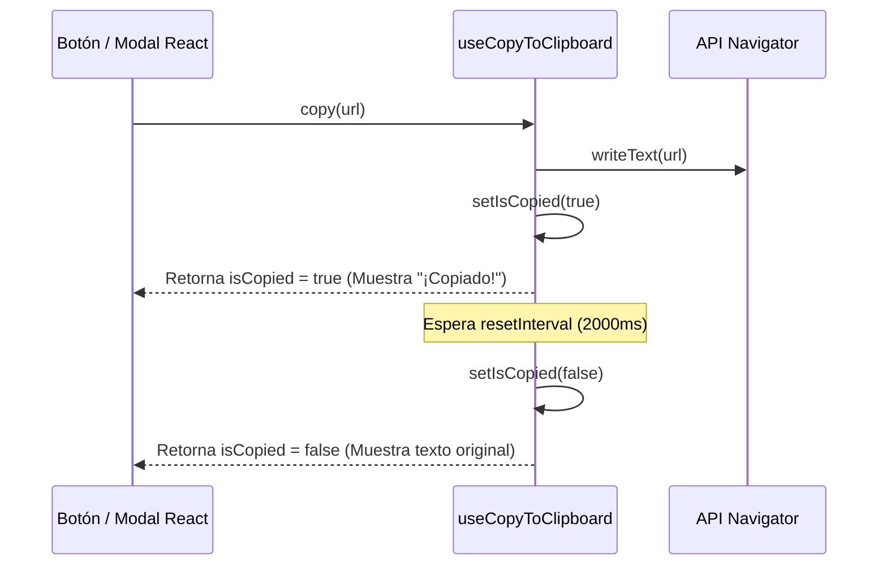

<!--
{
  "technicalName": "useCopyToClipboard",
  "targetPath": "src/utils/useCopyToClipboard.js",
  "dependencies": {
    "npm": {},
    "internal": []
  }
}
-->

# Hook de Copiado al Portapapeles (useCopyToClipboard)

Custom hook de React diseñado para encapsular la lógica del portapapeles (`navigator.clipboard.writeText`) y proveer un estado temporal de éxito para feedback visual del usuario que se restablece de forma automática.

---

## 1. Propósito y Casos de Uso
* **Feedback Temporal:** Evita la gestión duplicada de estados locales (`copied`, `setCopied`) y temporizadores en vistas individuales.
* **Consistencia visual:** Garantiza que todos los componentes muestren el estado "¡Copiado!" por un intervalo de tiempo homogéneo (por defecto 2 segundos).
* **Casos de Uso:**
  * Copiar el enlace de seguimiento del pedido desde el modal de checkout.
  * Copiar códigos promocionales y ofertas flash desde el modal de cupones.

---

## 2. Especificación Operativa (Lógica de React)
El hook expone un estado reactivo simple y una función de disparo que puede invocarse en cualquier evento `onClick`.

---

## 3. Código React Completo y 100% Funcional

```javascript
import { useState, useCallback, useEffect } from 'react'

/**
 * Hook personalizado para copiar texto al portapapeles con reset automático de estado.
 * @param {number} resetInterval - Tiempo en milisegundos para restablecer el estado "copiado".
 * @returns {[boolean, function, any]} [isCopied, copy, copiedValue]
 */
export default function useCopyToClipboard(resetInterval = 2000) {
  const [copiedValue, setCopiedValue] = useState(null)
  const [isCopied, setIsCopied] = useState(false)

  const copy = useCallback((value) => {
    if (typeof value === 'string' || typeof value === 'number') {
      navigator.clipboard.writeText(value.toString())
      setCopiedValue(value)
      setIsCopied(true)
    } else {
      console.warn(`Cannot copy ${typeof value} to clipboard.`)
    }
  }, [])

  useEffect(() => {
    let timeoutId
    if (isCopied) {
      timeoutId = setTimeout(() => {
        setIsCopied(false)
        setCopiedValue(null)
      }, resetInterval)
    }
    return () => {
      if (timeoutId) clearTimeout(timeoutId)
    }
  }, [isCopied, resetInterval])

  return [isCopied, copy, copiedValue]
}
```

---

## 4. Lógica de Estado y Ciclo de Vida
* **Desmontaje Seguro:** El hook incluye una limpieza del temporizador en el hook `useEffect` (`clearTimeout`) que se activa automáticamente si el componente se desmonta antes de que expire el intervalo, previniendo fugas de memoria (memory leaks).

---

## 5. Flujo Operativo y Secuencia de Interacción


