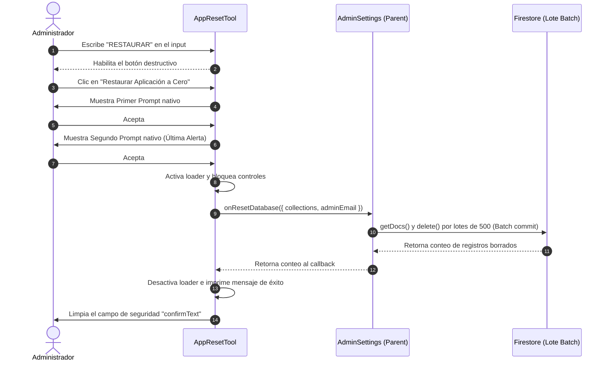

<!--
{
  "technicalName": "AppResetTool",
  "targetPath": "src/utils/AppResetTool.js",
  "dependencies": {
    "npm": {},
    "internal": []
  },
  "type": "service",
  "niches": []
}
-->

# Restaurador de Aplicación a Fábrica (AppResetTool)

## 1. Propósito y Casos de Uso

El componente `AppResetTool` es una utilidad administrativa crítica de marca blanca diseñada para limpiar la base de datos de negocio a cero. Es una pieza fundamental al finalizar el ciclo de desarrollo de una aplicación o antes de entregar una instancia a un cliente nuevo en un modelo Ecosistema.

### Casos de Uso principales:
1. **Puesta a Punto antes de Producción:** Permite borrar de forma masiva todos los registros de prueba (pedidos ficticios, clientes de prueba, créditos demo) generados durante la etapa de QA.
2. **Entrega Limpia a Nuevos Clientes (Ecosistema):** Wipéa instantáneamente la base de datos para dejar la aplicación lista para su uso inicial, conservando únicamente las cuentas administrativas configuradas.
3. **Control de Lotes Masivos (`Batch Deletion`):** Evita desbordamientos y errores de cuota de escritura en la base de datos dividiendo las transacciones en lotes de hasta 500 registros atómicos simultáneos.
4. **Seguridad Multi-factor:** Previene accidentes catastróficos requiriendo una confirmación explícita mediante teclado (`RESTAURAR`) además de un doble prompt nativo del sistema.

---

## 2. Especificación Visual y Estilos (Tailwind CSS)

Al tratarse de una funcionalidad destructiva de alta peligrosidad, la interfaz visual emite señales de advertencia claras:
* **Colores de Alerta:** Bordes y fondos con gradientes rojos translúcidos (`border-red-500/20 bg-red-500/5`).
* **Iconografía de Peligro:** Iconos de basurero e indicaciones de advertencia angulares (`AlertTriangle`) de color rojo intenso para denotar urgencia.
* **Control de Confirmación Expreso:** Caja de texto con tipografía de espaciado ancho (`tracking-wider font-bold`) que bloquea el botón ejecutor a menos que coincida exactamente con la frase de seguridad.
* **Loader de Proceso:** Indicador de carga circular continuo para evitar clicks repetidos durante el proceso de borrado.

---

## 3. Código React Completo y 100% Funcional

El componente está diseñado de manera **agnóstica y desacoplada** de servicios de datos específicos. El componente expone la lista de colecciones y propaga la orden de ejecución mediante callbacks reactivos, permitiendo que la lógica del lote destructivo corra en el padre.

```jsx
import React, { useState } from 'react';

/**
 * Iconos SVG Inline para evitar dependencias
 */
const AlertIcon = () => (
  <svg xmlns="http://www.w3.org/2000/svg" width="20" height="20" viewBox="0 0 24 24" fill="none" stroke="currentColor" strokeWidth="2" strokeLinecap="round" strokeLinejoin="round" className="text-red-500 shrink-0 mt-0.5"><path d="m21.73 18-8-14a2 2 0 0 0-3.48 0l-8 14A2 2 0 0 0 4 21h16a2 2 0 0 0 1.73-3Z"/><line x1="12" x2="12" y1="9" y2="13"/><line x1="12" x2="12.01" y1="17" y2="17"/></svg>
);

const TrashIcon = () => (
  <svg xmlns="http://www.w3.org/2000/svg" width="16" height="16" viewBox="0 0 24 24" fill="none" stroke="currentColor" strokeWidth="2" strokeLinecap="round" strokeLinejoin="round" className="shrink-0"><path d="M3 6h18"/><path d="M19 6v14c0 1-1 2-2 2H7c-1 0-2-1-2-2V6"/><path d="M8 6V4c0-1 1-2 2-2h4c1 0 2 1 2 2v2"/><line x1="10" x2="10" y1="11" y2="17"/><line x1="14" x2="14" y1="11" y2="17"/></svg>
);

const CheckIcon = () => (
  <svg xmlns="http://www.w3.org/2000/svg" width="18" height="18" viewBox="0 0 24 24" fill="none" stroke="currentColor" strokeWidth="2" strokeLinecap="round" strokeLinejoin="round"><path d="M22 11.08V12a10 10 0 1 1-5.93-9.14"/><polyline points="22 4 12 14.01 9 11.01"/></svg>
);

/**
 * Componente Principal: AppResetTool
 */
export default function AppResetTool({
  onResetDatabase,
  collectionsToClean = ['products', 'categories', 'orders', 'credits', 'coupons'],
  adminUserEmail = "administrador@tienda.com",
  isDeveloperMode = false
}) {
  const [confirmText, setConfirmText] = useState('');
  const [loading, setLoading] = useState(false);
  const [statusMessage, setStatusMessage] = useState(null);

  const SAFETY_KEYWORD = "RESTAURAR";

  const handleExecuteReset = async () => {
    if (confirmText !== SAFETY_KEYWORD) return;

    // Primer Guard de Confirmación Nativa
    const firstCheck = window.confirm(
      "⚠️ ¿Estás COMPLETAMENTE SEGURO de restaurar la aplicación?\n\nEsta acción eliminará de forma REAL y permanente todos los datos comerciales (productos, ventas, créditos) de la base de datos activa. No se puede deshacer."
    );
    if (!firstCheck) return;

    // Segundo Guard de Seguridad
    const secondCheck = window.confirm(
      "🔥 ADVERTENCIA FINAL: Confirmas que deseas borrar todos los registros y dejar únicamente la cuenta de administrador activa. ¿Deseas proceder con el borrado masivo?"
    );
    if (!secondCheck) return;

    setLoading(true);
    setStatusMessage({ type: 'info', text: 'Iniciando limpieza masiva de colecciones...' });

    try {
      if (onResetDatabase) {
        const deletedCount = await onResetDatabase({
          collections: collectionsToClean,
          adminEmail: adminUserEmail
        });
        
        setStatusMessage({
          type: 'success',
          text: `¡Restauración exitosa! Se eliminaron ${deletedCount || 0} registros de negocio. La base de datos está en cero y lista para producción.`
        });
        setConfirmText('');
      } else {
        throw new Error("No se ha provisto el callback de borrado (onResetDatabase).");
      }
    } catch (error) {
      console.error("Error al resetear la aplicación:", error);
      setStatusMessage({
        type: 'error',
        text: `Error en restauración: ${error.message || 'Error desconocido'}`
      });
    } finally {
      setLoading(false);
    }
  };

  return (
    <div className="bg-white rounded-3xl border border-red-100 shadow-sm overflow-hidden max-w-2xl mx-auto">
      
      {/* Cabecera Informativa */}
      <div className="p-5 sm:p-6 bg-rose-50/40 border-b border-rose-100/50 flex items-start gap-4">
        <div className="w-10 h-10 rounded-xl bg-rose-500/10 flex items-center justify-center shrink-0">
          <svg xmlns="http://www.w3.org/2000/svg" width="20" height="20" viewBox="0 0 24 24" fill="none" stroke="#f43f5e" strokeWidth="2.5"><path d="M3 6h18"/><path d="M19 6v14c0 1-1 2-2 2H7c-1 0-2-1-2-2V6"/><path d="M8 6V4c0-1 1-2 2-2h4c1 0 2 1 2 2v2"/></svg>
        </div>
        <div>
          <h3 className="text-sm font-extrabold text-slate-800">Restauración de la Aplicación</h3>
          <p className="text-xs text-slate-500 leading-relaxed mt-0.5">
            Borrado destructivo integral para resetear las bases de datos de forma limpia. Úsalo antes de replicar el sistema para un nuevo cliente o finalizar pruebas.
          </p>
        </div>
      </div>

      <div className="p-5 sm:p-6 space-y-6">
        
        {/* Retroalimentación de Estado */}
        {statusMessage && (
          <div 
            className={`p-4 rounded-xl flex items-start gap-3 border ${
              statusMessage.type === 'error' 
                ? 'bg-rose-50 border-rose-100 text-rose-600' 
                : statusMessage.type === 'success'
                ? 'bg-emerald-50 border-emerald-100 text-emerald-600'
                : 'bg-blue-50 border-blue-100 text-blue-600'
            }`}
          >
            {statusMessage.type === 'success' ? <CheckIcon /> : <AlertIcon />}
            <p className="text-xs font-bold leading-relaxed">{statusMessage.text}</p>
          </div>
        )}

        {/* Bloque Destructivo */}
        <div className="bg-rose-500/5 border border-rose-500/10 rounded-2xl p-5 space-y-4">
          <div className="flex items-start gap-2">
            <AlertIcon />
            <h4 className="font-extrabold text-sm text-rose-600">¡ADVERTENCIA DE ACCIÓN DESTRUCTIVA!</h4>
          </div>
          
          <p className="text-xs text-slate-500 leading-relaxed">
            Se eliminarán de forma <strong>permanente y real</strong> todos los datos de negocio en las siguientes colecciones:
            <span className="block font-mono bg-white border border-slate-100 text-[10px] text-slate-600 p-2.5 rounded-lg mt-2 leading-relaxed">
              {collectionsToClean.join(', ')}
            </span>
          </p>
          
          <p className="text-xs text-slate-400">
            La cuenta administrativa actual (<strong className="text-slate-600 font-bold">{adminUserEmail}</strong>) se mantendrá activa de forma segura.
          </p>
          
          {/* Input de confirmación */}
          <div className="border-t border-rose-100/50 pt-4">
            <label className="block text-[10px] font-extrabold text-slate-400 uppercase mb-2">
              Escribe <span className="text-rose-500 font-black">{SAFETY_KEYWORD}</span> en mayúsculas para confirmar:
            </label>
            
            <input
              type="text"
              placeholder="Escribe aquí..."
              value={confirmText}
              disabled={loading}
              className="w-full h-11 px-4 rounded-xl border border-slate-200 bg-white text-sm font-black tracking-wider text-slate-700 focus:outline-none focus:border-rose-500 transition-colors"
              onChange={(e) => setConfirmText(e.target.value)}
            />
          </div>

          <button
            onClick={handleExecuteReset}
            disabled={confirmText !== SAFETY_KEYWORD || loading}
            className="w-full flex items-center justify-center gap-2 py-3 px-4 min-h-[48px] bg-rose-500 hover:bg-rose-600 text-white rounded-xl font-bold text-xs transition-all duration-200 disabled:opacity-30 disabled:hover:bg-rose-500 text-center cursor-pointer shadow-sm shadow-rose-500/10"
          >
            {loading ? (
              <div className="w-4 h-4 border-2 border-white/30 border-t-white rounded-full animate-spin" />
            ) : (
              <>
                <TrashIcon />
                <span>Restaurar Aplicación a Cero (Borrado Real)</span>
              </>
            )}
          </button>

        </div>

      </div>

    </div>
  );
}
```

---

## 4. Lógica de Estado y Ciclo de Vida

1. **Flujo de Seguridad del Lote:**
   El componente delega el borrado real a la base de datos a través del callback `onResetDatabase`. Un ejemplo de cómo debe implementarse esta función en el parent (usando Firestore como referencia) para limpiar los registros de forma real en lotes de 500 es el siguiente:
   ```javascript
   import { getDocs, collection, writeBatch } from 'firebase/firestore';
   import { db } from './firebaseConfig';

   async function handleResetDatabase({ collections, adminEmail }) {
     let deletedCount = 0;

     // 1. Limpiar colecciones comerciales estándar
     for (const colName of collections) {
       const snapshot = await getDocs(collection(db, colName));
       const batches = [];
       let currentBatch = writeBatch(db);
       let operationCount = 0;

       snapshot.docs.forEach((docRef) => {
         currentBatch.delete(docRef.ref);
         deletedCount++;
         operationCount++;

         if (operationCount === 500) {
           batches.push(currentBatch.commit());
           currentBatch = writeBatch(db);
           operationCount = 0;
         }
       });

       if (operationCount > 0) {
         batches.push(currentBatch.commit());
       }
       await Promise.all(batches);
     }

     // 2. Limpiar usuarios y proteger cuenta admin
     const userSnapshot = await getDocs(collection(db, 'users'));
     const userBatches = [];
     let userBatch = writeBatch(db);
     let userOpCount = 0;

     userSnapshot.docs.forEach((userDoc) => {
       const userData = userDoc.data();
       if (userData.role !== 'admin' && userData.email !== adminEmail) {
         userBatch.delete(userDoc.ref);
         deletedCount++;
         userOpCount++;

         if (userOpCount === 500) {
           userBatches.push(userBatch.commit());
           userBatch = writeBatch(db);
           userOpCount = 0;
         }
       }
     });

     if (userOpCount > 0) {
       userBatches.push(userBatch.commit());
     }
     await Promise.all(userBatches);

     return deletedCount;
   }
   ```
2. **Ciclo de Carga:**
   El botón de acción destructiva se deshabilita instantáneamente al arrancar el callback y muestra un spinner para evitar solicitudes paralelas concurrentes de borrado, volviendo a su estado normal una vez que la base de datos retorna confirmación de éxito.

---

## 5. Flujo Operativo y Secuencia de Interacción


