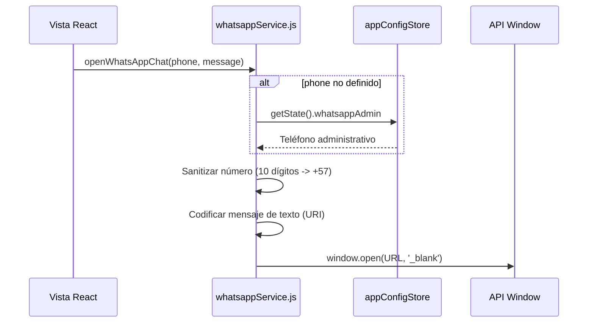

<!--
{
  "technicalName": "WhatsappService",
  "targetPath": "src/utils/WhatsappService.js",
  "dependencies": {
    "npm": {},
    "internal": []
  }
}
-->

# Servicio de WhatsApp (WhatsApp Service Utility)

Módulo de utilidad centralizado diseñado para procesar, sanitizar y redirigir de forma homogénea las comunicaciones hacia WhatsApp en toda la plataforma.

---

## 1. Propósito y Casos de Uso
* **Sanitización automática:** Remueve caracteres no numéricos y formatea números celulares locales de 10 dígitos (Colombia) anteponiéndoles automáticamente el indicativo de país (`57`).
* **Desacoplamiento de URL:** Centraliza el endpoint (`wa.me` vs `api.whatsapp.com`) y el escape de caracteres especiales (`encodeURIComponent`).
* **Fallback seguro:** Si no se especifica un número destino, utiliza de forma automática el teléfono administrativo configurado en la base de datos (`whatsappAdmin`) o en su defecto el de soporte técnico.

---

## 2. Especificación Operativa (Lógica Pura)
Este componente opera como una utilidad JS pura sin maquetado visual, exponiendo una API funcional y limpia para su consumo en cualquier parte de la aplicación.

---

## 3. Código Javascript Completo y 100% Funcional

```javascript
import useAppConfigStore from '../store/appConfigStore'
import { SUPPORT_WHATSAPP } from '../constants'

/**
 * Servicio / Utilidad para estructurar y abrir enlaces de chat hacia WhatsApp.
 * Centraliza la sanitización de teléfonos y la codificación de mensajes.
 */
export function openWhatsAppChat({ phone, message }) {
  const storePhone = useAppConfigStore.getState().whatsappAdmin || SUPPORT_WHATSAPP
  const targetPhone = phone || storePhone
  
  if (!targetPhone) {
    console.error('No se configuró ningún número de teléfono para WhatsApp.')
    return
  }

  // Limpiar caracteres no numéricos
  let cleanPhone = targetPhone.replace(/\D/g, '')

  // Formatear número celular de Colombia (10 dígitos) añadiendo código de país 57
  if (cleanPhone.length === 10) {
    cleanPhone = '57' + cleanPhone
  }

  const encodedMessage = encodeURIComponent(message)
  const url = `https://wa.me/${cleanPhone}?text=${encodedMessage}`
  
  window.open(url, '_blank')
}
```

---

## 4. Lógica de Estado y Ciclo de Vida
* **Lectura Directa:** Accede al estado de `appConfigStore` en tiempo de ejecución de manera síncrona mediante `getState()` evitando acoplamiento a ciclos de vida de componentes React.

---

## 5. Flujo Operativo y Secuencia de Interacción


