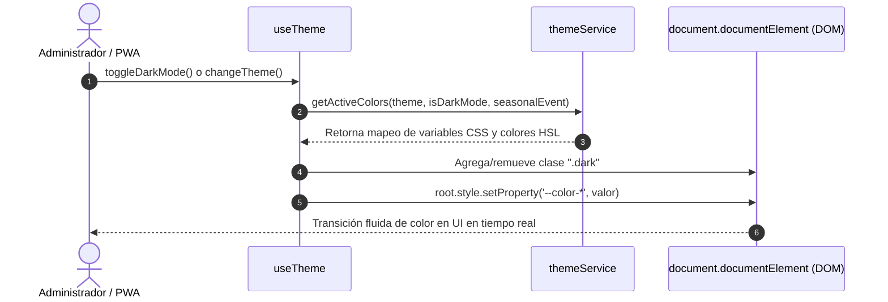

# Sistema de Temas Dinámicos y Modo Oscuro (ThemeManager)

## 1. Propósito y Casos de Uso

El **Sistema de Temas Dinámicos** es una solución avanzada de marca blanca para aplicaciones Ecosistema y multitenant. Permite cambiar el aspecto visual completo de una app en tiempo real mediante la inyección dinámica de variables CSS nativas (`CSS Custom Properties`).

### Capacidades principales:
1. **Paletas Preconfiguradas:** Soporta múltiples temas visuales completos (ej. Rosa Elegante, Azul Medianoche, Morado Premium) con configuraciones de color independientes para los estados **Claro** y **Oscuro**.
2. **Eventos Estacionales:** Permite sobreescribir el aspecto visual completo de la aplicación al activar fechas temáticas especiales (ej. Navidad 🎄, Halloween 🎃, Día de la Madre 🌸) con un solo flag sin alterar las hojas de estilo del núcleo.
3. **Modo Claro / Modo Oscuro Adaptativo:** Gestiona las clases del elemento raíz (`document.documentElement.classList.add('dark')`) para habilitar soporte integrado con utilidades oscuras (Tailwind CSS `@media (prefers-color-scheme)`) y variables CSS en cascada en paralelo.
4. **Diseño Desacoplado:** Agnóstico a preprocesadores y frameworks (Tailwind, Vanilla CSS, Sass, etc.).

---

## 2. Especificación Visual y Estilos

El motor inyecta un objeto de variables al elemento raíz `document.documentElement` o al contenedor de la app. Estas variables se pueden consumir directamente en archivos `.css` o clases inline:

```css
:root {
  background-color: var(--color-bg);
  color: var(--color-text);
  border-color: var(--color-border);
}

.button-primary {
  background-color: var(--color-primary);
  color: white;
}
```

---

## 3. Código Completo e Independiente

Para integrarlo en cualquier proyecto, el sistema se encapsula en dos módulos limpios: **El Catálogo de Paletas e Inyección de Variables** (`themeService.js`) y **El Hook React de Estado** (`useTheme.js`).

### A. Capa de Datos y Generación de Estilos (`themeService.js`)

```javascript
/**
 * Servicio de Temas y Paletas Dinámicas
 */

export const THEME_MODES = {
  LIGHT: 'light',
  DARK: 'dark'
};

const DEFAULT_LIGHT_BG = '#ffffff';
const DEFAULT_LIGHT_SURFACE = '#f8fafc';
const DEFAULT_LIGHT_SURFACE_2 = '#f1f5f9';
const DEFAULT_LIGHT_TEXT = '#0f172a';
const DEFAULT_LIGHT_TEXT_MUTED = '#64748b';
const DEFAULT_LIGHT_BORDER = '#e2e8f0';

const DEFAULT_DARK_BG = '#0f172a';
const DEFAULT_DARK_SURFACE = '#1e293b';
const DEFAULT_DARK_SURFACE_2 = '#334155';
const DEFAULT_DARK_TEXT = '#f8fafc';
const DEFAULT_DARK_TEXT_MUTED = '#cbd5e1';
const DEFAULT_DARK_BORDER = '#334155';

// Catálogo de Paletas Disponibles
export const ADVANCED_PALETTES = {
  'rosa-elegante': {
    id: 'rosa-elegante',
    name: 'Rosa Elegante',
    light: { primary: '#e91e8c', secondary: '#f48fb1', accent: '#ff4081', bg: '#fff5f9', surface: '#ffffff', surface2: '#fce4ec', text: '#1a0a12', textMuted: '#6d4c5e', border: '#f8bbd0' },
    dark: { primary: '#e91e8c', secondary: '#f48fb1', accent: '#ff4081', bg: '#0f0f0f', surface: '#1a1a1a', surface2: '#252525', text: '#f0f0f0', textMuted: '#a0a0a0', border: '#333333' }
  },
  'azul-medianoche': {
    id: 'azul-medianoche',
    name: 'Azul Medianoche',
    light: { primary: '#1565c0', secondary: '#64b5f6', accent: '#2979ff', bg: '#f0f4ff', surface: '#ffffff', surface2: '#e3f2fd', text: '#00091a', textMuted: '#2c4a7c', border: '#bbdefb' },
    dark: { primary: '#1565c0', secondary: '#64b5f6', accent: '#2979ff', bg: '#0f0f0f', surface: '#1a1a1a', surface2: '#252525', text: '#f0f0f0', textMuted: '#a0a0a0', border: '#333333' }
  },
  'verde-oliva': {
    id: 'verde-oliva',
    name: 'Verde Oliva',
    light: { primary: '#558b2f', secondary: '#aed581', accent: '#76ff03', bg: '#f4f8f0', surface: '#ffffff', surface2: '#f1f8e9', text: '#0a1200', textMuted: '#3e5229', border: '#c5e1a5' },
    dark: { primary: '#558b2f', secondary: '#aed581', accent: '#76ff03', bg: '#0f0f0f', surface: '#1a1a1a', surface2: '#252525', text: '#f0f0f0', textMuted: '#a0a0a0', border: '#333333' }
  }
};

// Paletas Temáticas Estacionales
export const SEASONAL_EVENTS = {
  none: { id: 'none', name: 'Sin Evento Activo' },
  navidad: {
    id: 'navidad',
    name: 'Navidad 🎄',
    light: { primary: '#d32f2f', secondary: '#388e3c', accent: '#fbc02d', bg: '#fff9f9', surface: '#ffffff', surface2: '#ffebee', text: '#1b0000', textMuted: '#5d4037', border: '#ffcdd2' },
    dark: { primary: '#ef5350', secondary: '#4caf50', accent: '#ffd54f', bg: '#0a0505', surface: '#180d0d', surface2: '#2b1616', text: '#ffebee', textMuted: '#d7ccc8', border: '#5c2525' }
  },
  halloween: {
    id: 'halloween',
    name: 'Halloween 🎃',
    light: { primary: '#f57c00', secondary: '#7b1fa2', accent: '#212121', bg: '#fffdfb', surface: '#ffffff', surface2: '#ffe0b2', text: '#1b0d00', textMuted: '#4a148c', border: '#ffcc80' },
    dark: { primary: '#ff9800', secondary: '#9c27b0', accent: '#eeeeee', bg: '#0f0a05', surface: '#1c130b', surface2: '#2d1e11', text: '#ffe0b2', textMuted: '#e1bee7', border: '#6d3c0c' }
  }
};

/**
 * Calcula y genera el mapeo de variables CSS para inyección.
 * @param {string|object} themeConfig - ID de paleta o paleta personalizada
 * @param {boolean} isDarkMode - Estado del modo oscuro
 * @param {string} activeSeasonalEvent - ID del evento estacional
 * @returns {object} Diccionario de variables CSS con sus valores de color
 */
export function getActiveColors(themeConfig, isDarkMode, activeSeasonalEvent = 'none') {
  let baseColors = null;

  // 1. Evaluar evento estacional
  if (activeSeasonalEvent && activeSeasonalEvent !== 'none' && SEASONAL_EVENTS[activeSeasonalEvent]) {
    const eventPalette = SEASONAL_EVENTS[activeSeasonalEvent];
    baseColors = isDarkMode ? eventPalette.dark : eventPalette.light;
  }

  // 2. Fallback a la paleta clásica de la tienda
  if (!baseColors) {
    if (typeof themeConfig === 'string') {
      const palette = ADVANCED_PALETTES[themeConfig] || ADVANCED_PALETTES['rosa-elegante'];
      baseColors = isDarkMode ? palette.dark : palette.light;
    } else if (themeConfig && typeof themeConfig === 'object') {
      baseColors = isDarkMode 
        ? (themeConfig.dark || themeConfig.light || themeConfig) 
        : (themeConfig.light || themeConfig);
    }
  }

  // 3. Fallback de seguridad final
  if (!baseColors) {
    baseColors = ADVANCED_PALETTES['rosa-elegante'].light;
  }

  return {
    '--color-primary': baseColors.primary || '#e91e8c',
    '--color-primary-light': baseColors.secondary || '#f48fb1',
    '--color-primary-dark': baseColors.accent || '#ff4081',
    '--color-secondary': baseColors.secondary || '#f8bbd9',
    '--color-accent': baseColors.accent || '#ff4081',
    '--color-bg': baseColors.bg || (isDarkMode ? DEFAULT_DARK_BG : DEFAULT_LIGHT_BG),
    '--color-surface': baseColors.surface || (isDarkMode ? DEFAULT_DARK_SURFACE : DEFAULT_LIGHT_SURFACE),
    '--color-surface-2': baseColors.surface2 || (isDarkMode ? DEFAULT_DARK_SURFACE_2 : DEFAULT_LIGHT_SURFACE_2),
    '--color-text': baseColors.text || (isDarkMode ? DEFAULT_DARK_TEXT : DEFAULT_LIGHT_TEXT),
    '--color-text-muted': baseColors.textMuted || (isDarkMode ? DEFAULT_DARK_TEXT_MUTED : DEFAULT_LIGHT_TEXT_MUTED),
    '--color-border': baseColors.border || (isDarkMode ? DEFAULT_DARK_BORDER : DEFAULT_LIGHT_BORDER)
  };
}
```

### B. Custom Hook React (`useTheme.js`)

```javascript
import { useState, useEffect, useCallback } from 'react';
import { getActiveColors } from './themeService';

/**
 * Hook portador para aplicar y gestionar variables CSS y clases DOM en tiempo real.
 * @param {object} props
 * @param {string} props.initialTheme - ID del tema por defecto
 * @param {boolean} props.initialDarkMode - Inicia en modo oscuro o claro
 * @param {string} props.initialSeasonalEvent - ID del evento por defecto
 */
export function useTheme({
  initialTheme = 'rosa-elegante',
  initialDarkMode = false,
  initialSeasonalEvent = 'none'
} = {}) {
  const [theme, setTheme] = useState(initialTheme);
  const [isDarkMode, setIsDarkMode] = useState(initialDarkMode);
  const [seasonalEvent, setSeasonalEvent] = useState(initialSeasonalEvent);

  // Efecto que inyecta las variables en el documento HTML
  useEffect(() => {
    const root = document.documentElement;
    
    // 1. Manejo del flag de clases oscuras (para Tailwind/CSS)
    if (isDarkMode) {
      root.classList.add('dark');
    } else {
      root.classList.remove('dark');
    }

    // 2. Generar e inyectar variables de color
    const variables = getActiveColors(theme, isDarkMode, seasonalEvent);
    Object.entries(variables).forEach(([key, val]) => {
      root.style.setProperty(key, val);
    });
  }, [theme, isDarkMode, seasonalEvent]);

  const toggleDarkMode = useCallback(() => {
    setIsDarkMode(prev => !prev);
  }, []);

  const changeTheme = useCallback((newTheme) => {
    setTheme(newTheme);
  }, []);

  const changeSeasonalEvent = useCallback((newEvent) => {
    setSeasonalEvent(newEvent);
  }, []);

  return {
    theme,
    isDarkMode,
    seasonalEvent,
    toggleDarkMode,
    changeTheme,
    changeSeasonalEvent
  };
}
```

---

## 4. Lógica de Estado y Ciclo de Vida

1. **Ciclo de Inyección DOM (`useEffect`):**
   Las variables CSS se inyectan en el elemento raíz `document.documentElement` (`:root`). Esto ocurre inmediatamente al montarse el componente y cada vez que cambia el tema, el estado de modo oscuro o el evento de temporada.
2. **Coexistencia con Tailwind CSS:**
   El switch sincroniza la clase `.dark` sobre el tag `<html>` de forma automática. Esto permite mezclar variables CSS tradicionales con selectores `dark:` nativos de Tailwind (`dark:bg-slate-900`) en la misma aplicación de forma totalmente fluida.

---

## 5. Secuencia de Interacción


