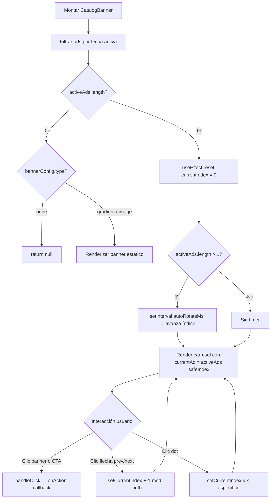

<!--
{
  "technicalName": "CatalogBanner",
  "targetPath": "src/components/ui/CatalogBanner.jsx",
  "dependencies": {
    "npm": {},
    "internal": []
  }
}
-->

# Carrusel de Anuncios Promocionales (CatalogBanner)

## 1. Propósito y Casos de Uso

Hero banner interactivo para la cabecera de catálogos y tiendas. Soporta dos modos:

1. **Banner estático** — Imagen de fondo o gradiente de marca cuando no hay anuncios activos.
2. **Carrusel dinámico** — Rotación automática entre múltiples anuncios con controles de navegación, shimmer de atención, efecto glow pulsante y CTA configurable.

Ideal para:
- **E-commerce:** Destacar ofertas flash, productos con descuento o colecciones nuevas.
- **Marketplaces:** Promover vendedores destacados o campañas de temporada.
- **Apps de servicios:** Anunciar promociones, membresías o descuentos por tiempo limitado.
- **Ecosistema con módulo de publicidad interna:** Carrusel administrable desde panel de control.

**Uso actual en App Ventas:** `src/components/client/catalog/CatalogBanner.jsx`. Se renderiza en `ClientCatalog.jsx` sobre la grilla de productos. Los anuncios provienen de Firestore (colección `ads`) y se filtran por fechas de vigencia.

---

## 2. Especificación Visual y Estilos

### Variables CSS Requeridas
```css
--color-primary       /* Color de acento — shimmer, glow, botón CTA */
--color-secondary     /* Segundo color — gradiente de fondo por defecto */
--border-app          /* Color de borde estándar */
--radius-base         /* Radio de borde para botones y contenedor */
```

### Características Visuales
| Elemento | Estilo |
|---|---|
| Contenedor | `border-radius: 24px`, `overflow: hidden`, `shadow-md` |
| Shimmer | `@keyframes cb-shimmer` — barra de luz diagonal que barre el banner indefinidamente |
| Glow pulsante | `@keyframes cb-glow-pulse` — halo de color primario en borde del card |
| Hover scale | `transform: scale(1.01)` suave en hover, `scale(0.95)` en active |
| Controles nav | Ocultos por defecto, visibles en hover del contenedor padre |
| Fade-in inicial | `@keyframes cb-fade-in` — reemplaza la dependencia de `framer-motion` |
| Imagen de fondo | `object-cover` + overlay `linear-gradient(to right, black/70, transparent)` para legibilidad |
| Dots de paginación | Punto activo se expande de `6px` a `16px` con `transition: width` |

---

## 3. Props y API del Componente

| Prop | Tipo | Default | Descripción |
|------|------|---------|-------------|
| `ads` | `Ad[]` | `[]` | Lista de anuncios ya cargados. El componente filtra los activos por fecha internamente. |
| `bannerConfig` | `BannerConfig` | `{ type: 'none' }` | Config del banner estático de respaldo cuando no hay anuncios activos. |
| `products` | `Product[]` | `[]` | Catálogo de productos. Solo se usa para resolver anuncios de tipo `'inventory'` (busca por `productId`). |
| `onAction` | `(action: ActionEvent) => void` | `null` | Callback al hacer clic en el banner o el CTA. Recibe `{ type, value, ad }`. |
| `autoRotateMs` | `number` | `6000` | Intervalo de auto-rotación del carrusel en milisegundos. |

### Estructura de `Ad`
```js
{
  active: boolean,
  startDate: string,        // 'YYYY-MM-DD'
  endDate: string,          // 'YYYY-MM-DD'
  type: 'inventory' | 'custom',
  title: string,
  description: string,
  category: string,         // Label del badge (ej. 'Temporada', 'Nuevo')
  ctaText: string,          // Texto del botón CTA
  ctaAction: string,        // Tipo de acción al hacer clic
  ctaValue: any,            // Valor enviado al onAction
  banner: string,           // URL de imagen (type: 'custom')
  image: string,            // URL alternativa de imagen
  colors: { bg: string, text: string }, // Colores custom (type: 'custom')
  glowEffect: boolean,      // Activa el borde glow pulsante
  // Solo para type: 'inventory':
  productId: string,
  customBanner: string,     // URL custom de imagen (sobreescribe imageUrl del producto)
  customTitle: string,      // Título custom (sobreescribe nombre del producto)
  discountType: 'percentage' | 'fixed',
  discountValue: number
}
```

### Estructura de `BannerConfig`
```js
{
  type: 'none' | 'gradient' | 'image',
  value: string   // URL de imagen si type === 'image'
}
```

### Estructura de `ActionEvent` (recibido en `onAction`)
```js
// Anuncio de inventario con producto encontrado:
{ type: 'product', value: productObject }

// Anuncio custom:
{ type: 'modal' | string, value: any, ad: adObject }
```

---

## 4. Código React Completo y 100% Funcional

```jsx
import { useState, useEffect } from 'react'

// ─── Íconos SVG inline ───────────────────────────────────────────────────────
const IconChevronLeft = () => (
  <svg width={16} height={16} viewBox="0 0 24 24" fill="none"
    stroke="currentColor" strokeWidth={2.5} strokeLinecap="round" strokeLinejoin="round">
    <polyline points="15 18 9 12 15 6" />
  </svg>
)
const IconChevronRight = () => (
  <svg width={16} height={16} viewBox="0 0 24 24" fill="none"
    stroke="currentColor" strokeWidth={2.5} strokeLinecap="round" strokeLinejoin="round">
    <polyline points="9 18 15 12 9 6" />
  </svg>
)

// ─── Keyframes CSS (sin framer-motion) ───────────────────────────────────────
const KEYFRAMES = `
  @keyframes cb-fade-in {
    from { opacity: 0; } to { opacity: 1; }
  }
  @keyframes cb-shimmer {
    0%   { transform: translateX(-150%) skewX(-25deg); }
    100% { transform: translateX(550%)  skewX(-25deg); }
  }
  @keyframes cb-glow-pulse {
    0%, 100% {
      box-shadow: 0 0 15px 2px color-mix(in srgb, var(--color-primary) 35%, transparent);
      border-color: color-mix(in srgb, var(--color-primary) 50%, transparent);
    }
    50% {
      box-shadow: 0 0 25px 6px color-mix(in srgb, var(--color-primary) 70%, transparent);
      border-color: color-mix(in srgb, var(--color-primary) 90%, transparent);
    }
  }
  .cb-glow { animation: cb-glow-pulse 3s infinite ease-in-out; }
  .cb-shimmer-bar { animation: cb-shimmer 4s infinite linear; }
  .cb-wrapper { animation: cb-fade-in 0.15s ease both; }
  .cb-container:hover .cb-nav-btn { opacity: 1 !important; }
`

// ─── Componente Principal ─────────────────────────────────────────────────────
export default function CatalogBanner({
  ads = [],
  bannerConfig = { type: 'none' },
  products = [],
  onAction = null,
  autoRotateMs = 6000
}) {
  const [currentIndex, setCurrentIndex] = useState(0)

  // Filtra anuncios vigentes por fecha
  const today = new Date().toISOString().split('T')[0]
  const activeAds = ads.filter(ad =>
    ad.active && today >= ad.startDate && today <= ad.endDate
  )

  // Reset índice cuando cambia la lista de activos (evita out-of-bounds)
  useEffect(() => {
    setCurrentIndex(0)
  }, [activeAds.length])

  // Auto-rotación del carrusel
  useEffect(() => {
    if (activeAds.length <= 1) return
    const timer = setInterval(() => {
      setCurrentIndex(prev => (prev + 1) % activeAds.length)
    }, autoRotateMs)
    return () => clearInterval(timer)
  }, [activeAds.length, autoRotateMs])

  // ─── Sin anuncios activos: banner estático de respaldo ────────────────────
  if (activeAds.length === 0) {
    if (!bannerConfig || bannerConfig.type === 'none') return null

    return (
      <>
        <style>{KEYFRAMES}</style>
        <div className="cb-wrapper" style={{
          maxWidth: 1280, margin: '16px auto 0', padding: '0 16px'
        }}>
          <div style={{
            width: '100%', height: 'clamp(144px, 18vw, 208px)',
            borderRadius: 24, overflow: 'hidden', position: 'relative',
            border: '1px solid var(--border-app)', display: 'flex',
            alignItems: 'center', justifyContent: 'center',
            background: bannerConfig.type === 'gradient'
              ? 'linear-gradient(135deg, var(--color-primary), var(--color-secondary))'
              : undefined
          }}>
            {bannerConfig.type === 'image' && bannerConfig.value && (
              <>
                 { e.target.style.display = 'none' }}
                />
                <div style={{ position: 'absolute', inset: 0, background: 'rgba(0,0,0,0.25)' }} />
              </>
            )}
            {bannerConfig.type === 'gradient' && (
              <h2 style={{
                position: 'relative', zIndex: 1, color: '#fff',
                fontWeight: 700, fontSize: 'clamp(18px, 3vw, 28px)',
                textAlign: 'center', padding: '0 16px',
                textShadow: '0 2px 8px rgba(0,0,0,0.3)'
              }}>
                Descubre nuestra colección
              </h2>
            )}
          </div>
        </div>
      </>
    )
  }

  // ─── Carrusel dinámico ────────────────────────────────────────────────────
  // Guard: si el índice queda fuera de rango, usar 0
  const safeIndex = currentIndex < activeAds.length ? currentIndex : 0
  const currentAd = activeAds[safeIndex]

  // Resuelve producto vinculado solo para type: 'inventory'
  const linkedProduct = currentAd.type === 'inventory'
    ? products.find(p => p.id === currentAd.productId) ?? null
    : null

  // Estilo de fondo
  const bgStyle = currentAd.type === 'custom' && currentAd.colors?.bg
    ? { background: currentAd.colors.bg }
    : { background: 'linear-gradient(135deg, var(--color-primary), var(--color-secondary))' }

  const textColor = currentAd.type === 'custom' && currentAd.colors?.text
    ? currentAd.colors.text
    : '#ffffff'

  const bannerImg = currentAd.type === 'inventory'
    ? (currentAd.customBanner || linkedProduct?.imageUrl || null)
    : (currentAd.banner || currentAd.image || null)

  // Cálculo del descuento — guard contra discountValue nulo
  const discountValue = currentAd.discountValue ?? 0
  const discountLabel = currentAd.discountType === 'percentage'
    ? `${discountValue}% OFF`
    : `-$${discountValue.toLocaleString()}`

  // Título y descripción del anuncio
  const adTitle = currentAd.type === 'inventory'
    ? (currentAd.customTitle || linkedProduct?.nombre || 'Oferta Especial')
    : currentAd.title

  const adDescription = currentAd.type === 'inventory'
    ? (linkedProduct?.descripcion || 'Descuentos increíbles por tiempo limitado.')
    : currentAd.description

  const handleClick = () => {
    if (!onAction) return
    if (currentAd.type === 'inventory' && linkedProduct) {
      onAction({ type: 'product', value: linkedProduct })
    } else {
      onAction({ type: currentAd.ctaAction || 'modal', value: currentAd.ctaValue, ad: currentAd })
    }
  }

  const goPrev = e => {
    e.stopPropagation()
    setCurrentIndex(prev => (prev - 1 + activeAds.length) % activeAds.length)
  }
  const goNext = e => {
    e.stopPropagation()
    setCurrentIndex(prev => (prev + 1) % activeAds.length)
  }

  return (
    <>
      <style>{KEYFRAMES}</style>
      <div className="cb-wrapper" style={{ maxWidth: 1280, margin: '16px auto 0', padding: '0 16px', position: 'relative' }}>
        <div
          className={`cb-container${currentAd.glowEffect ? ' cb-glow' : ''}`}
          onClick={handleClick}
          style={{
            width: '100%',
            height: 'clamp(160px, 20vw, 224px)',
            borderRadius: 24, overflow: 'hidden',
            position: 'relative', cursor: 'pointer',
            boxShadow: '0 4px 24px rgba(0,0,0,.10)',
            border: currentAd.glowEffect ? '2px solid transparent' : '1px solid var(--border-app)',
            display: 'flex', alignItems: 'center',
            transition: 'transform 0.2s, box-shadow 0.2s',
            ...(!bannerImg ? bgStyle : {})
          }}
          onMouseEnter={e => e.currentTarget.style.transform = 'scale(1.01)'}
          onMouseLeave={e => e.currentTarget.style.transform = 'scale(1)'}
          onMouseDown={e => e.currentTarget.style.transform = 'scale(0.97)'}
          onMouseUp={e => e.currentTarget.style.transform = 'scale(1.01)'}
        >
          {/* Shimmer de atención */}
          <div style={{ position: 'absolute', inset: 0, overflow: 'hidden', pointerEvents: 'none', zIndex: 10 }}>
            <div className="cb-shimmer-bar" style={{
              width: '30%', height: '100%', position: 'absolute', top: 0, left: 0,
              background: 'linear-gradient(to right, transparent, rgba(255,255,255,0.18), transparent)'
            }} />
          </div>

          {/* Imagen de fondo */}
          {bannerImg && (
            <>
               e.target.style.transform = 'scale(1.05)'}
                onMouseLeave={e => e.target.style.transform = 'scale(1)'}
                onError={e => { e.target.style.display = 'none' }}
              />
              <div style={{
                position: 'absolute', inset: 0,
                background: 'linear-gradient(to right, rgba(0,0,0,0.7), rgba(0,0,0,0.45), transparent)'
              }} />
            </>
          )}

          {/* Contenido del anuncio */}
          <div style={{
            position: 'relative', zIndex: 10, padding: 'clamp(16px, 3vw, 48px) clamp(20px, 5vw, 48px)',
            display: 'flex', flexDirection: 'column', justifyContent: 'space-between',
            height: '100%', maxWidth: 520, color: bannerImg ? '#fff' : textColor
          }}>
            <div>
              <span style={{
                display: 'inline-flex', alignItems: 'center', gap: 4,
                fontSize: 9, fontWeight: 900, textTransform: 'uppercase', letterSpacing: 1,
                background: 'rgba(255,255,255,0.15)', backdropFilter: 'blur(8px)',
                padding: '4px 10px', borderRadius: 100, marginBottom: 8,
                border: '1px solid rgba(255,255,255,0.15)', animation: 'pulse 2s infinite'
              }}>
                {currentAd.type === 'inventory' ? '⚡ Oferta Relámpago' : (currentAd.category || 'Promoción Especial')}
              </span>
              <h2 style={{
                fontWeight: 800, fontSize: 'clamp(15px, 2.5vw, 20px)',
                lineHeight: 1.2, margin: 0,
                overflow: 'hidden', display: '-webkit-box',
                WebkitLineClamp: 1, WebkitBoxOrient: 'vertical'
              }}>
                {adTitle}
              </h2>
              <p style={{
                fontSize: 'clamp(10px, 1.5vw, 12px)', opacity: 0.9, marginTop: 6,
                lineHeight: 1.5, fontWeight: 500,
                overflow: 'hidden', display: '-webkit-box',
                WebkitLineClamp: 2, WebkitBoxOrient: 'vertical'
              }}>
                {adDescription}
              </p>
            </div>

            <div style={{ display: 'flex', alignItems: 'center', gap: 12, marginTop: 12 }}>
              <button
                onClick={e => { e.stopPropagation(); handleClick() }}
                style={{
                  padding: '8px 16px', height: 36,
                  background: 'var(--color-primary)', color: '#fff',
                  border: 'none', borderRadius: 'var(--radius-base, 12px)',
                  fontWeight: 700, fontSize: 11, cursor: 'pointer',
                  boxShadow: '0 4px 16px rgba(0,0,0,0.2)',
                  transition: 'opacity 0.15s'
                }}
                onMouseEnter={e => e.target.style.opacity = '0.85'}
                onMouseLeave={e => e.target.style.opacity = '1'}
              >
                {currentAd.type === 'inventory' ? 'Comprar Ahora' : (currentAd.ctaText || 'Aprovechar Oferta')}
              </button>

              {currentAd.type === 'inventory' && linkedProduct && discountValue > 0 && (
                <span style={{
                  height: 36, display: 'flex', alignItems: 'center',
                  padding: '0 10px', borderRadius: 12,
                  background: 'rgba(0,0,0,0.4)', backdropFilter: 'blur(4px)',
                  border: '1px solid rgba(255,255,255,0.1)',
                  fontSize: 12, fontWeight: 900, color: '#fff'
                }}>
                  {discountLabel}
                </span>
              )}
            </div>
          </div>

          {/* Controles de navegación (solo si hay más de 1 anuncio) */}
          {activeAds.length > 1 && (
            <>
              <button
                onClick={goPrev}
                className="cb-nav-btn"
                style={{
                  position: 'absolute', left: 12, top: '50%', transform: 'translateY(-50%)',
                  width: 32, height: 32, borderRadius: '50%', border: 'none',
                  background: 'rgba(0,0,0,0.3)', backdropFilter: 'blur(8px)',
                  color: '#fff', cursor: 'pointer', zIndex: 20, opacity: 0,
                  display: 'flex', alignItems: 'center', justifyContent: 'center',
                  transition: 'opacity 0.2s, background 0.15s'
                }}
                aria-label="Anuncio anterior"
              >
                <IconChevronLeft />
              </button>
              <button
                onClick={goNext}
                className="cb-nav-btn"
                style={{
                  position: 'absolute', right: 12, top: '50%', transform: 'translateY(-50%)',
                  width: 32, height: 32, borderRadius: '50%', border: 'none',
                  background: 'rgba(0,0,0,0.3)', backdropFilter: 'blur(8px)',
                  color: '#fff', cursor: 'pointer', zIndex: 20, opacity: 0,
                  display: 'flex', alignItems: 'center', justifyContent: 'center',
                  transition: 'opacity 0.2s, background 0.15s'
                }}
                aria-label="Siguiente anuncio"
              >
                <IconChevronRight />
              </button>

              {/* Dots de paginación */}
              <div style={{
                position: 'absolute', bottom: 12, right: 24,
                display: 'flex', gap: 6, zIndex: 20
              }}>
                {activeAds.map((_, idx) => (
                  <button
                    key={idx}
                    onClick={e => { e.stopPropagation(); setCurrentIndex(idx) }}
                    aria-label={`Ir al anuncio ${idx + 1}`}
                    style={{
                      height: 6, borderRadius: 3, border: 'none', cursor: 'pointer', padding: 0,
                      width: idx === safeIndex ? 16 : 6,
                      background: idx === safeIndex ? 'var(--color-primary)' : 'rgba(255,255,255,0.4)',
                      transition: 'width 0.3s ease, background 0.3s ease'
                    }}
                  />
                ))}
              </div>
            </>
          )}
        </div>
      </div>
    </>
  )
}
```

---

## 5. Lógica de Estado y Ciclo de Vida

| Hook | Propósito |
|---|---|
| `useState(currentIndex)` | Índice del anuncio actualmente visible en el carrusel. |
| `useEffect([activeAds.length])` | **Reset de índice:** cuando la lista de anuncios activos cambia (carga inicial, cambio de fecha), reinicia el índice a `0` para evitar acceso fuera de rango (`undefined`). |
| `useEffect([activeAds.length, autoRotateMs])` | **Auto-rotación:** `setInterval` que avanza el índice cada `autoRotateMs` ms. El cleanup `clearInterval` evita memory leaks. No se activa si hay ≤1 anuncio activo. |

**Patrón de seguridad:** `const safeIndex = currentIndex < activeAds.length ? currentIndex : 0` — guard adicional para condiciones de carrera entre el reset de `useEffect` y un render intermedio.

---

## 6. Integración con Servicios Externos

El componente **no llama a ningún servicio directamente**. Los datos se inyectan como props. En App Ventas, el padre provee los datos así:

```js
// En ClientCatalog.jsx (App Ventas)
import { useAds } from '../hooks/useAds'
import { useProducts } from '../hooks/useInventory'
import useAppConfigStore from '../store/appConfigStore'

const { catalogBanner } = useAppConfigStore()
const { data: ads = [] } = useAds()
const { data: products = [] } = useProducts(true)

<CatalogBanner
  ads={ads}
  products={products}
  bannerConfig={catalogBanner}
  onAction={handleBannerAction}
/>
```

En **otro proyecto** basta con pasar el array desde cualquier fuente (fetch REST, estado local, datos estáticos):

```js
// Con datos estáticos para demo / prototipo
<CatalogBanner
  ads={[{
    active: true,
    startDate: '2026-01-01',
    endDate: '2026-12-31',
    type: 'custom',
    title: 'Gran Temporada',
    description: 'Los mejores precios del año.',
    ctaText: 'Ver Ofertas',
    ctaAction: 'scroll',
    category: 'Temporada',
    glowEffect: true
  }]}
  onAction={({ type }) => console.log('Acción:', type)}
/>
```

---

## 7. Flujo Operativo y Secuencia de Interacción



---

## 8. Ejemplo de Uso (Importación y Consumo)

### Modo carrusel dinámico (desde API)
```jsx
import CatalogBanner from './CatalogBanner'
import { useEffect, useState } from 'react'

function StorePage() {
  const [ads, setAds] = useState([])
  const [products, setProducts] = useState([])

  useEffect(() => {
    fetch('/api/ads').then(r => r.json()).then(setAds)
    fetch('/api/products').then(r => r.json()).then(setProducts)
  }, [])

  const handleAction = ({ type, value }) => {
    if (type === 'product') openProductModal(value)
    if (type === 'modal')   openPromoModal(value)
  }

  return (
    <CatalogBanner
      ads={ads}
      products={products}
      bannerConfig={{ type: 'gradient' }}  // fallback si no hay ads
      onAction={handleAction}
      autoRotateMs={5000}
    />
  )
}
```

### Modo banner estático (sin anuncios)
```jsx
<CatalogBanner
  ads={[]}
  bannerConfig={{ type: 'image', value: '/images/hero-banner.jpg' }}
/>
```

### Solo gradiente de marca
```jsx
<CatalogBanner
  ads={[]}
  bannerConfig={{ type: 'gradient' }}
/>
```

---

## 9. Origen
* **Extraído de:** App Ventas — `src/components/client/catalog/CatalogBanner.jsx`
* **Fecha de extracción:** 2026-05-29
* **Versión:** 1.0
* **Bugs corregidos en extracción:**
  - `currentIndex` fuera de rango cuando `activeAds` cambia → reset via `useEffect` + `safeIndex` guard.
  - `discountValue.toLocaleString()` sin null check → guard `?? 0` añadido.
