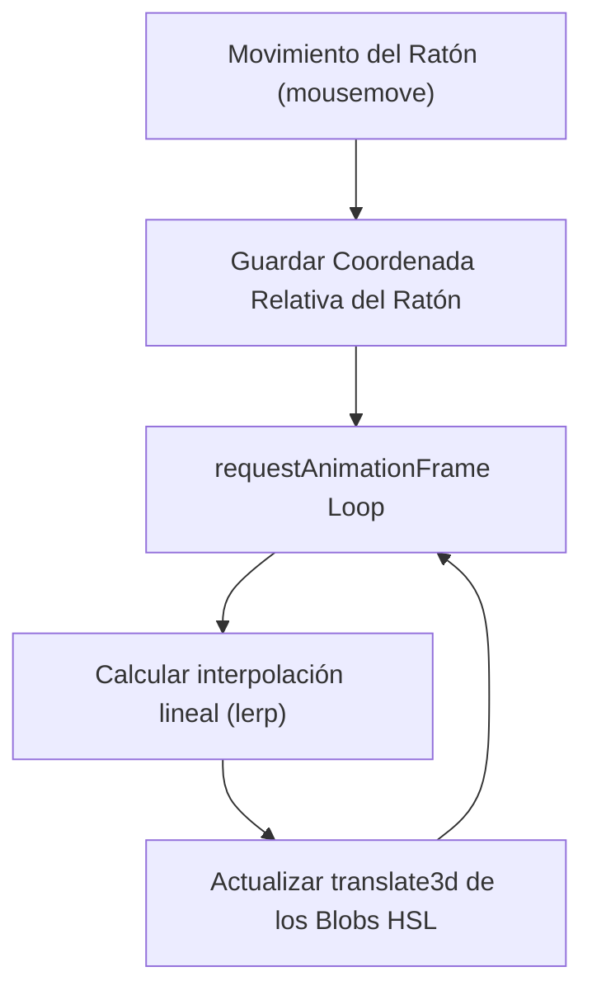

<!--
{
  "technicalName": "InteractiveAmbientGlow",
  "targetPath": "src/components/ui/InteractiveAmbientGlow.jsx",
  "dependencies": {
    "npm": {},
    "internal": []
  },
  "type": "component",
  "niches": []
}
-->

# Fondo de Luces Orgánicas Interactivas (`InteractiveAmbientGlow`)

Fondo decorativo animado de alto impacto visual. Combina esferas fluidas de gradientes HSL (blobs) que flotan de manera orgánica mediante keyframes y reaccionan de forma interactiva y con inercia a las coordenadas de movimiento del ratón, integrándose bajo un efecto de cristal esmerilado (glassmorphism).

---

## 1. Propósito y Casos de Uso
- **Pantallas de Entrada de Alto Impacto:** Ideal como fondo para formularios de Login, registro de usuarios o landing pages principales.
- **Marca Blanca Fluida:** Consume dinámicamente los colores de la marca para adaptarlos a la identidad visual del negocio en segundo plano sin distraer la lectura.

---

## 2. Especificación Visual y Estilos (Tailwind CSS)
- **Efecto de Cristal Esmerilado (Glassmorphism):** Superposición de una capa translúcida con desenfoque de fondo profundo (`backdrop-blur-[100px] bg-[var(--color-bg)]/20` o `bg-white/10`).
- **Blobs Animados:** Elementos vectoriales de gran tamaño con bordes difuminados y opacidad controlada (`opacity-30` a `opacity-50`) que oscilan de forma asincrónica.
- **Interactividad Reactiva:** Desplazamiento elástico amortiguado de las luces según la posición del cursor, evitando saltos bruscos mediante interpolación suave en JS.

---

## 3. Código React Completo

```jsx
import React, { useEffect, useState, useRef } from 'react';

export default function InteractiveAmbientGlow({
  color1 = 'var(--color-primary)',
  color2 = 'var(--color-accent)',
  color3 = '#ec4899', // Color rosa alternativo para mayor contraste
  sensitivity = 0.05, // Sensibilidad al movimiento del ratón/toque/giroscopio
  className = ''
}) {
  const containerRef = useRef(null);
  const mousePosRef = useRef({ x: 0, y: 0 });
  const isPointerActiveRef = useRef(false);
  const gyroRef = useRef({ x: 0, y: 0 });
  const [glowOffset, setGlowOffset] = useState({ x: 0, y: 0 });

  useEffect(() => {
    const handlePointerMove = (e) => {
      if (!containerRef.current) return;
      isPointerActiveRef.current = true;
      const rect = containerRef.current.getBoundingClientRect();
      const x = e.clientX - (rect.left + rect.width / 2);
      const y = e.clientY - (rect.top + rect.height / 2);
      mousePosRef.current = { x, y };
    };

    const handlePointerLeave = () => {
      isPointerActiveRef.current = false;
    };

    const container = containerRef.current;
    if (container) {
      container.addEventListener('pointermove', handlePointerMove);
      container.addEventListener('pointerleave', handlePointerLeave);
      container.addEventListener('pointerup', handlePointerLeave);
    }

    const handleOrientation = (e) => {
      if (e.beta !== null && e.gamma !== null) {
        // beta: inclinación adelante-atrás, gamma: izquierda-derecha
        const clampedGamma = Math.max(-45, Math.min(45, e.gamma));
        const clampedBeta = Math.max(-45, Math.min(45, e.beta - 45)); // Ángulo natural de sujeción
        gyroRef.current = { x: clampedGamma, y: clampedBeta };
      }
    };

    window.addEventListener('deviceorientation', handleOrientation);

    return () => {
      if (container) {
        container.removeEventListener('pointermove', handlePointerMove);
        container.removeEventListener('pointerleave', handlePointerLeave);
        container.removeEventListener('pointerup', handlePointerLeave);
      }
      window.removeEventListener('deviceorientation', handleOrientation);
    };
  }, []);

  useEffect(() => {
    let animationFrameId;

    const updatePosition = () => {
      setGlowOffset((prev) => {
        // Decaer el puntero a 0 si no hay toque activo
        if (!isPointerActiveRef.current) {
          mousePosRef.current.x += (0 - mousePosRef.current.x) * 0.05;
          mousePosRef.current.y += (0 - mousePosRef.current.y) * 0.05;
        }

        const pointerTargetX = mousePosRef.current.x * sensitivity * 12;
        const pointerTargetY = mousePosRef.current.y * sensitivity * 12;

        const gyroTargetX = gyroRef.current.x * sensitivity * 40;
        const gyroTargetY = gyroRef.current.y * sensitivity * 40;

        const targetX = pointerTargetX + gyroTargetX;
        const targetY = pointerTargetY + gyroTargetY;

        const nextX = prev.x + (targetX - prev.x) * 0.08;
        const nextY = prev.y + (targetY - prev.y) * 0.08;
        return { x: nextX, y: nextY };
      });
      animationFrameId = requestAnimationFrame(updatePosition);
    };

    animationFrameId = requestAnimationFrame(updatePosition);
    return () => cancelAnimationFrame(animationFrameId);
  }, [sensitivity]);

  return (
    <div
      ref={containerRef}
      className={`absolute inset-0 overflow-hidden bg-[var(--color-bg)] z-0 transition-colors duration-500 ${className}`}
    >
      {/* Luces y Esferas de Gradiente Flotantes */}
      <div 
        style={{
          transform: `translate3d(${glowOffset.x * 1.2}px, ${glowOffset.y * 1.2}px, 0)`,
          backgroundColor: color1,
          animation: 'floatBlob1 25s ease-in-out infinite'
        }}
        className="absolute w-80 h-80 sm:w-full max-w-[28.125rem] sm:h-[450px] rounded-full blur-[90px] sm:blur-[130px] opacity-25 sm:opacity-30 pointer-events-none will-change-transform top-[-10%] left-[5%]"
      />

      <div 
        style={{
          transform: `translate3d(${glowOffset.x * -0.9}px, ${glowOffset.y * -0.9}px, 0)`,
          backgroundColor: color2,
          animation: 'floatBlob2 30s ease-in-out infinite'
        }}
        className="absolute w-80 h-80 sm:w-full max-w-[31.25rem] sm:h-[500px] rounded-full blur-[90px] sm:blur-[140px] opacity-20 sm:opacity-25 pointer-events-none will-change-transform bottom-[-10%] right-[10%]"
      />

      <div 
        style={{
          transform: `translate3d(${glowOffset.y * 0.8}px, ${glowOffset.x * 0.8}px, 0)`,
          backgroundColor: color3,
          animation: 'floatBlob3 20s ease-in-out infinite'
        }}
        className="absolute w-64 h-64 sm:w-full max-w-[23.75rem] sm:h-[380px] rounded-full blur-[80px] sm:blur-[120px] opacity-15 sm:opacity-20 pointer-events-none will-change-transform top-[30%] left-[40%]"
      />

      {/* Capa de Cristal Esmerilado (Glassmorphism Overlay) */}
      <div className="absolute inset-0 backdrop-blur-[40px] sm:backdrop-blur-[80px] bg-[var(--color-bg)]/60 z-2 pointer-events-none" />

      {/* Estilos embebidos para keyframes de flotación orgánica */}
      <style dangerouslySetInnerHTML={{__html: `
        @keyframes floatBlob1 {
          0%, 100% { transform: translate(0, 0) scale(1); }
          33% { transform: translate(40px, -50px) scale(1.1); }
          66% { transform: translate(-30px, 30px) scale(0.9); }
        }
        @keyframes floatBlob2 {
          0%, 100% { transform: translate(0, 0) scale(1.1); }
          50% { transform: translate(-60px, 40px) scale(0.95); }
        }
        @keyframes floatBlob3 {
          0%, 100% { transform: translate(0, 0) scale(0.9); }
          50% { transform: translate(50px, 60px) scale(1.15); }
        }
      `}} />
    </div>
  );
}
```

---

## 4. Lógica de Estado y Ciclo de Vida
1. **Inercia con `requestAnimationFrame`:** Para evitar saltos y tirones de rendimiento en la CPU al actualizar estados, se implementa una función de bucle de animación nativa que calcula la interpolación lineal (`lerp`) a una tasa de refresco óptima sincronizada con la pantalla.
2. **Cálculo de Desplazamientos Opuestos:** La esfera 1 y 2 se desplazan en direcciones y proporciones de escala opuestas en base a las coordenadas del ratón, reforzando la sensación de profundidad espacial y dinamismo orgánico.
3. **Optimización con `will-change-transform`:** Se le indica al navegador de antemano que estos elementos variarán su posición para que cargue los vectores en la GPU, garantizando 60/120 FPS estables.

---

## 5. Secuencia de Interacción (Flujo de Estados)


