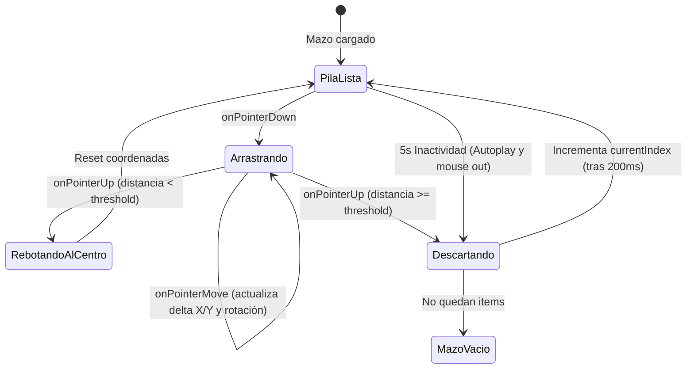

<!--
{
  "technicalName": "SwipeableCardStack",
  "targetPath": "src/components/ui/SwipeableCardStack.jsx",
  "dependencies": {
    "npm": {},
    "internal": []
  },
  "type": "component",
  "niches": [
    "retail_clothing",
    "moda-local-calzado",
    "coleccionismo-geek"
  ]
}
-->

# Mazo de Tarjetas Deslizables (`SwipeableCardStack`)

Componente de visualización tridimensional en forma de pila de tarjetas interactiva de marca blanca. Permite al usuario arrastrar la tarjeta superior hacia la izquierda o derecha (utilizando el ratón en escritorio o gestos táctiles en pantallas móviles) para descartarla u operar acciones con transiciones fluidas de rotación, escala y opacidad. Incluye además mecánicas de autoplay por inactividad e instrucciones visuales dinámicas.

---

## 1. Propósito y Casos de Uso
- **Promociones y Cupones:** Mostrar una pila de ofertas comerciales deslizando para ver la siguiente.
- **Catálogo de Productos Destacados:** Descubrimiento interactivo y gamificado de productos sugeridos.
- **Autoplay de Sugerencias:** Carrusel dinámico autogiratorio que cambia de producto tras un periodo de inactividad para incentivar compras de antojo.
- **Instrucción de Interacción:** Mostrar al usuario cómo operar el mazo mediante leyendas explicativas en la parte superior.

---

## 2. Especificación Visual y Estilos (Tailwind CSS)
- **Perspectiva 3D:** Tarjetas secundarias y terciarias posicionadas en segundo plano con desfase de escala (`scale-95`, `scale-90`) y traducción vertical (`translate-y-4`, `translate-y-8`) para simular profundidad física.
- **Física de Deslizamiento (Swipe):** Rotación angular progresiva e inclinación proporcional a la distancia de arrastre horizontal (`rotate-[deg]`).
- **Compatibilidad Pointer API:** Utiliza los eventos unificados `PointerEvents` para garantizar soporte simultáneo fluido en móviles iOS/Android y ratón en PC.
- **Instrucciones Pulsantes:** Barra superior con bordes redondeados y efecto `animate-pulse` para captar la atención del usuario de manera sutil pero clara.

---

## 3. Código React Completo

```jsx
import React, { useState, useEffect, useRef } from 'react';

export default function SwipeableCardStack({
  items = [], // Array de objetos { id, product, render }
  onSwipe = () => {}, // Callback (direction, item) => {}
  onEmpty = () => {}, // Callback al vaciarse el mazo
  className = '',
  threshold = 120 // Umbral de arrastre para registrar descarte (píxeles)
}) {
  const [currentIndex, setCurrentIndex] = useState(0);
  const [dragOffset, setDragOffset] = useState({ x: 0, y: 0 });
  const [isDragging, setIsDragging] = useState(false);
  const [isHovered, setIsHovered] = useState(false);
  const dragStart = useRef({ x: 0, y: 0 });
  const topCardRef = useRef(null);

  const activeItem = items[currentIndex];

  // Auto-play cada 5 segundos si no se está interactuando (sin arrastre ni hover)
  useEffect(() => {
    if (items.length === 0 || currentIndex >= items.length || isDragging || isHovered) {
      return;
    }

    const interval = setInterval(() => {
      // Pasa automáticamente la tarjeta hacia la izquierda (ignorar/siguiente)
      swipeCard('left');
    }, 5000);

    return () => clearInterval(interval);
  }, [currentIndex, items.length, isDragging, isHovered]);

  const handlePointerDown = (e) => {
    e.preventDefault();
    setIsDragging(true);
    dragStart.current = { x: e.clientX, y: e.clientY };
    if (topCardRef.current) {
      topCardRef.current.setPointerCapture(e.pointerId);
    }
  };

  const handlePointerMove = (e) => {
    if (!isDragging) return;
    const deltaX = e.clientX - dragStart.current.x;
    const deltaY = e.clientY - dragStart.current.y;
    setDragOffset({ x: deltaX, y: deltaY });
  };

  const handlePointerUp = (e) => {
    if (!isDragging) return;
    setIsDragging(false);
    if (topCardRef.current) {
      topCardRef.current.releasePointerCapture(e.pointerId);
    }

    // Comprobar si supera el umbral de descarte
    if (Math.abs(dragOffset.x) > threshold) {
      const direction = dragOffset.x > 0 ? 'right' : 'left';
      swipeCard(direction);
    } else {
      // Rebotar al centro
      setDragOffset({ x: 0, y: 0 });
    }
  };

  const swipeCard = (direction) => {
    // Lanzar la tarjeta fuera de la pantalla antes de actualizar índice
    const exitX = direction === 'right' ? 600 : -600;
    setDragOffset({ x: exitX, y: dragOffset.y });

    setTimeout(() => {
      onSwipe(direction, activeItem);
      setDragOffset({ x: 0, y: 0 });
      const nextIndex = currentIndex + 1;
      setCurrentIndex(nextIndex);
      if (nextIndex >= items.length) {
        onEmpty();
      }
    }, 200);
  };

  // Indicadores de dirección durante el arrastre
  const swipeLeft  = isDragging && dragOffset.x < -40;
  const swipeRight = isDragging && dragOffset.x > 40;
  const opacity    = Math.min(Math.abs(dragOffset.x) / threshold, 1);

  if (currentIndex >= items.length) {
    return (
      <div className="flex flex-col items-center justify-center p-8 border border-dashed border-[var(--color-border)] rounded-3xl h-64 text-center bg-white/50 dark:bg-neutral-900/40">
        <span className="text-xs font-black uppercase tracking-widest text-[var(--color-text-muted)]">¡Viste todas las sugerencias!</span>
      </div>
    );
  }

  return (
    <div 
      className={`relative w-full max-w-sm h-[324px] select-none touch-none flex flex-col gap-3 ${className}`}
      onMouseEnter={() => setIsHovered(true)}
      onMouseLeave={() => setIsHovered(false)}
    >
      {/* Barra de Instrucción de Swipe Premium */}
      <div className="flex items-center justify-between px-3.5 py-1.5 bg-primary/5 dark:bg-primary/10 rounded-full border border-primary/10 text-[9px] font-extrabold text-primary animate-pulse shrink-0">
        <span className="flex items-center gap-1">👈 DESLIZA IZQ (PASAR)</span>
        <span className="w-1.5 h-1.5 rounded-full bg-primary/40" />
        <span className="flex items-center gap-1">DESLIZA DER (AGREGAR) 👉</span>
      </div>

      <div className="relative w-full h-[288px] min-h-0">
        {/* Tarjeta de Respaldo Terciaria (debajo) */}
        {currentIndex + 2 < items.length && (
          <div className="absolute inset-x-4 bottom-0 h-[288px] rounded-3xl bg-[var(--color-surface-2)]/40 border border-[var(--color-border)] opacity-40 scale-90 translate-y-8 z-0 transition-all duration-300" />
        )}

        {/* Tarjeta de Respaldo Secundaria */}
        {currentIndex + 1 < items.length && (
          <div 
            style={{
              transform: isDragging 
                ? `scale(${0.95 + Math.min(Math.abs(dragOffset.x), threshold) / threshold * 0.05}) translate3d(0, ${16 - Math.min(Math.abs(dragOffset.x), threshold) / threshold * 16}px, 0)` 
                : 'scale(0.95) translate3d(0, 16px, 0)'
            }}
            className="absolute inset-x-2 bottom-0 h-[288px] rounded-3xl bg-[var(--color-surface-2)] border border-[var(--color-border)] opacity-85 z-10 transition-transform duration-300 pointer-events-none"
          />
        )}

        {/* Tarjeta Superior Activa (Arrastrable) */}
        <div
          ref={topCardRef}
          onPointerDown={handlePointerDown}
          onPointerMove={handlePointerMove}
          onPointerUp={handlePointerUp}
          onPointerCancel={handlePointerUp}
          style={{
            transform: `translate3d(${dragOffset.x}px, ${dragOffset.y}px, 0) rotate(${dragOffset.x * 0.06}deg)`,
            transition: isDragging ? 'none' : 'transform 0.4s cubic-bezier(0.175, 0.885, 0.32, 1.275)'
          }}
          className="absolute inset-x-0 top-0 h-[288px] rounded-3xl bg-[var(--color-surface)] border border-[var(--color-border)] shadow-xl z-20 cursor-grab active:cursor-grabbing overflow-hidden"
        >
          {/* Overlays informativos */}
          {swipeLeft && (
            <div className="absolute inset-0 bg-red-500/10 flex items-center justify-center z-30 pointer-events-none" style={{ opacity }}>
              <span className="bg-red-500 text-[var(--color-text)] text-[9px] font-black px-3 py-1.5 rounded-xl shadow-lg tracking-widest uppercase">Ignorar</span>
            </div>
          )}

          {swipeRight && (
            <div className="absolute inset-0 bg-green-500/10 flex items-center justify-center z-30 pointer-events-none" style={{ opacity }}>
              <span className="bg-green-500 text-[var(--color-text)] text-[9px] font-black px-3 py-1.5 rounded-xl shadow-lg tracking-widest uppercase">Agregar</span>
            </div>
          )}

          <div className="w-full h-full">
            {activeItem.render ? activeItem.render() : activeItem.content}
          </div>
        </div>
      </div>
    </div>
  );
}
```

---

## 4. Lógica de Estado y Ciclo de Vida
1. **Captura de Puntero (`Pointer Capture`):** Al activar `onPointerDown` se invoca `setPointerCapture` para obligar al navegador a redirigir todos los movimientos subsecuentes al nodo de la tarjeta activa, incluso si el cursor se sale físicamente del elemento durante un arrastre rápido.
2. **Transformaciones e Inercia:** La rotación (`dragOffset.x * 0.06`) se acopla dinámicamente con el eje X. Al soltarla, se evalúa si sobrepasa el umbral (`threshold`) para desencadenar el descarte acelerado o volver elásticamente al centro con un efecto rebote (*spring reset*).
3. **Escalamiento del Fondo:** La tarjeta en segundo plano se expande progresivamente de `scale(0.95)` a `scale(1)` a medida que la superior se aleja, logrando una sensación tridimensional de avance.
4. **Ciclo de Autoplay:** Utiliza `setInterval` con un temporizador de `5000ms`. Al completarse el tiempo, si `isDragging` e `isHovered` son falsos, invoca a `swipeCard('left')` para avanzar el mazo automáticamente de forma fluida.

---

## 5. Secuencia de Interacción (Flujo de Estados)


