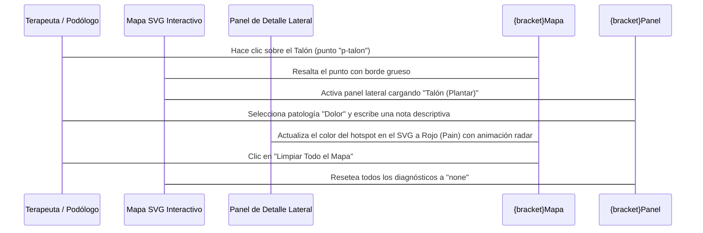

<!--
{
  "resource": "MapaAnatomicoPie",
  "technicalName": "MapaAnatomicoPie",
  "targetPath": "src/components/common/MapaAnatomicoPie.jsx",
  "type": "component",
  "niches": ["wellness_podology"],
  "dependencies": {
    "npm": {
      "lucide-react": "^0.344.0"
    },
    "internal": []
  }
}
-->

# Mapa Anatómico del Pie (`MapaAnatomicoPie`)

Componente interactivo que muestra una representación SVG de las vistas plantar (planta) y dorsal (empeine) del pie humano, permitiendo al podólogo o terapeuta marcar y diagnosticar zonas con dolor, callosidades o lesiones específicas con registro de notas locales.

## 1. Propósito y Casos de Uso
- **Diagnóstico Inicial:** Marcación visual exacta de las afecciones del paciente para su expediente clínico.
- **Seguimiento del Tratamiento:** Comparar el estado del pie sesión tras sesión viendo la evolución de las zonas marcadas.

## 2. Especificación Visual y Estilos
- **SVG Adaptativo:** Siluetas limpias y vectorizadas con soporte para temas oscuros y claros.
- **Hotspots Interactivos:** Zonas interactivas que cambian de color de relleno según la patología seleccionada (Rojo para Dolor, Naranja para Heloma/Callo, Amarillo para Lesión, Verde para Sano).
- **Animación Hover:** Efecto de escalado y brillo tipo radar (`animate-ping`) en las zonas con alertas activas.

## 3. Código React Completo

```jsx
import React, { useState } from 'react';
import { Eye, Edit3, Trash2, CheckCircle, Info } from 'lucide-react';

const ZONAS_INICIALES = [
  // Planta del pie
  { id: 'p-talon', label: 'Talón (Plantar)', x: 120, y: 320, r: 24, view: 'plantar', status: 'none', note: '' },
  { id: 'p-arco', label: 'Arco Interno', x: 100, y: 220, r: 18, view: 'plantar', status: 'none', note: '' },
  { id: 'p-metatarso', label: 'Metatarso Central', x: 120, y: 140, r: 20, view: 'plantar', status: 'none', note: '' },
  { id: 'p-dedogrand', label: 'Dedo Halux (Dedo gordo)', x: 80, y: 70, r: 14, view: 'plantar', status: 'none', note: '' },
  { id: 'p-dedospeq', label: 'Dedos Menores', x: 150, y: 80, r: 16, view: 'plantar', status: 'none', note: '' },
  
  // Dorso del pie
  { id: 'd-tobillo', label: 'Tobillo / Articulación', x: 120, y: 330, r: 24, view: 'dorsal', status: 'none', note: '' },
  { id: 'd-empeine', label: 'Empeine Superior', x: 120, y: 210, r: 22, view: 'dorsal', status: 'none', note: '' },
  { id: 'd-unagrand', label: 'Uña Dedo Gordo (Halux)', x: 80, y: 70, r: 12, view: 'dorsal', status: 'none', note: '' },
  { id: 'd-unaspeq', label: 'Uñas Dedos Menores', x: 145, y: 85, r: 14, view: 'dorsal', status: 'none', note: '' }
];

const ESTADOS_PATOLOGIA = [
  { id: 'none', label: 'Sano / Sin registro', color: 'bg-slate-400', stroke: '#94a3b8', fill: 'rgba(148,163,184,0.15)' },
  { id: 'pain', label: 'Dolor / Inflamación', color: 'bg-red-500', stroke: '#ef4444', fill: 'rgba(239,68,68,0.3)' },
  { id: 'callus', label: 'Heloma / Callosidad', color: 'bg-amber-500', stroke: '#f59e0b', fill: 'rgba(245,158,11,0.3)' },
  { id: 'lesion', label: 'Lesión / Grieta / Ulcera', color: 'bg-violet-500', stroke: '#8b5cf6', fill: 'rgba(139,92,246,0.3)' }
];

export default function MapaAnatomicoPie({ onChange, initialZonas }) {
  const [zonas, setZonas] = useState(initialZonas || ZONAS_INICIALES);
  const [selectedZonaId, setSelectedZonaId] = useState(null);

  const activeZona = zonas.find(z => z.id === selectedZonaId);

  const handleUpdateStatus = (statusId) => {
    if (!selectedZonaId) return;
    const updated = zonas.map(z => {
      if (z.id === selectedZonaId) {
        return { ...z, status: statusId };
      }
      return z;
    });
    setZonas(updated);
    if (onChange) onChange(updated);
  };

  const handleUpdateNote = (noteText) => {
    if (!selectedZonaId) return;
    const updated = zonas.map(z => {
      if (z.id === selectedZonaId) {
        return { ...z, note: noteText };
      }
      return z;
    });
    setZonas(updated);
    if (onChange) onChange(updated);
  };

  const getColorConfig = (zona) => {
    const statusObj = ESTADOS_PATOLOGIA.find(e => e.id === zona.status) || ESTADOS_PATOLOGIA[0];
    return statusObj;
  };

  const clearAllMarks = () => {
    const cleared = zonas.map(z => ({ ...z, status: 'none', note: '' }));
    setZonas(cleared);
    setSelectedZonaId(null);
    if (onChange) onChange(cleared);
  };

  return (
    <div className="w-full grid grid-cols-1 lg:grid-cols-12 gap-5 rounded-2xl border border-[var(--color-border)] bg-[var(--color-surface)] p-5 shadow-lg">
      
      {/* Vista SVG de los pies */}
      <div className="lg:col-span-8 flex flex-col items-center justify-center bg-[var(--color-bg)]/50 rounded-xl p-4 border border-[var(--color-border)] relative">
        <span className="text-[10px] font-black uppercase text-[var(--color-text-muted)] tracking-widest absolute top-4 left-4">Mapa Anatómico Interactivo</span>
        
        <div className="flex flex-col sm:flex-row gap-8 mt-6">
          {/* Vista Plantar */}
          <div className="flex flex-col items-center gap-2">
            <span className="text-xs font-bold text-[var(--color-text-muted)]">Vista Plantar</span>
            <div className="w-[200px] h-[380px] border border-[var(--color-border)]/50 rounded-2xl bg-[var(--color-surface)] relative overflow-hidden">
              <svg className="w-full h-full" viewBox="0 0 240 400">
                {/* Silueta de Pie Plantar Izquierdo simplificado */}
                <path 
                  d="M 120 40 C 90 40, 60 70, 60 110 C 60 160, 90 200, 80 250 C 70 300, 90 370, 120 370 C 150 370, 170 300, 160 250 C 150 200, 180 160, 180 110 C 180 70, 150 40, 120 40 Z" 
                  fill="rgba(var(--color-primary-rgb), 0.03)" 
                  stroke="var(--color-border)" 
                  strokeWidth="2"
                />
                {/* Puntos interactivas */}
                {zonas.filter(z => z.view === 'plantar').map(zona => {
                  const conf = getColorConfig(zona);
                  const isSelected = selectedZonaId === zona.id;
                  return (
                    <g key={zona.id} className="cursor-pointer" onClick={() => setSelectedZonaId(zona.id)}>
                      <circle 
                        cx={zona.x} 
                        cy={zona.y} 
                        r={zona.r} 
                        fill={conf.fill} 
                        stroke={conf.stroke} 
                        strokeWidth={isSelected ? 3 : 1.5}
                        className="transition-all hover:scale-110"
                      />
                      {zona.status !== 'none' && (
                        <circle 
                          cx={zona.x} 
                          cy={zona.y} 
                          r={4} 
                          fill={conf.stroke}
                          className="animate-ping"
                        />
                      )}
                      <text 
                        x={zona.x} 
                        y={zona.y + 4} 
                        fontSize="9" 
                        textAnchor="middle" 
                        fontWeight="bold"
                        fill="var(--color-text)"
                        className="pointer-events-none"
                      >
                        {zona.id.replace('p-', '').substring(0,2).toUpperCase()}
                      </text>
                    </g>
                  );
                })}
              </svg>
            </div>
          </div>

          {/* Vista Dorsal */}
          <div className="flex flex-col items-center gap-2">
            <span className="text-xs font-bold text-[var(--color-text-muted)]">Vista Dorsal</span>
            <div className="w-[200px] h-[380px] border border-[var(--color-border)]/50 rounded-2xl bg-[var(--color-surface)] relative overflow-hidden">
              <svg className="w-full h-full" viewBox="0 0 240 400">
                {/* Silueta de Pie Dorsal Izquierdo simplificado */}
                <path 
                  d="M 120 40 C 95 40, 65 70, 65 110 C 65 155, 95 190, 85 240 C 75 290, 95 365, 120 365 C 145 365, 165 290, 155 240 C 145 190, 175 155, 175 110 C 175 70, 145 40, 120 40 Z" 
                  fill="rgba(var(--color-primary-rgb), 0.03)" 
                  stroke="var(--color-border)" 
                  strokeWidth="2"
                />
                {/* Puntos interactivas */}
                {zonas.filter(z => z.view === 'dorsal').map(zona => {
                  const conf = getColorConfig(zona);
                  const isSelected = selectedZonaId === zona.id;
                  return (
                    <g key={zona.id} className="cursor-pointer" onClick={() => setSelectedZonaId(zona.id)}>
                      <circle 
                        cx={zona.x} 
                        cy={zona.y} 
                        r={zona.r} 
                        fill={conf.fill} 
                        stroke={conf.stroke} 
                        strokeWidth={isSelected ? 3 : 1.5}
                        className="transition-all hover:scale-110"
                      />
                      {zona.status !== 'none' && (
                        <circle 
                          cx={zona.x} 
                          cy={zona.y} 
                          r={4} 
                          fill={conf.stroke}
                          className="animate-ping"
                        />
                      )}
                      <text 
                        x={zona.x} 
                        y={zona.y + 4} 
                        fontSize="9" 
                        textAnchor="middle" 
                        fontWeight="bold"
                        fill="var(--color-text)"
                        className="pointer-events-none"
                      >
                        {zona.id.replace('d-', '').substring(0,2).toUpperCase()}
                      </text>
                    </g>
                  );
                })}
              </svg>
            </div>
          </div>
        </div>

        <button 
          onClick={clearAllMarks}
          className="mt-4 px-3.5 py-1.5 rounded-xl border border-[var(--color-border)] text-[10px] font-black uppercase text-red-500 hover:bg-red-500/10 transition-all cursor-pointer"
        >
          Limpiar Todo el Mapa
        </button>
      </div>

      {/* Panel de Configuración Lateral */}
      <div className="lg:col-span-4 flex flex-col gap-4">
        {activeZona ? (
          <div className="p-4 rounded-xl border border-[var(--color-border)] bg-[var(--color-surface-2)]/30 flex flex-col gap-4 animate-fadeIn">
            <div>
              <span className="text-[10px] font-black text-[var(--color-text-muted)] uppercase tracking-wider">Zona Seleccionada</span>
              <h3 className="text-sm font-black text-[var(--color-text)] mt-0.5">{activeZona.label}</h3>
            </div>

            {/* Clasificación de Patología */}
            <div className="flex flex-col gap-2">
              <label className="text-[10px] font-bold text-[var(--color-text-muted)]">Diagnóstico de la Zona:</label>
              <div className="flex flex-col gap-1.5">
                {ESTADOS_PATOLOGIA.map(status => (
                  <button
                    key={status.id}
                    onClick={() => handleUpdateStatus(status.id)}
                    className={`flex items-center gap-3 p-2.5 rounded-lg border text-left text-xs font-semibold transition-all cursor-pointer ${
                      activeZona.status === status.id
                        ? 'border-[var(--color-primary)] bg-[var(--color-surface)] text-[var(--color-text)] shadow-sm'
                        : 'border-transparent bg-transparent text-[var(--color-text-muted)] hover:bg-[var(--color-surface-2)]/30'
                    }`}
                  >
                    <div className={`w-3.5 h-3.5 rounded-full ${status.color}`} />
                    <span>{status.label}</span>
                  </button>
                ))}
              </div>
            </div>

            {/* Campo de Notas */}
            <div className="flex flex-col gap-2">
              <label className="text-[10px] font-bold text-[var(--color-text-muted)]">Notas Clínicas del Área:</label>
              <textarea
                value={activeZona.note}
                onChange={(e) => handleUpdateNote(e.target.value)}
                placeholder="Ej. Hiperqueratosis dolorosa a la palpación, se requiere fresado de disco plano..."
                rows={4}
                className="w-full p-2.5 rounded-xl border border-[var(--color-border)] bg-[var(--color-bg)] text-xs text-[var(--color-text)] focus:border-[var(--color-primary)] outline-none transition-all resize-none"
              />
            </div>

            <div className="flex items-center gap-2 p-3 rounded-lg bg-[var(--color-primary)]/10 text-[var(--color-primary)]">
              <Info className="w-4 h-4 shrink-0" />
              <span className="text-[10px] font-bold">Cambios sincronizados en tiempo real.</span>
            </div>
          </div>
        ) : (
          <div className="p-6 rounded-xl border border-[var(--color-border)] bg-[var(--color-bg)]/50 flex flex-col items-center justify-center text-center gap-3 h-full min-h-[250px]">
            <div className="w-10 h-10 rounded-full bg-[var(--color-border)]/50 flex items-center justify-center text-[var(--color-text-muted)]">
              <Eye className="w-5 h-5" />
            </div>
            <div>
              <p className="text-xs font-bold text-[var(--color-text)]">Sin Zona Seleccionada</p>
              <p className="text-[10px] text-[var(--color-text-muted)] mt-1 max-w-[180px]">
                Haz clic en cualquier punto de los pies para iniciar el diagnóstico de esa zona.
              </p>
            </div>
          </div>
        )}
      </div>

    </div>
  );
}
```

## 4. Lógica de Estado y Ciclo de Vida
- **`zonas`:** Almacena el array de todas las zonas interactivas del pie, actualizando sus campos `status` y `note` al modificar el panel lateral.
- **`selectedZonaId`:** ID de la zona que está bajo inspección en el panel de control lateral.

## 5. Flujo Operativo y Secuencia de Interacción


