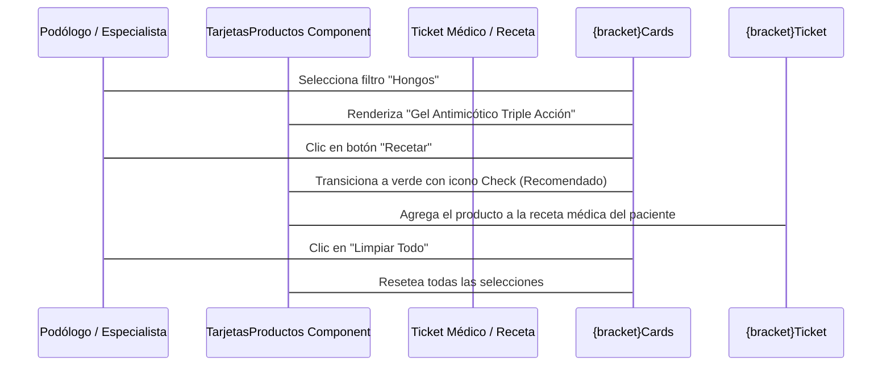

<!--
{
  "resource": "TarjetasProductosPostCuidado",
  "technicalName": "TarjetasProductosPostCuidado",
  "targetPath": "src/components/common/TarjetasProductosPostCuidado.jsx",
  "type": "component",
  "niches": ["wellness_podology"],
  "dependencies": {
    "npm": {
      "lucide-react": "^0.344.0"
    },
    "internal": []
  }
}
-->

# Tarjetas de Productos para Post-Cuidado (`TarjetasProductosPostCuidado`)

Componente de e-commerce y recomendación médica diseñado para sugerir cremas hidratantes, geles antimicóticos, ortesis de silicona o plantillas ortopédicas personalizadas de acuerdo al diagnóstico podológico del paciente.

## 1. Propósito y Casos de Uso
- **Cross-selling Médico:** Venta de productos complementarios en la recepción o checkout de la cita médica.
- **Receta de Cuidado:** Generar una lista de compras sugerida impresa o enviada por WhatsApp al paciente para su tratamiento en casa.

## 2. Especificación Visual y Estilos
- **Product Card Layout:** Tarjetas con sombreado difuso, indicador de precio destacado en color primario e insignias de tipo de patología recomendada.
- **Acción Rápida (Añadir a Receta):** Micro-animación en hover y cambio de estado visual (Checkmark) al agregar productos al carrito o expediente.
- **Garantía de Contraste:** Uso de `!text-white` para textos sobre botones de compra.

## 3. Código React Completo

```jsx
import React, { useState } from 'react';
import { ShoppingCart, Check, Heart, Plus, Sparkles, Filter } from 'lucide-react';

const PRODUCTOS_DATA = [
  {
    id: 'prod-crema-urea',
    nombre: 'Crema Podológica Urea 20%',
    descripcion: 'Hidratación ultra profunda para talones agrietados y resequedad extrema.',
    precio: 35000,
    categoria: 'hidratacion',
    nichoLabel: 'Resequedad / Anhidrosis',
    imagenColor: 'from-blue-200 to-sky-300'
  },
  {
    id: 'prod-antimicotico',
    nombre: 'Gel Antimicótico Triple Acción',
    descripcion: 'Tratamiento localizado para pie de atleta y micosis en uñas.',
    precio: 42000,
    categoria: 'micosis',
    nichoLabel: 'Hongos / Infecciones',
    imagenColor: 'from-emerald-200 to-teal-300'
  },
  {
    id: 'prod-silicona',
    nombre: 'Separadores de Dedos de Gel',
    descripcion: 'Par de ortesis de silicona suave para corrección de hallux valgus (juanete).',
    precio: 18000,
    categoria: 'ortesis',
    nichoLabel: 'Juanetes / Desviaciones',
    imagenColor: 'from-amber-200 to-orange-300'
  },
  {
    id: 'prod-plantillas',
    nombre: 'Plantillas Confort Amortiguadoras',
    descripcion: 'Diseño ergonómico para reducir puntos de presión en metatarso y talón.',
    precio: 75000,
    categoria: 'pisada',
    nichoLabel: 'Puntos de Presión / Dolor',
    imagenColor: 'from-indigo-200 to-violet-300'
  }
];

export default function TarjetasProductosPostCuidado({ onAddRecipe, activeCondition }) {
  const [selectedCategoria, setSelectedCategoria] = useState('todos');
  const [recetaIds, setRecetaIds] = useState([]);
  const [favoritos, setFavoritos] = useState([]);

  // Filtrar productos
  const filteredProducts = PRODUCTOS_DATA.filter(prod => {
    const matchesCategoria = selectedCategoria === 'todos' || prod.categoria === selectedCategoria;
    const matchesCondition = !activeCondition || prod.categoria === activeCondition;
    return matchesCategoria && matchesCondition;
  });

  const handleToggleRecipe = (id) => {
    setRecetaIds(prev => {
      const exists = prev.includes(id);
      const updated = exists ? prev.filter(pId => pId !== id) : [...prev, id];
      if (onAddRecipe) {
        onAddRecipe(PRODUCTOS_DATA.filter(p => updated.includes(p.id)));
      }
      return updated;
    });
  };

  const toggleFavorito = (id) => {
    setFavoritos(prev => 
      prev.includes(id) ? prev.filter(fId => fId !== id) : [...prev, id]
    );
  };

  const formatearPrecio = (valor) => {
    return '$' + valor.toLocaleString('es-CO') + ' COP';
  };

  return (
    <div className="w-full flex flex-col gap-5 rounded-2xl border border-[var(--color-border)] bg-[var(--color-surface)] p-5 shadow-lg">
      
      {/* Cabecera y Filtros */}
      <div className="flex flex-col sm:flex-row gap-4 justify-between items-start sm:items-center">
        <div>
          <h3 className="text-sm font-black text-[var(--color-text)]">Recomendaciones Post-Cuidado</h3>
          <p className="text-xs text-[var(--color-text-muted)]">Productos recomendados según el diagnóstico clínico</p>
        </div>

        {/* Botones de Categorías */}
        <div className="flex gap-1.5 overflow-x-auto py-1 scrollbar-none w-full sm:w-auto">
          {[
            { id: 'todos', label: 'Todos' },
            { id: 'hidratacion', label: 'Resequedad' },
            { id: 'micosis', label: 'Hongos' },
            { id: 'ortesis', label: 'Corrección' },
            { id: 'pisada', label: 'Pisada/Dolor' }
          ].map(cat => (
            <button
              key={cat.id}
              onClick={() => setSelectedCategoria(cat.id)}
              className={`px-3 py-1 text-xs font-bold rounded-lg border transition-all cursor-pointer whitespace-nowrap ${
                selectedCategoria === cat.id
                  ? 'border-[var(--color-primary)] bg-[var(--color-primary-light)] text-[var(--color-primary)]'
                  : 'border-[var(--color-border)] bg-[var(--color-surface)] text-[var(--color-text-muted)] hover:text-[var(--color-text)]'
              }`}
            >
              {cat.label}
            </button>
          ))}
        </div>
      </div>

      {/* Grid de Productos */}
      <div className="grid grid-cols-1 sm:grid-cols-2 lg:grid-cols-4 gap-4">
        {filteredProducts.map(prod => {
          const inReceta = recetaIds.includes(prod.id);
          const isFav = favoritos.includes(prod.id);
          return (
            <div
              key={prod.id}
              className="rounded-xl border border-[var(--color-border)] bg-[var(--color-bg)]/40 overflow-hidden flex flex-col gap-3 group hover:shadow-md transition-all duration-200"
            >
              {/* Contenedor Imagen Simulado */}
              <div className={`h-36 bg-gradient-to-tr ${prod.imagenColor} relative flex items-center justify-center p-4`}>
                <span className="text-[10px] font-bold text-slate-700 bg-white/80 px-2 py-0.5 rounded-full shadow-sm">
                  {prod.nichoLabel}
                </span>

                {/* Botón Favorito */}
                <button
                  type="button"
                  onClick={() => toggleFavorito(prod.id)}
                  className="absolute top-2 right-2 p-1.5 rounded-full bg-white/70 hover:bg-white text-slate-700 transition-all cursor-pointer"
                >
                  <Heart className={`w-3.5 h-3.5 ${isFav ? 'fill-red-500 text-red-500' : 'text-slate-600'}`} />
                </button>
              </div>

              {/* Detalles de Producto */}
              <div className="p-3.5 flex flex-col gap-1.5 flex-1 justify-between">
                <div className="flex flex-col gap-1">
                  <h4 className="text-xs font-bold text-[var(--color-text)] line-clamp-1">{prod.nombre}</h4>
                  <p className="text-[10px] text-[var(--color-text-muted)] leading-relaxed line-clamp-2 h-7">{prod.descripcion}</p>
                </div>

                <div className="flex flex-col gap-2.5 mt-2">
                  <span className="text-xs font-black text-[var(--color-primary)]">{formatearPrecio(prod.precio)}</span>
                  
                  <button
                    type="button"
                    onClick={() => handleToggleRecipe(prod.id)}
                    className={`w-full py-1.5 rounded-lg text-[10px] font-black uppercase tracking-wider flex items-center justify-center gap-1.5 transition-all cursor-pointer ${
                      inReceta
                        ? 'bg-emerald-500 !text-[var(--color-text)] hover:bg-emerald-600 shadow-sm'
                        : 'bg-[var(--color-primary)] !text-[var(--color-text)] hover:bg-[var(--color-primary-dark)] shadow-sm'
                    }`}
                  >
                    {inReceta ? (
                      <>
                        <Check className="w-3.5 h-3.5 stroke-[3]" />
                        <span>Recomendado</span>
                      </>
                    ) : (
                      <>
                        <Plus className="w-3.5 h-3.5" />
                        <span>Recetar</span>
                      </>
                    )}
                  </button>
                </div>
              </div>
            </div>
          );
        })}
      </div>

      {/* Resumen Receta */}
      {recetaIds.length > 0 && (
        <div className="p-3.5 rounded-xl bg-emerald-500/10 border border-emerald-500/20 text-emerald-500 text-xs font-bold flex justify-between items-center animate-fadeIn">
          <div className="flex items-center gap-2">
            <Sparkles className="w-4 h-4 shrink-0" />
            <span>Tiene {recetaIds.length} productos agregados a la orden médica de cuidado.</span>
          </div>
          <button 
            onClick={() => setRecetaIds([])}
            className="text-[10px] font-black uppercase text-red-500 hover:underline cursor-pointer"
          >
            Limpiar Todo
          </button>
        </div>
      )}

    </div>
  );
}
```

## 4. Lógica de Estado y Ciclo de Vida
- **`selectedCategoria`:** Permite filtrar productos de forma ágil desde el lateral.
- **`recetaIds`:** Mantiene la lista de compras del paciente, recalculando dinámicamente precios y avisos de éxito.
- **`favoritos`:** Estado local de preferencia del usuario.

## 5. Flujo Operativo y Secuencia de Interacción


