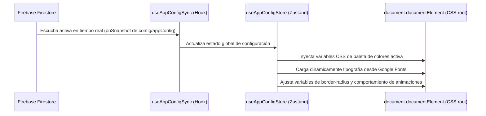

# Manual de Configuración de Marca y Variables Ecosistema

## 1. Propósito y Visión General
Este manual detalla el funcionamiento de la arquitectura multi-marca y Ecosistema dinámica de **App Ventas**. La plataforma está diseñada para personalizar dinámicamente toda la experiencia visual (colores, fuentes, logos, bordes, animaciones) y de negocio (feature flags de créditos, cupones y reclamos) leyendo la configuración en tiempo real desde Firebase Firestore.

Esto elimina la necesidad de compilar compilaciones estáticas diferentes para cada cliente, permitiendo correr múltiples marcas desde la misma base de código.

---

## 2. Arquitectura y Flujo de Datos

El ciclo de personalización opera a través de un flujo híbrido sincronizado:



### Paletas de Colores de Marca Soportadas
El sistema cuenta con un mapeo de 8 temas principales (claros y oscuros). Al cambiar el atributo `theme` en la configuración de la base de datos, el archivo `App.jsx` inyecta automáticamente los siguientes tokens en el DOM:
* `--color-primary`: Color de realce principal.
* `--color-secondary`: Color secundario de fondos suaves.
* `--color-action`: Color de compra (Botones del carrito/checkout).
* `--color-bg`: Fondo de pantalla global de la app.
* `--color-surface`: Color de las tarjetas y modales interactivos.

---

## 3. Guía de Integración y Despliegue de un Nuevo Cliente (Paso a Paso)

Para desplegar la aplicación para un nuevo negocio cliente, sigue estos tres pasos sencillos:

### Paso 1: Configurar el Entorno del Cliente
Crea o edita el archivo `.env.local` en la raíz del proyecto para conectar el build con el nuevo proyecto de Firebase de tu cliente:
```env
VITE_FIREBASE_API_KEY="tu-api-key"
VITE_FIREBASE_AUTH_DOMAIN="tu-auth-domain"
VITE_FIREBASE_PROJECT_ID="tu-proyecto-id"
VITE_FIREBASE_STORAGE_BUCKET="tu-storage-bucket"
VITE_FIREBASE_MESSAGING_SENDER_ID="tu-sender-id"
VITE_FIREBASE_APP_ID="tu-app-id"
```

### Paso 2: Siembra de Datos (Seeding de Firestore)
1. Descarga el archivo de credenciales JSON de tu cuenta de servicio desde la consola de Firebase (`Configuración del Proyecto` -> `Cuentas de Servicio` -> `Generar nueva clave privada`).
2. Guarda el archivo con el nombre `firebase-service-account.json` dentro del directorio `scratch/` en la raíz de tu proyecto (ej: `D:\PROTOTIPE\Plantillas Core\App Ventas\scratch\`).
3. Ejecuta el script de siembra para poblar de forma automática todas las colecciones iniciales necesarias:
   ```bash
   node scratch/seed_brand.js
   ```

### Paso 3: Lanzar la Aplicación
Una vez sembrada la base de datos, inicia el servidor de desarrollo local:
   ```bash
   npm run dev
   ```
La aplicación leerá de inmediato la configuración sembrada en Firestore y configurará el tema visual por defecto (`morado-premium`).

---

## 4. Preguntas Frecuentes y Solución de Problemas (Troubleshooting)

#### ❓ ¿Cómo puedo editar en vivo el nombre o colores del cliente?
Como administrador de la app, navega a la sección de **Ajustes de Administrador** en el panel, o edita directamente los campos en el documento `config/appConfig` en la consola de Firebase. La aplicación del cliente se actualizará en tiempo real sin recargar el navegador.

#### ❓ El script de siembra me da un error de credenciales
Asegúrate de que el archivo `firebase-service-account.json` está ubicado exactamente en la carpeta `scratch/` y que pertenece al mismo proyecto de Firebase configurado en tu `.env.local`.

#### ❓ Los botones de compra no tienen el color del tema deseado
El color del botón de compra se rige por la variable `--color-action`. Si deseas forzar un color específico que no sea el primario por defecto del tema, define el campo `actionColor` en hexadecimal dentro de tu configuración de Firestore.
