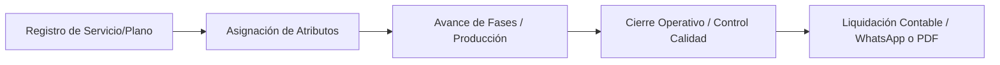

# 🛠️ Manual de Verticales de Servicios y Operaciones Técnicas a la Medida

Este manual proporciona las directrices comerciales, operativas y de modelado de datos para adaptar el motor **PROTOTIPE** a negocios basados en servicios técnicos, talleres y manufactura personalizada en Latinoamérica.

El objetivo principal es permitir a la IA y a los desarrolladores comprender cómo inyectar lógica de negocio dinámica y workflows especializados utilizando la infraestructura base (React, Firebase, Tailwind CSS y Zustand) sin alterar el núcleo compartido de la aplicación.

---

## 🏗️ 1. Arquitectura de Atributos Dinámicos y Flujo de Trabajo

Para evitar el acoplamiento rígido, los negocios que no venden productos de retail ordinarios estructuran su catálogo y deudas en base a dos pilares dinámicos:

1. **Atributos Flexibles (Producto/Variante):** Parámetros clave-valor guardados en la colección `products` (y pasados al carrito/pedidos) que describen las especificaciones de fabricación o servicio.
2. **Lógica de Estados Personalizada (Workflow):** Un campo `status` dentro de la colección `orders` (o `services`) que mapea el progreso operativo en lugar del flujo de entrega tradicional.



---

## 📂 2. Catálogo de Nichos de Servicio y Herramientas Funcionales

A continuación se definen los estándares de implementación para los 8 nichos de servicios más solicitados.

### 2.1 — Tornerías y Talleres de Mecanizado de Precisión
* **Problema a Resolver:** Falta de seguimiento físico del estado de fabricación de piezas únicas y pérdida de planos en papel.
* **Feature Flags Recomendadas:**
  ```json
  {
    "enableDianBilling": false,
    "billingMode": "fixed_per_service",
    "enableDelivery": true,
    "enableKitchen": true // Se usa como "Panel de Torneado/Bodega"
  }
  ```
* **Esquema de Datos (Atributos en Firestore):**
  ```json
  "atributos": {
    "material": "Bronce SAE 64",
    "diametro": "2.5 pulgadas",
    "tipoRosca": "NPT 1/2",
    "tolerancia": "0.02 mm",
    "planosUrl": "https://firebasestorage.googleapis.com/.../plano.pdf"
  }
  ```
* **Workflow Operativo (`orderStatus`):**
  `recibido` → `en_disenio` → `torneado` → `fresado` → `control_calidad` → `listo_para_entrega`
* **Mensaje de WhatsApp Formateado:**
  > 🛠️ *[NombreTaller]*: Hola *{cliente}*, tu orden de mecanizado para la pieza *{item}* (*{atributos.material}*, *{atributos.diametro}*) ha pasado al estado: **{orderStatus}**. Puedes ver el plano y avance aquí: *{linkSeguimiento}*

---

### 2.2 — Mantenimiento de Refrigeración, Aire Acondicionado y Climatización
* **Problema a Resolver:** Reportar diagnósticos de parámetros técnicos y antes/después del estado del equipo en sitio.
* **Feature Flags Recomendadas:**
  ```json
  {
    "enableCredits": true,
    "billingMode": "percentage",
    "employeePortal": true // Permite loguear técnicos con firma
  }
  ```
* **Esquema de Datos (Atributos en Firestore):**
  ```json
  "atributos": {
    "marcaEquipo": "York Industrial",
    "capacidadBTU": "24000",
    "presionGasPSI": "65",
    "voltajeLectura": "220V",
    "firmaClienteUrl": "https://firebasestorage.googleapis.com/.../firma.png"
  }
  ```
* **Workflow Operativo (`orderStatus`):**
  `agendado` → `diagnostico` → `espera_repuestos` → `en_mantenimiento` → `pruebas_operativas` → `completado`
* **Plantilla de Recibo / Orden de Servicio PDF:**
  Cabecera con los campos de lectura del instrumento (PSI, Voltaje) y el renderizado gráfico de la firma del cliente al pie del reporte.

---

### 2.3 — Contratistas, Electricistas y Pintores
* **Problema a Resolver:** Cotización manual de presupuestos en sitio combinando insumos físicos con mano de obra por metros cuadrados.
* **Feature Flags Recomendadas:**
  ```json
  {
    "enableCredits": true,
    "billingMode": "flat_monthly"
  }
  ```
* **Esquema de Datos (Atributos en Firestore):**
  ```json
  "atributos": {
    "unidadMedida": "Metros Cuadrados",
    "cantidadMetros": "85",
    "tipoMaterial": "Pintura Tipo 1 Lavable",
    "manoObraCosto": 450000,
    "herramientasAdicionales": "Andamios telescópicos"
  }
  ```
* **Workflow Operativo (`orderStatus`):**
  `cotizado` → `aprobado_cliente` → `anticipo_recibido` → `obra_iniciada` → `inspeccion` → `entregado`
* **Mensaje de WhatsApp Formateado:**
  > 📐 *[Contratista]*: Hola *{cliente}*, adjuntamos la cotización para el servicio de *{item}* (*{atributos.cantidadMetros}* *{atributos.unidadMedida}*). Total Materiales: *{totalMateriales}*, Mano de Obra: *{atributos.manoObraCosto}*. Link del presupuesto PDF: *{linkPdf}*

---

### 2.4 — Alquiler de Maquinaria y Equipos de Construcción
* **Problema a Resolver:** Control de stock móvil (disponible vs alquilado), cálculo de depósitos de garantía e históricos de retornos atrasados.
* **Feature Flags Recomendadas:**
  ```json
  {
    "enableCredits": true,
    "enableDelivery": true
  }
  ```
* **Esquema de Datos (Atributos en Firestore):**
  ```json
  "atributos": {
    "diasRenta": 15,
    "fechaRetorno": "2026-06-19",
    "depositoGarantia": 300000,
    "direccionObra": "Calle 45 Sur #20-10",
    "operadorRequerido": false
  }
  ```
* **Workflow Operativo (`orderStatus`):**
  `reservado` → `entregado_en_obra` → `activo` → `devolucion_pendiente` → `retornado` → `liquidado`
* **Lógica Financiera:**
  El cobro se calcula dinámicamente multiplicando `diasRenta` * `precioBaseDia` + `depositoGarantia` (reembolsable).

---

### 2.5 — Carpinterías y Fábricas de Muebles Personalizados
* **Problema a Resolver:** Definición exacta del despiece, color de lámina, marca de herrajes y coordinación de visitas técnicas.
* **Feature Flags Recomendadas:**
  ```json
  {
    "enableCredits": true,
    "enableKitchen": true // Se usa como "Panel de Ensamble y Despiece"
  }
  ```
* **Esquema de Datos (Atributos en Firestore):**
  ```json
  "atributos": {
    "tipoMadera": "MDF Melamina 18mm",
    "colorAcabado": "Roble Ceniza",
    "herrajesMarca": "Häfele Cierre Lento",
    "dimensiones": "2.40m x 1.80m x 0.60m",
    "fechaInstalacion": "2026-06-25"
  }
  ```
* **Workflow Operativo (`orderStatus`):**
  `medidas_tomadas` → `disenio_3d_aprobado` → `corte_tableros` → `ensamble` → `en_transito` → `instalado`

---

### 2.6 — Lavanderías y Servicios de Tintorería
* **Problema a Resolver:** Control visual de manchas o roturas de prendas al ingresar para evitar reclamos indebidos del cliente.
* **Feature Flags Recomendadas:**
  ```json
  {
    "enableDelivery": true,
    "employeePortal": true
  }
  ```
* **Esquema de Datos (Atributos en Firestore):**
  ```json
  "atributos": {
    "tipoPrenda": "Abrigo de paño",
    "colorPrenda": "Negro",
    "dañosDetectados": "Descosido bolsillo derecho",
    "manchasRegistradas": "Mancha cuello (tinta)",
    "fotoIngresoUrl": "https://firebasestorage.googleapis.com/.../abrigo.jpg"
  }
  ```
* **Workflow Operativo (`orderStatus`):**
  `ingresado` → `en_lavado` → `secado` → `planchado` → `empaquetado` → `entregado`

---

### 2.7 — Reparación y Tapicería de Muebles
* **Problema a Resolver:** Registro de materiales a restaurar y cálculo del metraje de tela o espuma requerido.
* **Feature Flags Recomendadas:**
  ```json
  {
    "enableCredits": true,
    "enableKitchen": true // Se usa como "Taller de Tapizado"
  }
  ```
* **Esquema de Datos (Atributos en Firestore):**
  ```json
  "atributos": {
    "muebleOriginal": "Sofá 3 Puestos",
    "tipoTelaSeleccionada": "Microfibra Anti-rasguños",
    "codigoColorTela": "Gris-Grafito #4A4A4A",
    "densidadEspuma": "D30 Alta Densidad",
    "metrajeRequerido": "12 metros"
  }
  ```
* **Workflow Operativo (`orderStatus`):**
  `evaluado` → `desarmado` → `reparacion_estructura` → `esponjado` → `tapizado` → `acabados_finales` → `completado`

---

### 2.8 — Consultorios de Bienestar, Podología y Estética
* **Problema a Resolver:** Control de historial por sesiones, recordatorios automatizados de citas y asignación de terapeuta.
* **Feature Flags Recomendadas:**
  ```json
  {
    "employeePortal": true,
    "billingMode": "fixed_per_service"
  }
  ```
* **Esquema de Datos (Atributos en Firestore):**
  ```json
  "atributos": {
    "diagnosticoInicial": "Onicocriptosis bilateral en hallux",
    "numeroSesion": "Sesión 1 de 3",
    "terapeutaAsignado": "Dra. Carolina Gómez",
    "proximaCita": "2026-06-11 15:30",
    "observacionesSesion": "Se realiza curación y espiculaectomía."
  }
  ```
* **Workflow Operativo (`orderStatus`):**
  `cira_agendada` → `en_sala` → `tratamiento` → `agendamiento_proxima` → `completado`

---

## 🛠️ 3. Directivas de Implementación para la IA

Cuando el usuario solicite implementar o migrar un módulo para cualquiera de estos nichos, la IA debe seguir estas reglas:

1. **Agnosticismo del Componente de Visualización:**
   * La visualización en el carrito (`CartDrawer`), los detalles del producto (`ProductDetailPage`) y la tarjeta de administración (`OrderCard`) **deben** recorrer el objeto `atributos` dinámicamente usando `Object.entries(atributos)` o mapear claves genéricas.
   * Queda estrictamente prohibido codificar nombres de campos como "Talla" o "Color" a nivel de Core. Usa variables localizadas o renderizadores iterativos llave-valor.
2. **Modularización de Componentes de Captura:**
   * Si un nicho requiere una captura de datos muy específica (ej: canvas para la firma digital o checklist de diagnósticos), este código debe encapsularse en un componente atómico portátil bajo `/src/components/ui/` o `/src/components/common/` y documentarse en la biblioteca de componentes.
3. **Persistencia Sólida en Firestore:**
   * Todo atributo dinámico recopilado en el flujo del cliente debe guardarse en el objeto `atributos` de la colección `orders` (y en el array `items`) para que la telemetría y el PDF lean de la misma fuente estructurada de datos.
