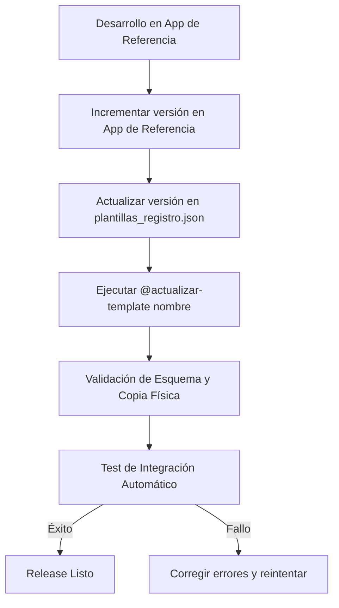

# 🚀 Protocolo de Releases y Versionado SemVer de Plantillas

Este documento establece el protocolo estándar para la gestión de versiones, actualización del registro central y despliegue de las plantillas base en el ecosistema **PROTOTIPE**. 

---

## 📌 1. Reglas de Versionado SemVer (x.y.z)

Cada plantilla declarada en `plantillas_registro.json` debe incrementar su versión en base a la naturaleza del cambio aplicado en la aplicación de referencia (fuente):

### 🐞 PATCH (`x.y.z` ➔ `x.y.z+1`)
Se utiliza para cambios cosméticos, correcciones de errores que no alteran la interfaz del programador ni los esquemas de datos:
*   Corrección de importaciones rotas o rutas relativas.
*   Ajustes estéticos menores (espaciados, colores HSL locales) sin cambiar propiedades CSS principales.
*   Tratamiento de excepciones locales (`try/catch` adicionales).
*   Limpieza de logs y refactorización interna invisible para el usuario final.

### 🌟 MINOR (`x.y.z` ➔ `x.y+1.0`)
Se utiliza cuando se añade valor funcional sin romper la compatibilidad hacia atrás en la inicialización:
*   Adición de un nuevo componente en `src/components/ui/` o `src/components/common/`.
*   Implementación de un nuevo Hook de React o Store de Zustand.
*   Actualización menor de dependencias npm del template que no requieran cambios de código en otros archivos.
*   Adición de nuevos catálogos o plantillas de datos estáticos opcionales.

### ⚠️ MAJOR (`x.y.z` ➔ `x+1.0.0`)
Se utiliza para cambios estructurales de gran envergadura o actualizaciones incompatibles:
*   Actualización de la versión mayor del Core (ej: Migrar de React 18 a React 19).
*   Cambios en los esquemas transaccionales de Firestore que requieran nuevas reglas de seguridad (`firestore.rules`) obligatorias.
*   Reestructuración física de carpetas clave definidas en `SYNC_PATHS` (ej: mover `src/store` a `src/context`).
*   Modificaciones en las variables críticas de inicialización del archivo `.env.local` requeridas para que la app compile.

---

## 🔄 2. Pipeline de Release de Plantillas

Para realizar la liberación de una nueva versión de plantilla, se debe seguir estrictamente este flujo secuencial:



### Paso 1: Modificación de la Fuente
Realiza los cambios y asegúrate de que la app de referencia compile y funcione perfectamente en su entorno local (`npm run build`).

### Paso 2: Incremento de Versión en el Registro
Abre [plantillas_registro.json](file:///D:/PROTOTIPE/Prototipe-CLI/plantillas_registro.json) e incrementa el campo `version` de la plantilla que vas a actualizar siguiendo las reglas SemVer antes de sincronizar.

### Paso 3: Disparo de Sincronización y Pruebas
Ejecuta el disparador rápido desde el chat:
```bash
# Sincroniza, sanitiza credenciales y corre los tests de compilación aislada
npm run sync:full <nombre_plantilla>
```
*Si estás conversando con la IA, puedes indicarle:* **`@actualizar-template <nombre_plantilla>`** *para que realice todo el proceso automáticamente.*

### Paso 4: Verificación
El pipeline automáticamente:
1. Copiará el template limpio a un directorio temporal aislado (`os.tmpdir()`).
2. Correrá `npm install` y `npm run build`.
3. Verificará que el artefacto `dist/index.html` contenga los assets compilados de producción.
4. Si pasa con `✓ PASSED`, la versión se considera oficialmente liberada para el aprovisionamiento de nuevos clientes.

---

## 🛠️ 3. Acciones correctivas ante fallos de Build

Si la prueba de compilación (`test_templates.js`) emite un resultado de `✗ FAILED`, detén inmediatamente el despliegue de esa plantilla y sigue estas pautas:

1. **Revisión de Logs:** Corre el test con salida detallada para ver el error de Vite:
   ```bash
   node test_templates.js --template <nombre_plantilla> --verbose
   ```
2. **Conservación de Entorno Temporal:** Si el error es difícil de diagnosticar, ejecuta:
   ```bash
   node test_templates.js --template <nombre_plantilla> --keep-temp
   ```
   Abre la carpeta temporal que reporta el script para inspeccionar los archivos compilados exactamente en el mismo estado en que fallaron.
3. **Corregir en Origen:** Realiza las correcciones de código siempre en la aplicación fuente de referencia, **nunca** directamente en el temporal ni en la carpeta `templates/` del CLI (para no romper la sincronía).
4. **Re-sincronizar:** Repite el comando `sync:full` una vez solucionado el bug en la fuente.
