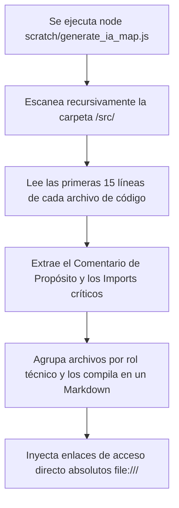

# Manual de Desarrollo: Generación y Uso de Mapas Semánticos para IA

## 1. Propósito y Visión General
El **Generador de Mapas de Arquitectura para IA** (`generate_ia_map.js`) es una herramienta de productividad extrema diseñada para automatizar la asimilación técnica de cualquier proyecto por parte de modelos de Inteligencia Artificial (como Gemini, GPT, Claude). 

Al escanear el disco y leer la cabecera funcional de cada archivo, el script compila una tabla con **rutas absolutas clicables** y dependencias críticas. Esto permite que cualquier IA entienda el 100% de la arquitectura física del código en un solo turno, eliminando la necesidad de realizar búsquedas recursivas lentas en el espacio de trabajo.

---

## 2. Flujo Operativo de Indexación

El script de mapeo funciona mediante una lectura estática recursiva de metadatos en tres etapas:



### Clasificación Automática de Roles
El script lee la estructura de carpetas y el contenido físico del archivo para determinar con precisión cuál es su responsabilidad técnica:
* **Página / Vista:** Archivos dentro de `/pages/` que controlan el viewport del usuario.
* **Componente UI:** Archivos en `/components/` reutilizables visualmente.
* **Estado Global:** Stores de Zustand en `/store/` que sincronizan variables.
* **Hook Custom:** Lógica reactiva extraída en `/hooks/`.
* **Servicios de Backend / API:** Clases de integración de base de datos en `/services/`.

---

## 3. Guía de Uso del Script en Nuevos Proyectos (Paso a Paso)

### Paso 1: Copiar el Script al Nuevo Proyecto
Cuando inicies el desarrollo de una nueva aplicación a medida para un cliente, copia el archivo del script dentro de su directorio de utilidades o scripts locales (por ejemplo, en la carpeta `/scratch/` o `/scripts/`):
👉 `/scratch/generate_ia_map.js`

### Paso 2: Ejecutar la Indexación Automática (Parametrización Dinámica)
Abre tu consola en el nuevo proyecto y ejecuta el script con Node. Puedes correrlo de tres maneras según la estructura del proyecto:

1. **Uso Estándar (Por defecto):**
   Si tu proyecto usa la carpeta `/src/` y deseas generar el mapa en la raíz:
   ```bash
   node scratch/generate_ia_map.js
   ```

2. **Personalizando la Carpeta de Origen (`--src`):**
   Si tu proyecto usa otra estructura (por ejemplo, `/app/` en Next.js):
   ```bash
   node scratch/generate_ia_map.js --src=app
   ```

3. **Personalizando el Archivo de Salida (`--output`):**
   Si quieres guardar el mapa con otro nombre o en otro directorio:
   ```bash
   node scratch/generate_ia_map.js --output=documentacion/mapa_para_ia.md
   ```

4. **Combinado:**
   ```bash
   node scratch/generate_ia_map.js --src=app --output=doc/mapa_ia.md
   ```

El script procesará los archivos y generará al instante el archivo Markdown centralizador especificado.

### Paso 3: Cómo pasárselo a la IA para arranques rápidos
Cuando inicies una nueva conversación con una IA para pedirle modificaciones o auditorías en ese nuevo proyecto, copia y pega este prompt inicial en el chat:

> 💡 **PROMPT DE ARRANQUE RECOMENDADO PARA LA IA:**
> *"Hola. Estoy trabajando en un proyecto de software. He generado un mapa semántico de su arquitectura en el archivo `mapa_arquitectura_ia.md` (o la ruta correspondiente). Por favor, lee de forma prioritaria este archivo. Úsalo como tu guía de navegación. Cuando me propongas cambios de código o necesites leer archivos, accede a ellos directamente utilizando las rutas absolutas (`file:///...`) especificadas en la tabla de ese mapa. De esta forma evitarás búsquedas lentas en el espacio de trabajo."*

---

## 4. Preguntas Frecuentes y Solución de Problemas (Troubleshooting)

#### ❓ El mapa de la IA me dice que el propósito es "Componente o módulo funcional..."
Esto ocurre si el archivo de código no tiene ningún comentario aclaratorio en sus primeras 15 líneas. Para optimizar el mapa, acostumbra a colocar siempre un breve comentario descriptivo de una línea en la cabecera de tus componentes. El script lo capturará automáticamente en el próximo escaneo.

#### ❓ ¿El script requiere instalar dependencias adicionales?
No. El script está escrito utilizando APIs nativas de Node.js (`fs` y `path`), por lo que se ejecuta de manera directa sin necesidad de hacer `npm install` ni añadir librerías al `package.json` de tu nuevo proyecto.

#### ❓ ¿Qué pasa si añado nuevos archivos al proyecto?
Simplemente vuelve a ejecutar `node scratch/generate_ia_map.js` para regenerar el mapa con la estructura y archivos actualizados en segundos. Podrías incluso integrarlo en tus scripts de `package.json` para que se ejecute automáticamente antes de cada compilación:
```json
"scripts": {
  "build": "node scratch/generate_ia_map.js && vite build"
}
```
