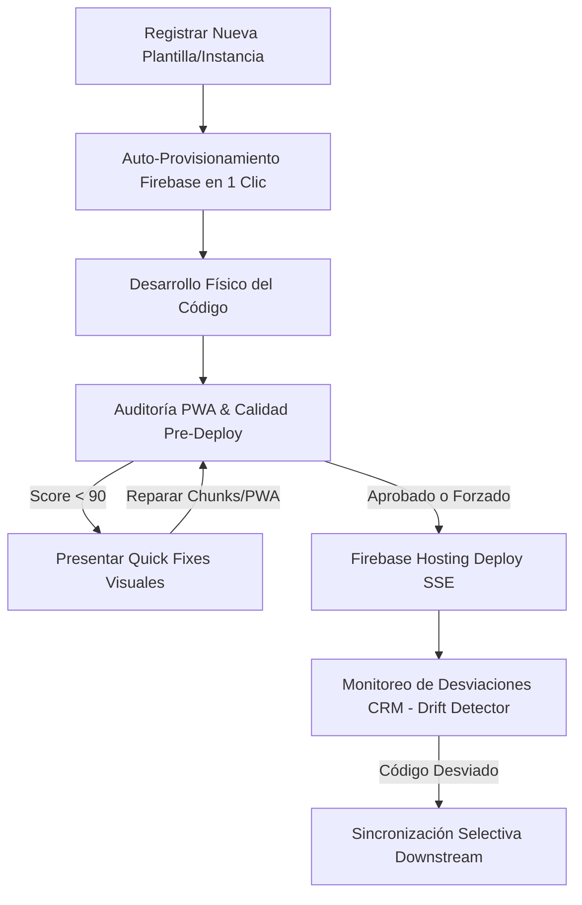

# 🧠 Análisis de Automatización & Propuesta de Integración Visual (Dashboard)

## 1. Análisis de Coherencia e Integridad del Ecosistema

El flujo de aprovisionamiento, calidad y despliegue del ecosistema PROTOTIPE se encuentra unificado bajo la arquitectura de **Bridge CLI** (`server.js`) y el cliente **Dev Dashboard**. 

Las modificaciones recientes (como el resolvedor de Firebase sin pasos manuales y el auditor síncrono pre-deploy) encajan de manera coherente sin alterar el core del negocio, logrando tres mejoras críticas:
* **Cero Configuraciones Manuales:** El Bridge CLI se encarga de crear el proyecto en la nube o asociarlo analizando la cuenta de Firebase conectada.
* **Seguridad Transaccional:** El despliegue de hosting no se puede realizar si el auditor local detecta vulnerabilidades críticas de seguridad o rendimiento (ej. falta de Service Worker o chunks demasiado grandes), asegurando que el código liberado sea siempre de grado premium.
* **Trazabilidad de Código (Paridad CRM):** El detector de desviaciones (Drift API) valida en tiempo real si el código del cliente se desvía de la plantilla de referencia, previniendo la degradación del software a largo plazo.

---

## 2. Propuesta de Integración Visual en el Dashboard

Para consolidar estas herramientas en el flujo diario del desarrollador, proponemos estructurar visualmente las siguientes secciones en la interfaz del **Dev Dashboard**:

### 📊 1. Tarjeta Resumen de Paridad de Código en Cores
* **Concepto:** Mostrar directamente en la tarjeta de cada Core de la lista principal su índice de paridad.
* **Interfaz:** Un pequeño indicador tipo badge con degradado (ej: `100% Sincronizado` en verde, o `87% Desviado` en ámbar).
* **Acción rápida:** Un botón de "Ver Desviaciones" que redirija al modal de comparación y diffs de código.

### 🌐 2. Hub de Aprovisionamiento Firestore & Hosting
* **Concepto:** En el asistente de creación de nuevos proyectos ("Nueva Instancia"), añadir un switch de control interactivo: `Auto-Provisionar Firebase`.
* **Interfaz:** Al activarlo, muestra los medidores de progreso en tiempo real de:
  - `[x]` Creación de Proyecto Firebase
  - `[x]` Inicialización de Base de Datos Firestore (nam5)
  - `[x]` Creación de Web App en Cloud
  - `[x]` Despliegue inicial de reglas e índices
* **Resultado:** Todo en una sola vista con barras de carga y retroalimentación fluida sin recurrir a la terminal.

### ⚡ 3. Control de Quick Fixes Inline
* **Concepto:** Dentro del panel de auditoría, renderizar los botones de reparación rápida de forma proactiva.
* **Interfaz:** Tarjetas de sugerencias con botones interactivos HSL (ej: "Dividir Bundles pesados con Code Splitting", "Generar assets PWA con logos automáticos"). Al hacer clic, ejecuta la corrección física y recalcula el score de calidad al instante.

---

## 🔄 Flujo de Trabajo Integrado (Workflow)

