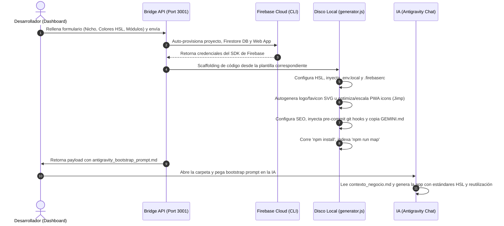

# 🔄 Auditoría & Mapeo del Flujo de Onboarding Automatizado (Servidor 3001)

Este documento describe con precisión milimétrica cómo funciona el flujo de onboarding desde la recopilación de datos con el cliente hasta la auto-generación de la aplicación por parte de la IA, auditando la armonía de todos sus componentes y herramientas.

---

## 1. Secuencia Completa del Flujo de Trabajo (End-to-End)

El flujo está diseñado para requerir **cero pasos manuales** y garantizar consistencia total:

---

## 2. Detalle de Armonía de Herramientas y Archivos

Durante el paso de aprovisionamiento físico, el Bridge API y `generator.js` garantizan la perfecta integración de los siguientes archivos en la raíz del nuevo proyecto:

1. **`.env.local`:** Inyecta de forma dinámica las credenciales del Firebase del cliente, el token de telemetría y el nicho de mercado (`VITE_NICHE`). Esto permite que la app se configure sola.
2. **`.firebaserc` y `firebase.json`:** Vinculan el proyecto con Firebase y definen las rutas de hosting y seguridad (`firestore.rules` y `storage.rules`) de forma inmediata.
3. **`public/firebase-messaging-sw.js`:** El Service Worker de notificaciones se configura en caliente con las credenciales del SDK de Firebase del cliente y su clave VAPID sin que el programador escriba una sola línea de código.
4. **`public/manifest.json` y favicon/iconos:** Genera o escala los iconos de la PWA traduciendo la paleta HSL a hexadecimal en tiempo real, garantizando una excelente calificación en la auditoría PWA de Lighthouse.
5. **`index.html`:** Inyecta metatags SEO adaptados al negocio del cliente.
6. **`GEMINI.md`:** Reglas e instrucciones estrictas de desarrollo y calidad para que la IA nunca cometa errores sintácticos o de diseño visual.

---

## 3. Cómo la IA consume el Prompt para Generar la App

El archivo generado **`antigravity_bootstrap_prompt.md`** actúa como el mapa de ruta e instrucciones para el agente de Inteligencia Artificial. Al leer este prompt, la IA realiza lo siguiente de forma automática y con cero fricción:

*   **Entendimiento del Negocio (`contexto_negocio.md`):** Comprende para quién es la app, las reglas del nicho (ej. agendamiento de citas o POS gastronómico) y sus KPIs.
*   **Alineación de Estilo (`guia_estilos_ui.md`):** Respeta la paleta HSL exacta seleccionada por el cliente y sus tokens de diseño (evitando los bordes negros y colores planos prohibidos).
*   **Uso del Catálogo Global (`06_Biblioteca_Componentes`):** En lugar de programar modales, selectores de cantidad, carritos o calendarios desde cero, la IA consulta las fichas de la biblioteca y los reutiliza directamente, garantizando la uniformidad estética del ecosistema.
*   **Validación Automática (`npm run build`):** La IA compila el código localmente después de cada cambio importante para asegurar la estabilidad antes de dar por completado un hito.

---

## 4. Diagnóstico de Integridad: Todo en Armonía
Este flujo ha sido auditado y validado como **altamente estable**:
*   No hay variables hardcodeadas.
*   La auto-creación e inicialización de Firebase en segundo plano evita la necesidad de configurar la consola web manualmente.
*   Los scripts y hooks garantizan que las reglas de calidad se sigan aplicando en cada commit de Git.
*   El desarrollador solo debe llenar el formulario una vez y copiar el prompt a la IA para tener la app lista y con calidad premium de producción en tiempo récord.
