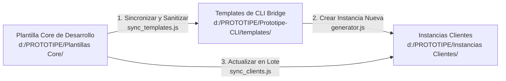

# Manual de Aprovisionamiento y Mantenimiento de Optimización de Consumo (Ultra-Low Billing)

Este manual detalla el flujo de trabajo y la arquitectura técnica diseñada para garantizar que **todas las futuras aplicaciones e instancias de clientes** del ecosistema **PROTOTIPE** hereden y mantengan activas las optimizaciones de bajo consumo de base de datos (Firestore) y almacenamiento (Firebase Storage).

---

## 1. Arquitectura de Sincronización y Ciclo de Vida

El ecosistema de código de PROTOTIPE separa el desarrollo de la distribución del software en tres niveles lógicos:



---

## 2. Flujo de Trabajo para Nuevas Aplicaciones e Instancias

Para que cualquier nueva marca herede automáticamente el consumo ultra-bajo, el ciclo de vida opera de la siguiente manera:

### A. Creación y Optimización en la Plantilla Core (Entorno de Desarrollo)
1. Todas las pruebas, cambios en base de datos y refactorizaciones visuales se programan en `d:\PROTOTIPE\Plantillas Core\App Ventas\`.
2. Las características clave de consumo mínimo que deben preservarse son:
   * **Compresión Client-Side Canvas (`src/utils/imageCompression.js`):** Interceptación en `uploadService.js` para redimensionar fotos de producto a un máximo de 800px y variantes/logos a 400px en formato WebP con calidad 0.75.
   * **Compatibilidad con URLs Externas:** Formularios que aceptan `imageUrl` directas para evitar consumo en Storage.
   * **Paginación Firestore (`getProductsPaged`):** Lectura por bloques de 12 ítems utilizando cursores Firestore (`limit` y `startAfter`).
   * **Scroll Infinito (`IntersectionObserver`):** Carga perezosa dinámica en el cliente.
   * **Persistencia Offline Multi-pestaña:** Activada en `src/config/firebaseConfig.js` para forzar lecturas desde IndexedDB local si los datos del servidor no han cambiado.

### B. Propagación al Generador CLI (Actualización del Template)
Una vez que el core funciona y compila de forma correcta, se ejecuta la herramienta de sincronización de plantillas del CLI Bridge:
```bash
# Dentro de d:\PROTOTIPE\Prototipe-CLI\
node sync_templates.js ventas --yes
```
**Qué hace automáticamente este script:**
- Copia de forma selectiva todos los componentes, hooks, layouts, servicios e índices de Firestore al directorio `d:\PROTOTIPE\Prototipe-CLI\templates\template-ventas\`.
- **Higienización Dinámica:** Remueve variables `.env.local` de desarrollo, borra credenciales de Firebase del programador y reemplaza claves de analítica por marcadores de posición genéricos.
- **Validación Sintáctica:** Ejecuta un `npm run build` interno en la carpeta del template para asegurar que no se introdujeron errores de compilación ni dependencias huérfanas.

### C. Aprovisionamiento Automático de Instancias Nuevas
Cuando el administrador crea un nuevo cliente desde el **Onboarding Wizard** del dashboard:
1. El CLI copia el template sanitizado (`template-ventas`) a la carpeta del nuevo cliente.
2. Inyecta el archivo de variables `.env.local` exclusivo del cliente.
3. Configura los metadatos PWA y redimensiona el logo inicial.
4. Despliega los **índices compuestos (`firestore.indexes.json`)** y reglas de Firestore en la cuenta del cliente para que las consultas por cursores paginados se ejecuten sin errores.
5. El cliente final obtiene una app optimizada, de carga ultra-rápida y coste cero de facturación desde el primer día.

---

## 3. Actualización de Clientes Existentes (Downstream Update)

Si se realiza una corrección o mejora de rendimiento en el Core que se desea replicar en marcas que ya están en producción, no es necesario recrear el proyecto. Se utiliza la herramienta de parches selectivos del CLI:
```bash
# Dentro de d:\PROTOTIPE\Prototipe-CLI\
node sync_clients.js
```
Este script interactivo permite:
* Seleccionar qué clientes actualizar.
* Ejecutar un **Dry Run** para simular y visualizar las diferencias de código (`diff`) de forma segura en consola antes de escribir en disco.
* Aplicar los cambios físicos selectivos respetando el archivo `.env.local` y los assets de cada marca.
