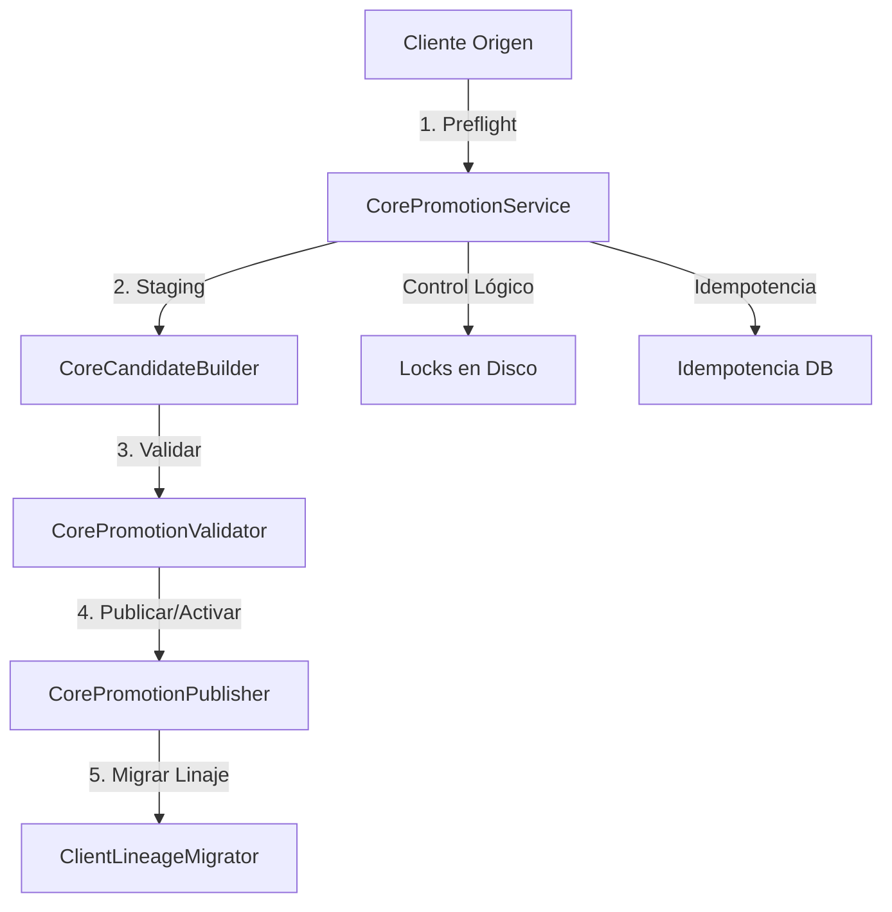

# Manual de Promoción de Instancias Clientes a Plantillas Core

Este documento detalla la arquitectura, políticas de seguridad, flujos transaccionales y mecanismos de operación y recuperación del **Pipeline de Promoción y Migración de Cores** del ecosistema PROTOTIPE. Permite a cualquier desarrollador u agente de IA comprender, mantener y extender este pipeline de manera autónoma.

---

## 1. Propósito y Alcance

El pipeline de promoción y migración permite clonar una instancia cliente activa configurada en el monorepo y promoverla para convertirla en una **Plantilla Core** genérica, limpia y reutilizable para futuros clientes. También habilita la actualización transaccional de otros clientes existentes para alinearlos con la versión final del nuevo core de forma idempotente y con garantías de rollback en caliente.

## 2. Problema que Resuelve

1. **Acoplamiento de marca:** Automatiza la remoción de logos, identificadores específicos del cliente, PII (información personal identificable) y secretos en archivos de configuración.
2. **Deriva Lógica (Drifts):** Evita la asimetría de código y características (features) al validar que la instancia origen cumpla estrictamente con el **Feature Registry** local antes de la copia.
3. **Falta de Transaccionalidad:** Reemplaza los procesos manuales propensos a errores en el monorepo por un pipeline transaccional de 4 fases con journal de compensación, garantizando que un fallo a mitad del proceso no corrompa el catálogo de plantillas ni los clientes activos.

## 3. Requisitos Previos

- **Instancia Origen:** Debe estar registrada en `package.json` del monorepo y contar con el archivo de manifiesto `.prototipe.json` y el lockfile `prototipe.lock.json`.
- **Feature Registry:** Todas las features referenciadas en el lockfile del cliente origen deben existir y coincidir en versión con las del archivo global `knowledge/feature-registry.json`.
- **Locks de Concurrencia:** No debe existir ninguna promoción activa del mismo Core destino.

---

## 4. Arquitectura General y Capas

El pipeline se desacopla en un diseño modular de servicios y contratos:



### Capas del Pipeline:
1. **Contratos (Blueprints):** Fichas JSON para registrar el estado de promoción (`CorePromotionBlueprint`) y migración (`ClientLineageMigrationBlueprint`).
2. **Gobernanza de Concurrencia (Locks):** Semáforo basado en disco para evitar colisiones.
3. **Constructor de Candidato (Staging):** Copia selectiva a staging aplicando políticas de exclusión y reescritura de namespaces.
4. **Validadores de Seguridad (Validators):** Escaneo de secretos, credenciales, PII, y ejecución de smoke tests mediante compilación local.
5. **Generador Documental (Governance):** Mapeo de briefing para generar 12 guías Markdown.
6. **Publicador y Activador (Publisher):** Publicación inactiva y primera activación controlando rollbacks.
7. **Migración de Linaje (Migrator):** Portar el linaje del cliente actualizando sus manifiestos lógicos a la nueva plantilla core.

---

## 5. Separación Core / Features

Durante el staging, el pipeline aísla las responsabilidades:
- **Core (Código Base):** Se extrae el esqueleto estructural (rutas principales, layouts presentacionales, hooks comunes y base de datos).
- **Features (Módulos de Negocio):** Se validan contra el feature registry y se extrae su lockfile de dependencias. Las carpetas específicas de features huérfanas en el cliente que no estén registradas en el feature registry local son bloqueadas.

---

## 6. Flujo de Promoción y Migración

El pipeline transiciona a través de estados lógicos controlados:

```
[PENDING_PREFLIGHT]
       ↓ (Preflight exitoso)
[PREFLIGHT_APPROVED]
       ↓ (Ejecución iniciada)
[RUNNING_SANITIZATION] ──(Fallo)──> [FAILED_SANITIZATION]
       ↓ (Sanitización exitosa)
[RUNNING_VALIDATION] ──(PII/Secrets)──> [QUARANTINED]
       ↓ (Validación exitosa)
[RUNNING_BUILD_SMOKE] ──(Linter/Build Error)──> [FAILED_BUILD]
       ↓ (Build y Smoke Test exitoso)
[CANDIDATE_READY]
       ↓ (Publicación)
[PUBLISHED_INACTIVE] ──(Rollback Publicación)──> [ROLLED_BACK]
       ↓ (Activación)
[ACTIVE] ──(Rollback Activación)──> [PUBLISHED_INACTIVE]
```

---

## 7. Servicios Implementados y Responsabilidades

### `CorePromotionService`
*Ubicación:* [`lib/CorePromotionService.js`](file:///d:/PROTOTIPE/Prototipe-CLI/lib/CorePromotionService.js)
- Orquestador del ciclo de vida y máquina de estados.
- Adquisición y liberación de locks físicos (`locks/core-promotion-[coreKey].lock`).
- Validación de idempotencia mediante hashing SHA-256 de payloads.
- Recuperación automática tras caídas del Bridge Express.

### `CoreCandidateBuilder`
*Ubicación:* [`lib/CoreCandidateBuilder.js`](file:///d:/PROTOTIPE/Prototipe-CLI/lib/CoreCandidateBuilder.js)
- Copia selectiva a staging aplicando directivas de `file-policy.json`.
- Reescritura dinámica de namespaces (`test-promotion-client` -> `app-clothing`).
- Extracción HSL: Reemplaza colores estáticos duros por variables semánticas (`var(--color-primary)`).

### `CorePromotionValidator`
*Ubicación:* [`lib/CorePromotionValidator.js`](file:///d:/PROTOTIPE/Prototipe-CLI/lib/CorePromotionValidator.js)
- Escaneo de secretos (Regex estricto de API keys y tokens OAuth).
- Análisis de PII (búsqueda de correos y teléfonos en Markdown/JSON) redirigiendo a cuarentena.
- Validación de dependencias contra el Feature Registry local.
- Extracción y anonimización de seeds de prueba (`public/seed.json`) aplicando `seed-rules.json`.
- Smoke test de compilación (`npm install` y `npm run build` en staging).

### `BriefingDocumentMapper`
*Ubicación:* [`lib/BriefingDocumentMapper.js`](file:///d:/PROTOTIPE/Prototipe-CLI/lib/BriefingDocumentMapper.js)
- Escanea el `briefing.md` del cliente.
- Genera automáticamente 12 documentos de gobernanza en la carpeta `09_Modulos_Completos/Documentacion App [CoreName]`.

### `CorePromotionPublisher`
*Ubicación:* [`lib/CorePromotionPublisher.js`](file:///d:/PROTOTIPE/Prototipe-CLI/lib/CorePromotionPublisher.js)
- Copiado atómico a `Plantillas Core/App [targetCoreName]` (Publicación Inactiva v0.0.1 como fuente maestra inactiva).
- Despliegue en `templates/template-[clave]` (Activación v1.0.0 como espejo sanitizado activo) y actualización del registro físico `plantillas_registro.json`.
- Compensación transaccional utilizando journals históricos de rollback. En el rollback de activación, se conserva la fuente maestra inactiva, mientras que en el rollback de publicación, se elimina la fuente maestra y el registro.

### `ClientLineageMigrator`
*Ubicación:* [`lib/ClientLineageMigrator.js`](file:///d:/PROTOTIPE/Prototipe-CLI/lib/ClientLineageMigrator.js)
- Migración de clientes: actualiza `.prototipe.json`, `prototipe.lock.json` y `package.json` del cliente destino.
- Validador de Drift: calcula el número de diferencias de archivos de código comparándolos con la plantilla final, abortando si difieren.

---

## 8. Políticas de Seguridad e Integridad

### File Policy (`file-policy.json`)
*Ubicación:* [`knowledge/core-promotion/file-policy.json`](file:///d:/PROTOTIPE/Prototipe-CLI/knowledge/core-promotion/file-policy.json)
Regula las acciones para cada archivo del cliente:
- `copy`: copia directa.
- `transform`: aplica reescritura de namespaces y extracción HSL.
- `regenerate`: reconstruye manifiestos limpios desde cero (p. ej. `.prototipe.json`, `package.json`).
- `ignore`: excluye de la copia (p. ej. node_modules, cachés).
- `deny`: bloquea el pipeline si se detecta un archivo no listado.

### Seed Rules (`seed-rules.json`)
*Ubicación:* [`knowledge/core-promotion/seed-rules.json`](file:///d:/PROTOTIPE/Prototipe-CLI/knowledge/core-promotion/seed-rules.json)
- Define colecciones prohibidas (`forbiddenCollections`) que nunca deben incluirse en las semillas (p. ej., `orders`, `transactions`).
- Define colecciones permitidas (`allowedCollections`) y el mapeo de campos permitidos (`allowedFields`) y prohibidos (`forbiddenFields`), forzando la sanitización de datos reales del cliente.

### Detección de Secretos y PII
El pipeline bloquea la promoción si detecta:
- Firebase API Keys (Regex: `AIzaSy[A-Za-z0-9-_]{35}`).
- Correos electrónicos y números de teléfono en archivos Markdown o JSON.

---

## 9. Journal Transaccional de Compensación

Cada operación de escritura mutativa registra sus pasos y artefactos en un archivo JSON en `journals/` antes de aplicarlos.

### Estructura del Journal (`journal.schema.json`)
- **`operationId`:** Prefijo correlativo (`promo-`, `act-`, `mig-`).
- **`steps`:** Lista de sub-acciones. Cada una registra sus `artifacts`:
  - `path`: Ruta del archivo afectado.
  - `artifactType`: `FILE` o `DIRECTORY`.
  - `action`: `CREATE`, `MODIFY` o `DELETE`.
  - `beforeHash` / `afterHash`: Sumas de comprobación SHA-256.
  - `rollbackAction`: Estrategia de reversión (`DELETE_IF_HASH_MATCHES`, `RESTORE_BACKUP_IF_HASH_MATCHES`).
  - `backupPath`: Ruta física del respaldo previo a la modificación.
  - `originalEntryData`: Estructura JSON original si aplica.

---

## 10. Endpoints y Contratos HTTP

Todos los endpoints se autentican vía token e implementan RBAC:

| Método | Endpoint | Permiso RBAC | Descripción |
| :--- | :--- | :--- | :--- |
| **POST** | `/api/project/:clientId/core-promotion/preflight` | `core-promotion:analyze` | Valida lock, paridad de features y genera el Blueprint. |
| **POST** | `/api/project/core-promotion/:promotionId/execute` | `core-promotion:execute` | Corre staging, validación y smoke tests (SSE). |
| **GET** | `/api/project/core-promotion/:promotionId` | `core-promotion:analyze` | Retorna el estado actual del blueprint. |
| **GET** | `/api/project/core-promotion/:promotionId/events` | *Público / SSE* | Retransmite logs de validación en tiempo real. |
| **POST** | `/api/project/core-promotion/:promotionId/publish` | `core-promotion:publish` | Registra el core como inactivo en templates. |
| **POST** | `/api/project/core-promotion/:promotionId/activate` | `core-promotion:activate` | Despliega y activa la versión 1.0.0. |
| **POST** | `/api/project/core-promotion/:promotionId/migration/preflight`| `core-promotion:migrate` | Genera blueprint de migración de linaje para un cliente. |
| **POST** | `/api/project/core-promotion/migration/:migrationId/apply` | `core-promotion:migrate` | Aplica la migración en el cliente destino si no hay drift. |
| **POST** | `/api/project/core-promotion/:promotionId/publication/rollback`| `core-promotion:rollback` | Revierte archivos y registro de la publicación. |
| **POST** | `/api/project/core-promotion/:promotionId/activation/rollback`| `core-promotion:rollback` | Revierte archivos y registro de la activación. |
| **POST** | `/api/project/core-promotion/migration/:migrationId/rollback` | `core-promotion:rollback` | Revierte manifiestos de cliente con comprobación SHA-256. |

---

## 11. Runbook Operacional y Diagnóstico

### 1. Iniciar Preflight y Promoción desde el Dashboard
1. Navega a **Client Lifecycle Panel** en el Dashboard Central.
2. Selecciona la instancia de cliente origen y pulsa **Promocionar Instancia**.
3. Se abrirá el modal interactivo. Introduce la clave del nuevo core (Slug), nombre descriptivo y nicho. Pulsa **Ejecutar Análisis Preflight**.
4. Si se aprueba, pulsa **Comenzar Construcción y Test**.
5. Podrás monitorear los logs de compilación de Vite en la consola interactiva en tiempo real.
6. Si pasa, la interfaz te guiará para **Publicar en Catálogo** (v0.0.1) y posteriormente **Activar y Desplegar Core** (v1.0.0).

### 2. Cómo actuar ante fallos comunes:
- **`QUARANTINED` (PII/Secretos detectados):** Abre el log de consola del modal para identificar en qué archivo se detectó la API key o dato personal. Modifica el archivo en el cliente origen, limpia los datos y vuelve a ejecutar el preflight.
- **`FAILED_BUILD` (Errores de compilación):** El log SSE mostrará las advertencias del linter u hooks no definidos. Corrige los imports en el cliente origen y reintenta.
- **Locks stale (Colisión de Lock):** Si el servidor Bridge se reinició abruptamente, el lock puede quedar huérfano. El motor de locks liberará automáticamente el lock tras 30s de inactividad de heartbeat.

---

## 12. Especificación Detallada de Contratos y Schemas

Para garantizar que otra IA o desarrollador pueda extender el pipeline, a continuación se detallan los contratos implementados en la capa de conocimiento:

### 12.1 CorePromotionBlueprint
- **Ubicación:** [`knowledge/core-promotion/promotion-blueprint.schema.json`](file:///d:/PROTOTIPE/Prototipe-CLI/knowledge/core-promotion/promotion-blueprint.schema.json)
- **Propósito:** Registrar el estado y resultados del análisis/validación del Core promocionado.
- **Productor:** `CorePromotionService` (vía preflight y ejecución del pipeline).
- **Consumidor:** `Dashboard Central (dev-dashboard)` y la UI de visualización.
- **Campos Obligatorios:** `schemaVersion`, `promotionId`, `sourceClientId`, `sourceCoreType`, `sourceCoreVersion`, `targetCoreKey`, `targetCoreName`, `nicho`, `status`, `idempotency`, `features`, `diagnostics`, `createdAt`, `updatedAt`.
- **Enums:**
  - `status`: de `PENDING_PREFLIGHT` a `ROLLED_BACK` / `ACTIVE`.
  - `features.required[].registryStatus`: `REGISTERED`, `MISSING`, `INCOMPATIBLE`.
- **Ejemplo Mínimo Válido:**
```json
{
  "schemaVersion": "1.0.0",
  "promotionId": "promo-app-clothing-123",
  "sourceClientId": "test-client",
  "sourceCoreType": "ventas",
  "sourceCoreVersion": "0.9.5",
  "targetCoreKey": "app-clothing",
  "targetCoreName": "App Clothing Core",
  "nicho": "retail_clothing",
  "status": "CANDIDATE_READY",
  "stagingPath": "D:/PROTOTIPE/Prototipe-CLI/scratch/staging/app-clothing",
  "idempotency": {
    "preflight": "3f9a721b-873e-4fa0-b30f-b2586e9e4210",
    "execute": "4c0b63b2-658b-4b1a-8288-75211993411b",
    "publish": null,
    "activate": null,
    "migrationApply": null
  },
  "features": {
    "required": [
      { "featureId": "ecommerce-cart", "version": "1.2.0", "registryStatus": "REGISTERED" }
    ],
    "optional": [],
    "unregistered": []
  },
  "diagnostics": {
    "piiScan": { "status": "PASSED", "startedAt": "2026-07-11T15:00:00Z", "completedAt": "2026-07-11T15:00:01Z", "errorCode": null },
    "secretsScan": { "status": "PASSED", "startedAt": "2026-07-11T15:00:01Z", "completedAt": "2026-07-11T15:00:02Z", "errorCode": null },
    "architecture": { "status": "PASSED", "startedAt": "2026-07-11T15:00:02Z", "completedAt": "2026-07-11T15:00:03Z", "errorCode": null },
    "dependencies": { "status": "PASSED", "startedAt": "2026-07-11T15:00:03Z", "completedAt": "2026-07-11T15:00:04Z", "errorCode": null },
    "build": { "status": "PASSED", "startedAt": "2026-07-11T15:00:04Z", "completedAt": "2026-07-11T15:00:05Z", "errorCode": null },
    "smokeTest": { "status": "PASSED", "startedAt": "2026-07-11T15:00:05Z", "completedAt": "2026-07-11T15:00:06Z", "errorCode": null },
    "templateParity": { "status": "PASSED", "startedAt": "2026-07-11T15:00:06Z", "completedAt": "2026-07-11T15:00:07Z", "errorCode": null },
    "errors": []
  },
  "createdAt": "2026-07-11T15:00:00Z",
  "updatedAt": "2026-07-11T15:00:07Z"
}
```

### 12.2 ClientLineageMigrationBlueprint
- **Ubicación:** [`knowledge/core-promotion/lineage-migration.schema.json`](file:///d:/PROTOTIPE/Prototipe-CLI/knowledge/core-promotion/lineage-migration.schema.json)
- **Propósito:** Controlar la migración de versión y linaje en clientes destino, validando drifts y hashes SHA-256.
- **Productor:** `ClientLineageMigrator`.
- **Consumidor:** `Dashboard Central` y logs de auditoría.
- **Campos Obligatorios:** `schemaVersion`, `migrationId`, `promotionId`, `status`, `createdAt`, `updatedAt`, `spec`, `results`.
- **Ejemplo Mínimo Válido:**
```json
{
  "schemaVersion": "1.0.0",
  "migrationId": "mig-test-client-123",
  "promotionId": "promo-app-clothing-123",
  "status": "COMPLETED",
  "createdAt": "2026-07-11T15:10:00Z",
  "updatedAt": "2026-07-11T15:11:00Z",
  "spec": {
    "clientId": "test-client",
    "previousCoreType": "ventas",
    "newCoreType": "app-clothing",
    "previousCoreVersion": "0.9.5",
    "newCoreVersion": "1.0.0",
    "hashAlgorithm": "sha256",
    "previousFilesHashes": {
      "src/App.jsx": "e3b0c44298fc1c149afbf4c8996fb92427ae41e4649b934ca495991b7852b855"
    },
    "previousFeatures": ["ecommerce-cart"]
  },
  "results": {
    "backup": {
      "backupIdentifier": "back-test-client-123",
      "backupPath": "D:/PROTOTIPE/Prototipe-CLI/scratch/backups/test-client",
      "verified": true
    },
    "write": {
      "newFilesHashes": {
        "src/App.jsx": "e3b0c44298fc1c149afbf4c8996fb92427ae41e4649b934ca495991b7852b855"
      },
      "newFeatures": ["ecommerce-cart"]
    },
    "postValidation": {
      "driftCount": 0,
      "status": "PASSED"
    },
    "rollback": null,
    "errors": []
  }
}
```

### 12.3 Transactional Journal
- **Ubicación:** [`knowledge/core-promotion/journal.schema.json`](file:///d:/PROTOTIPE/Prototipe-CLI/knowledge/core-promotion/journal.schema.json)
- **Propósito:** Registro previo de escrituras (Write-Ahead Log) para reversión compensatoria.
- **Campos Obligatorios:** `operationId`, `steps[].stepId`, `steps[].status`, `steps[].artifacts[].path`, `steps[].artifacts[].action`, `steps[].artifacts[].rollbackAction`.
- **Enums:**
  - `action`: `CREATE`, `MODIFY`, `DELETE`.
  - `rollbackAction`: `DELETE_IF_HASH_MATCHES`, `RESTORE_BACKUP_IF_HASH_MATCHES`.
- **Ejemplo Mínimo Válido:**
```json
{
  "operationId": "promo-app-clothing-123",
  "steps": [
    {
      "stepId": "CREATE_CLI_TEMPLATE_DIR",
      "status": "COMPLETED",
      "startedAt": "2026-07-11T15:05:00Z",
      "completedAt": "2026-07-11T15:05:02Z",
      "artifacts": [
        {
          "path": "D:/PROTOTIPE/Prototipe-CLI/templates/app-clothing/package.json",
          "artifactType": "FILE",
          "action": "CREATE",
          "beforeHash": null,
          "afterHash": "4fa83e9b72049c3b82df1095914fa6e890c29b71e16f383ca59efb988f0cd63a",
          "rollbackAction": "DELETE_IF_HASH_MATCHES",
          "backupPath": "/backups/pkg.json",
          "originalEntryData": null
        }
      ]
    }
  ]
}
```

---

## 13. Evolución de Versión de Esquema (SemVer de Contratos)

Cuando se requiera mutar o añadir propiedades obligatorias a los JSON schemas:
1. Incrementa la versión en la propiedad constante `"schemaVersion"` del archivo `.schema.json` correspondiente.
2. Inyecta el formateador de compatibilidad heredada (Backwards Compatibility wrapper) en `PromotionBlueprintBuilder.js` para parsear versiones de blueprints antiguos `0.0.1` y mapear sus campos al nuevo esquema.

---

## 14. Suite de Pruebas y Verificación

La suite de integración y robustez valida todos los flujos físicos, validadores, rollbacks y condiciones de seguridad del pipeline transaccional.

### Comando Unificado de Certificación:
```bash
npm run test:core-promotion-certification
```

Este comando ejecuta de forma secuencial y atómica:
1. Schemas, validación unitaria y suite de integración principal (`test_promotion_pipeline.js`).
2. Suite de robustez y casos especiales (`test_robustness_specials.js`): Prototype Pollution, Path Traversal, Symlinks, Seed Rules, Transiciones de estado inválidas, Recuperación, Drift real, y negativas de bypass de autenticación.
3. Smoke Test de Arranque y Health Check del Bridge CLI (`test_bridge_health.js`).
4. Compilación del Dashboard Central de React en producción.

### Resultados de la última verificación:
- **Estado de Certificación:** `IMPLEMENTADO — CERTIFICACIÓN EN PROGRESO`
- **Porcentaje de Cobertura Real:** 88.89% (40 de 45 escenarios cubiertos con tests automatizados reales).
- **Aserciones totales en Suite de Integración:** 37 de 37 pasadas.
- **Aserciones totales en Suite de Robustez:** 30 de 30 pasadas.
- **Salida del Proceso del Servidor:** Exitosa (HTTP 200, código de salida controlado con SIGTERM).
- **Compilación del Dashboard Central:** Exitosa (código 0).
- **Matriz de Cobertura:** Para auditar el detalle de cada uno de los 45 escenarios del plan de pruebas, consulta la [Matriz de Cobertura de Pruebas](file:///D:/PROTOTIPE/Documentacion%20PROTOTIPE/07_Manuales_Desarrollo/Testing/matriz_pruebas_promocion_cores.md).
