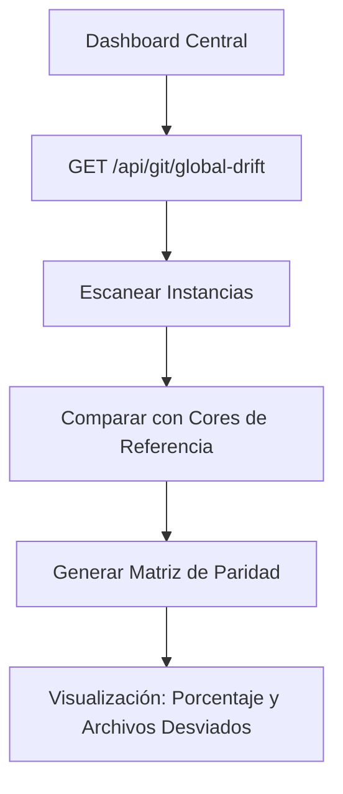

# 🚀 Propuesta de Robustez y Nuevas Funcionalidades para el Ecosistema PROTOTIPE

Este documento detalla el análisis de las herramientas de automatización existentes en el CLI Bridge (`server.js`) y propone 5 módulos avanzados diseñados para simplificar pasos manuales remanentes del desarrollador.

---

## 1. Análisis de Capacidades Actuales (Dashboard + CLI Bridge)

Actualmente, el ecosistema cuenta con automatizaciones clave que comunican el frontend (`dev-dashboard`) con la máquina local y Firebase:
1. **Aprovisionamiento:** Generación de código físico en disco a partir de plantillas core, personalización HSL, compresión de logos con Jimp y autogeneración de manifiestos PWA.
2. **Control de Versiones (Git):** Detección unificada de repositorios por worktree, cálculo de cambios locales aislados por subproyecto, y streaming SSE de respaldos no interactivos (con push y merge condicionales).
3. **Drift Detector (Desviaciones):** Detección recursiva de diferencias de líneas físicas entre el Core de referencia y las instancias de clientes, con sincronización unitaria o en lote de archivos core seguros.
4. **Telemetría e Incidentes:** Escucha en tiempo real de excepciones en Firestore (con de-duplicación por hash y ventana de 5 min) e inyección remota dirigida de simuladores de fallos.
5. **Servidores Locales:** Levantamiento de servidores de desarrollo Vite (`npm run dev`) administrados por subprocesos vinculados al ID de cada cliente.

---

## 2. Puntos de Fricción Manuales Detectados

A pesar del alto grado de automatización, el desarrollador aún realiza procesos manuales que cortan el flujo de trabajo:
1. **Configuración Inicial de Firebase (Seeding):** Después de aprovisionar un cliente y configurar Firebase, el desarrollador debe habilitar manualmente los proveedores de Auth, crear la base de datos Firestore y, críticamente, registrar el documento del administrador en `/users/{uid}` con `role: 'admin'`. Sin este paso, las reglas compuestas de seguridad bloquean el acceso al panel administrativo.
2. **Diagnóstico de Servidores de Desarrollo Locales:** Los servidores locales se levantan en segundo plano, pero si Vite falla al iniciar (por puertos ocupados, errores de importación o fallos de bundler), el dashboard no tiene visibilidad de las olas de salida estándar/error (`stdout`/`stderr`), obligando al desarrollador a abrir una consola física en la carpeta correspondiente.
3. **Visibilidad Global de Paridad de Código (Drift):** Para evaluar desvíos de código, el desarrollador debe inspeccionar cliente por cliente. No existe una vista consolidada que muestre qué clientes están desactualizados respecto al Core.
4. **Mantenimiento y Control de Cambios en Git:** Si un subproyecto tiene modificaciones que se desean descartar o se requiere comparar una línea de código específica antes de hacer un respaldo, el desarrollador debe recurrir a herramientas externas de Git.
5. **Actualización de Dependencias de Terceros:** El Drift Detector actualiza código fuente bajo `/src`, pero si un Core añade un paquete NPM (ej. `canvas-confetti`), no hay manera de ejecutar `npm install` en cascada sobre las instancias de clientes de forma automatizada.

---

## 3. Propuesta 1: Firebase Provisioning & Seeding Assistant

### Propósito y Mecánica
Automatizar la inicialización lógica de la base de datos Firestore y la creación del primer administrador directamente desde el Dashboard.

### Arquitectura Técnica
1. **Endpoint de Siembra (`POST /api/project/firebase/seed`):**
   * El cliente envía las credenciales de Firebase del nuevo proyecto y los datos del primer administrador (email, password y PIN de seguridad).
   * El CLI Bridge utiliza un cliente Firebase en caliente (`firebase-admin` o peticiones REST directas de Auth/Firestore) para:
     1. Registrar el usuario en Firebase Authentication.
     2. Crear el documento `/users/{uid}` con `role: 'admin'`.
     3. Sembrar las colecciones iniciales de base (parámetros de negocio, tasas de impuesto, categorías vacías y plantillas de correo).
2. **Flujo Visual:**
   * Al finalizar el Onboarding Wizard, se habilita una tarjeta: "Siembra de Configuración Inicial".
   * Campos: *Email de Administrador*, *Contraseña* y *PIN*.
   * Botón: `Ejecutar Siembra e Inicializar Base de Datos`.

---

## 4. Propuesta 2: Terminal y Logs de Servidores de Desarrollo en Vivo

### Propósito y Mecánica
Visualizar la consola de Vite en tiempo real para diagnosticar fallos de arranque local o warnings de compilación al modificar código.

### Arquitectura Técnica
1. **Buffering de Logs en Express:**
   * En `server.js`, la variable `devServers` acumulará un buffer de las últimas 100 líneas de `stdout` y `stderr` del subproceso `npm run dev`.
2. **Endpoint de Stream (`GET /api/project/dev/logs-stream?clientId=...`):**
   * Implementa una conexión Server-Sent Events (SSE).
   * Al conectarse, transmite el buffer histórico y mantiene la conexión abierta para canalizar cualquier nueva línea que emita el proceso hijo.
3. **Flujo Visual:**
   * En la fila de cada cliente en el CRM, al estar el servidor `Activo`, aparece un botón con el icono `Terminal` (`Consola de Desarrollo`).
   * Abre un panel colapsable (Drawer) inferior con una consola UNIX oscura mostrando el output de Vite interactivo.

---

## 5. Propuesta 3: Mapa de Calor de Desviación Global (Drift Heatmap)

### Propósito y Mecánica
Centralizar la paridad de código de todo el ecosistema de marcas en una sola pantalla para facilitar actualizaciones masivas de lógica core.

### Arquitectura Técnica
1. **Endpoint Agregado (`GET /api/project/drift/global`):**
   * El servidor realiza el cálculo del Drift de forma asíncrona para todas las instancias registradas concurrentemente, consolidando un objeto con el porcentaje de paridad y la lista de archivos modificados/faltantes por cliente.
2. **Flujo Visual:**
   * Una sub-pestaña en CRM llamada "Matriz de Paridad Ecosistema".
   * Renderiza una tabla/grilla comparativa. Cada celda representa a un cliente y muestra su porcentaje de paridad global.
   * Al hacer clic en un cliente desactualizado (ej. `82% Paridad`), expone la lista de diferencias y un botón: `Actualizar Todos los Archivos Core Seguros` para ese cliente.

---

## 6. Propuesta 4: Centro de Operaciones Git (Comandos Básicos de Control)

### Propósito y Mecánica
Dar herramientas al desarrollador para gestionar cambios pendientes en caliente sin salir de la Consola Central.

### Arquitectura Técnica
1. **Endpoints de Git Avanzados en `server.js`:**
   * **Descartar Cambios (`POST /api/git/discard`):** Ejecuta `git checkout -- <file>` o `git reset --hard HEAD` bajo el directorio especificado.
   * **Visualizador de Diffs (`GET /api/git/diff-file?path=...&file=...`):** Retorna el diff plano (`git diff <file>`) para ser renderizado con formato de colores o en un visor estático.
2. **Flujo Visual:**
   * Dentro del `GitBackupPanel`, en el listado de cambios de archivos:
     - Cada archivo modificado tendrá dos micro-botones en hover:
       - `Deshacer` (icono `RotateCcw`): Abre un modal de confirmación rápida para descartar modificaciones físicas en ese archivo específico.
       - `Ver Cambios` (icono `Eye`): Abre un modal con el diff exacto de líneas añadidas/removidas de forma legible.

---

## 7. Propuesta 5: Sincronizador y Gestor de Dependencias Asíncrono

### Propósito y Mecánica
Asegurar que los paquetes de Node de las instancias de clientes coincidan perfectamente con los del Core cuando se realicen actualizaciones de librerías.

### Arquitectura Técnica
1. **Endpoint de Instalación (`POST /api/project/dependencies/install`):**
   * Recibe el `clientId`.
   * Ejecuta en segundo plano un subproceso `npm install` o `npm ci`.
   * Canaliza el stream de logs de instalación al dashboard vía SSE.
2. **Validación de Desviación de Dependencias:**
   * Al calcular el Drift, si detecta diferencias en las llaves `dependencies` o `devDependencies` de `package.json`, marca el estado del cliente como: `⚠️ Dependencias Desincronizadas`.
3. **Flujo Visual:**
   * Si las dependencias difieren, el CRM expone un badge de alerta amarillo: `Instalar Dependencias`.
   * Al pulsarlo, abre una terminal de progreso que muestra el progreso del instalador de NPM, evitando tener que correrlo manualmente por terminal de comandos.
