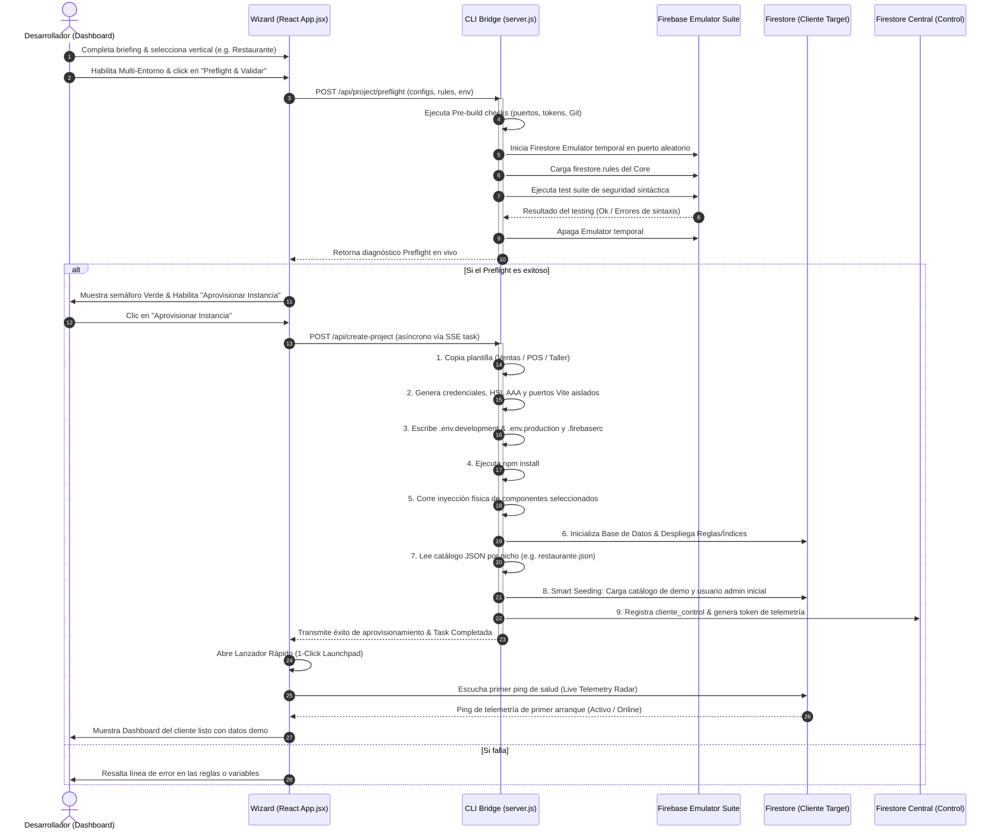

# 🚀 Propuesta Técnica: Wizard de Aprovisionamiento Premium e Integración Avanzada

**Fecha:** 2026-07-01  
**Autor:** Diseñador de Producto Senior & Desarrollador Full Stack  
**Estado:** Propuesta de Diseño de Producto y Especificación Técnica para la Excelencia en `dev-dashboard`

---

## 📋 Misión y Objetivos

Transformar el flujo de creación de instancias de clientes SaaS en un proceso de un solo clic, ultra-rápido, tolerante a fallos, pre-validado en sandbox local, y pre-sembrado con datos lógicos acordes al nicho de negocio.

---

## 1. Arquitectura Conceptual del Sistema

El nuevo flujo interactúa de forma directa con los componentes locales, la Firebase CLI, los emuladores locales de Firebase y la base de datos central de control.



---

## 2. Especificación de UI/UX (Flujo Visual y Componentes Tailwind)

El asistente de aprovisionamiento se expande a **4 pasos lógicos interactivos** integrando una interfaz oscura premium con HSL variables y soporte de contraste de accesibilidad.

### Paso 1: Configuración del Servidor y Entorno Dual
En lugar de una sola credencial de Firebase, el wizard presenta un switch de configuración de entorno.

```html
<!-- Componente UI: Switch de Entorno Dual y Campos Dinámicos -->
<div class="p-5 rounded-2xl border border-[var(--color-border)] bg-[var(--color-surface)] backdrop-blur-xl">
  <div class="flex items-center justify-between mb-4">
    <div>
      <h3 class="text-sm font-bold text-slate-100">Configuración de Entorno Dual</h3>
      <p class="text-xs text-slate-400">Genera instancias aisladas para desarrollo de pruebas y producción en la nube.</p>
    </div>
    <button class="relative inline-flex h-6 w-11 shrink-0 cursor-pointer rounded-full border-2 border-transparent transition-colors duration-200 ease-in-out focus:outline-none focus:ring-2 focus:ring-indigo-600 focus:ring-offset-2 bg-indigo-600">
      <span class="translate-x-5 pointer-events-none inline-block h-5 w-5 transform rounded-full bg-white shadow ring-0 transition duration-200 ease-in-out"></span>
    </button>
  </div>

  <div class="grid grid-cols-2 gap-4 animate-fadeIn">
    <!-- Formulario Entorno Dev/Staging -->
    <div class="p-4 rounded-xl bg-slate-950/40 border border-slate-800">
      <span class="text-[10px] font-extrabold text-amber-400 uppercase tracking-wider block mb-2">Entorno 🧪 DESARROLLO / PRUEBAS</span>
      <input type="text" placeholder="Project ID (ej. app-ventas-dev)" class="w-full bg-slate-900 border border-slate-800 rounded-lg px-3 py-1.5 text-xs text-slate-200 placeholder-slate-600 focus:border-amber-400 outline-none transition-colors" />
      <input type="text" placeholder="API Key Firebase" class="w-full mt-2 bg-slate-900 border border-slate-800 rounded-lg px-3 py-1.5 text-xs text-slate-200 placeholder-slate-600 focus:border-amber-400 outline-none transition-colors" />
    </div>

    <!-- Formulario Entorno Prod -->
    <div class="p-4 rounded-xl bg-slate-950/40 border border-slate-800">
      <span class="text-[10px] font-extrabold text-emerald-400 uppercase tracking-wider block mb-2">Entorno 🚀 PRODUCCIÓN / LIVE</span>
      <input type="text" placeholder="Project ID (ej. app-ventas-prod)" class="w-full bg-slate-900 border border-slate-800 rounded-lg px-3 py-1.5 text-xs text-slate-200 placeholder-slate-600 focus:border-emerald-400 outline-none transition-colors" />
      <input type="text" placeholder="API Key Firebase" class="w-full mt-2 bg-slate-900 border border-slate-800 rounded-lg px-3 py-1.5 text-xs text-slate-200 placeholder-slate-600 focus:border-emerald-400 outline-none transition-colors" />
    </div>
  </div>
</div>
```

### Paso 2: Sembrado de Datos Lógicos (Smart Seeding Select)
Durante el aprovisionamiento, se habilitan controles interactivos para poblar automáticamente bases de datos vacías.

```html
<!-- Componente UI: Selector de Nivel de Sembrado Comercial -->
<div class="mt-4 p-5 rounded-2xl border border-[var(--color-border)] bg-[var(--color-surface)]">
  <h3 class="text-sm font-bold text-slate-100 flex items-center gap-1.5">
    <Database size={15} class="text-indigo-400" />
    Sembrado de Catálogo Comercial por Defecto
  </h3>
  <p class="text-xs text-slate-400 mb-3">Pueble instantáneamente la tienda del cliente con datos estructurados para su vertical.</p>
  
  <div class="grid grid-cols-3 gap-3">
    <!-- Opción 1: Clean -->
    <label class="relative flex flex-col p-3 rounded-xl border border-slate-800 bg-slate-950/20 cursor-pointer hover:border-slate-700 transition-all select-none">
      <input type="radio" name="seed_level" value="clean" class="sr-only" />
      <span class="text-xs font-bold text-slate-200">Esqueleto Limpio</span>
      <span class="text-[10px] text-slate-500 mt-1">Solo parámetros, sin productos ni categorías.</span>
    </label>
    
    <!-- Opción 2: Demo Básico (Recomendado) -->
    <label class="relative flex flex-col p-3 rounded-xl border border-indigo-500 bg-indigo-500/5 cursor-pointer hover:border-indigo-400 transition-all select-none">
      <input type="radio" name="seed_level" value="demo_basic" checked class="sr-only" />
      <span class="text-xs font-bold text-indigo-400">Catálogo de Demostración</span>
      <span class="text-[10px] text-slate-400 mt-1">12 productos del nicho con variantes, stock e imágenes HSL.</span>
    </label>

    <!-- Opción 3: Stress Test -->
    <label class="relative flex flex-col p-3 rounded-xl border border-slate-800 bg-slate-950/20 cursor-pointer hover:border-slate-700 transition-all select-none">
      <input type="radio" name="seed_level" value="stress" class="sr-only" />
      <span class="text-xs font-bold text-slate-200">Simulación Completa</span>
      <span class="text-[10px] text-slate-500 mt-1">100+ productos, 50 clientes ficticios e historial de 30 días.</span>
    </label>
  </div>
</div>
```

### Paso 3: Tarjeta de Diagnóstico Preflight
Antes de habilitar el botón "Crear Proyecto", se corre una auditoría local rápida que compila las reglas y comprueba dependencias de red.

```html
<!-- Componente UI: Tarjeta de Pre-Vuelo y Semáforo de Reglas -->
<div class="p-4 rounded-xl bg-slate-950/50 border border-slate-800 flex items-center justify-between gap-4 mt-4">
  <div class="flex items-center gap-3">
    <div class="relative flex h-3 w-3">
      <span class="animate-ping absolute inline-flex h-full w-full rounded-full bg-emerald-400 opacity-75"></span>
      <span class="relative inline-flex rounded-full h-3 w-3 bg-emerald-500"></span>
    </div>
    <div>
      <span class="text-[10px] font-extrabold uppercase text-slate-400 tracking-wider block">Verificación de Reglas Firestore</span>
      <span class="text-xs font-bold text-slate-200">firestore.rules de Core compiladas exitosamente en emulador local.</span>
    </div>
  </div>
  <button class="px-3 py-1 bg-slate-900 border border-slate-700 hover:bg-slate-800 text-[10px] font-bold text-slate-300 rounded-lg cursor-pointer transition-all">
    Verificar de nuevo
  </button>
</div>
```

---

## 3. Especificación Técnica de Backend (CLI Bridge)

Para dar soporte a estas tres nuevas automatizaciones, se introducen nuevos módulos en `Prototipe-CLI/server.js` y `Prototipe-CLI/generator.js`.

### A. Validación Efímera de Reglas Firestore
Se añade el endpoint `/api/firebase/validate-rules` en `server.js`. Este levanta localmente el emulador de Firestore, escribe las reglas a testear y las analiza con la API oficial para asegurar coherencia sintáctica antes de desplegarlas en la nube de producción del cliente.

```javascript
const { exec } = require('child_process');
const fs = require('fs');
const path = require('path');

app.post('/api/firebase/validate-rules', async (req, res) => {
  const { rulesContent, projectId } = req.body;
  if (!rulesContent) return res.status(400).json({ error: 'Falta rulesContent' });

  const tempRulesPath = path.join(__dirname, 'temp_validate.rules');
  fs.writeFileSync(tempRulesPath, rulesContent, 'utf-8');

  exec(`firebase setup:emulators:firestore && firebase emulators:exec --only firestore "firebase deploy --only firestore:rules --project=${projectId} --dry-run"`, (err, stdout, stderr) => {
    if (fs.existsSync(tempRulesPath)) fs.unlinkSync(tempRulesPath);

    if (err || stderr.includes('Error')) {
      return res.status(422).json({
        success: false,
        error: 'Error de compilación sintáctica en firestore.rules',
        details: stderr || stdout
      });
    }

    res.json({
      success: true,
      message: 'Reglas válidas sintácticamente'
    });
  });
});
```

### B. Configuración de Entornos Múltiples
En `generator.js`, el paso de generación de archivos de entorno se actualiza para inyectar variables de manera granular y configurar aliases de despliegue en `.firebaserc`.

```javascript
function setupMultiEnvironment(targetPath, answers) {
  const { clientId, firebaseConfigDev, firebaseConfigProd } = answers;

  if (firebaseConfigDev) {
    const devEnv = `
VITE_FIREBASE_API_KEY="${firebaseConfigDev.apiKey}"
VITE_FIREBASE_AUTH_DOMAIN="${firebaseConfigDev.authDomain}"
VITE_FIREBASE_PROJECT_ID="${firebaseConfigDev.projectId}"
VITE_FIREBASE_STORAGE_BUCKET="${firebaseConfigDev.storageBucket}"
VITE_FIREBASE_MESSAGING_SENDER_ID="${firebaseConfigDev.messagingSenderId}"
VITE_FIREBASE_APP_ID="${firebaseConfigDev.appId}"
VITE_TELEMETRY_TOKEN="${clientId}-dev-token"
VITE_ENVIRONMENT="development"
    `;
    fs.writeFileSync(path.join(targetPath, '.env.development'), devEnv.trim(), 'utf-8');
  }

  if (firebaseConfigProd) {
    const prodEnv = `
VITE_FIREBASE_API_KEY="${firebaseConfigProd.apiKey}"
VITE_FIREBASE_AUTH_DOMAIN="${firebaseConfigProd.authDomain}"
VITE_FIREBASE_PROJECT_ID="${firebaseConfigProd.projectId}"
VITE_FIREBASE_STORAGE_BUCKET="${firebaseConfigProd.storageBucket}"
VITE_FIREBASE_MESSAGING_SENDER_ID="${firebaseConfigProd.messagingSenderId}"
VITE_FIREBASE_APP_ID="${firebaseConfigProd.appId}"
VITE_TELEMETRY_TOKEN="${clientId}-prod-token"
VITE_ENVIRONMENT="production"
    `;
    fs.writeFileSync(path.join(targetPath, '.env.production'), prodEnv.trim(), 'utf-8');
  }

  const firebaserc = {
    projects: {
      default: firebaseConfigDev?.projectId || firebaseConfigProd?.projectId,
      development: firebaseConfigDev?.projectId,
      production: firebaseConfigProd?.projectId
    }
  };
  fs.writeFileSync(path.join(targetPath, '.firebaserc'), JSON.stringify(firebaserc, null, 2), 'utf-8');
}
```

### C. Motor de Smart Seeding
El backend de aprovisionamiento en `server.js` implementa `/api/project/seed` utilizando `firebase-admin` para conectarse a la base de datos Firestore del cliente e inyectar el catálogo adaptativo.

```javascript
const admin = require('firebase-admin');

app.post('/api/project/seed', async (req, res) => {
  const { projectId, niche, seedLevel, adminCredentials } = req.body;
  
  try {
    const db = getFirestoreClientForProject(projectId);
    const batch = db.batch();

    const seedFilePath = path.join(__dirname, 'niche_seeds', `${niche}.json`);
    if (!fs.existsSync(seedFilePath)) {
      return res.status(404).json({ error: `No existe plantilla de datos demo para el nicho: ${niche}` });
    }

    const { products, categories, businessSettings } = JSON.parse(fs.readFileSync(seedFilePath, 'utf-8'));

    categories.forEach(cat => {
      const catRef = db.collection('categories').doc(cat.id);
      batch.set(catRef, { ...cat, creadoEn: admin.firestore.FieldValue.serverTimestamp() });
    });

    products.forEach(prod => {
      const prodRef = db.collection('products').doc(prod.id);
      batch.set(prodRef, { ...prod, creadoEn: admin.firestore.FieldValue.serverTimestamp() });
    });

    const configRef = db.collection('config').doc('settings');
    batch.set(configRef, { 
      ...businessSettings,
      inicializadoEn: admin.firestore.FieldValue.serverTimestamp() 
    });

    await batch.commit();

    if (adminCredentials?.email && adminCredentials?.password) {
      await createInitialAdminUser(projectId, adminCredentials.email, adminCredentials.password);
    }

    res.json({ success: true, message: `Catálogo de ${niche} sembrado exitosamente (${products.length} productos).` });
  } catch (err) {
    res.status(500).json({ error: `Fallo al sembrar la base de datos: ${err.message}` });
  }
});
```
