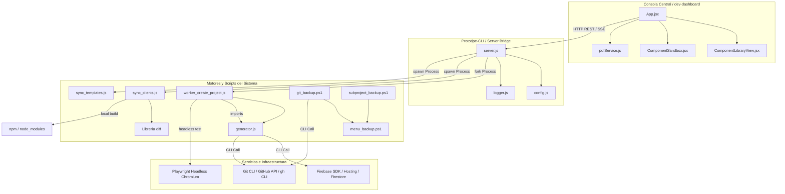

# 🗺️ Mapa de Dependencias y Matriz de Impacto de Riesgos — Ecosistema PROTOTIPE

Este documento detalla el acoplamiento lógico, físico y de infraestructura del ecosistema **PROTOTIPE**, evaluando el impacto operativo ante la ausencia de sus componentes y clasificando los riesgos de fallo en producción.

---

## 1. Mapa de Dependencias del Sistema

El ecosistema opera bajo un flujo de dependencias unidireccionales en el que el frontend visual orquesta al backend local, y este a su vez interactúa con los motores de automatización del sistema y los servicios externos de nube.

---

## 2. Matriz de Impacto Operativo

| Componente | Depende de | Consumido por | Nivel de Criticidad | Impacto si Desaparece / Falla (Efecto Dominó) |
| :--- | :--- | :--- | :--- | :--- |
| **`server.js`** (Express Bridge) | `config.js`, `logger.js` | `dev-dashboard` (PWA) | **CRÍTICO** | **Parálisis de Administración Visual:** El dashboard central se queda ciego. No es posible crear proyectos, ver telemetría local, lanzar tests ni sincronizar clientes. |
| **`generator.js`** (Constructor CLI) | Firebase CLI, Git, Nicho JSON templates | `worker_create_project.js` | **CRÍTICO** | **Bloqueo de Nuevos Clientes:** El wizard de briefing falla en el bootstrap. No se pueden inicializar copias, inyectar branding HSL, ni generar credenciales Firebase locales. |
| **`sync_clients.js`** (Sincronizador) | Hashes MD5, npm build, `.prototipe.json` | `server.js` (sync-stream endpoint) | **ALTO** | **Congelamiento de Versiones:** El Core de desarrollo queda aislado. Ninguna mejora o fix del Core puede propagarse a las instancias de clientes de producción. |
| **`worker_create_project.js`** (Worker Fork) | `generator.js`, Playwright | `server.js` | **ALTO** | **Incertidumbre de Despliegue:** La creación de proyectos no puede ejecutarse en background. Los smoke tests automatizados no corren, permitiendo el deploy de builds rotos. |
| **`App.jsx`** (Dashboard Central) | Firebase Auth, `server.js` API | Operador Técnico / Desarrollador | **ALTO** | **Pérdida de Interfaz Gráfica:** Obliga al operador técnico a realizar todas las acciones (crear, desplegar, sincronizar, respaldar) manualmente mediante comandos de terminal del CLI. |
| **`git_backup.ps1`** (PowerShell Engine) | Git CLI, `backup.log` | `menu_backup.ps1`, `server.js` | **MEDIO** | **Vulnerabilidad de Resguardo:** Pérdida de copias de seguridad incrementales automatizadas del ecosistema y sus instancias de cliente. |
| **`config.js`** (CLI Config) | Variables `.env` | `server.js`, `generator.js`, `sync_templates.js` | **ALTO** | **Fallo General de Resoluciones:** El CLI y la API pierden la capacidad de localizar las rutas físicas de Cores, Documentación e Instancias de Clientes, bloqueando toda la suite. |

---

## 3. Análisis de Riesgos y Puntos de Falla Críticos

### 3.1 Puntos Únicos de Falla (SPOF)
1.  **El Loop de Eventos del Servidor API Local (`server.js`):**
    *   *Riesgo:* Si un proceso o comando se ejecuta sincrónicamente o experimenta latencias de red críticas al consultar Firebase, todo el canal de comunicación SSE del Dashboard se congela.
    *   *Severidad:* **Crítica.**
2.  **La "Versión de Oro" de Dependencias:**
    *   *Riesgo:* Desviaciones en el archivo `package.json` de una plantilla que compile localmente pero no sea compatible con la suite de Playwright global del worker.
    *   *Severidad:* **Alta.**

### 3.2 Componentes con Mayor Riesgo de Fallo en Producción
*   **`sync_clients.js` (Sincronización Downstream):**
    *   *Causa:* Altamente vulnerable a colisiones de dependencias npm locales en el cliente. Si el cliente tiene archivos locales modificados sin versionar o dependencias rotas, el comando `npm run build` falla, forzando constantes rollbacks e interrupciones en la cola de sincronización.
*   **`generator.js` (Motor de Creación):**
    *   *Causa:* Alta dependencia de infraestructura externa. Cambios de API o de autenticación en la Firebase CLI global o en el gh CLI de GitHub provocan fallos inmediatos en las rutinas de aprovisionamiento de Shards y repositorios.
*   **`worker_create_project.js` (Smoke Tests Playwright):**
    *   *Causa:* Sensibilidad gráfica de Chromium Headless. Falta de librerías del sistema en el SO anfitrión (especialmente en entornos Windows Server sin aceleración básica) causa que los smoke tests fallen con excepciones de timeout de Playwright, bloqueando el aprovisionamiento de instancias correctas.
*   **PowerShell Scripts de Resguardo (`git_backup.ps1`):**
    *   *Causa:* Bloqueos del sistema de archivos de Windows. Procesos en background de editores o servidores locales que dejen en uso archivos staged provocan que las rutinas de cambio de nombre de carpetas `.git` a `.git-backup-temp` fallen, dejando el repositorio raíz en un estado inconsistente (gitlinks corruptos).
