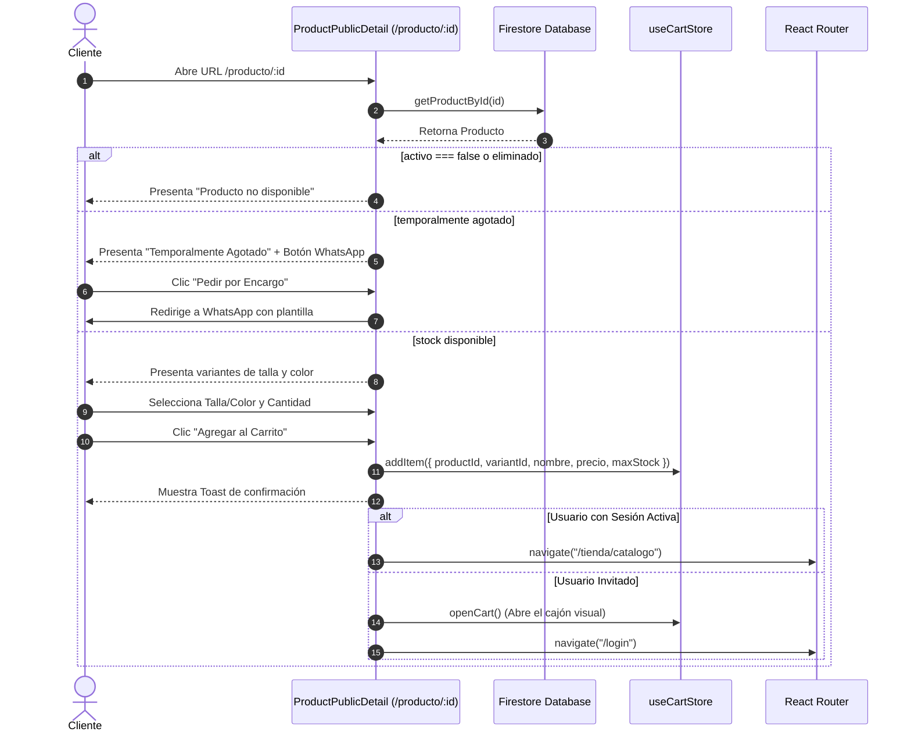

# Manual Técnico: Módulo de Compra Rápida por Código QR
## Arquitectura del Sistema, Flujos de Datos e Integración de Marca Blanca

Este manual proporciona una guía detallada sobre el diseño arquitectónico, flujo de datos, seguridad e integración del sistema de compras directas mediante códigos QR de **App Ventas**.

---

## 1. Arquitectura General y Topología del Módulo

El flujo QR está diseñado bajo un modelo híbrido Ecosistema. El administrador de la tienda genera un código QR unificado para cada producto del catálogo que los clientes escanean físicamente desde su dispositivo móvil.

```
       ┌────────────────────────┐
       │   PANEL ADMINISTRADOR  │
       └───────────┬────────────┘
                   │ Genera QR con URL: https://tienda.com/producto/:id
                   ▼
       ┌────────────────────────┐
       │   CÓDIGO QR FÍSICO     │
       └───────────┬────────────┘
                   │ Escaneado por cámara móvil
                   ▼
 ┌────────────────────────────────────────┐
 │ RUTA CLIENTE PÚBLICA (/producto/:id)    │
 └─────────────────┬──────────────────────┘
                   │
         ┌─────────┴─────────┐
         ▼                   ▼
  [¿Tiene stock?]    [¿Está agotado?]
         │                   │
         ▼                   ▼
  Agregar al Carrito    WhatsApp Encargo
         │
    ┌────┴────────────────────────┐
    ▼                             ▼
[Usuario Logueado]       [Usuario Invitado]
    │                             │
    ▼                             ▼
Catálogo tradicional      Abre Carrito y va a Login/Checkout
```

---

## 2. Flujo de Datos y Transición de Estados

### 2.1 Generación de Códigos QR (Administrador)
En el panel `AdminInventory.jsx`, cuando el flag `qrEnabled` en el almacén de configuración de la app (`useAppConfigStore`) está encendido, se habilita la opción de generar códigos QR por producto.

1. **API Externa de Renderizado:** La imagen del código QR se renderiza dinámicamente utilizando la API de codificación abierta:
   `https://api.qrserver.com/v1/create-qr-code/?size=200x200&data={data}`
2. **Parámetro Codificado:** La URL codificada apunta al host de la aplicación activa, agregando la subruta del detalle de producto:
   `${window.location.origin}/producto/${qrProduct.id}`
3. **Descarga de Alta Resolución:** Para impresión física en etiquetas de estantes o empaques, se expone un disparador que descarga la imagen en formato de alta resolución (`500x500px`).

### 2.2 Consumo de URLs e Intercepción (Cliente)
Al abrir la URL `/producto/:id`, la aplicación no exige autenticación de Firebase, permitiendo una velocidad de visualización ultra-rápida.



---

## 3. Lógica de Negocio y Reglas de Inventario

### 3.1 Filtros y Coherencia de Variantes
El selector de variantes (`Talla` y `Color`) cuenta con controles dinámicos para evitar que el usuario agregue combinaciones que no tienen stock físico:
- **Tallas Disponibles:** Se extraen filtrando únicamente aquellas variantes cuyo stock sea estrictamente mayor a cero.
- **Colores Cruzados:** Al seleccionar una talla, el conjunto de colores disponibles se reduce de forma dinámica a los que corresponden a esa talla y tienen existencias, previniendo errores de preselección inválida en el carrito.
- **Preselección de Única Opción:** Si el producto cuenta con una sola talla o un solo color elegible, el sistema los autoselecciona al instante.

### 3.2 Compra por Encargo (WhatsApp)
Si todas las variantes de un producto resuelven a `stock <= 0`, el sistema entra en modo de prevención de quiebre comercial:
- Se presenta una advertencia clara e informativa.
- El botón de agregar al carrito se transforma en un botón verde llamativo: **"Pedir por Encargo vía WhatsApp"**.
- Al pulsarlo, se codifica una plantilla que redirige al usuario al WhatsApp corporativo configurado en `appConfigStore`, indicando el producto de interés.

---

## 4. Pruebas y Tolerancia a Fallos
1. **Producto Desactivado u Oculto:** Si el administrador oculta el artículo (`activo: false`) o lo elimina del panel, el servicio `getProductById` de Firestore rechaza la petición. El componente captura el error y redirige a una pantalla limpia de "Producto no disponible" con un CTA para volver al catálogo.
2. **Exceso de Cantidad:** Al agregar productos, se calcula la suma de la cantidad elegida más la que ya existe en el carrito. Si esta suma supera el stock físico de la variante seleccionada, se arroja un aviso descriptivo y se detiene la acción.
3. **Cero Cumulative Layout Shift (CLS):** La pantalla cuenta con skeletons con las mismas proporciones de la imagen y secciones de texto, asegurando una carga visual sin molestos brincos de pantalla en dispositivos móviles con redes de baja velocidad.
